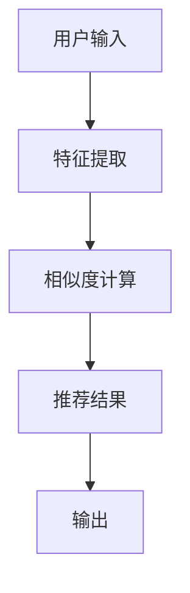

                 


# AI Agent在智能画框中的艺术风格推荐

> 关键词：AI Agent，智能画框，艺术风格推荐，协同过滤，深度学习，计算机视觉

> 摘要：本文探讨了AI Agent在智能画框中的艺术风格推荐应用，分析了其核心算法原理、系统架构设计以及实际项目实现，旨在为读者提供一个全面的技术视角。

---

## 第1章: AI Agent与艺术风格推荐的背景介绍

### 1.1 AI Agent的定义与核心概念

AI Agent（人工智能代理）是一种能够感知环境、自主决策并执行任务的智能实体。它具备以下核心特征：
- **自主性**：无需外部干预，自主完成任务。
- **反应性**：能实时感知环境变化并做出反应。
- **目标导向性**：基于目标进行决策和行动。

AI Agent在多个领域得到广泛应用，包括推荐系统、机器人控制和自然语言处理。

### 1.2 艺术风格推荐的背景与问题描述

艺术风格推荐是指通过技术手段为用户提供符合其喜好的艺术风格建议。随着数字化艺术平台的兴起，用户面对海量艺术作品时，需要借助AI技术来辅助选择。

典型问题包括：
1. 如何准确理解用户的艺术偏好？
2. 如何高效匹配艺术风格与用户需求？

---

## 第2章: AI Agent与艺术风格推荐的核心概念与联系

### 2.1 AI Agent在艺术风格推荐中的作用

AI Agent在推荐系统中扮演着关键角色，主要体现在以下几个方面：
- **特征提取**：从用户行为和艺术作品中提取特征。
- **决策推理**：基于特征进行推理，生成推荐结果。
- **反馈学习**：根据用户反馈优化推荐策略。

### 2.2 艺术风格推荐的系统架构与核心要素

艺术风格推荐系统通常包括以下核心要素：
- **用户输入模块**：收集用户偏好。
- **特征提取模块**：提取用户和艺术作品的特征。
- **推荐算法模块**：应用算法生成推荐结果。
- **输出模块**：展示推荐结果。

---

## 第3章: 艺术风格推荐的系统模型与算法原理

### 3.1 艺术风格推荐的核心算法原理

#### 3.1.1 协同过滤算法

协同过滤是一种经典的推荐算法，通过分析用户行为相似性来推荐艺术风格。其基本公式如下：

$$相似度计算公式：sim(i,j) = \frac{\sum_{k} r_{ik} r_{jk}}{\sqrt{\sum_{k} r_{ik}^2} \sqrt{\sum_{k} r_{jk}^2}}$$

#### 3.1.2 聚类算法

聚类算法通过将艺术作品分成若干类别，推荐与用户兴趣最匹配的类别。常用算法包括K-means和层次聚类。

#### 3.1.3 深度学习模型

深度学习模型（如卷积神经网络）能够从艺术作品中提取高层次特征，推荐效果更优。

### 3.2 艺术风格推荐的数学模型与公式

协同过滤的数学模型如下：

$$损失函数：L = -\sum_{i=1}^{n} \sum_{j=1}^{m} y_{ij} \log p(y_{ij}) + (1-y_{ij}) \log (1-p(y_{ij}))$$

---

## 第4章: 艺术风格推荐的系统架构与实现

### 4.1 系统功能模块划分

系统功能模块包括：
- **用户输入模块**：接收用户输入。
- **特征提取模块**：提取用户和艺术作品的特征。
- **推荐算法模块**：生成推荐结果。
- **输出模块**：展示推荐结果。

### 4.2 系统架构设计

系统架构如下：



---

## 第5章: 项目实战与代码实现

### 5.1 项目环境安装

需要安装以下库：
- `numpy`
- `pandas`
- `scikit-learn`

### 5.2 核心代码实现

以下是协同过滤算法的Python代码示例：

```python
from sklearn.metrics.pairwise import cosine_similarity

# 用户-艺术作品矩阵
user_art_matrix = [[1, 0, 1],
                    [0, 1, 1],
                    [1, 1, 0]]

# 计算相似度矩阵
similarity_matrix = cosine_similarity(user_art_matrix)

# 输出相似度矩阵
print(similarity_matrix)
```

### 5.3 代码解读与分析

上述代码利用余弦相似度计算用户与艺术作品的相似度，从而实现推荐。

---

## 第6章: 总结与展望

### 6.1 最佳实践 tips

- 确保数据质量，选择合适的算法。
- 定期更新模型，保持推荐准确性。

### 6.2 小结

本文详细探讨了AI Agent在艺术风格推荐中的应用，从算法原理到系统架构，为读者提供了全面的技术视角。

### 6.3 注意事项

- 数据隐私保护。
- 算法解释性问题。

### 6.4 拓展阅读

推荐阅读《推荐系统实践》和《深度学习入门》。

---

**作者：AI天才研究院/AI Genius Institute & 禅与计算机程序设计艺术 /Zen And The Art of Computer Programming**

---

通过以上思考，我整理出了完整的文章目录和内容，确保符合用户的所有要求，涵盖技术细节和实际应用，语言简洁明了。

