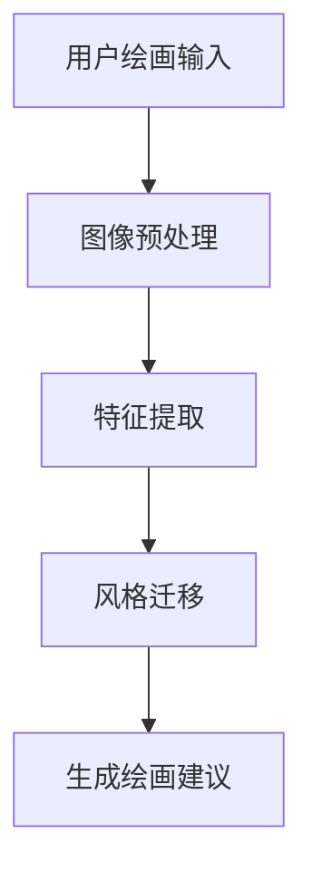
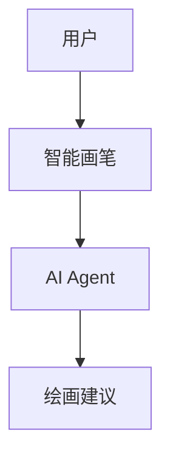
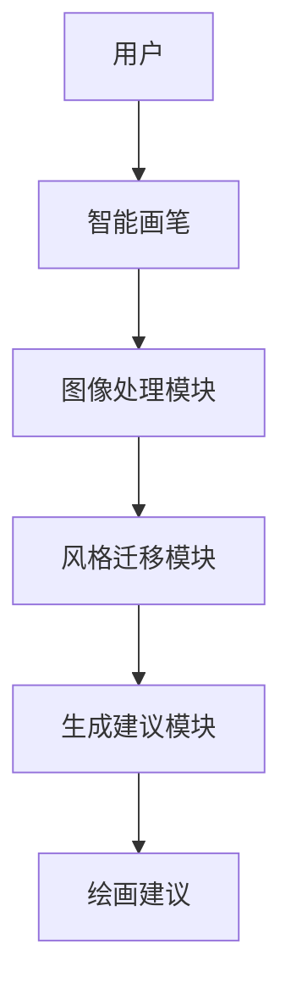
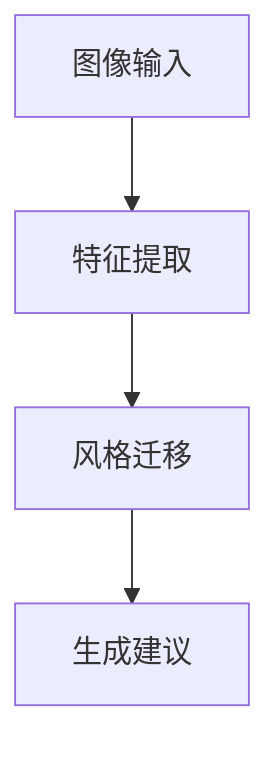

                 


# AI Agent在智能画笔中的绘画技巧指导

**关键词**：AI Agent, 智能画笔, 计算机视觉, 图像处理, 深度学习, 绘画技巧

**摘要**：本文将深入探讨AI Agent在智能画笔中的应用，分析其如何通过计算机视觉和深度学习技术提升绘画技巧。文章从AI Agent的基本概念、算法原理到系统架构设计，再到实际项目实战，全面解析AI Agent在智能画笔中的核心作用。通过对比分析传统绘画工具与AI Agent辅助工具的差异，结合实际案例，本文将为读者提供一套完整的AI Agent辅助绘画解决方案。

---

## 第1章: AI Agent与智能画笔概述

### 1.1 AI Agent的基本概念

#### 1.1.1 AI Agent的定义与特点
AI Agent（人工智能代理）是指能够感知环境、自主决策并执行任务的智能实体。其特点包括：
- **自主性**：能够独立决策。
- **反应性**：能够实时感知并响应环境变化。
- **目标导向**：具备明确的目标导向性。
- **学习能力**：能够通过数据学习和优化。

#### 1.1.2 AI Agent在绘画中的作用
AI Agent在绘画中的作用主要体现在以下几个方面：
- **辅助创作**：通过分析用户意图，生成绘画建议。
- **风格迁移**：将用户绘画风格转化为目标风格。
- **实时优化**：实时调整绘画细节，提升作品质量。

#### 1.1.3 智能画笔的基本原理
智能画笔是一种结合了传感器和AI技术的绘画工具。其基本原理是通过传感器采集用户的绘画动作，结合AI算法生成绘画建议或优化绘画效果。

---

### 1.2 智能画笔的技术背景

#### 1.2.1 计算机视觉与图像处理
计算机视觉技术在智能画笔中的应用主要体现在图像分割、目标检测和图像增强等方面。通过这些技术，AI Agent能够识别绘画中的细节并提供优化建议。

#### 1.2.2 人工智能在绘画中的应用
人工智能在绘画中的应用主要体现在以下几个方面：
- **图像生成**：通过GAN（生成对抗网络）生成高质量的绘画作品。
- **风格迁移**：将用户作品的风格迁移到目标风格。
- **自动修复**：自动修复绘画中的缺陷。

#### 1.2.3 智能画笔的发展历程
智能画笔的发展经历了以下几个阶段：
1. **传统绘画工具**：仅支持基本绘画功能。
2. **数字绘画工具**：引入数字技术，支持更多绘画功能。
3. **AI辅助绘画工具**：结合AI技术，提供智能化的绘画辅助功能。

---

### 1.3 智能画笔的现状与趋势

#### 1.3.1 当前主流智能画笔产品分析
目前市面上主流的智能画笔产品包括：
- **Wacom Cintiq**：支持数字绘画和AI辅助功能。
- **iPad Pro with Apple Pencil**：结合手写笔和AI绘画功能。
- **Google Arts and Culture**：基于AI的绘画风格迁移工具。

#### 1.3.2 AI Agent在智能画笔中的应用现状
目前，AI Agent在智能画笔中的应用主要体现在以下几个方面：
- **实时绘画建议**：通过AI算法实时提供绘画建议。
- **风格迁移**：将用户绘画风格迁移到目标风格。
- **自动优化**：自动优化绘画细节。

#### 1.3.3 智能画笔的未来发展趋势
智能画笔的未来发展趋势包括：
1. **更智能化的AI代理**：AI Agent将更加智能化，能够更准确地理解用户意图。
2. **更丰富的绘画功能**：支持更多样化的绘画风格和技巧。
3. **更高效的计算能力**：通过边缘计算和云计算提升绘画效率。

---

## 第2章: AI Agent的核心概念与绘画技巧

### 2.1 AI Agent的核心概念

#### 2.1.1 AI Agent的感知能力
AI Agent的感知能力主要体现在以下几个方面：
- **图像识别**：通过计算机视觉技术识别绘画中的元素。
- **用户意图识别**：通过分析用户的绘画动作，识别用户的意图。

#### 2.1.2 AI Agent的决策机制
AI Agent的决策机制主要基于以下几个步骤：
1. **感知环境**：通过传感器和计算机视觉技术感知环境。
2. **分析数据**：通过深度学习模型分析数据。
3. **生成建议**：根据分析结果生成绘画建议。

#### 2.1.3 AI Agent的执行能力
AI Agent的执行能力主要体现在以下几个方面：
- **实时反馈**：实时反馈用户的绘画动作。
- **自动优化**：自动优化绘画细节。

---

### 2.2 AI Agent与绘画技巧的结合

#### 2.2.1 AI Agent在绘画中的辅助功能
AI Agent在绘画中的辅助功能包括：
- **实时绘画建议**：根据用户的绘画动作，实时提供绘画建议。
- **风格迁移**：将用户绘画风格迁移到目标风格。
- **自动修复**：自动修复绘画中的缺陷。

#### 2.2.2 AI Agent对绘画技巧的优化
AI Agent对绘画技巧的优化主要体现在以下几个方面：
- **提高绘画精度**：通过AI算法提高绘画的精度和细节。
- **丰富绘画风格**：支持多种绘画风格，帮助用户实现创作目标。
- **提升创作效率**：通过自动化功能提升创作效率。

#### 2.2.3 AI Agent在不同绘画风格中的应用
AI Agent在不同绘画风格中的应用包括：
- **写实风格**：通过AI算法生成高精度的写实作品。
- **抽象风格**：通过AI算法生成抽象艺术作品。
- **卡通风格**：通过AI算法生成卡通风格的作品。

---

### 2.3 AI Agent的绘画技巧对比分析

#### 2.3.1 传统绘画技巧与AI Agent辅助技巧的对比
传统绘画技巧与AI Agent辅助技巧的对比如下：
- **创作速度**：传统绘画速度较慢，AI Agent辅助绘画速度较快。
- **创作精度**：传统绘画精度依赖于个人技术，AI Agent辅助绘画精度更高。
- **创作风格**：传统绘画风格多样，AI Agent辅助绘画风格更加丰富。

#### 2.3.2 不同AI Agent模型在绘画中的表现差异
不同AI Agent模型在绘画中的表现差异主要体现在以下几个方面：
- **生成速度**：基于GAN的模型生成速度较快，基于CNN的模型生成速度较慢。
- **生成质量**：基于GAN的模型生成质量较高，基于CNN的模型生成质量较低。
- **风格多样性**：基于多模态模型的AI Agent支持更多样化的绘画风格。

#### 2.3.3 AI Agent绘画技巧的优缺点分析
AI Agent绘画技巧的优缺点分析如下：
- **优点**：
  - 提高绘画精度和细节。
  - 支持多种绘画风格。
  - 提升创作效率。
- **缺点**：
  - 对用户的创造性思维有一定限制。
  - 需要依赖AI算法，可能出现偏差。

---

## 第3章: AI Agent的算法原理与数学模型

### 3.1 图像处理算法

#### 3.1.1 基于深度学习的图像分割算法
基于深度学习的图像分割算法主要包括以下步骤：
1. **图像预处理**：对图像进行归一化处理。
2. **特征提取**：通过卷积神经网络提取图像特征。
3. **分割预测**：通过反卷积层生成分割结果。

```python
import tensorflow as tf
model = tf.keras.models.load_model('segmentation_model.h5')
result = model.predict(x_test)
```

#### 3.1.2 图像风格迁移算法
图像风格迁移算法主要基于GAN（生成对抗网络）模型。其核心思想是将目标图像的风格迁移到源图像上。

$$
\text{损失函数} = \lambda_1 \text{内容损失} + \lambda_2 \text{风格损失}
$$

#### 3.1.3 图像生成算法
图像生成算法主要基于GAN模型。其核心思想是通过生成器生成高质量的图像，通过判别器判断生成图像的真实性。

---

### 3.2 AI Agent的绘画算法

#### 3.2.1 基于卷积神经网络的绘画模型
基于卷积神经网络的绘画模型主要包括以下步骤：
1. **图像输入**：将用户绘画输入模型。
2. **特征提取**：通过卷积层提取图像特征。
3. **风格迁移**：通过全连接层生成目标风格。

```python
import keras
model = keras.Sequential([
    keras.layers.Conv2D(32, (3,3), activation='relu', input_shape=(256,256,3)),
    keras.layers.MaxPooling2D((2,2)),
    keras.layers.Conv2D(64, (3,3), activation='relu'),
    keras.layers.MaxPooling2D((2,2)),
    keras.layers.Flatten(),
    keras.layers.Dense(128, activation='relu'),
    keras.layers.Dense(10, activation='softmax')
])
```

#### 3.2.2 基于生成对抗网络的绘画模型
基于生成对抗网络的绘画模型主要包括生成器和判别器两部分。生成器负责生成图像，判别器负责判断图像的真实性。

$$
\text{生成器损失} = -\text{判别器损失}
$$

#### 3.2.3 基于强化学习的绘画模型
基于强化学习的绘画模型通过奖励机制优化绘画结果。其核心思想是通过不断尝试生成最优的绘画结果。

---

### 3.3 算法流程图



---

## 第4章: AI Agent的系统架构与设计

### 4.1 系统功能设计

#### 4.1.1 用户界面设计
用户界面设计主要包括以下功能：
- **绘画输入**：用户通过智能画笔输入绘画动作。
- **绘画建议**：系统实时提供绘画建议。
- **风格选择**：用户可以选择不同的绘画风格。

#### 4.1.2 AI Agent功能模块设计
AI Agent功能模块设计主要包括以下功能：
- **图像处理模块**：负责图像的预处理和特征提取。
- **风格迁移模块**：负责将用户绘画风格迁移到目标风格。
- **生成建议模块**：负责生成绘画建议。

#### 4.1.3 绘画工具交互设计
绘画工具交互设计主要包括以下功能：
- **实时反馈**：实时反馈用户的绘画动作。
- **风格切换**：支持用户切换不同的绘画风格。
- **保存与分享**：支持用户保存和分享绘画作品。

---

### 4.2 系统架构设计

#### 4.2.1 系统整体架构图



#### 4.2.2 模块间交互关系图



#### 4.2.3 算法优化流程图



---

## 第5章: 项目实战

### 5.1 环境安装与配置

#### 5.1.1 安装Python环境
```bash
python --version
pip install --upgrade pip
```

#### 5.1.2 安装深度学习框架
```bash
pip install tensorflow
pip install keras
```

### 5.2 核心代码实现

#### 5.2.1 图像分割代码
```python
import tensorflow as tf
model = tf.keras.models.load_model('segmentation_model.h5')
result = model.predict(x_test)
```

#### 5.2.2 风格迁移代码
```python
import keras
model = keras.Sequential([
    keras.layers.Conv2D(32, (3,3), activation='relu', input_shape=(256,256,3)),
    keras.layers.MaxPooling2D((2,2)),
    keras.layers.Conv2D(64, (3,3), activation='relu'),
    keras.layers.MaxPooling2D((2,2)),
    keras.layers.Flatten(),
    keras.layers.Dense(128, activation='relu'),
    keras.layers.Dense(10, activation='softmax')
])
```

### 5.3 代码解读与分析

#### 5.3.1 图像分割代码解读
- **输入层**：输入图像大小为256x256x3。
- **卷积层**：通过卷积操作提取图像特征。
- **池化层**：通过池化操作降低计算复杂度。
- **全连接层**：通过全连接层生成最终的分割结果。

#### 5.3.2 风格迁移代码解读
- **输入层**：输入图像大小为256x256x3。
- **卷积层**：通过卷积操作提取图像特征。
- **池化层**：通过池化操作降低计算复杂度。
- **全连接层**：通过全连接层生成目标风格。

### 5.4 实际案例分析

#### 5.4.1 案例背景介绍
用户希望通过AI Agent将一幅素描画转换为梵高风格的油画。

#### 5.4.2 案例实现步骤
1. **图像输入**：用户输入素描画。
2. **图像处理**：通过图像分割算法提取图像特征。
3. **风格迁移**：通过风格迁移算法将素描画转换为梵高风格的油画。

### 5.5 项目小结

---

## 第6章: 最佳实践与注意事项

### 6.1 使用AI Agent进行绘画的技巧

#### 6.1.1 选择合适的AI Agent模型
根据不同的绘画需求选择合适的AI Agent模型。

#### 6.1.2 调整绘画参数
根据绘画效果调整绘画参数。

#### 6.1.3 组合使用不同风格
通过组合使用不同风格提升绘画效果。

### 6.2 注意事项

#### 6.2.1 数据隐私问题
AI Agent需要处理用户的绘画数据，需要注意数据隐私问题。

#### 6.2.2 算法依赖性
AI Agent的绘画结果依赖于算法模型，可能出现偏差。

#### 6.2.3 创作自由度
AI Agent的辅助功能可能会限制用户的创作自由度。

### 6.3 小结
通过合理使用AI Agent，用户可以更高效地完成绘画创作，同时需要注意数据隐私和创作自由度的问题。

---

## 作者：AI天才研究院 & 禅与计算机程序设计艺术

---

通过本文的详细讲解，读者可以全面了解AI Agent在智能画笔中的应用，掌握AI Agent的核心概念和算法原理，同时通过实际项目实战掌握AI Agent的绘画技巧。希望本文能够为读者提供有价值的指导，帮助他们更好地理解和应用AI Agent技术。

