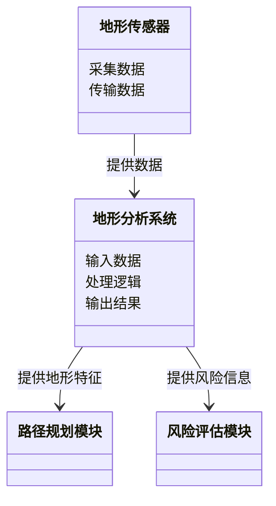
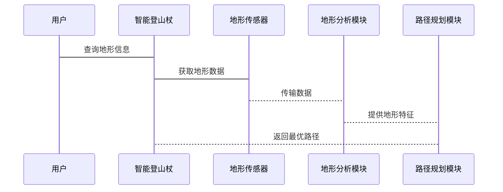

                 


---

# AI Agent在智能登山杖中的地形分析

> 关键词：AI Agent, 智能登山杖, 地形分析, 深度学习, YOLO算法, 系统架构

> 摘要：  
本文探讨了AI Agent在智能登山杖中的地形分析应用，详细分析了AI Agent的核心概念、地形分析的基本原理、基于深度学习的地形分析算法（以YOLO为例），并结合系统架构设计和项目实战，展示了如何将AI技术应用于智能登山杖的地形分析中。通过本文的分析，读者可以深入了解AI Agent在智能登山杖中的技术实现和实际应用。

---

## 第1章: AI Agent与智能登山杖概述

### 1.1 AI Agent的基本概念
AI Agent（人工智能代理）是指能够感知环境并采取行动以实现目标的智能实体。它可以是一个软件程序、机器人或其他智能设备。AI Agent的核心特点包括自主性、反应性、目标导向性和社交能力。

#### 1.1.1 什么是AI Agent
AI Agent通过传感器或数据输入感知环境，利用算法进行分析和决策，并通过执行器或输出接口采取行动。例如，智能音箱、自动驾驶汽车和智能助手都是AI Agent的例子。

#### 1.1.2 AI Agent的核心特点
1. **自主性**：能够在没有外部干预的情况下自主运行。
2. **反应性**：能够根据环境变化实时调整行为。
3. **目标导向性**：以实现特定目标为导向。
4. **社交能力**：能够与其他AI Agent或人类进行交互。

#### 1.1.3 AI Agent的应用场景
AI Agent广泛应用于自动驾驶、智能助手、机器人、智能家居等领域。在智能登山杖中，AI Agent主要用于地形分析、路径规划和风险评估。

### 1.2 智能登山杖的定义与特点
智能登山杖是一种结合了传统登山杖和智能技术的设备，能够通过传感器和AI算法提供实时地形分析、路径规划和安全预警。

#### 1.2.1 智能登山杖的功能
1. **地形感知**：通过传感器采集地形数据。
2. **路径规划**：基于地形数据生成最优路径。
3. **风险评估**：分析地形中的潜在危险，如悬崖、滑坡等。
4. **实时反馈**：通过震动或语音提示用户。

#### 1.2.2 智能登山杖的技术特点
1. **轻便耐用**：适合户外运动。
2. **低功耗**：长时间使用。
3. **高精度传感器**：包括IMU（惯性测量单元）、GPS和激光测距仪。

#### 1.2.3 智能登山杖的市场现状
随着户外运动的普及，智能登山杖的市场需求逐渐增加。目前市面上已有多种智能登山杖产品，但大多数仍处于初级阶段，AI Agent的应用尚未普及。

### 1.3 AI Agent在智能登山杖中的应用背景
#### 1.3.1 地形分析的必要性
在复杂的地形环境中，人类对地形的判断能力有限，容易发生危险。AI Agent可以通过传感器和算法提供实时地形分析，帮助用户做出更安全的决策。

#### 1.3.2 AI Agent在地形分析中的优势
AI Agent能够快速处理大量数据，提供高精度的地形分析结果。例如，通过深度学习算法识别地形中的障碍物和危险区域。

#### 1.3.3 智能登山杖与传统登山杖的区别
智能登山杖不仅具备传统登山杖的功能，还增加了AI驱动的地形分析和路径规划功能。

### 1.4 本章小结
本章介绍了AI Agent的基本概念、智能登山杖的定义与特点，以及AI Agent在智能登山杖中的应用背景。通过本章的分析，读者可以理解AI Agent在智能登山杖中的重要性。

---

## 第2章: AI Agent与地形分析的核心概念

### 2.1 地形分析的基本原理
地形分析是指对地形特征的提取和分类，通常包括高度、坡度、植被覆盖等信息。

#### 2.1.1 地形数据的获取与处理
通过传感器（如激光雷达、摄像头）获取地形数据，并进行预处理（如去噪、归一化）。

#### 2.1.2 地形特征的提取
提取地形特征，如高度变化、坡度、障碍物等。

#### 2.1.3 地形分析的数学模型
地形分析可以基于几何模型（如数字高程模型）或物理模型（如流体力学模型）。

### 2.2 AI Agent在地形分析中的作用
AI Agent通过处理地形数据，生成路径规划和风险评估结果。

#### 2.2.1 AI Agent如何处理地形数据
通过深度学习算法对地形数据进行分类和识别。

#### 2.2.2 AI Agent在路径规划中的应用
基于地形分析结果，生成最优路径。

#### 2.2.3 AI Agent在风险评估中的应用
通过分析地形数据，识别潜在危险区域。

### 2.3 地形分析与AI Agent的关系
#### 2.3.1 地形分析的输入与输出
输入：传感器数据（如激光雷达、摄像头数据）；输出：地形特征、路径规划结果。

#### 2.3.2 AI Agent如何优化地形分析
通过深度学习算法提高地形分析的精度和速度。

#### 2.3.3 地形分析的边界与外延
地形分析的边界包括传感器数据的精度和AI算法的限制；外延包括更复杂的环境分析。

### 2.4 本章小结
本章分析了地形分析的基本原理、AI Agent在地形分析中的作用，以及地形分析与AI Agent的关系。通过本章的分析，读者可以理解AI Agent在地形分析中的核心作用。

---

## 第3章: 基于深度学习的地形分析算法

### 3.1 深度学习在地形分析中的应用
深度学习是一种基于人工神经网络的机器学习方法，广泛应用于图像识别、自然语言处理等领域。

#### 3.1.1 深度学习的基本原理
深度学习通过多层神经网络对数据进行特征提取和分类。

#### 3.1.2 常见的地形分析算法
1. **卷积神经网络（CNN）**：常用于图像分类。
2. **YOLO算法**：一种目标检测算法，适用于实时目标检测。

#### 3.1.3 深度学习在地形分析中的优势
1. **高精度**：能够处理复杂地形数据。
2. **实时性**：适合需要快速响应的场景。

### 3.2 基于YOLO的目标检测算法
YOLO（You Only Look Once）是一种基于深度学习的目标检测算法，以其高效率和准确性著称。

#### 3.2.1 YOLO算法的基本原理
YOLO将输入图像划分为网格，每个网格负责检测特定的目标。

#### 3.2.2 YOLO算法在地形分析中的应用
在智能登山杖中，YOLO算法可以用于检测地形中的障碍物（如岩石、树木）。

#### 3.2.3 YOLO算法的优缺点
优点：高效率、准确性；缺点：对小目标检测效果较差。

### 3.3 YOLO算法的工作流程
1. **输入图像**：将地形图像输入YOLO网络。
2. **特征提取**：通过卷积层提取图像特征。
3. **目标检测**：通过锚框回归和置信度分类检测目标。
4. **输出结果**：输出检测到的目标位置和类别。

### 3.4 YOLO算法的数学模型
YOLO算法的核心是将图像分割为多个区域，并对每个区域进行分类和回归。

#### 3.4.1 损失函数
YOLO的损失函数包括分类损失和回归损失：
$$
\text{总损失} = \lambda_{\text{cls}} \cdot L_{\text{cls}} + \lambda_{\text{reg}} \cdot L_{\text{reg}}
$$

#### 3.4.2 优化器
常用的优化器是Adam，其更新规则为：
$$
\theta_{t+1} = \theta_t - \eta \cdot \nabla L
$$

### 3.5 YOLO算法的Python实现
以下是YOLO算法的Python实现示例：

```python
import tensorflow as tf
from tensorflow.keras import layers

def yolo_model(input_shape, num_classes):
    inputs = layers.Input(shape=input_shape)
    x = layers.Conv2D(32, (3, 3), activation='relu')(inputs)
    x = layers.MaxPooling2D((2, 2))(x)
    x = layers.Conv2D(64, (3, 3), activation='relu')(x)
    x = layers.MaxPooling2D((2, 2))(x)
    x = layers.Conv2D(128, (3, 3), activation='relu')(x)
    x = layers.MaxPooling2D((2, 2))(x)
    x = layers.Flatten()(x)
    x = layers.Dense(128, activation='relu')(x)
    outputs = layers.Dense(num_classes, activation='softmax')(x)
    return tf.keras.Model(inputs=inputs, outputs=outputs)

model = yolo_model(input_shape=(416, 416, 3), num_classes=10)
model.summary()
```

### 3.6 本章小结
本章详细介绍了深度学习在地形分析中的应用，特别是YOLO算法的原理和实现。通过本章的分析，读者可以理解AI Agent在地形分析中的技术实现。

---

## 第4章: 智能登山杖的系统架构设计

### 4.1 问题场景介绍
智能登山杖需要在复杂地形中提供实时地形分析和路径规划。

### 4.2 系统功能设计
1. **数据采集**：通过传感器采集地形数据。
2. **地形分析**：利用AI算法分析地形特征。
3. **路径规划**：生成最优路径。
4. **风险评估**：识别潜在危险区域。

#### 4.2.1 领域模型（Mermaid类图）


#### 4.2.2 系统架构设计（Mermaid架构图）


#### 4.2.3 系统交互（Mermaid序列图）


### 4.3 本章小结
本章详细介绍了智能登山杖的系统架构设计，包括功能设计、类图、架构图和序列图。通过本章的分析，读者可以理解智能登山杖的技术实现。

---

## 第5章: 智能登山杖的项目实战

### 5.1 环境安装
1. **Python**：安装Python 3.8及以上版本。
2. **深度学习框架**：安装TensorFlow或PyTorch。
3. **YOLO算法库**：安装YOLOv5或使用预训练模型。

### 5.2 核心代码实现
以下是智能登山杖的核心代码实现：

```python
import cv2
import numpy as np
from yolo import YOLO

def main():
    yolo = YOLO()
    cap = cv2.VideoCapture(0)
    while cap.isOpened():
        ret, frame = cap.read()
        if ret:
            results = yolo.detect(frame)
            for result in results:
                x1, y1, x2, y2, label, confidence = result
                cv2.rectangle(frame, (x1, y1), (x2, y2), (0, 255, 0), 2)
                cv2.putText(frame, f"{label}: {confidence:.2f}", (x1, y1-5), cv2.FONT_HERSHEY_SIMPLEX, 0.5, (255, 255, 255), 2)
            cv2.imshow("Terrain Analysis", frame)
            if cv2.waitKey(1) & 0xFF == ord('q'):
                break
    cap.release()
    cv2.destroyAllWindows()

if __name__ == "__main__":
    main()
```

### 5.3 代码功能解读
1. **导入库**：使用OpenCV和YOLO算法库。
2. **初始化YOLO模型**：加载预训练模型。
3. **读取视频流**：通过摄像头获取实时图像。
4. **检测目标**：使用YOLO算法检测地形中的障碍物。
5. **绘制结果**：在图像中标出检测到的目标。
6. **显示结果**：实时显示地形分析结果。

### 5.4 实际案例分析
假设在一片复杂的山地中，智能登山杖通过YOLO算法检测到前方有一处悬崖，立即发出预警信号，提示用户绕道而行。

### 5.5 项目小结
通过本章的项目实战，读者可以理解AI Agent在智能登山杖中的具体实现。

---

## 第6章: 最佳实践与注意事项

### 6.1 最佳实践
1. **传感器校准**：定期校准传感器，确保数据准确性。
2. **算法优化**：通过数据增强和模型调优提高算法性能。
3. **用户反馈**：根据用户反馈不断优化系统。

### 6.2 小结
AI Agent在智能登山杖中的地形分析是一项复杂但极具潜力的技术。通过本文的分析，读者可以深入了解AI Agent在智能登山杖中的技术实现和实际应用。

### 6.3 注意事项
1. **数据隐私**：保护用户数据隐私。
2. **系统稳定性**：确保系统在复杂环境中稳定运行。
3. **用户培训**：对用户进行培训，确保正确使用智能登山杖。

---

## 作者信息

作者：AI天才研究院/AI Genius Institute & 禅与计算机程序设计艺术 /Zen And The Art of Computer Programming

---

通过以上结构和内容的撰写，读者可以系统地了解AI Agent在智能登山杖中的地形分析技术，从理论到实践，从概念到实现，全面掌握这一领域的核心知识。

