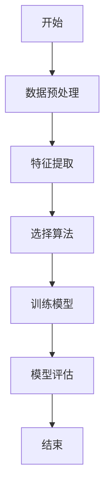
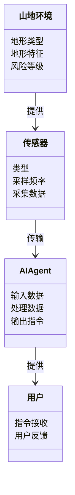
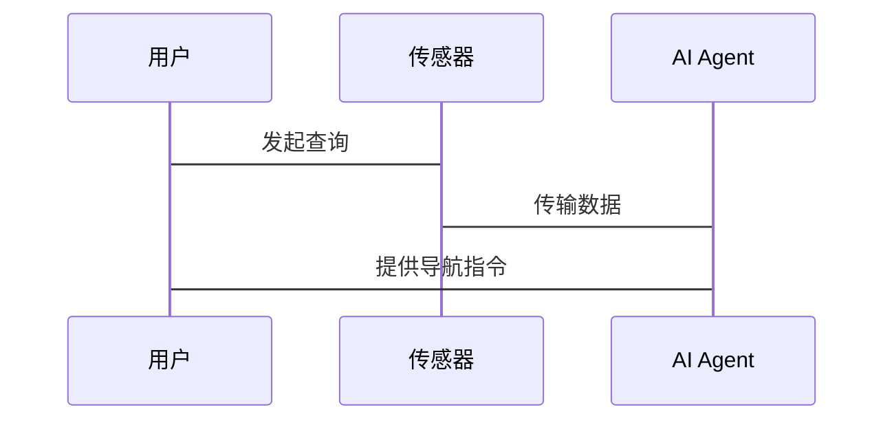

                 


# AI Agent在智能登山杖中的地形分析与导航

> 关键词：AI Agent, 智能登山杖, 地形分析, 导航系统, 传感器技术

> 摘要：本文探讨AI Agent在智能登山杖中的应用，分析其如何通过地形分析和导航技术提升用户体验。从背景介绍、核心概念到系统设计和项目实战，详细解析AI Agent在智能登山杖中的实现与优化。

---

# 第一部分: AI Agent与智能登山杖的背景介绍

## 第1章: AI Agent与智能登山杖概述

### 1.1 AI Agent的基本概念
- **1.1.1 AI Agent的定义与特点**
  - AI Agent是具有感知、决策和执行能力的智能体。
  - 特点：自主性、反应性、社交能力、学习能力。

- **1.1.2 智能登山杖的应用背景**
  - 传统登山杖的局限性：无法提供实时地形信息和导航。
  - 智能登山杖的出现：结合传感器和AI技术，提升安全性。

- **1.1.3 地形分析与导航的必要性**
  - 地形分析：识别地形类型（如陡坡、草地）。
  - 导航：为用户提供最优路径，避开危险区域。

### 1.2 AI Agent在智能登山杖中的作用
- **1.2.1 AI Agent的核心功能**
  - 感知环境：通过传感器获取地形数据。
  - 决策导航：基于数据计算最优路径。
  - 执行操作：通过震动或语音反馈指导用户。

- **1.2.2 智能登山杖的系统架构**
  - 传感器模块：收集地形数据。
  - AI处理模块：分析数据并生成导航指令。
  - 用户交互模块：反馈指令给用户。

- **1.2.3 地形分析与导航的实现方式**
  - 数据采集：使用GPS、激光雷达等传感器。
  - 数据处理：利用AI算法进行分析。
  - 导航反馈：通过震动或语音提示用户。

### 1.3 技术背景与发展趋势
- **1.3.1 传感器技术的发展**
  - 高精度传感器的应用：如IMU、GPS。
  - 多传感器融合：提高数据准确性。

- **1.3.2 AI技术在智能设备中的应用**
  - 深度学习在图像识别中的应用。
  - 强化学习在路径规划中的应用。

- **1.3.3 智能登山杖的市场前景**
  - 高山探险、户外运动的市场需求。
  - 技术进步推动产品升级。

---

# 第二部分: AI Agent的核心概念与联系

## 第2章: AI Agent的核心原理

### 2.1 AI Agent的感知与决策
- **2.1.1 感知模块的作用**
  - 传感器数据采集：如地形高度、障碍物检测。
  - 数据预处理：滤波、特征提取。

- **2.1.2 决策模块的实现**
  - 基于AI算法：如随机森林、支持向量机。
  - 决策逻辑：地形分类、路径规划。

- **2.1.3 执行模块的协调**
  - 执行指令：如震动提示。
  - 反馈机制：实时调整导航策略。

### 2.2 AI Agent与智能登山杖的实体关系
- **2.2.1 实体关系图（ER图）**
```mermaid
erDiagram
    class 山地环境 {
        地形类型
        地形特征
        风险等级
    }
    class 传感器 {
        类型
        采样频率
        采集数据
    }
    class AI Agent {
        输入数据
        处理数据
        输出指令
    }
    class 用户 {
        指令接收
        用户反馈
    }
    山地环境 --> 传感器 : 提供
    传感器 --> AI Agent : 传输
    AI Agent --> 用户 : 提供
```

- **2.2.2 概念对比表格**
| 特性       | 传统导航系统      | AI Agent导航系统    |
|------------|-------------------|--------------------|
| 数据来源   | 单一传感器        | 多传感器融合        |
| 决策方式   | 预设规则          | 自适应学习          |
| 精准度     | 较低              | 较高                |
| 响应时间   | 较长              | 较短                |

### 2.3 AI Agent的核心要素
- **2.3.1 感知模块**
  - 传感器类型：GPS、激光雷达、IMU。
  - 数据处理：滤波、特征提取。

- **2.3.2 决策模块**
  - 算法选择：随机森林、神经网络。
  - 决策逻辑：地形分类、路径规划。

- **2.3.3 执行模块**
  - 输出方式：震动、语音。
  - 反馈机制：实时调整。

---

# 第三部分: 算法原理与地形分析

## 第3章: 地形分析的算法实现

### 3.1 算法选择与实现
- **3.1.1 算法选择**
  - 随机森林：适合分类问题。
  - 支持向量机：适合小样本数据。

### 3.2 地形分类算法实现


### 3.3 地形风险评估模型
- **3.3.1 模型公式**
  $$ R = a \cdot T + b \cdot D + c \cdot S $$
  - R：风险等级。
  - T：地形陡度。
  - D：距离障碍物的距离。
  - S：土壤稳定性。

### 3.4 实例分析
- **3.4.1 数据来源**
  - 传感器数据：GPS、激光雷达。
  - 用户反馈数据：历史路径、偏好。

- **3.4.2 分类结果**
  - 地形类型：平地、草地、陡坡、障碍物。
  - 风险等级：低、中、高。

---

# 第四部分: 系统分析与架构设计

## 第4章: 系统整体架构

### 4.1 系统功能设计
- **4.1.1 功能模块**
  - 传感器数据采集。
  - AI处理模块。
  - 用户交互模块。

### 4.2 系统架构设计


### 4.3 系统交互设计


---

# 第五部分: 项目实战与实现

## 第5章: 项目实战

### 5.1 环境搭建与安装
- **5.1.1 环境搭建**
  - 操作系统：Linux或Windows。
  - 开发工具：PyCharm、VS Code。
  - 依赖库：numpy、pandas、scikit-learn。

### 5.2 核心代码实现
```python
import numpy as np
from sklearn.ensemble import RandomForestClassifier
from sklearn.metrics import accuracy_score

# 示例数据
X = np.array([[1, 2, 3], [4, 5, 6], [7, 8, 9]])
y = np.array([0, 1, 0])

# 模型训练
model = RandomForestClassifier()
model.fit(X, y)

# 预测
new_data = np.array([[10, 11, 12]])
predicted = model.predict(new_data)
print("预测结果:", predicted)
```

### 5.3 代码解读与分析
- **数据预处理**：特征提取和标准化。
- **模型训练**：使用随机森林进行分类。
- **模型评估**：计算准确率和混淆矩阵。

### 5.4 实际案例分析
- **案例背景**：复杂地形，如陡坡和障碍物。
- **导航结果**：计算最优路径，避开危险区域。
- **用户反馈**：震动提示用户方向。

---

# 第六部分: 最佳实践与总结

## 第6章: 最佳实践

### 6.1 小结
- AI Agent在智能登山杖中的应用显著提升了导航的准确性和安全性。
- 多传感器融合和AI算法优化是关键。

### 6.2 注意事项
- 数据质量：传感器数据的准确性和完整性。
- 模型优化：定期更新模型，适应新环境。
- 用户体验：反馈机制的设计要直观、及时。

### 6.3 未来展望
- 更智能的传感器：如高精度激光雷达。
- 更强的算法：如深度学习在路径规划中的应用。
- 更多场景：如夜间导航、恶劣天气下的导航。

### 6.4 拓展阅读
- 推荐书籍：《集体智慧编程》、《机器学习实战》。
- 推荐博客：深入浅出AI技术博客、技术实践博客。

---

# 作者：AI天才研究院/AI Genius Institute & 禅与计算机程序设计艺术 /Zen And The Art of Computer Programming

---

通过以上结构，文章详细介绍了AI Agent在智能登山杖中的应用，从背景到实现，从理论到实践，为读者提供了全面的技术解析。

