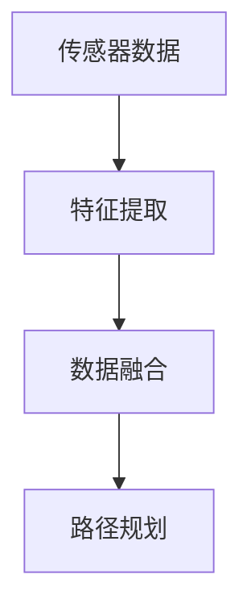
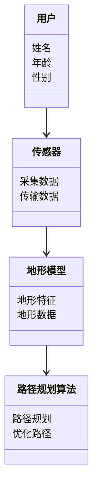
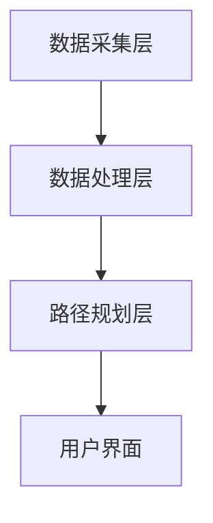
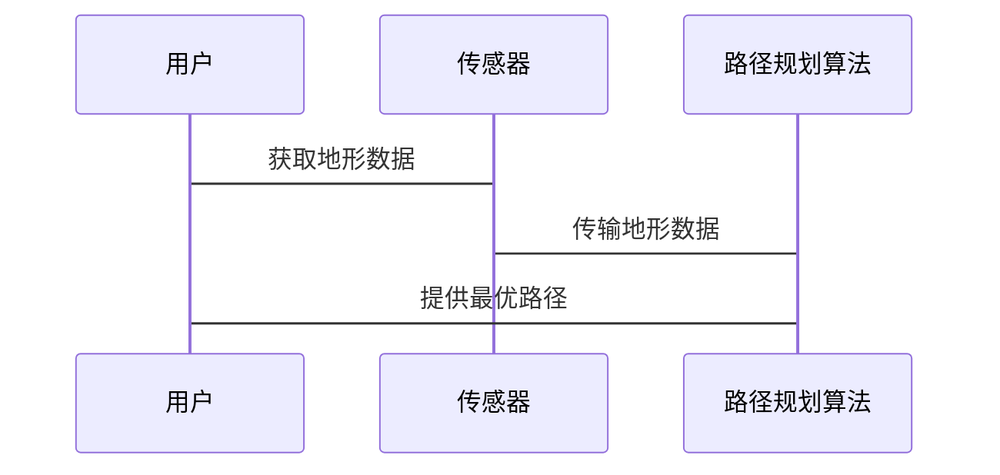

                 


# AI Agent在智能登山杖中的地形适应指导

**关键词：** AI Agent, 智能登山杖, 地形适应, 路径规划, 实时反馈, 运动辅助

**摘要：** 本文详细探讨了AI Agent在智能登山杖中的应用，重点分析了其在地形适应指导中的核心算法、系统架构和实际应用场景。通过结合实时传感器数据、路径规划算法和用户反馈机制，AI Agent能够为用户提供智能化的地形适应指导，显著提升户外运动的安全性和效率。

---

## 第1章: 背景介绍

### 1.1 问题背景
#### 1.1.1 传统登山杖的局限性
传统登山杖主要依赖用户的经验和直觉进行地形判断，存在以下问题：
- 无法实时感知地形特征（如坡度、障碍物等）。
- 无法根据地形变化提供实时反馈和调整建议。
- 对复杂地形（如陡坡、碎石路等）适应能力有限。

#### 1.1.2 地形适应的重要性
在户外运动中，地形适应是确保安全和效率的关键因素。复杂的地形（如山地、森林、沙漠等）可能对用户的体力、方向感和决策能力提出更高要求。传统登山杖无法提供足够的地形适应支持，容易导致用户迷失、疲劳或受伤。

#### 1.1.3 AI技术在运动辅助设备中的应用前景
AI技术的快速发展为运动辅助设备的智能化提供了可能。通过结合传感器数据、实时计算和用户反馈，AI Agent能够为用户提供智能化的地形适应指导。

### 1.2 问题描述
#### 1.2.1 地形适应的核心问题
- 如何实时感知和分析地形特征？
- 如何根据地形特征制定最优路径？
- 如何根据用户反馈动态调整路径规划？

#### 1.2.2 用户需求分析
用户在使用智能登山杖时，期望设备能够：
- 实时感知地形特征（如坡度、障碍物、地面硬度等）。
- 提供最优路径规划建议。
- 根据用户反馈动态调整路径。

#### 1.2.3 系统目标与边界
系统目标：
- 实现实时地形感知和分析。
- 提供智能化的路径规划和优化建议。
- 实现用户与设备之间的实时交互。

系统边界：
- 系统仅支持户外复杂地形环境。
- 系统依赖于外部传感器数据（如GPS、惯性传感器等）。
- 系统不考虑极端天气条件（如暴雨、大雪）。

### 1.3 问题解决
#### 1.3.1 AI Agent的基本概念
AI Agent是一种能够感知环境、做出决策并执行操作的智能体。在智能登山杖中，AI Agent负责：
- 实时感知地形特征。
- 根据感知结果制定最优路径。
- 根据用户反馈动态调整路径规划。

#### 1.3.2 地形适应的实现方式
- **实时传感器数据采集：** 通过GPS、惯性传感器等设备获取地形特征。
- **路径规划算法：** 使用A*算法等算法进行路径规划。
- **用户反馈机制：** 根据用户的反馈动态调整路径。

#### 1.3.3 系统设计的创新点
- **实时感知与分析：** 系统能够实时感知地形特征并进行分析。
- **动态路径规划：** 系统能够根据地形变化和用户反馈动态调整路径。
- **用户交互设计：** 系统能够与用户进行实时交互，提供个性化的指导。

### 1.4 本章小结
本章介绍了AI Agent在智能登山杖中的应用背景，分析了传统登山杖的局限性，明确了系统的目标和边界。通过AI Agent的实时感知、决策和执行能力，智能登山杖能够为用户提供智能化的地形适应指导。

---

## 第2章: 核心概念与联系

### 2.1 AI Agent的基本原理
AI Agent的基本原理包括感知、决策和执行三个模块。在智能登山杖中，AI Agent通过以下步骤实现地形适应指导：
1. **感知模块：** 采集地形特征数据（如GPS坐标、倾斜角度、地面硬度等）。
2. **决策模块：** 根据感知数据制定最优路径。
3. **执行模块：** 执行路径规划并提供反馈。

### 2.2 核心概念对比
下表对比了不同AI Agent的属性和应用场景：

| AI Agent类型 | 感知能力 | 决策能力 | 执行能力 | 适用场景 |
|--------------|----------|----------|----------|----------|
| 反应式AI Agent | 实时感知 | 简单决策 | 实时反馈 | 复杂地形实时适应 |
| 基于模型AI Agent | 离线分析 | 复杂决策 | 离线反馈 | 预规划路径 |
| 学习型AI Agent | 实时学习 | 自适应决策 | 动态反馈 | 复杂环境自适应 |

### 2.3 ER实体关系图
以下是系统实体关系图：

```mermaid
er
actor: 用户
sensor: 传感器
地形模型: 地形特征
路径规划算法: 路径规划
```

---

## 第3章: 算法原理讲解

### 3.1 路径规划算法
#### 3.1.1 A*算法原理
A*算法是一种常用的路径规划算法，其基本步骤如下：
1. **初始化：** 设置起点和目标点。
2. **生成候选路径：** 根据地形特征生成候选路径。
3. **计算路径成本：** 使用启发函数计算路径成本。
4. **选择最优路径：** 根据路径成本选择最优路径。

#### 3.1.2 算法实现
以下是A*算法的Python实现示例：

```python
import heapq

def a_star_search(start, goal, grid):
    open_set = set()
    closed_set = set()
    came_from = {}
    g_score = {}
    f_score = {}

    heapq.heappush(open_set, (0, start))
    g_score[start] = 0
    f_score[start] = heuristic(start, goal)

    while open_set:
        current = heapq.heappop(open_set)
        if current[1] == goal:
            return reconstruct_path(came_from, start, goal)
        for neighbor in grid[current[1]]:
            if neighbor not in closed_set:
                tentative_g_score = g_score[current[1]] + cost(current[1], neighbor)
                if neighbor not in g_score or tentative_g_score < g_score[neighbor]:
                    came_from[neighbor] = current[1]
                    g_score[neighbor] = tentative_g_score
                    f_score[neighbor] = g_score[neighbor] + heuristic(neighbor, goal)
                    heapq.heappush(open_set, (f_score[neighbor], neighbor))
        closed_set.add(current[1])
    return None
```

#### 3.1.3 数学模型与公式
路径规划的数学模型如下：

$$ \text{路径成本} = \sum_{i=1}^{n} \text{边成本} $$

启发函数的计算公式为：

$$ \text{启发函数} = \text{曼哈顿距离}(x, y) $$

### 3.2 传感器数据融合
传感器数据融合是实现地形适应的关键技术。以下是传感器数据融合的流程图：



---

## 第4章: 数学模型

### 4.1 地形分析模型
地形分析模型包括以下部分：
- **距离计算：** 使用欧几里得距离公式计算两点之间的距离。
- **障碍物检测：** 使用凸包算法检测障碍物。
- **路径权重计算：** 根据地形特征计算路径权重。

#### 4.1.1 距离公式
两点之间的欧几里得距离公式为：

$$ \text{距离} = \sqrt{(x_2 - x_1)^2 + (y_2 - y_1)^2} $$

#### 4.1.2 路径权重计算
路径权重的计算公式为：

$$ \text{权重} = \sum_{i=1}^{n} (\text{坡度} + \text{障碍物密度}) $$

### 4.2 路径优化模型
路径优化模型包括以下部分：
- **路径成本函数：** 定义路径的成本函数。
- **优化目标：** 最小化路径成本。

#### 4.2.1 成本函数
路径的成本函数为：

$$ \text{成本} = \sum_{i=1}^{n} (\text{路径权重} + \text{路径长度}) $$

#### 4.2.2 优化目标
优化目标为：

$$ \min \text{成本} $$

---

## 第5章: 系统分析与架构设计

### 5.1 问题场景介绍
用户在复杂地形中使用智能登山杖时，系统需要实时感知地形特征并提供最优路径规划。

### 5.2 系统功能设计
系统功能设计包括以下模块：
- **实时地形感知：** 实时采集地形特征数据。
- **路径规划：** 根据地形特征数据制定最优路径。
- **用户反馈：** 根据用户反馈动态调整路径。

#### 5.2.1 领域模型
以下是系统领域模型：



### 5.3 系统架构设计
系统架构设计采用分层架构，包括以下部分：
- **数据采集层：** 负责采集传感器数据。
- **数据处理层：** 负责处理传感器数据并生成地形模型。
- **路径规划层：** 负责根据地形模型制定最优路径。

#### 5.3.1 系统架构
以下是系统架构图：



### 5.4 系统接口设计
系统接口设计包括以下部分：
- **传感器接口：** 与传感器设备进行数据交互。
- **用户界面：** 与用户进行交互。

#### 5.4.1 系统交互
以下是系统交互图：



---

## 第6章: 项目实战

### 6.1 环境搭建
项目实战需要以下环境：
- **传感器设备：** GPS、惯性传感器等。
- **开发工具：** Python、Mermaid、LaTeX。

### 6.2 核心代码实现
以下是核心代码实现：

```python
import heapq

def a_star_search(start, goal, grid):
    open_set = set()
    closed_set = set()
    came_from = {}
    g_score = {}
    f_score = {}

    heapq.heappush(open_set, (0, start))
    g_score[start] = 0
    f_score[start] = heuristic(start, goal)

    while open_set:
        current = heapq.heappop(open_set)
        if current[1] == goal:
            return reconstruct_path(came_from, start, goal)
        for neighbor in grid[current[1]]:
            if neighbor not in closed_set:
                tentative_g_score = g_score[current[1]] + cost(current[1], neighbor)
                if neighbor not in g_score or tentative_g_score < g_score[neighbor]:
                    came_from[neighbor] = current[1]
                    g_score[neighbor] = tentative_g_score
                    f_score[neighbor] = g_score[neighbor] + heuristic(neighbor, goal)
                    heapq.heappush(open_set, (f_score[neighbor], neighbor))
        closed_set.add(current[1])
    return None
```

### 6.3 实际案例分析
以下是实际案例分析：

用户在复杂地形中使用智能登山杖时，系统能够实时感知地形特征并提供最优路径规划。例如，在陡坡地形中，系统会优先选择坡度较小的路径。

---

## 第7章: 总结与展望

### 7.1 本章总结
本文详细探讨了AI Agent在智能登山杖中的应用，分析了其在地形适应指导中的核心算法、系统架构和实际应用场景。

### 7.2 未来展望
未来的研究方向包括：
- **更复杂的地形适应算法：** 如深度强化学习算法。
- **更高效的传感器数据处理技术：** 如边缘计算技术。
- **更智能的用户交互设计：** 如语音交互技术。

---

**作者：AI天才研究院/AI Genius Institute & 禅与计算机程序设计艺术 /Zen And The Art of Computer Programming**

