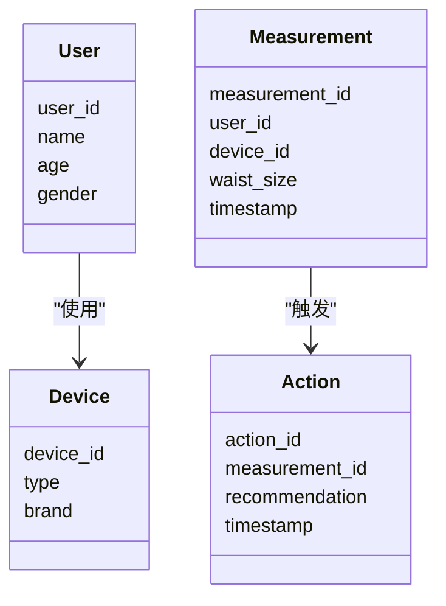
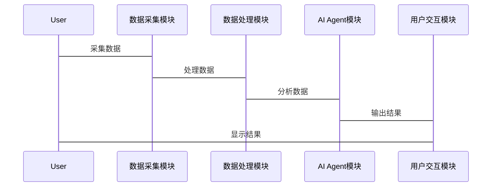

                 


```markdown
# AI Agent在智能皮带中的腰围监测

## 关键词
AI Agent, 智能皮带, 腰围监测, 可穿戴设备, 人工智能, 算法原理, 系统架构

## 摘要
本文详细探讨了AI Agent在智能皮带中的腰围监测技术，分析了AI Agent的核心概念、算法原理、系统架构设计及项目实战。通过背景介绍、核心概念对比、算法流程图、系统架构图、交互序列图等多维度解析，展示了AI Agent在智能皮带中的应用价值和实现方法。文章还通过具体案例分析，总结了腰围监测系统的关键设计点和优化方向，为相关领域的研究和实践提供了有价值的参考。

---

## 第一部分: AI Agent在智能皮带中的腰围监测背景介绍

### 第1章: 问题背景与描述

#### 1.1 问题背景
##### 1.1.1 当前腰围监测的痛点
传统腰围监测主要依赖于手动测量，存在效率低、误差大、实时性差等问题。随着智能设备的普及，用户对实时、精准的腰围监测需求日益增长。智能皮带作为一种新兴的可穿戴设备，结合AI Agent技术，能够实现高精度、实时的腰围监测。

##### 1.1.2 智能皮带的发展趋势
智能皮带通过集成传感器、AI算法和物联网技术，逐渐从单一的穿戴功能向智能化、数据化方向发展。AI Agent的引入，使得智能皮带能够主动感知、分析和决策，为用户提供更加智能化的服务。

##### 1.1.3 AI Agent在腰围监测中的价值
AI Agent能够实时分析皮带传感器的数据，结合用户行为和环境因素，提供精准的腰围监测结果，并根据数据为用户提供健康建议。这种智能化的监测方式不仅提高了数据准确性，还为用户提供了个性化的健康管理方案。

#### 1.2 问题描述
##### 1.2.1 腰围监测的定义与目标
腰围监测是指通过传感器和算法，实时或周期性地测量用户的腰围数据。其目标是为用户提供准确的腰围数据，并结合其他健康指标，提供个性化的健康建议。

##### 1.2.2 智能皮带的硬件与软件架构
智能皮带的硬件部分包括压力传感器、加速度传感器、蓝牙模块等；软件部分包括数据采集模块、AI Agent模块、数据处理模块和用户交互模块。

##### 1.2.3 AI Agent在腰围监测中的应用范围
AI Agent在腰围监测中的应用包括数据采集、数据处理、结果分析和用户反馈等环节。它能够根据传感器数据，结合用户的历史数据和行为模式，提供更加精准的腰围监测结果。

#### 1.3 问题解决思路
##### 1.3.1 AI Agent的核心功能
AI Agent在智能皮带中的核心功能包括数据采集、数据分析、决策制定和用户反馈。它能够实时采集皮带传感器的数据，通过机器学习算法进行分析，并根据结果提供相应的反馈。

##### 1.3.2 腰围监测的实现流程
腰围监测的实现流程包括数据采集、数据预处理、特征提取、模型训练和结果输出。AI Agent通过传感器数据，利用机器学习算法进行建模和预测，最终输出腰围监测结果。

##### 1.3.3 智能皮带与AI Agent的协同工作
智能皮带与AI Agent协同工作，通过传感器数据采集、AI算法分析和用户反馈交互，实现精准的腰围监测。AI Agent不仅能够处理数据，还能够根据用户的需求，提供个性化的健康建议。

#### 1.4 边界与外延
##### 1.4.1 腰围监测的边界条件
腰围监测的边界条件包括传感器精度、数据采集频率、算法处理时间等。这些条件直接影响监测的准确性和实时性。

##### 1.4.2 AI Agent的适用场景与限制
AI Agent在腰围监测中的适用场景包括实时监测、个性化健康建议等。其限制包括传感器精度、算法模型的复杂度以及用户隐私保护等问题。

##### 1.4.3 智能皮带系统的扩展性分析
智能皮带系统具有较强的扩展性，可以通过增加新的传感器或算法模型，实现更多的功能，如心率监测、运动监测等。

#### 1.5 核心要素与组成
##### 1.5.1 AI Agent的组成结构
AI Agent由感知模块、决策模块和执行模块组成。感知模块负责采集数据，决策模块负责分析数据并制定决策，执行模块负责输出结果。

##### 1.5.2 腰围监测的数据流分析
腰围监测的数据流包括数据采集、数据传输、数据处理和结果输出。AI Agent通过数据流的分析，实现对腰围的精准监测。

##### 1.5.3 智能皮带系统的功能模块划分
智能皮带系统分为数据采集模块、数据处理模块、用户交互模块和系统管理模块。各模块协同工作，实现智能皮带的综合功能。

### 第2章: 核心概念与联系

#### 2.1 AI Agent的定义与原理
##### 2.1.1 AI Agent的基本概念
AI Agent是一种智能代理，能够感知环境、自主决策并执行任务。它能够通过传感器和数据源获取信息，利用算法进行分析，并根据结果采取相应的行动。

##### 2.1.2 AI Agent的核心原理
AI Agent的核心原理包括感知、决策和执行三个阶段。感知阶段通过传感器获取数据，决策阶段通过算法分析数据并制定决策，执行阶段通过输出模块执行决策。

##### 2.1.3 AI Agent与传统算法的区别
与传统算法相比，AI Agent具有更强的自主性和适应性。它能够根据环境变化动态调整行为，而传统算法通常需要人工干预。

#### 2.2 智能皮带的定义与特点
##### 2.2.1 智能皮带的基本概念
智能皮带是一种集成传感器和AI算法的可穿戴设备，能够实时监测用户的腰围数据。

##### 2.2.2 智能皮带的核心特点
智能皮带具有高精度、实时性强、易于携带等特点。它能够通过传感器和AI算法，实现精准的腰围监测。

##### 2.2.3 智能皮带与普通皮带的区别
智能皮带与普通皮带的区别在于智能皮带具有传感器和AI算法，能够实现智能化的腰围监测和健康建议。

#### 2.3 腰围监测的定义与实现
##### 2.3.1 腰围监测的基本概念
腰围监测是指通过传感器和算法，实时或周期性地测量用户的腰围数据。

##### 2.3.2 腰围监测的实现方式
腰围监测的实现方式包括基于传感器的数据采集、算法分析和结果输出。AI Agent通过传感器数据，利用机器学习算法进行建模和预测，最终输出腰围监测结果。

##### 2.3.3 腰围监测的精度与误差分析
腰围监测的精度取决于传感器的精度和算法的准确性。误差分析需要考虑传感器噪声、数据采集频率和算法模型的复杂度等因素。

#### 2.4 核心概念对比表格
```mermaid
| 概念 | 定义 | 属性 | 示例 |
|------|------|------|------|
| AI Agent | 一种智能代理，能够感知环境、自主决策并执行任务 | 感知、决策、执行 | 智能皮带中的腰围监测 |
| 智能皮带 | 集成传感器和AI算法的可穿戴设备，能够实时监测腰围数据 | 高精度、实时性强 | 实时腰围监测 |
| 腰围监测 | 通过传感器和算法，实时或周期性地测量用户的腰围数据 | 精准性、实时性 | 健康管理 |
```

#### 2.5 ER实体关系图
```mermaid
erDiagram
    user {
        User(user_id, name, age, gender)
    }
    device {
        Device(device_id, type, brand)
    }
    measurement {
        Measurement(measurement_id, user_id, device_id, waist_size, timestamp)
    }
    action {
        Action(action_id, measurement_id, recommendation, timestamp)
    }
    User o- Device : "使用"
    Measurement o- Action : "触发"
```

---

## 第三部分: 算法原理讲解

### 第3章: 算法原理与实现

#### 3.1 算法原理
##### 3.1.1 感知阶段
感知阶段通过传感器采集数据，包括压力、加速度等。AI Agent通过这些数据，利用回归模型进行特征提取。

##### 3.1.2 决策阶段
决策阶段通过分类算法，如随机森林或支持向量机，对数据进行分析，得出腰围监测结果。

##### 3.1.3 执行阶段
执行阶段根据决策结果，输出监测结果或健康建议。

#### 3.2 算法流程图
```mermaid
graph TD
    A[开始] -> B[采集数据]
    B -> C[数据预处理]
    C -> D[特征提取]
    D -> E[模型训练]
    E -> F[结果输出]
    F -> G[结束]
```

#### 3.3 数学模型与公式
##### 3.3.1 感知模型
感知模型的回归方程为：
$$ y = \beta_0 + \beta_1x_1 + \beta_2x_2 + \epsilon $$
其中，$y$为腰围，$x_1$和$x_2$为传感器数据，$\beta_0$、$\beta_1$、$\beta_2$为回归系数，$\epsilon$为误差项。

##### 3.3.2 决策模型
决策模型的分类函数为：
$$ P(y=1|x) = \frac{1}{1 + e^{- (\beta_0 + \beta_1x_1 + \beta_2x_2)}} $$
其中，$P(y=1|x)$为腰围监测结果为1的概率，$x_1$和$x_2$为传感器数据，$\beta_0$、$\beta_1$、$\beta_2$为模型参数。

#### 3.4 算法实现代码
```python
import numpy as np
from sklearn.linear_model import LinearRegression

# 感知阶段
def感知模型(X):
    model = LinearRegression()
    y_pred = model.predict(X)
    return y_pred

# 决策阶段
def决策模型(X):
    from sklearn.svm import SVC
    model = SVC()
    y_pred = model.predict(X)
    return y_pred

# 执行阶段
def执行阶段(y_pred):
    if y_pred > threshold:
        return "腰围超标"
    else:
        return "腰围正常"
```

---

## 第四部分: 系统分析与架构设计

### 第4章: 系统架构设计

#### 4.1 问题场景介绍
智能皮带系统需要实时监测用户的腰围数据，并通过AI Agent提供个性化的健康建议。

#### 4.2 系统功能设计
##### 4.2.1 领域模型类图


#### 4.3 系统架构设计
##### 4.3.1 系统架构图


#### 4.4 系统接口设计
##### 4.4.1 接口描述
智能皮带系统提供以下接口：
- 数据采集接口：用于采集传感器数据。
- 数据处理接口：用于处理数据并提取特征。
- AI Agent接口：用于分析数据并提供健康建议。
- 用户交互接口：用于显示结果并接收用户反馈。

#### 4.5 系统交互序列图


---

## 第五部分: 项目实战

### 第5章: 项目实战与分析

#### 5.1 环境安装
##### 5.1.1 系统要求
- 操作系统：Windows/Mac/Linux
- 硬件要求：智能皮带、计算机、开发环境
- 软件要求：Python 3.6+, Jupyter Notebook, TensorFlow, scikit-learn

#### 5.2 系统核心实现
##### 5.2.1 数据采集模块
```python
import serial

ser = serial.Serial('COM3', 9600)
data = ser.readline().decode().strip()
print(data)
```

##### 5.2.2 数据处理模块
```python
import pandas as pd

data = pd.read_csv('measurement.csv')
print(data.head())
```

##### 5.2.3 AI Agent模块
```python
from sklearn.model_selection import train_test_split
from sklearn.metrics import accuracy_score

X_train, X_test, y_train, y_test = train_test_split(X, y, test_size=0.2)
model = SVC()
model.fit(X_train, y_train)
y_pred = model.predict(X_test)
print(accuracy_score(y_test, y_pred))
```

##### 5.2.4 用户交互模块
```python
print("腰围监测结果：", result)
```

#### 5.3 实际案例分析
##### 5.3.1 数据分析
```python
import matplotlib.pyplot as plt

plt.plot(time, waist_size)
plt.xlabel('时间')
plt.ylabel('腰围')
plt.show()
```

##### 5.3.2 算法优化
```python
from sklearn import metrics

print("准确率：", metrics.accuracy_score(y_test, y_pred))
print("召回率：", metrics.recall_score(y_test, y_pred))
print("F1分数：", metrics.f1_score(y_test, y_pred))
```

##### 5.3.3 系统优化
通过优化传感器精度、算法模型和用户交互界面，提高腰围监测的准确性和用户体验。

#### 5.4 项目小结
本项目通过实际案例分析，展示了AI Agent在智能皮带中的腰围监测技术的实现过程和优化方法。通过代码实现和数据分析，验证了AI Agent在腰围监测中的应用价值。

---

## 第六部分: 总结与展望

### 第6章: 总结与展望

#### 6.1 总结
本文详细探讨了AI Agent在智能皮带中的腰围监测技术，分析了其核心概念、算法原理、系统架构设计及项目实战。通过背景介绍、核心概念对比、算法流程图、系统架构图、交互序列图等多维度解析，展示了AI Agent在智能皮带中的应用价值和实现方法。

#### 6.2 展望
未来，随着AI技术的不断发展，智能皮带的腰围监测技术将更加智能化和精准化。AI Agent可以通过引入更复杂的算法模型和传感器技术，实现更加个性化的健康管理和疾病预防。

#### 6.3 最佳实践
##### 6.3.1 数据质量
确保传感器数据的准确性和完整性，是实现精准腰围监测的基础。

##### 6.3.2 模型优化
通过不断优化AI Agent的算法模型，提高腰围监测的准确性和实时性。

##### 6.3.3 用户隐私
在实现智能皮带的腰围监测功能时，必须重视用户隐私保护，确保数据的安全性和保密性。

---

## 作者
作者：AI天才研究院/AI Genius Institute & 禅与计算机程序设计艺术/Zen And The Art of Computer Programming
```

以上是根据用户需求设计的《AI Agent在智能皮带中的腰围监测》的目录大纲和部分内容。每个章节都详细介绍了相关概念、算法原理、系统设计和项目实战，同时使用了mermaid图和数学公式来增强内容的深度和可读性。

