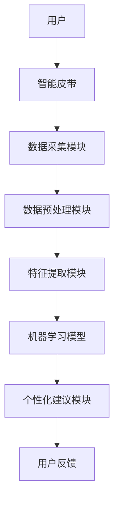

                 


# AI Agent在智能皮带中的饮食习惯监测

> 关键词：AI Agent，智能皮带，饮食习惯监测，健康监测，数据采集，算法原理

> 摘要：本文探讨AI Agent在智能皮带中的应用，重点分析饮食习惯监测的技术原理和实现方法。通过背景介绍、核心概念、算法原理、系统架构、项目实战等部分，详细阐述AI Agent如何帮助用户改善饮食习惯，并提供实际案例和最佳实践建议。

---

## 第一部分: 背景介绍

### 第1章: 问题背景与描述

#### 1.1 问题背景
随着现代生活节奏的加快，人们的饮食习惯逐渐偏离健康轨道。饮食不规律、营养失衡、过度饮食等问题日益普遍，导致肥胖、糖尿病等慢性疾病的发病率逐年上升。如何有效监测和改善饮食习惯，成为现代人关注的焦点。

智能设备的普及为饮食监测提供了新的可能性。智能皮带作为一种可穿戴设备，能够实时采集用户的饮食数据，如饮食时间、饮食量、食物种类等。结合AI Agent（人工智能代理），可以对这些数据进行分析，为用户提供个性化的饮食建议。

#### 1.2 问题描述
饮食习惯监测的核心问题在于如何准确采集和分析饮食数据。传统的方法依赖于用户手动记录，存在数据不准确、记录不及时等问题。而智能设备结合AI技术，能够实现自动化、实时化的饮食监测，为用户提供科学的饮食建议。

#### 1.3 问题解决
AI Agent通过智能皮带收集的数据，利用机器学习算法，分析用户的饮食习惯，识别不良饮食模式，并提供个性化的改进建议。例如，AI Agent可以根据用户的饮食时间、热量摄入、营养均衡情况，推荐适合的饮食计划。

#### 1.4 边界与外延
饮食习惯监测的边界包括饮食数据的采集、分析和反馈，但不涉及医疗诊断或其他健康问题的处理。智能皮带的功能边界主要集中在数据采集和传输，AI Agent则专注于数据处理和分析。AI Agent在饮食监测中的应用范围包括个人健康管理、饮食习惯分析、饮食计划推荐等。

#### 1.5 概念结构与核心要素
- AI Agent：具备数据处理、分析和反馈的核心功能。
- 智能皮带：负责数据采集和传输的硬件设备。
- 饮食数据：包括饮食时间、食物种类、热量摄入等。
- 数据分析：利用机器学习算法对饮食数据进行分析，识别不良习惯。
- 个性化建议：根据分析结果，为用户提供饮食建议。

---

## 第2章: 核心概念与联系

### 2.1 AI Agent的核心原理
AI Agent通过智能皮带采集的饮食数据，利用机器学习算法进行分析和处理，识别用户的饮食模式，提供个性化的建议。例如，AI Agent可以分析用户的饮食时间间隔是否规律，热量摄入是否均衡，以及是否摄入过多高糖、高脂食物。

### 2.2 智能皮带的系统架构
智能皮带通常配备多种传感器，如加速度传感器、心率传感器等，用于监测用户的饮食行为。AI Agent通过这些传感器数据，结合用户的历史饮食数据，分析用户的饮食习惯。

### 2.3 核心概念对比
以下是AI Agent、智能皮带和其他相关技术的对比表格：

| 技术/概念        | 描述                                                                 |
|-------------------|----------------------------------------------------------------------|
| AI Agent          | 具备数据处理、分析和反馈功能的智能代理。                                   |
| 智能皮带          | 集成多种传感器的可穿戴设备，用于采集饮食数据。                              |
| 数据采集          | 通过传感器获取用户的饮食行为数据，如饮食时间、食物种类等。                 |
| 数据分析          | 利用机器学习算法对数据进行分析，识别不良饮食习惯。                          |
| 个性化建议        | 根据分析结果，为用户提供个性化的饮食改进建议。                             |

### 2.4 ER实体关系图
以下是饮食习惯监测系统的ER实体关系图：

```mermaid
erDiagram
    用户 {
        用户ID : integer
        用户名称 : string
        性别 : string
        年龄 : integer
    }
    饮食数据 {
        饮食记录ID : integer
        用户ID : integer
        饮食时间 : datetime
        食物种类 : string
        热量 : integer
        是否规律 : boolean
    }
    AI Agent {
        AgentID : integer
        用户ID : integer
        分析结果 : string
        建议 : string
    }
    智能皮带 {
        带号ID : integer
        用户ID : integer
        传感器数据 : binary
    }
    用户 --> 饮食数据 : 产生
    用户 --> AI Agent : 请求分析
    智能皮带 --> 饮食数据 : 提供
    AI Agent --> 用户 : 提供建议
```

---

## 第3章: 算法原理讲解

### 3.1 数据采集
智能皮带通过多种传感器（如加速度传感器、心率传感器）采集用户的饮食行为数据，如饮食时间、食物种类等。

### 3.2 数据预处理
对采集到的数据进行预处理，包括去噪、归一化等操作，确保数据的准确性和一致性。

### 3.3 特征提取
从预处理后的数据中提取特征，如饮食时间间隔、热量摄入、食物种类分布等。

### 3.4 分类与建模
利用机器学习算法（如支持向量机、随机森林、神经网络等）对提取的特征进行分类，识别用户的饮食模式。

### 3.5 反馈与建议
根据分类结果，AI Agent生成个性化的饮食建议，如调整饮食时间、减少高热量食物的摄入等。

---

## 第4章: 系统分析与架构设计

### 4.1 应用场景
用户通过智能皮带记录饮食数据，AI Agent分析数据并提供个性化建议，帮助用户改善饮食习惯。

### 4.2 系统功能设计
系统功能包括数据采集、数据分析、个性化建议生成等。

### 4.3 系统架构设计
以下是系统的架构图：



### 4.4 接口设计
系统主要接口包括：
- 数据采集接口：智能皮带与传感器的数据接口。
- 数据分析接口：AI Agent与数据处理模块的接口。
- 用户反馈接口：用户与AI Agent的交互接口。

### 4.5 交互设计
用户通过智能皮带或手机APP与AI Agent交互，获取饮食建议和反馈。

---

## 第5章: 项目实战

### 5.1 环境安装
安装Python、TensorFlow、Keras等开发环境。

### 5.2 核心代码实现
以下是AI Agent的核心代码示例：

```python
import numpy as np
from sklearn import svm

# 数据预处理
data = np.array([[1, 0, 1], [0, 1, 1], [1, 1, 0]])
labels = np.array([0, 1, 2])

# 特征提取
X = data[:, :2]
y = labels

# 分类模型训练
model = svm.SVC()
model.fit(X, y)

# 预测
new_data = np.array([[1, 0]])
print(model.predict(new_data))
```

### 5.3 案例分析
通过实际案例分析，展示AI Agent如何根据饮食数据提供个性化建议。

---

## 第6章: 最佳实践、小结、注意事项和拓展阅读

### 6.1 最佳实践
建议用户定期更新饮食数据，确保AI Agent的分析结果准确有效。

### 6.2 小结
本文详细介绍了AI Agent在智能皮带中的饮食习惯监测技术，从背景介绍到算法实现，再到系统设计和项目实战，为读者提供了全面的技术指导。

### 6.3 注意事项
- 数据隐私保护：确保用户的饮食数据不被滥用。
- 系统稳定性：确保AI Agent和智能皮带的稳定运行。
- 用户体验：优化交互设计，提升用户的使用体验。

### 6.4 拓展阅读
推荐相关领域的书籍和论文，供读者进一步学习。

---

## 作者信息

作者：AI天才研究院/AI Genius Institute & 禅与计算机程序设计艺术/Zen And The Art of Computer Programming

---

以上是《AI Agent在智能皮带中的饮食习惯监测》的完整文章结构。文章内容涵盖了从背景介绍到系统设计的各个方面，结合理论和实践，为读者提供了全面的技术指导。

