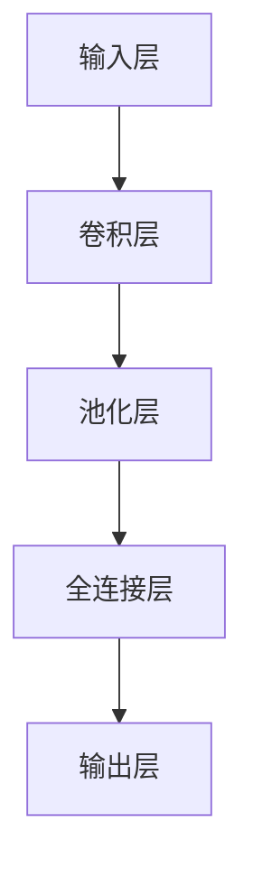
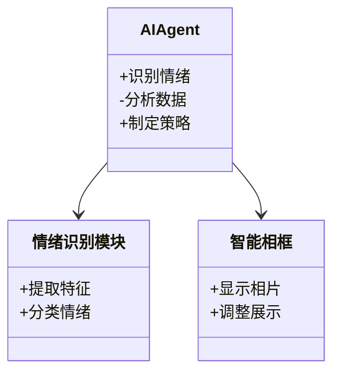
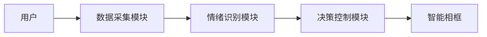
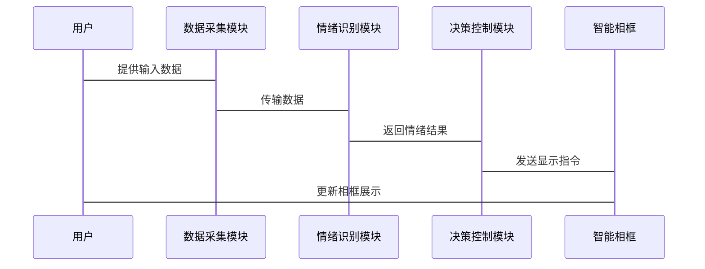

                 


```markdown
# AI Agent在智能相框中的情绪识别显示

> 关键词：AI Agent，智能相框，情绪识别，深度学习，卷积神经网络，系统架构

> 摘要：本文详细探讨AI Agent在智能相框中的情绪识别显示应用，从背景介绍、核心概念、算法原理到系统架构和项目实战，全面解析如何利用AI技术实现智能相框的情绪识别与显示功能。

---

## 第1章 AI Agent与智能相框的背景

### 1.1 AI Agent的基本概念
#### 1.1.1 AI Agent的定义与特点
AI Agent（人工智能代理）是一种能够感知环境、自主决策并执行任务的智能实体。它具备自主性、反应性、目标导向和社交能力等核心特点。

#### 1.1.2 AI Agent的核心功能与应用场景
AI Agent的核心功能包括信息处理、决策制定、任务执行和与用户的交互。其应用场景广泛，如智能助手、自动驾驶、智能家居和医疗诊断等。

#### 1.1.3 AI Agent在智能设备中的作用
在智能设备中，AI Agent通过感知环境数据、分析用户需求并执行相应的操作，提升了设备的智能化水平和用户体验。

### 1.2 情绪识别技术的背景
#### 1.2.1 情绪识别的基本概念
情绪识别是指通过分析面部表情、语音语调和文本内容等多模态数据，推断出用户的当前情绪状态的技术。

#### 1.2.2 情绪识别的主要技术与方法
情绪识别的主要技术包括基于计算机视觉的面部表情分析、基于自然语言处理的文本情绪分析，以及结合语音特征的情绪识别方法。

#### 1.2.3 情绪识别在智能设备中的应用潜力
在智能设备中，情绪识别技术可以用于个性化推荐、情感支持和用户体验优化等方面，为用户带来更贴心的服务体验。

### 1.3 智能相框的发展历程
#### 1.3.1 相框的演变史
从传统相框到数字相框，再到智能相框，相框的功能逐步从单纯的展示工具演变为具备智能化交互能力的设备。

#### 1.3.2 智能相框的定义与特点
智能相框是一种结合了电子显示技术和人工智能技术的新型相框，能够通过网络连接、传感器数据采集和AI算法分析，实现智能化的相片展示和用户交互。

#### 1.3.3 智能相框的应用场景与用户需求
智能相框的应用场景包括家庭相册展示、远程亲情互动、个性化相框推荐等。用户需求主要集中在便捷性、智能化和情感化方面。

### 1.4 AI Agent与智能相框的结合
#### 1.4.1 AI Agent在智能相框中的应用价值
通过AI Agent，智能相框能够实现更智能的相片管理和展示，为用户提供个性化的服务。

#### 1.4.2 情绪识别在智能相框中的意义
情绪识别能够让智能相框根据用户的当前情绪状态，自动调整相片展示内容，提供情感化的用户体验。

#### 1.4.3 本章小结
本章通过对AI Agent和情绪识别的背景介绍，阐述了它们在智能相框中的结合及其应用潜力。

---

## 第2章 AI Agent与情绪识别的核心概念

### 2.1 AI Agent的核心原理
#### 2.1.1 AI Agent的感知与决策机制
AI Agent通过感知环境信息、分析数据并基于预设的决策模型，制定行动方案。

#### 2.1.2 AI Agent的行为模型
AI Agent的行为模型包括基于规则的模型、基于知识的模型和基于学习的模型。每种模型都有其适用的场景和特点。

#### 2.1.3 AI Agent与人类交互的特点
AI Agent与人类交互的特点包括自然性、实时性、个性化和情感化。通过这些特点，AI Agent能够提供更贴近人类需求的服务。

### 2.2 情绪识别的核心原理
#### 2.2.1 情绪识别的主要方法
情绪识别的主要方法包括基于面部表情的识别、基于语音特征的识别和基于文本内容的识别。

#### 2.2.2 情绪识别的特征提取技术
情绪识别的特征提取技术包括图像特征提取、语音特征提取和文本特征提取。这些技术为后续的情绪分类提供了基础。

#### 2.2.3 情绪识别的算法选择与优化
在情绪识别中，卷积神经网络（CNN）和长短期记忆网络（LSTM）是常用的算法。选择合适的算法并进行优化是提升识别准确率的关键。

### 2.3 AI Agent与情绪识别的联系
#### 2.3.1 AI Agent如何利用情绪识别技术
AI Agent可以通过情绪识别技术感知用户的情绪状态，从而调整其行为策略，提供更个性化的服务。

#### 2.3.2 情绪识别如何增强AI Agent的功能
情绪识别增强了AI Agent的情感理解能力，使其能够更好地理解用户需求，提供更贴心的服务。

#### 2.3.3 两者结合的系统架构
结合AI Agent与情绪识别技术的系统架构包括数据采集模块、情绪识别模块、决策控制模块和用户交互模块。各模块协同工作，实现智能化的情绪识别与显示。

### 2.4 核心概念对比分析
#### 2.4.1 AI Agent与传统程序的对比
通过对比分析，可以看出AI Agent在自主性、学习能力和适应性等方面相较于传统程序的优势。

#### 2.4.2 情绪识别与传统图像识别的对比
情绪识别相较于传统图像识别，更加注重情感信息的提取和分析，具有更高的应用价值。

#### 2.4.3 核心概念的ER实体关系图
```mermaid
er
actor AI Agent
actor 情绪识别
actor 智能相框
```

---

## 第3章 情绪识别算法的原理与实现

### 3.1 情绪识别的主要算法
#### 3.1.1 基于CNN的情绪识别算法
卷积神经网络（CNN）是一种常用的图像分类算法，适用于面部表情的情绪识别。

#### 3.1.2 基于RNN的情绪识别算法
长短期记忆网络（LSTM）适用于处理时间序列数据，可以用于语音和文本的情绪识别。

### 3.2 情绪识别算法的实现步骤
#### 3.2.1 数据预处理
对图像数据进行归一化、增强和标注处理，为模型训练提供高质量的数据集。

#### 3.2.2 模型构建
使用Keras框架构建卷积神经网络模型，包括卷积层、池化层、全连接层和输出层。

#### 3.2.3 模型训练与优化
通过Adam优化器进行模型训练，并使用交叉熵损失函数进行损失优化。

#### 3.2.4 模型评估与测试
使用测试集对模型进行评估，计算准确率、召回率和F1值，分析模型的性能表现。

### 3.3 情绪识别算法的数学模型
#### 3.3.1 卷积神经网络的数学模型


#### 3.3.2 长短期记忆网络的数学模型
```latex
$$
f(t) = \sigma(W_f \cdot [h(t-1), x(t)])
$$
```

---

## 第4章 智能相框系统分析与架构设计

### 4.1 系统功能设计
#### 4.1.1 领域模型设计


#### 4.1.2 功能模块划分
智能相框系统主要包括数据采集模块、情绪识别模块、决策控制模块和用户交互模块。

### 4.2 系统架构设计
#### 4.2.1 系统架构图


#### 4.2.2 关键接口设计
系统的主要接口包括数据采集接口、情绪识别接口和用户交互接口。

### 4.3 系统交互设计
#### 4.3.1 交互流程图


---

## 第5章 项目实战: 智能相框的情绪识别显示实现

### 5.1 开发环境搭建
#### 5.1.1 Python环境安装
使用Anaconda安装Python 3.8及以上版本，并安装必要的库如TensorFlow、Keras和OpenCV。

#### 5.1.2 数据集准备
收集并标注面部表情数据集，包括不同情绪状态的图像。

### 5.2 核心代码实现
#### 5.2.1 数据预处理代码
```python
import cv2
import numpy as np

def preprocess_image(image):
    image = cv2.resize(image, (224, 224))
    image = image / 255.0
    return image
```

#### 5.2.2 情绪识别模型代码
```python
from keras.models import Sequential
from keras.layers import Conv2D, MaxPooling2D, Flatten, Dense

model = Sequential()
model.add(Conv2D(32, (3,3), activation='relu', input_shape=(224, 224, 3)))
model.add(MaxPooling2D((2,2)))
model.add(Flatten())
model.add(Dense(128, activation='relu'))
model.add(Dense(4, activation='softmax'))  # 假设4种情绪类别
model.compile(optimizer='adam', loss='categorical_crossentropy', metrics=['accuracy'])
```

### 5.3 项目实战案例分析
#### 5.3.1 实验结果分析
通过实验验证模型的准确率、召回率和F1值，分析模型的性能表现。

#### 5.3.2 案例分析与总结
总结项目实现中的经验教训，提出改进建议。

---

## 第6章 最佳实践与总结

### 6.1 小结
通过本文的详细讲解，读者可以全面了解AI Agent在智能相框中的情绪识别显示应用，掌握其实现原理和系统架构设计。

### 6.2 注意事项
在实际应用中，需要注意数据隐私保护、模型泛化能力提升以及系统稳定性保障等问题。

### 6.3 拓展阅读
推荐读者阅读相关领域的书籍和论文，如《深度学习》、《机器学习实战》和《情感计算》等。

---

## 作者信息

作者：AI天才研究院/AI Genius Institute & 禅与计算机程序设计艺术 /Zen And The Art of Computer Programming
```

