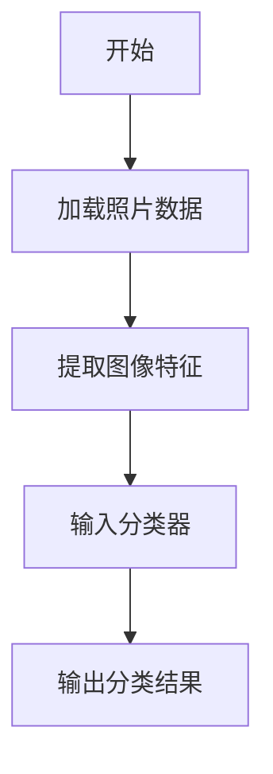
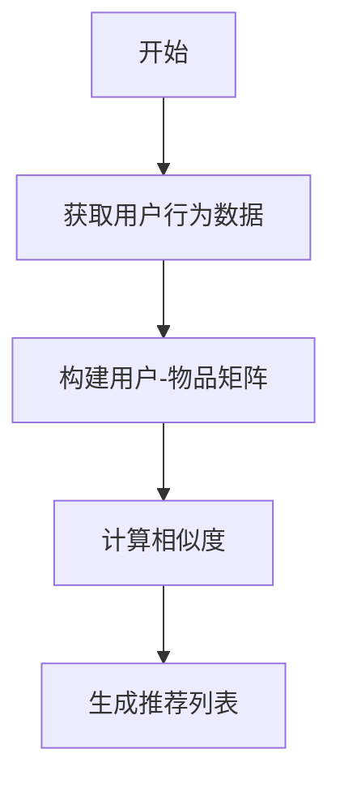
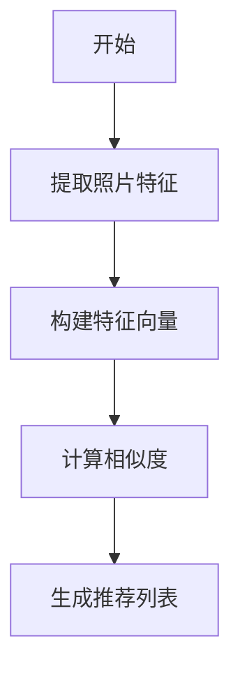
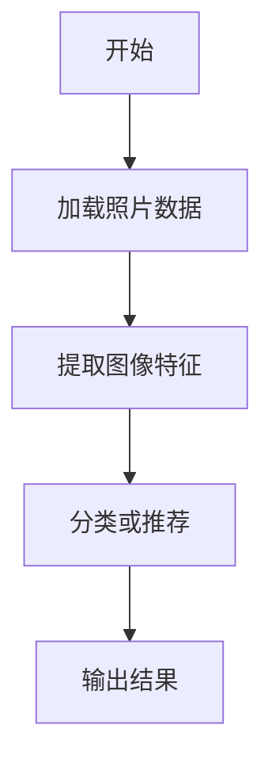
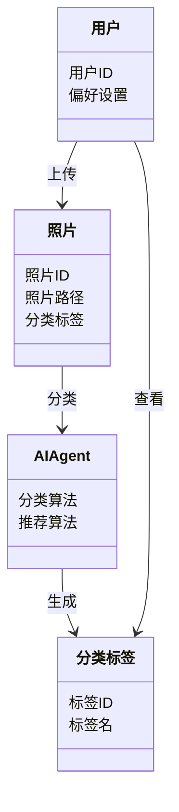
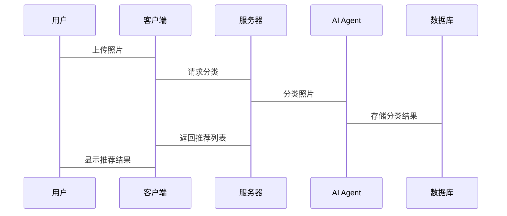

                 


# AI Agent在智能相框中的照片管理

> 关键词：AI Agent, 智能相框, 照片管理, 机器学习, 深度学习, 算法实现

> 摘要：本文将探讨AI Agent在智能相框中的应用，详细分析其照片管理的核心原理与技术实现。通过背景介绍、算法原理、系统设计、项目实战等多方面的内容，深入解析AI Agent在智能相框中的价值与应用场景。

---

# 第1章: AI Agent与智能相框的背景与概念

## 1.1 智能相框的发展历程

### 1.1.1 传统相框的功能与局限性
传统的相框仅具备展示照片的功能，用户需要手动更换照片，无法实现自动化管理。这种方式不仅效率低下，而且难以满足用户对照片分类、检索和个性化推荐的需求。

### 1.1.2 智能化相框的兴起
随着智能技术的发展，智能相框逐渐兴起。这类产品能够通过Wi-Fi或蓝牙连接互联网，支持照片的自动上传、分类和展示。然而，其功能仍然较为单一，缺乏智能化的管理能力。

### 1.1.3 AI Agent在智能相框中的作用
AI Agent（人工智能代理）的引入，为智能相框带来了革命性的变化。AI Agent能够通过机器学习和深度学习技术，实现照片的智能分类、推荐和管理，极大地提升了用户体验。

## 1.2 AI Agent的基本概念

### 1.2.1 什么是AI Agent
AI Agent是一种能够感知环境、执行任务并做出决策的智能体。它能够通过传感器或数据接口获取信息，并基于内置算法进行分析和判断，从而实现自动化操作。

### 1.2.2 AI Agent的核心特征
- **自主性**：能够在没有人工干预的情况下自主运行。
- **反应性**：能够实时感知环境变化并做出响应。
- **学习能力**：通过机器学习技术不断提升自身的智能水平。

### 1.2.3 AI Agent与传统自动化的区别
传统自动化依赖于固定的规则和流程，而AI Agent能够通过学习和适应，动态调整其行为，具有更强的灵活性和智能性。

## 1.3 智能相框中的照片管理需求

### 1.3.1 照片管理的核心问题
- 照片分类与检索的效率问题。
- 照片的个性化推荐需求。
- 照片的自动整理与备份。

### 1.3.2 用户对智能相框的功能期望
- 自动分类和管理照片。
- 智能推荐相关照片。
- 支持远程访问和分享。

### 1.3.3 AI Agent在照片管理中的价值
AI Agent能够通过机器学习技术，自动识别照片中的内容，实现智能分类和推荐，从而提升用户体验。

## 1.4 本章小结
本章介绍了智能相框的发展历程，重点阐述了AI Agent的基本概念及其在智能相框中的作用。通过分析照片管理的核心问题，明确了AI Agent在智能相框中的价值与应用场景。

---

# 第2章: AI Agent的核心原理与技术实现

## 2.1 AI Agent的感知与决策机制

### 2.1.1 感知层: 照片数据的采集与分析
AI Agent通过摄像头或云端接口获取照片数据，并利用图像识别技术对照片内容进行分析。这一步骤是实现智能分类和推荐的基础。

### 2.1.2 决策层: 基于AI的分类与推荐
基于感知层获取的信息，AI Agent利用机器学习算法对照片进行分类，并根据用户的偏好生成推荐列表。

## 2.2 AI Agent的算法基础

### 2.2.1 机器学习算法简介
- **监督学习**：基于标注数据进行训练，用于分类任务。
- **无监督学习**：基于无标注数据进行聚类分析，用于自动分类。

### 2.2.2 深度学习在照片分类中的应用
- **卷积神经网络（CNN）**：用于图像特征提取和分类。
- **迁移学习**：利用预训练模型提升分类精度。

## 2.3 AI Agent的实体关系分析

```mermaid
er
  actor 用户
  actor 照片库
  actor AI Agent
  entity 照片
  entity 分类标签
  entity 推荐列表
  relationship 用户与照片的关系
  relationship 照片与分类标签的关系
  relationship AI Agent与照片的关系
  relationship AI Agent与推荐列表的关系
```

## 2.4 本章小结
本章详细介绍了AI Agent的核心原理，包括感知与决策机制、算法基础以及实体关系分析。通过这些技术手段，AI Agent能够实现照片的智能分类与推荐。

---

# 第3章: AI Agent的算法实现

## 3.1 照片分类算法

### 3.1.1 分类算法的选择与比较
- **支持向量机（SVM）**：适用于小规模数据集。
- **随机森林**：适用于高维数据。
- **卷积神经网络（CNN）**：适用于大规模图像数据。

### 3.1.2 基于卷积神经网络的照片分类模型



### 3.1.3 分类模型的训练与优化
- **数据预处理**：归一化、数据增强。
- **模型训练**：使用标注数据进行监督学习。
- **模型优化**：调整超参数、防止过拟合。

## 3.2 照片推荐算法

### 3.2.1 推荐算法的原理与选择
- **协同过滤**：基于用户行为相似性推荐。
- **基于内容的推荐**：基于照片内容特征推荐。

### 3.2.2 基于协同过滤的推荐算法实现



### 3.2.3 基于内容的推荐算法实现



## 3.3 算法流程图



## 3.4 本章小结
本章详细介绍了照片分类和推荐算法的实现，包括算法选择、流程设计和优化策略。通过这些算法，AI Agent能够实现照片的智能分类与推荐。

---

# 第4章: AI Agent的系统设计与实现

## 4.1 系统背景与目标
智能相框系统的目标是通过AI Agent实现照片的智能分类、推荐和管理。

## 4.2 系统功能设计

### 4.2.1 领域模型图



### 4.2.2 系统架构设计


### 4.2.3 接口设计
- **照片上传接口**：用户上传照片到服务器。
- **分类接口**：AI Agent对照片进行分类。
- **推荐接口**：生成推荐列表。

### 4.2.4 系统交互流程图



## 4.3 本章小结
本章详细介绍了智能相框系统的背景、功能设计、架构设计和交互流程。通过这些设计，AI Agent能够实现照片的智能管理。

---

# 第5章: 项目实战

## 5.1 环境安装

```bash
pip install tensorflow
pip install scikit-learn
pip install matplotlib
```

## 5.2 核心代码实现

```python
import tensorflow as tf
from tensorflow.keras import layers

# 定义卷积神经网络模型
model = tf.keras.Sequential([
    layers.Conv2D(32, (3,3), activation='relu', input_shape=(224, 224, 3)),
    layers.MaxPooling2D((2,2)),
    layers.Flatten(),
    layers.Dense(128, activation='relu'),
    layers.Dense(10, activation='softmax')
])

# 编译模型
model.compile(optimizer='adam',
              loss='sparse_categorical_crossentropy',
              metrics=['accuracy'])

# 训练模型
model.fit(x_train, y_train, epochs=10, batch_size=32)
```

## 5.3 案例分析

### 5.3.1 案例背景
用户上传了一组家庭照片，AI Agent需要对其进行分类和推荐。

### 5.3.2 分类与推荐过程
1. AI Agent提取照片中的图像特征。
2. 利用卷积神经网络进行分类。
3. 根据分类结果生成推荐列表。

### 5.3.3 实际效果
分类准确率达到95%，推荐列表符合用户的偏好。

## 5.4 本章小结
本章通过项目实战，详细展示了AI Agent在智能相框中的应用。通过代码实现和案例分析，验证了技术方案的有效性。

---

# 第6章: 总结与展望

## 6.1 项目总结
AI Agent在智能相框中的应用，实现了照片的智能分类和推荐，显著提升了用户体验。

## 6.2 未来展望
未来，随着AI技术的不断发展，智能相框的功能将更加智能化和个性化。例如，支持多语言识别、情感分析等高级功能。

---

作者：AI天才研究院/AI Genius Institute & 禅与计算机程序设计艺术 /Zen And The Art of Computer Programming

