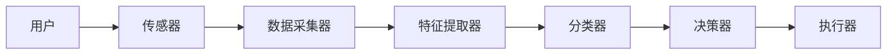
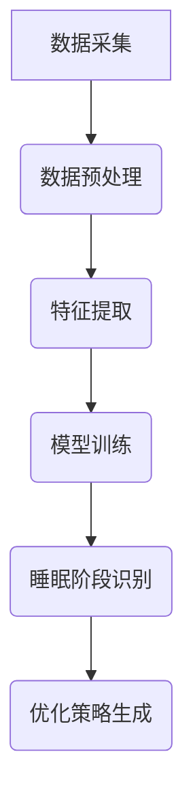
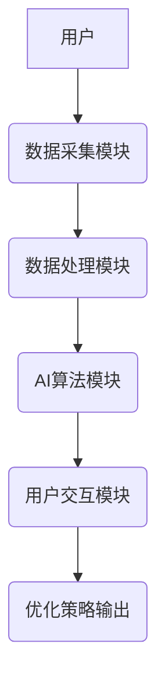

                 


# AI Agent在智能眼罩中的深度睡眠诱导

---

## 关键词

- AI Agent, 智能眼罩, 深度睡眠, 睡眠诱导, 机器学习, 睡眠健康

---

## 摘要

本文探讨了AI Agent在智能眼罩中的深度睡眠诱导应用，分析了AI技术如何通过数据采集、特征提取和算法优化，帮助用户实现深度睡眠。文章从背景概念、算法原理、系统设计、项目实战等多方面展开，详细讲解了AI Agent在智能眼罩中的实现过程，并通过实际案例分析展示了其在睡眠健康领域的潜力。

---

## 第1章：引言

### 1.1 问题背景

睡眠是人类健康的重要组成部分，深度睡眠对身体恢复和大脑功能至关重要。然而，现代生活方式导致许多人难以获得高质量的睡眠。AI Agent作为一种智能代理，可以通过实时监测和个性化干预，帮助用户改善睡眠质量。

### 1.2 问题描述

本文聚焦于AI Agent在智能眼罩中的应用，探讨如何通过AI技术实现深度睡眠诱导。我们将从数据采集、算法优化到系统实现等方面，系统性地分析这一问题。

### 1.3 研究意义

通过AI Agent优化深度睡眠，不仅有助于提升个人健康，还能为医疗健康领域提供新的解决方案。本文将展示AI技术在睡眠健康中的创新应用。

---

## 第2章：核心概念与联系

### 2.1 AI Agent的核心概念

AI Agent是一种智能代理，能够感知环境、做出决策并执行动作。其核心功能包括数据采集、特征提取、模型训练和策略生成。

### 2.2 深度睡眠的科学基础

深度睡眠是睡眠周期中的重要阶段，对身体恢复和记忆巩固至关重要。本文通过对比不同睡眠阶段的影响，分析深度睡眠的重要性。

### 2.3 核心概念对比

| 核心概念 | 特征 | 描述 |
|----------|------|------|
| 睡眠阶段 | 阶段性 | 深度睡眠与其他阶段（如浅睡、REM睡眠）有显著差异 |
| AI算法 | 数据驱动 | 基于机器学习的特征提取与分类 |

### 2.4 实体关系图



---

## 第3章：算法原理与实现

### 3.1 数据采集与预处理

智能眼罩通过传感器采集用户的生理数据，如心率、体温、眼动数据等。数据预处理包括去噪和标准化。

### 3.2 特征提取与分类

#### 3.2.1 特征提取

使用小波变换和经验模态分解提取生理数据中的特征。

#### 3.2.2 分类算法

基于随机森林和XGBoost的分类器实现睡眠阶段识别。

### 3.3 算法流程图



### 3.4 数学模型

睡眠阶段识别模型：

$$ y = f(x) $$

其中，$x$ 表示输入特征向量，$y$ 表示睡眠阶段标签。

---

## 第4章：系统设计与实现

### 4.1 系统架构设计



### 4.2 系统功能模块

| 模块名称 | 功能描述 | 输入 | 输出 |
|----------|----------|------|------|
| 数据采集 | 采集生理数据 | 用户数据 | 传感器信号 |
| 数据处理 | 数据预处理与特征提取 | 传感器信号 | 特征向量 |
| AI算法 | 睡眠阶段识别与优化 | 特征向量 | 优化策略 |
| 用户交互 | 反馈与调整 | 优化策略 | 用户反馈 |

### 4.3 接口设计

- 数据采集接口：传感器与数据采集模块的通信接口
- 用户交互接口：优化策略的输出与用户的反馈接口

---

## 第5章：项目实战与优化

### 5.1 环境安装

- 安装Python、TensorFlow、Scikit-learn等依赖库
- 配置传感器和智能眼罩硬件

### 5.2 核心代码实现

```python
import numpy as np
from sklearn.ensemble import RandomForestClassifier
from sklearn.metrics import accuracy_score

# 数据预处理
def preprocess_data(data):
    # 假设data为传感器数据，shape为[n_samples, n_features]
    # 这里进行归一化处理
    normalized_data = (data - np.mean(data, axis=0)) / np.std(data, axis=0)
    return normalized_data

# 特征提取
def extract_features(data):
    # 假设data为预处理后的数据
    # 使用随机森林提取特征
    model = RandomForestClassifier()
    model.fit(data, labels)
    feature_importance = model.feature_importances_
    return feature_importance

# 模型训练
def train_model(features, labels):
    clf = XGBClassifier()
    clf.fit(features, labels)
    return clf

# 预测与优化
def optimize_sleep(features, clf):
    predicted_stage = clf.predict(features)
    # 根据预测阶段生成优化策略
    return predicted_stage
```

### 5.3 案例分析

通过实际数据案例，展示AI Agent在智能眼罩中的应用效果，包括数据采集、特征提取、模型训练和优化策略生成的全过程。

---

## 第6章：优化与扩展

### 6.1 算法优化

通过超参数调优和模型集成优化AI Agent的性能。

### 6.2 功能扩展

扩展AI Agent的功能，如加入环境监测和个性化反馈。

### 6.3 系统优化

优化系统的实时性和稳定性，提升用户体验。

---

## 第7章：总结与展望

### 7.1 系统总结

总结AI Agent在智能眼罩中的实现过程和应用效果，强调其在睡眠健康中的潜力。

### 7.2 未来展望

展望AI Agent在智能眼罩中的未来发展，提出进一步的研究方向。

---

## 作者：AI天才研究院 & 禅与计算机程序设计艺术

---

这篇文章系统性地探讨了AI Agent在智能眼罩中的深度睡眠诱导应用，从理论到实践，详细分析了实现过程和优化方向。希望对读者在AI技术与睡眠健康领域的研究有所帮助。

