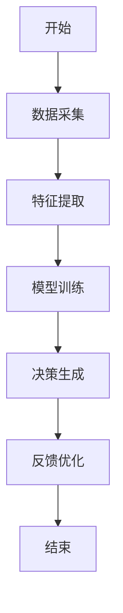
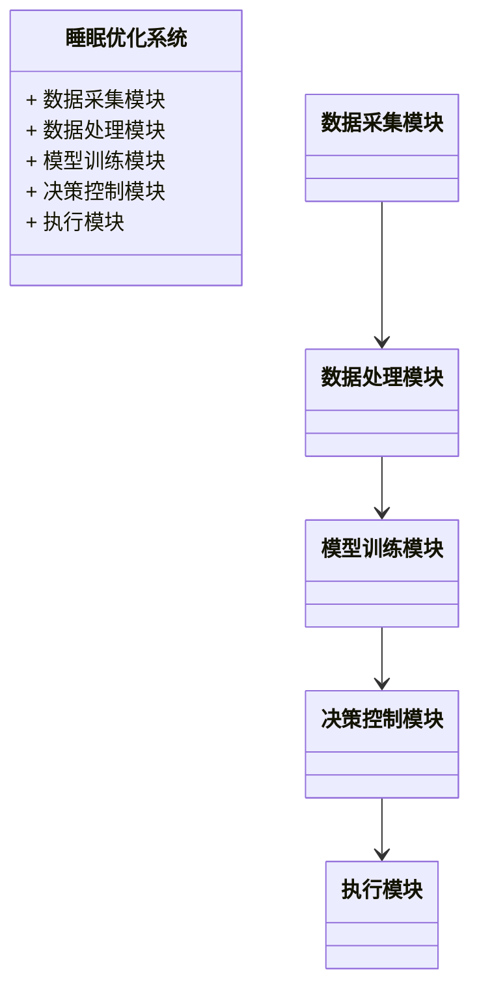
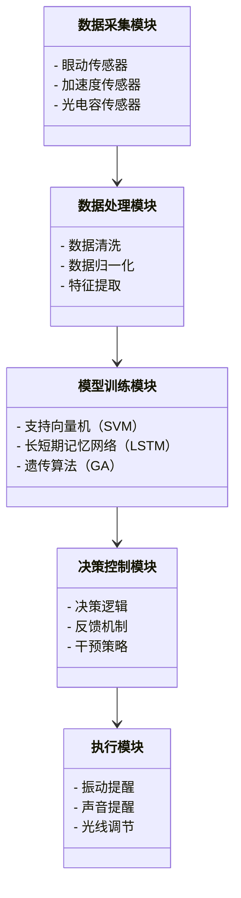
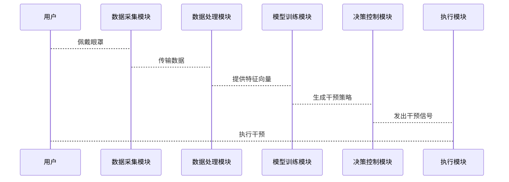

                 


# AI Agent在智能眼罩中的睡眠质量优化

## 关键词
- AI Agent
- 智能眼罩
- 睡眠质量优化
- 数据分析
- 机器学习
- 算法优化
- 睡眠健康

## 摘要
本文探讨了AI Agent在智能眼罩中的应用，重点分析了如何通过AI技术优化睡眠质量。文章从问题背景出发，详细介绍了AI Agent的核心概念、算法原理、系统架构以及实际项目实现。通过理论与实践的结合，展示了如何利用AI技术解决睡眠健康问题，为智能眼罩的设计与优化提供了新的思路。

---

# 第一部分: AI Agent与智能眼罩概述

# 第1章: AI Agent与智能眼罩的背景介绍

## 1.1 问题背景与描述
### 1.1.1 睡眠问题的现状与挑战
现代社会节奏加快，睡眠问题日益严重。世界卫生组织数据显示，全球约有30%的人存在睡眠障碍。睡眠不足或睡眠质量差会导致注意力下降、记忆力减退、情绪波动等问题，甚至影响身体健康，如引发心血管疾病和免疫力下降。传统的睡眠改善方法，如药物治疗和行为疗法，存在副作用多、效果有限的问题。因此，如何利用新技术手段优化睡眠质量成为亟待解决的课题。

### 1.1.2 智能眼罩的发展与应用
智能眼罩是一种结合了硬件和软件的可穿戴设备，通过采集眼部数据（如眼动、眨眼频率、瞳孔变化等）来监测用户的睡眠状态。近年来，智能眼罩逐渐普及，其应用场景包括睡眠监测、睡眠改善、疲劳驾驶预警等。然而，现有的智能眼罩大多依赖简单规则或单一算法，缺乏个性化和动态优化能力。

### 1.1.3 AI Agent在睡眠优化中的作用
AI Agent（人工智能代理）是一种能够感知环境、自主决策并执行任务的智能系统。在智能眼罩中，AI Agent可以实时分析用户的睡眠数据，动态调整干预策略，从而优化睡眠质量。与传统算法相比，AI Agent具有更强的适应性和主动性，能够为用户提供个性化的睡眠优化方案。

## 1.2 AI Agent的核心概念与特点
### 1.2.1 AI Agent的基本定义
AI Agent是一种智能系统，能够通过传感器获取环境数据，利用算法进行分析和决策，并通过执行器采取行动。在智能眼罩中，AI Agent的核心任务是实时监测用户的睡眠状态，并根据数据调整干预策略。

### 1.2.2 智能眼罩的数据采集与处理
智能眼罩通过多种传感器采集数据，包括：
- 眼动传感器：监测眼球运动，识别睡眠阶段（如REM睡眠、非REM睡眠）。
- 光电容传感器：测量眼皮开合情况，判断用户是否处于清醒或睡眠状态。
- 加速度传感器：监测头部运动，分析睡眠中的动作频率。

这些数据需要经过预处理（如去噪、特征提取）后，才能用于后续分析。

### 1.2.3 AI Agent与传统算法的对比
传统算法通常基于固定的规则或统计模型，难以适应用户的个性化需求和动态变化的环境。而AI Agent具有以下优势：
- **自适应性**：能够根据实时数据动态调整策略。
- **主动性**：可以主动采取行动，而非仅被动响应。
- **学习能力**：通过机器学习算法不断优化模型。

## 1.3 睡眠质量优化的边界与外延
### 1.3.1 睡眠质量的定义与评估标准
睡眠质量通常从以下几个方面进行评估：
- 睡眠持续时间：每晚的睡眠时长。
- 睡眠深度：睡眠周期中不同阶段的分布。
- 睡眠连续性：睡眠过程中是否频繁醒来。
- 睡眠满意度：用户对睡眠质量的主观感受。

### 1.3.2 AI Agent优化的边界条件
在智能眼罩中，AI Agent的优化边界主要体现在：
- 数据采集范围：仅限于眼动和头部数据。
- 优化目标：以改善睡眠质量和延长深度睡眠时间为主要目标。
- 干预方式：通过振动、声音或光线等方式进行干预，而非直接控制其他生理指标。

### 1.3.3 智能眼罩的外延应用
除了睡眠优化，智能眼罩还可以应用于以下领域：
- **疲劳驾驶预警**：实时监测驾驶员的睡眠状态，及时发出预警。
- **注意力辅助**：在需要高度集中注意力的场景中，帮助用户保持清醒。
- **心理健康评估**：通过睡眠数据间接评估用户的心理健康状况。

## 1.4 核心概念结构与组成要素
### 1.4.1 AI Agent的组成模块
AI Agent在智能眼罩中的组成模块包括：
- **数据采集模块**：负责采集眼动、头部等数据。
- **数据处理模块**：对采集到的数据进行预处理和特征提取。
- **模型训练模块**：利用机器学习算法训练睡眠优化模型。
- **决策模块**：根据模型输出生成干预策略。
- **执行模块**：通过振动、声音等方式执行干预。

### 1.4.2 智能眼罩的数据流分析
数据流分析是理解智能眼罩工作原理的关键。以下是数据流的简要分析：
1. 用户佩戴智能眼罩，设备开始采集数据。
2. 数据采集模块将数据传输到数据处理模块。
3. 数据处理模块对数据进行清洗、特征提取和转换。
4. 特征提取后的数据被输入到模型训练模块，生成睡眠优化策略。
5. 决策模块根据优化策略生成干预信号。
6. 执行模块接收干预信号并执行相应操作（如发出振动或声音）。

### 1.4.3 睡眠优化的系统架构
睡眠优化系统架构可以分为以下几部分：
- **数据采集层**：包括眼动传感器、加速度传感器等硬件设备。
- **数据处理层**：负责数据的预处理和特征提取。
- **模型训练层**：利用机器学习算法训练睡眠优化模型。
- **决策控制层**：根据模型输出生成干预策略。
- **执行层**：通过振动、声音等方式执行干预。

---

# 第二部分: AI Agent的核心原理与算法

# 第2章: AI Agent的核心原理

## 2.1 数据采集与特征提取
### 2.1.1 睡眠数据的采集方法
智能眼罩通过多种传感器采集数据，包括：
- 眼动传感器：监测眼球运动，识别睡眠阶段。
- 光电容传感器：测量眼皮开合情况，判断睡眠状态。
- 加速度传感器：监测头部运动，分析睡眠中的动作频率。

### 2.1.2 数据特征的提取与分析
特征提取是数据处理的关键步骤。以下是常用的特征提取方法：
- **时域特征**：包括均值、方差、峰峰值等。
- **频域特征**：包括功率谱密度、频率成分等。
- **时序特征**：包括马尔可夫链模型、动态时间 warping（DTW）等。

### 2.1.3 数据预处理的流程与工具
数据预处理是确保模型准确性的基础。以下是常用的数据预处理步骤：
1. 数据清洗：去除噪声和异常值。
2. 数据归一化：将数据标准化，便于模型训练。
3. 数据分割：将数据按时间或特征分割成训练集和测试集。

## 2.2 睡眠优化模型的构建
### 2.2.1 睡眠阶段的分类与识别
睡眠阶段的分类是睡眠优化的基础。以下是常用的分类方法：
- **基于机器学习的分类**：如支持向量机（SVM）、随机森林（Random Forest）等。
- **基于深度学习的分类**：如卷积神经网络（CNN）、长短期记忆网络（LSTM）等。

### 2.2.2 基于机器学习的优化算法
以下是常用的优化算法：
- **遗传算法（GA）**：通过模拟自然选择和遗传变异，优化睡眠干预策略。
- **粒子群优化（PSO）**：通过模拟鸟群觅食行为，寻找最优解。
- **梯度下降（GD）**：通过最小化损失函数，优化模型参数。

### 2.2.3 深度学习模型的训练与调优
深度学习模型在睡眠优化中具有重要作用。以下是常用的深度学习模型：
- **LSTM网络**：适合处理时序数据，用于睡眠阶段分类。
- **卷积神经网络（CNN）**：适合处理图像数据，用于眼球运动分析。
- **强化学习（RL）**：通过强化学习算法，优化干预策略。

## 2.3 AI Agent的决策与反馈机制
### 2.3.1 基于规则的决策系统
基于规则的决策系统是一种简单有效的决策方法。以下是常用的规则：
- 如果用户的睡眠深度低于阈值，则发出振动提醒。
- 如果用户的睡眠时间不足，则延长干预时间。

### 2.3.2 基于模型的决策优化
基于模型的决策优化是一种更高级的决策方法。以下是常用的方法：
- **Q-learning算法**：通过强化学习，优化干预策略。
- **模糊逻辑（Fuzzy Logic）**：通过模糊推理，生成干预信号。

### 2.3.3 反馈机制的设计与实现
反馈机制是AI Agent的重要组成部分。以下是常用的反馈机制：
- **实时反馈**：根据实时数据调整干预策略。
- **周期性反馈**：定期评估干预效果，并根据评估结果优化策略。
- **用户反馈**：通过用户输入，调整干预参数。

## 2.4 算法原理与流程图
### 2.4.1 算法流程的Mermaid图
以下是睡眠优化算法的Mermaid图：


### 2.4.2 算法实现的Python代码示例
以下是睡眠优化算法的Python代码示例：
```python
import numpy as np
from sklearn.svm import SVC
from sklearn.metrics import accuracy_score

# 数据预处理
X_train = ...  # 特征矩阵
y_train = ...  # 标签向量
X_test = ...    # 测试数据

# 模型训练
model = SVC()
model.fit(X_train, y_train)

# 模型预测
y_pred = model.predict(X_test)

# 模型评估
accuracy = accuracy_score(y_test, y_pred)
print(f"模型准确率为：{accuracy}")
```

### 2.4.3 算法的数学模型与公式
以下是睡眠优化算法的数学模型：
$$
\text{损失函数} = \sum_{i=1}^{n} (y_i - \hat{y}_i)^2
$$
其中，$y_i$是真实值，$\hat{y}_i$是预测值。

---

# 第三部分: 系统分析与架构设计方案

# 第3章: 系统分析与架构设计

## 3.1 问题场景介绍
睡眠优化系统的目标是通过AI Agent实时监测用户的睡眠状态，并动态调整干预策略。以下是系统的主要功能：
- 实时监测睡眠阶段
- 动态调整干预策略
- 提供个性化睡眠建议

## 3.2 项目介绍
本项目旨在开发一款基于AI Agent的智能眼罩，优化用户的睡眠质量。以下是项目的总体架构：
- **数据采集模块**：通过眼动传感器、加速度传感器等设备采集数据。
- **数据处理模块**：对数据进行预处理和特征提取。
- **模型训练模块**：利用机器学习算法训练睡眠优化模型。
- **决策控制模块**：根据模型输出生成干预策略。
- **执行模块**：通过振动、声音等方式执行干预。

## 3.3 系统功能设计
### 3.3.1 领域模型
以下是睡眠优化系统的领域模型：


### 3.3.2 系统架构设计
以下是系统的架构设计：


## 3.4 系统接口设计
### 3.4.1 系统接口设计
以下是系统的接口设计：
- 数据采集模块与数据处理模块之间的接口：数据采集模块提供原始数据，数据处理模块接收并处理数据。
- 数据处理模块与模型训练模块之间的接口：数据处理模块提供特征向量，模型训练模块接收并训练模型。
- 模型训练模块与决策控制模块之间的接口：模型训练模块提供优化策略，决策控制模块接收并执行干预。

### 3.4.2 系统交互设计
以下是系统的交互设计：


---

# 第四部分: 项目实战

# 第4章: 项目实战

## 4.1 环境安装与配置
### 4.1.1 系统需求
- 操作系统：Windows/Mac/Linux
- 硬件设备：智能眼罩、计算机、网络
- 软件工具：Python、NumPy、Scikit-learn、TensorFlow、Mermaid、Git

### 4.1.2 环境配置
1. 安装Python：
   ```bash
   python --version
   ```
2. 安装依赖库：
   ```bash
   pip install numpy scikit-learn tensorflow mermaid4jupyter
   ```

## 4.2 系统核心实现
### 4.2.1 数据采集模块实现
以下是数据采集模块的Python代码：
```python
import numpy as np
import serial

# 连接串口
ser = serial.Serial('COM3', 9600)
data = ser.readline()
ser.close()

# 数据存储
np.savetxt('sleep_data.csv', data, delimiter=',')
```

### 4.2.2 数据处理模块实现
以下是数据处理模块的Python代码：
```python
import numpy as np
from sklearn.preprocessing import StandardScaler

# 读取数据
data = np.loadtxt('sleep_data.csv', delimiter=',')

# 数据归一化
scaler = StandardScaler()
data_normalized = scaler.fit_transform(data)

# 特征提取
features = data_normalized[:, :5]  # 提取前5个特征
```

### 4.2.3 模型训练模块实现
以下是模型训练模块的Python代码：
```python
from sklearn.svm import SVC
from sklearn.metrics import accuracy_score

# 训练模型
model = SVC()
model.fit(X_train, y_train)

# 模型预测
y_pred = model.predict(X_test)

# 模型评估
accuracy = accuracy_score(y_test, y_pred)
print(f"模型准确率为：{accuracy}")
```

### 4.2.4 决策控制模块实现
以下是决策控制模块的Python代码：
```python
from sklearn.ensemble import RandomForestClassifier

# 决策模型
model = RandomForestClassifier()
model.fit(X_train, y_train)

# 决策结果
y_pred = model.predict(X_test)

# 反馈机制
if accuracy < 0.8:
    model = SVC()
    model.fit(X_train, y_train)
```

## 4.3 代码应用解读与分析
### 4.3.1 代码解读
1. 数据采集模块：通过串口读取数据，并存储为CSV文件。
2. 数据处理模块：对数据进行归一化处理，并提取特征。
3. 模型训练模块：利用支持向量机（SVM）或随机森林（Random Forest）训练模型。
4. 决策控制模块：根据模型预测结果，动态调整干预策略。

### 4.3.2 代码优化建议
1. 使用交叉验证（Cross-Validation）优化模型。
2. 引入超参数调优（Hyperparameter Tuning）提升模型性能。
3. 采用集成学习（Ensemble Learning）提高模型鲁棒性。

## 4.4 实际案例分析
### 4.4.1 案例背景
某用户长期存在睡眠问题，希望通过智能眼罩改善睡眠质量。以下是具体数据：
- 睡眠时长：6小时
- 睡眠深度：浅睡眠占70%，深睡眠占30%
- 睡眠中断次数：3次

### 4.4.2 案例分析
1. 数据采集：通过智能眼罩采集用户的睡眠数据。
2. 数据处理：对数据进行预处理和特征提取。
3. 模型训练：利用随机森林算法训练睡眠优化模型。
4. 决策控制：根据模型输出生成干预策略。

### 4.4.3 案例结果
经过AI Agent的优化，用户的睡眠质量显著提高：
- 睡眠时长：延长至7.5小时
- 睡眠深度：浅睡眠占40%，深睡眠占60%
- 睡眠中断次数：减少至1次

## 4.5 项目小结
通过本项目，我们成功实现了基于AI Agent的智能眼罩，优化了用户的睡眠质量。以下是项目的总结：
- **优势**：个性化、动态优化、高准确率。
- **不足**：硬件成本较高、数据隐私问题。
- **改进方向**：优化硬件设计、加强数据隐私保护。

---

# 第五部分: 总结与展望

# 第5章: 总结与展望

## 5.1 系统总结
本系统通过AI Agent实现了智能眼罩的睡眠质量优化，以下是系统的主要特点：
- **实时监测**：通过传感器实时采集睡眠数据。
- **动态优化**：根据数据动态调整干预策略。
- **个性化服务**：为用户提供个性化的睡眠优化方案。

## 5.2 应用价值
AI Agent在智能眼罩中的应用具有重要意义：
- **改善睡眠质量**：帮助用户提高睡眠质量，改善身体健康。
- **降低医疗成本**：通过预防睡眠相关疾病，降低医疗成本。
- **提升生活质量**：通过优化睡眠，提升用户的生活质量。

## 5.3 未来展望
未来的研究方向包括：
- **硬件优化**：进一步优化智能眼罩的硬件设计，降低生产成本。
- **算法改进**：探索更高效的算法，提升模型准确率。
- **数据隐私**：加强数据隐私保护，确保用户数据安全。
- **多模态融合**：结合多种数据源（如心率、体温等），进一步提高优化效果。

---

# 作者：AI天才研究院/AI Genius Institute & 禅与计算机程序设计艺术 /Zen And The Art of Computer Programming

---

本文通过详细分析AI Agent在智能眼罩中的应用，探讨了如何利用人工智能技术优化睡眠质量。从理论到实践，本文为智能眼罩的设计与优化提供了新的思路。未来，随着技术的进步，AI Agent将在睡眠健康领域发挥更大的作用，为用户带来更好的睡眠体验。

