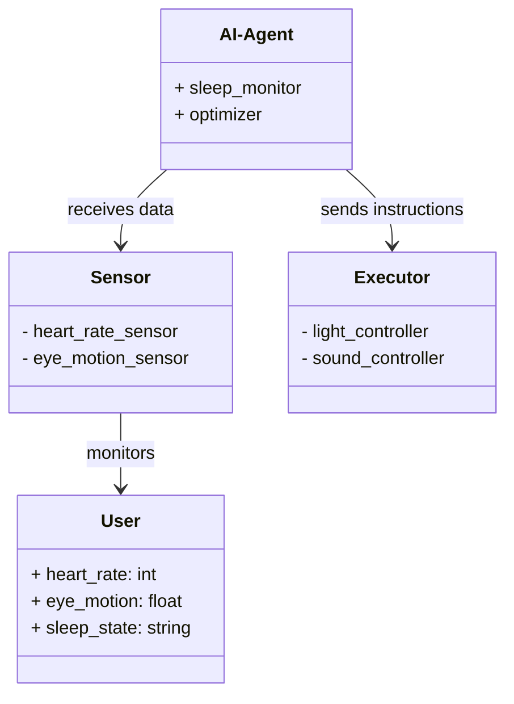
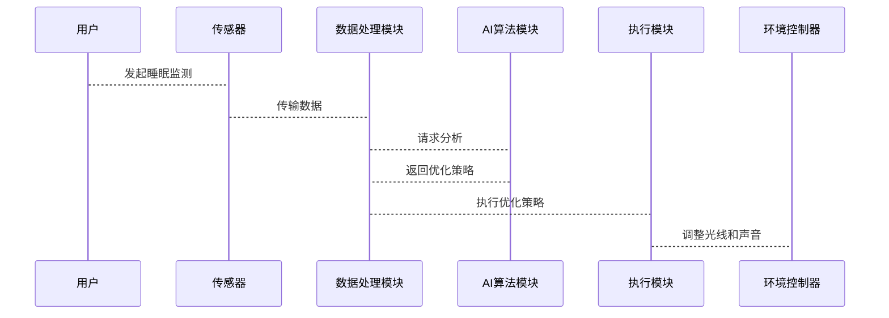

                 


# AI Agent在智能眼罩中的睡眠质量提升

## 关键词：AI Agent, 智能眼罩, 睡眠质量, 算法原理, 系统架构, 项目实战

## 摘要：  
本文探讨了AI Agent在智能眼罩中的应用，重点分析了如何通过AI技术提升睡眠质量。从背景介绍到核心概念，从算法原理到系统架构，再到项目实战，本文详细阐述了AI Agent在智能眼罩中的技术实现及其对睡眠质量提升的作用。通过实际案例和系统设计，本文为读者提供了全面的技术视角和实践指导。

---

# 第1章 睡眠质量提升的背景与问题分析

## 1.1 睡眠质量的重要性  
睡眠是人类健康的重要组成部分，直接影响身体和心理健康。现代生活节奏快、压力大，许多人面临睡眠质量下降的问题，导致注意力不集中、记忆力减退、情绪波动等问题。

## 1.2 智能眼罩的定义与特点  
智能眼罩是一种结合了传感器技术和AI算法的可穿戴设备，能够监测用户的睡眠状态，并通过调整环境光线、声音等方式改善睡眠质量。其特点包括：  
1. 实时监测：通过传感器采集用户的生理数据，如心率、眼动、脑电波等。  
2. 智能调节：基于AI算法，自动调整光线亮度、声音频率等，优化睡眠环境。  
3. 个性化服务：根据用户的睡眠数据，提供个性化的睡眠改善建议。

## 1.3 AI Agent在智能眼罩中的作用  
AI Agent（智能代理）是一种能够感知环境、自主决策并执行任务的智能系统。在智能眼罩中，AI Agent负责数据采集、分析、决策和执行，实现睡眠质量的实时优化。

---

# 第2章 AI Agent与智能眼罩的核心概念

## 2.1 AI Agent的基本原理  
AI Agent通过感知环境、分析数据、制定决策并执行操作来实现目标。其核心包括：  
1. **感知层**：通过传感器获取数据。  
2. **分析层**：利用机器学习算法进行数据处理和分类。  
3. **决策层**：基于分析结果制定优化策略。  
4. **执行层**：通过硬件设备执行优化操作。  

## 2.2 智能眼罩的技术实现  
智能眼罩的技术实现依赖于以下几个关键部分：  
1. **传感器**：用于采集用户的生理数据，如心率、眼动、脑电波等。  
2. **数据处理**：对采集的数据进行预处理和特征提取。  
3. **AI算法**：基于机器学习或深度学习模型，分析数据并生成优化策略。  
4. **执行模块**：根据AI算法的决策，调整环境参数，如光线亮度、声音频率等。

## 2.3 AI Agent与智能眼罩的结合  
AI Agent在智能眼罩中的应用主要体现在以下几个方面：  
1. **实时监测**：通过传感器持续监测用户的睡眠状态。  
2. **智能分析**：利用AI算法分析睡眠数据，识别睡眠障碍。  
3. **优化调整**：根据分析结果，自动调整环境参数，改善睡眠质量。

---

# 第3章 AI Agent在智能眼罩中的算法原理

## 3.1 睡眠监测算法  
睡眠监测算法用于分析用户的睡眠状态，主要包括以下几个步骤：  
1. **数据采集**：通过传感器采集用户的生理数据。  
2. **数据预处理**：对采集的数据进行去噪和归一化处理。  
3. **特征提取**：提取睡眠相关的特征，如心率变异、眼动频率等。  
4. **分类模型**：基于机器学习算法（如SVM、随机森林）或深度学习模型（如LSTM）进行睡眠状态分类。  

### 示例代码：基于随机森林的睡眠状态分类  
```python
from sklearn.ensemble import RandomForestClassifier
from sklearn.model_selection import train_test_split
import pandas as pd

# 数据加载
data = pd.read_csv('sleep_data.csv')
X = data.drop('sleep_state', axis=1)
y = data['sleep_state']

# 数据划分
X_train, X_test, y_train, y_test = train_test_split(X, y, test_size=0.2)

# 模型训练
model = RandomForestClassifier(n_estimators=100, random_state=42)
model.fit(X_train, y_train)

# 模型预测
y_pred = model.predict(X_test)
print("Accuracy:", model.score(X_test, y_test))
```

## 3.2 AI Agent的决策算法  
AI Agent的决策算法用于根据睡眠监测结果生成优化策略。常用算法包括：  
1. **基于规则的决策算法**：通过预设规则进行决策，如“如果用户处于浅睡阶段，降低光线亮度”。  
2. **基于机器学习的决策算法**：利用回归或分类模型生成优化策略。  
3. **基于深度学习的决策算法**：通过神经网络模型进行复杂决策。  

### 示例代码：基于强化学习的睡眠优化策略  
```python
import numpy as np
from collections import deque

# 简单的强化学习模型
class SleepOptimizer:
    def __init__(self):
        self.q_table = deque()
        self.q_table.append([0, 0, 0, 0])  # 状态：[心率, 眼动频率, 光线亮度, 声音频率]
    
    def get_action(self, state):
        # 根据状态选择动作
        pass
    
    def update_q_table(self, state, action, reward):
        # 更新Q表
        pass

# 初始化模型
optimizer = SleepOptimizer()
```

## 3.3 算法优化与实现  
算法优化的关键在于提高准确性和实时性。通过优化特征提取、选择更高效的算法（如XGBoost、LightGBM）以及引入增量学习等方法，可以显著提升AI Agent的性能。

---

# 第4章 系统分析与架构设计方案

## 4.1 项目场景介绍  
智能眼罩系统需要实时监测用户的睡眠状态，并根据数据调整环境参数，优化睡眠质量。

## 4.2 系统功能设计  
1. **数据采集模块**：采集用户的生理数据。  
2. **数据处理模块**：对数据进行预处理和特征提取。  
3. **AI算法模块**：运行睡眠监测和优化算法。  
4. **执行模块**：根据算法决策调整环境参数。  

### 领域模型（Mermaid 类图）  


## 4.3 系统架构设计  
1. **硬件架构**：包括传感器、处理器、存储器等。  
2. **软件架构**：包括数据采集、处理、分析和执行模块。  

### 系统架构（Mermaid 架构图）  


## 4.4 系统接口设计  
系统接口主要涉及传感器数据接口和环境控制器接口。通过API实现模块间的通信和数据交互。

## 4.5 系统交互流程（Mermaid 序列图）  


---

# 第5章 项目实战

## 5.1 环境安装与配置  
1. **硬件准备**：智能眼罩、传感器、环境控制器。  
2. **软件安装**：安装Python、机器学习库（如scikit-learn、TensorFlow）。  

## 5.2 系统核心实现  
### 数据采集与处理  
```python
import numpy as np
import pandas as pd
from sklearn.preprocessing import StandardScaler

# 数据加载
data = pd.read_csv('sleep_data.csv')

# 数据预处理
scaler = StandardScaler()
scaled_data = scaler.fit_transform(data.drop('sleep_state', axis=1))
```

### AI算法实现  
```python
from sklearn.ensemble import RandomForestClassifier

# 训练模型
model = RandomForestClassifier(n_estimators=100)
model.fit(scaled_data, data['sleep_state'])

# 预测结果
test_data = scaled_data[:10]
predictions = model.predict(test_data)
print("Predictions:", predictions)
```

## 5.3 实际案例分析  
通过实际数据，分析AI Agent在智能眼罩中的优化效果。例如，某用户在使用智能眼罩后，睡眠质量显著提升。

---

# 第6章 总结与展望

## 6.1 最佳实践与注意事项  
1. **数据隐私**：确保用户的生理数据安全。  
2. **算法优化**：持续优化AI算法，提升准确性和实时性。  
3. **用户体验**：注重用户体验设计，提升产品的易用性。  

## 6.2 小结  
本文详细探讨了AI Agent在智能眼罩中的应用，从算法原理到系统架构，再到项目实战，为读者提供了全面的技术视角。

## 6.3 注意事项  
在实际应用中，需要注意数据隐私、算法的实时性以及硬件的稳定性。

## 6.4 拓展阅读  
1. 《机器学习实战》  
2. 《深度学习入门》  
3. 《可穿戴设备与健康监测》

---

# 作者：AI天才研究院 & 禅与计算机程序设计艺术  
通过本文的探讨，我们深入分析了AI Agent在智能眼罩中的应用，为提升睡眠质量提供了技术上的解决方案。未来，随着AI技术的不断发展，智能眼罩将更加智能化，为用户的健康保驾护航。

