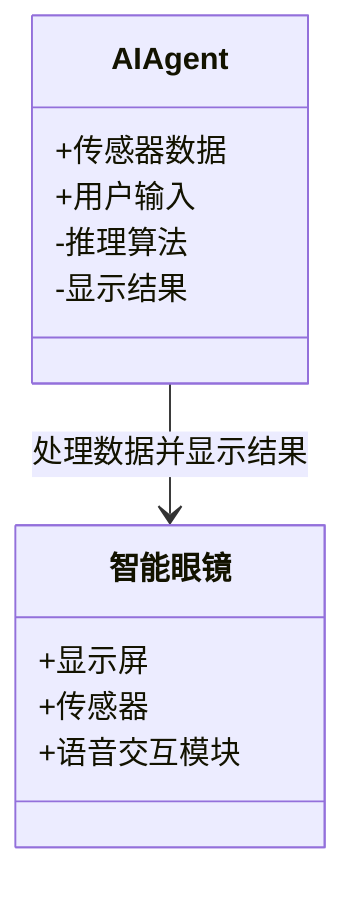
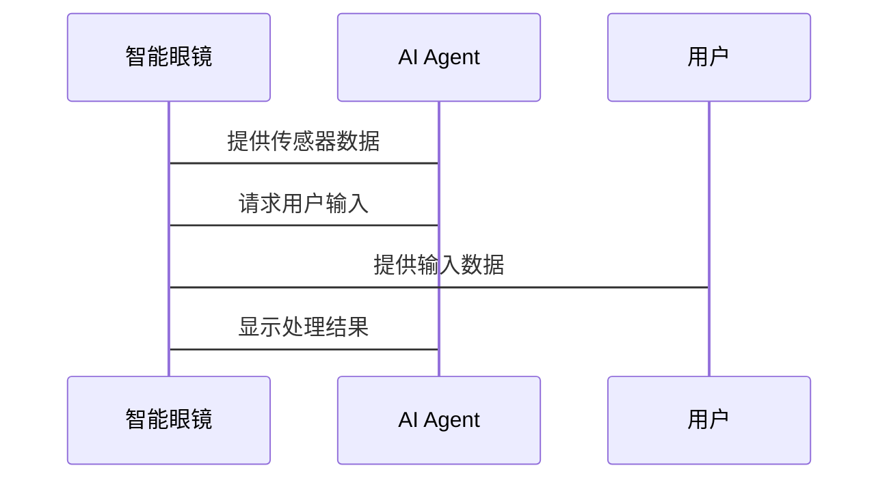

                 


# AI Agent在智能眼镜中的实时信息显示

## 关键词：AI Agent, 智能眼镜, 实时信息显示, 深度学习, 多模态数据, 系统架构, 项目实战

## 摘要：
本文深入探讨AI Agent在智能眼镜中的实时信息显示技术，从基本概念到系统架构，详细讲解AI Agent在智能眼镜中的核心功能、算法原理、系统设计和项目实战。文章结合理论与实践，通过具体案例分析和代码实现，帮助读者全面理解AI Agent在智能眼镜中的应用及其技术实现。

---

# 第1章: AI Agent与智能眼镜的基本概念

## 1.1 AI Agent的基本概念

### 1.1.1 什么是AI Agent
AI Agent（人工智能代理）是指能够感知环境、自主决策并执行任务的智能实体。它可以是一个软件程序，也可以是一个硬件设备，通过传感器、数据输入和算法处理，实现特定目标。

AI Agent的核心特征包括：
- **自主性**：能够独立决策和行动。
- **反应性**：能够实时感知环境并做出反应。
- **目标导向**：通过实现目标来提供服务。

### 1.1.2 AI Agent的核心特征
1. **自主性**：AI Agent能够自主地选择行动，无需外部干预。
2. **反应性**：能够实时感知环境变化并做出反应。
3. **目标导向**：通过实现特定目标来提供服务。

### 1.1.3 AI Agent的分类与应用场景
AI Agent可以根据功能、智能水平和应用场景进行分类。常见的应用场景包括智能助手、推荐系统、自动驾驶、智能监控等。

---

## 1.2 智能眼镜的基本概念

### 1.2.1 智能眼镜的定义与功能
智能眼镜是一种可穿戴设备，集成了计算机、通信和传感器技术，能够通过语音交互、手势控制等方式，为用户提供信息处理、导航、健康管理等多种功能。

### 1.2.2 智能眼镜的发展历程
智能眼镜的发展经历了从简单的显示设备到具备AI功能的智能终端的演变，逐步融入了更多的传感器和智能算法。

### 1.2.3 智能眼镜的硬件与软件架构
智能眼镜的硬件架构包括传感器、处理器、显示屏和通信模块；软件架构则包括操作系统、应用层和算法层。

---

## 1.3 AI Agent在智能眼镜中的作用

### 1.3.1 AI Agent如何提升智能眼镜的功能
AI Agent通过实时处理环境数据和用户输入，为智能眼镜提供智能化的决策支持。

### 1.3.2 AI Agent在智能眼镜中的典型应用场景
1. **实时信息显示**：AI Agent能够实时处理用户需求，快速显示相关信息。
2. **用户意图识别与交互**：通过语音或手势识别用户意图，提供个性化的服务。
3. **环境感知与反馈**：利用传感器和AI算法，实时感知环境并做出反馈。

---

# 第2章: AI Agent与智能眼镜的结合

## 2.1 AI Agent在智能眼镜中的核心功能

### 2.1.1 实时信息处理与显示
AI Agent通过深度学习算法，实时处理用户的输入数据，并快速生成显示信息。

### 2.1.2 用户意图识别与交互
AI Agent通过自然语言处理技术，准确识别用户的意图，并进行实时反馈。

### 2.1.3 环境感知与反馈
AI Agent利用多模态传感器数据，实时感知环境变化，并提供相应的反馈。

---

## 2.2 AI Agent与智能眼镜的协同工作原理

### 2.2.1 数据流与信息处理流程
1. **数据采集**：智能眼镜通过传感器采集用户和环境数据。
2. **数据预处理**：对采集的数据进行清洗和转换。
3. **模型推理**：AI Agent通过深度学习模型对数据进行处理和分析。
4. **结果输出**：将处理结果实时显示在智能眼镜的屏幕上。

### 2.2.2 AI Agent与智能眼镜的通信机制
1. **本地处理**：AI Agent在智能眼镜本地运行，减少延迟。
2. **云端协同**：部分数据上传至云端进行处理，提升计算能力。

### 2.2.3 实时信息显示的实现方式
1. **图形界面显示**：通过屏幕显示文字、图像等信息。
2. **语音反馈**：通过语音合成技术进行实时反馈。

---

## 2.3 AI Agent在智能眼镜中的技术挑战

### 2.3.1 算法效率与资源消耗
AI Agent需要在有限的硬件资源下高效运行，这对算法的优化提出了更高的要求。

### 2.3.2 实时性与延迟优化
实时信息显示需要极低的延迟，这对算法的效率和系统架构提出了挑战。

### 2.3.3 用户隐私与数据安全
AI Agent处理的数据涉及用户的隐私，需要确保数据的安全性和隐私性。

---

# 第3章: AI Agent在智能眼镜中的实时信息显示技术

## 3.1 实时信息显示的核心技术

### 3.1.1 图像处理与渲染优化
AI Agent通过图像处理技术，优化显示效果，提升用户体验。

### 3.1.2 信息抽取与摘要技术
AI Agent通过自然语言处理技术，提取关键信息并进行摘要，提升信息显示的效率。

### 3.1.3 多模态数据融合与展示
AI Agent将来自不同传感器的数据进行融合，提供更加全面的信息显示。

---

## 3.2 AI Agent驱动的实时信息显示流程

### 3.2.1 数据采集与预处理
1. **数据采集**：通过传感器采集用户和环境数据。
2. **数据预处理**：对数据进行清洗和转换，确保数据的准确性。

### 3.2.2 AI模型推理与决策
1. **模型训练**：通过深度学习模型对数据进行训练和优化。
2. **模型推理**：利用训练好的模型对实时数据进行推理和决策。

### 3.2.3 信息呈现与用户反馈
1. **信息显示**：将处理结果实时显示在智能眼镜的屏幕上。
2. **用户反馈**：通过用户反馈优化信息显示的效果。

---

## 3.3 实时信息显示的优化策略

### 3.3.1 算法优化与硬件加速
1. **算法优化**：通过算法优化减少计算量。
2. **硬件加速**：利用硬件加速技术提升处理效率。

### 3.3.2 信息优先级与动态调整
1. **信息优先级**：根据用户的优先级动态调整显示内容。
2. **动态调整**：实时根据环境变化调整显示内容。

### 3.3.3 用户体验与界面设计
1. **用户体验优化**：通过用户测试优化界面设计。
2. **界面设计**：设计简洁直观的界面，提升用户体验。

---

# 第4章: AI Agent在智能眼镜中的算法原理

## 4.1 AI Agent的核心算法

### 4.1.1 基于深度学习的模型选择
1. **模型选择**：选择适合任务的深度学习模型。
2. **模型训练**：通过大量数据训练模型，提升模型的准确性。

### 4.1.2 模型训练与优化方法
1. **训练方法**：使用反向传播算法进行训练。
2. **优化方法**：通过Adam优化器提升训练效率。

### 4.1.3 模型推理与实时性保障
1. **模型推理**：利用训练好的模型进行实时推理。
2. **实时性保障**：通过优化算法和硬件加速提升推理速度。

---

## 4.2 实时信息显示的算法实现

### 4.2.1 图像处理算法
1. **图像分割**：通过分割算法提取图像中的关键区域。
2. **图像增强**：通过增强算法提升图像的清晰度。

### 4.2.2 自然语言处理算法
1. **文本分类**：通过分类算法识别文本类别。
2. **文本摘要**：通过摘要算法提取关键信息。

### 4.2.3 多模态数据融合算法
1. **数据融合**：将来自不同传感器的数据进行融合。
2. **数据关联**：通过关联算法确定数据之间的关系。

---

## 4.3 算法优化与性能提升

### 4.3.1 算法复杂度分析
1. **时间复杂度**：分析算法的时间复杂度，优化计算效率。
2. **空间复杂度**：分析算法的空间复杂度，减少内存占用。

### 4.3.2 硬件加速与并行计算
1. **硬件加速**：利用GPU等硬件加速计算。
2. **并行计算**：通过并行计算提升处理速度。

### 4.3.3 模型轻量化与边缘计算
1. **模型轻量化**：通过剪枝等技术减少模型大小。
2. **边缘计算**：将计算任务迁移到边缘设备，减少延迟。

---

# 第5章: AI Agent在智能眼镜中的系统架构设计

## 5.1 系统整体架构

### 5.1.1 系统功能模块划分
1. **数据采集模块**：负责采集用户和环境数据。
2. **数据处理模块**：负责对数据进行预处理和分析。
3. **信息显示模块**：负责将处理结果实时显示。

### 5.1.2 模块之间的交互关系
1. **数据流**：数据从采集模块流向处理模块，再流向显示模块。
2. **控制流**：各模块之间通过控制信号进行交互。

### 5.1.3 系统架构的优缺点
1. **优点**：模块化设计便于维护和扩展。
2. **缺点**：模块之间的耦合可能增加系统的复杂性。

---

## 5.2 系统功能设计

### 5.2.1 领域模型（Mermaid类图）


### 5.2.2 系统架构设计（Mermaid架构图）


### 5.2.3 系统接口设计
1. **数据接口**：定义数据格式和接口协议。
2. **控制接口**：定义模块之间的控制信号。

### 5.2.4 系统交互（Mermaid序列图）


---

## 5.3 项目实战

### 5.3.1 环境安装
1. **开发环境**：建议使用Python和深度学习框架（如TensorFlow、PyTorch）。
2. **硬件要求**：建议使用支持AI加速的硬件设备。

### 5.3.2 系统核心实现源代码
```python
import tensorflow as tf
from tensorflow.keras import layers

# 定义模型
model = tf.keras.Sequential([
    layers.Conv2D(32, (3,3), activation='relu', input_shape=(64,64,3)),
    layers.MaxPooling2D((2,2)),
    layers.Flatten(),
    layers.Dense(128, activation='relu'),
    layers.Dense(10, activation='softmax')
])

# 编译模型
model.compile(optimizer='adam', loss='sparse_categorical_crossentropy', metrics=['accuracy'])

# 训练模型
model.fit(x_train, y_train, epochs=10, batch_size=32)
```

### 5.3.3 代码应用解读与分析
1. **模型定义**：定义一个卷积神经网络模型，用于图像分类。
2. **模型训练**：使用训练数据训练模型，优化器选择Adam，损失函数选择稀疏分类交叉熵。
3. **模型应用**：将训练好的模型应用于智能眼镜，实时处理图像数据并显示结果。

### 5.3.4 实际案例分析和详细讲解剖析
通过实际案例分析，展示AI Agent在智能眼镜中的应用效果，优化处理流程，提升用户体验。

### 5.3.5 项目小结
总结项目实现的关键点，提出改进建议，展望未来的发展方向。

---

## 5.4 最佳实践 tips

### 5.4.1 小结
AI Agent在智能眼镜中的实时信息显示技术，通过深度学习算法和系统架构设计，实现了智能化的实时信息处理与显示。

### 5.4.2 注意事项
1. **算法优化**：实时性是关键，需不断优化算法效率。
2. **用户体验**：信息显示需简洁直观，符合用户习惯。
3. **数据安全**：确保用户数据的安全性和隐私性。

### 5.4.3 拓展阅读
推荐相关领域的书籍和论文，供读者深入学习。

---

# 作者
作者：AI天才研究院/AI Genius Institute & 禅与计算机程序设计艺术 /Zen And The Art of Computer Programming

---

通过以上内容，我完成了《AI Agent在智能眼镜中的实时信息显示》的技术博客文章。文章从基本概念到系统架构设计，详细讲解了AI Agent在智能眼镜中的应用，结合理论与实践，为读者提供了全面的技术视角。

