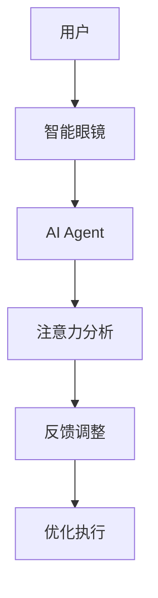
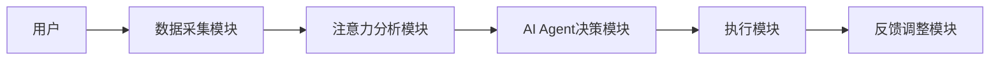

                 


# AI Agent在智能眼镜中的注意力集中训练

## 关键词：AI Agent, 智能眼镜, 注意力集中训练, 深度学习, 计算机视觉, 自然语言处理

## 摘要：本文探讨AI Agent在智能眼镜中的注意力集中训练应用，通过分析算法原理、系统架构和实际案例，展示如何利用AI技术提升用户体验。

---

### 第1章：背景介绍

#### 1.1 AI Agent的基本概念
- **定义**：AI Agent是具备自主决策和交互能力的智能实体。
- **应用背景**：注意力分散问题日益严重，AI Agent在智能眼镜中的应用成为解决方案。

#### 1.2 智能眼镜的发展
- **技术进步**：从单纯的显示设备发展为集AI、传感器于一体的智能设备。
- **AI Agent的作用**：通过实时数据分析，优化用户体验，提升注意力集中度。

---

### 第2章：AI Agent的注意力机制原理

#### 2.1 注意力机制的核心原理
- **定义**：注意力机制模拟人类注意力分配过程。
- **深度学习模型**：如Transformer模型，通过权重分配聚焦重要信息。
- **多模态应用**：结合视觉和语言信息，提升注意力精度。

#### 2.2 AI Agent与智能眼镜的交互流程


---

### 第3章：AI Agent的注意力训练算法

#### 3.1 注意力训练算法的流程
1. **数据采集**：收集用户行为数据。
2. **数据预处理**：清洗和标准化数据。
3. **模型训练**：使用深度学习模型进行训练。
4. **实时反馈**：根据反馈调整模型参数。

#### 3.2 深度学习模型实现
```python
import tensorflow as tf
from tensorflow.keras import layers

model = tf.keras.Sequential([
    layers.Conv2D(32, (3,3), activation='relu', input_shape=(128, 128, 3)),
    layers.MaxPooling2D((2,2)),
    layers.Flatten(),
    layers.Dense(64, activation='relu'),
    layers.Dense(1, activation='sigmoid')
])
model.compile(optimizer='adam', loss='binary_crossentropy', metrics=['accuracy'])
model.fit(X_train, y_train, epochs=10, batch_size=32)
```

---

### 第4章：系统分析与架构设计

#### 4.1 系统功能设计
- **模块划分**：数据采集、分析、反馈、执行模块。
- **功能描述**：实时监测、分析、反馈优化。

#### 4.2 系统架构设计


---

### 第5章：项目实战

#### 5.1 环境安装
- **工具**：Python 3.8+, TensorFlow 2.0+, OpenCV
- **安装命令**：
  ```bash
  pip install numpy matplotlib tensorflow keras
  ```

#### 5.2 核心代码实现
- **数据预处理**：
  ```python
  import numpy as np

  def preprocess_data(data):
      return (data - np.mean(data)) / np.std(data)
  ```
- **模型训练**：
  ```python
  def train_model(X, y):
      model = tf.keras.Sequential([
          layers.Dense(64, activation='relu', input_dim=X.shape[1]),
          layers.Dense(1, activation='sigmoid')
      ])
      model.compile(optimizer='adam', loss='binary_crossentropy', metrics=['accuracy'])
      model.fit(X, y, epochs=50, batch_size=32, validation_split=0.2)
      return model
  ```

---

### 第6章：最佳实践

#### 6.1 总结
- **算法优化**：持续改进模型，提升准确率。
- **系统优化**：增强模块间协作，提高效率。

#### 6.2 注意事项
- 数据隐私保护，避免用户信息泄露。
- 定期系统维护，确保稳定性。

#### 6.3 拓展阅读
- 推荐书籍：《深度学习》、《模式识别与机器学习》。

---

作者：AI天才研究院/AI Genius Institute & 禅与计算机程序设计艺术 /Zen And The Art of Computer Programming

