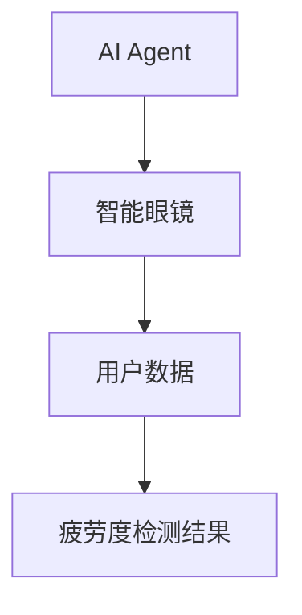
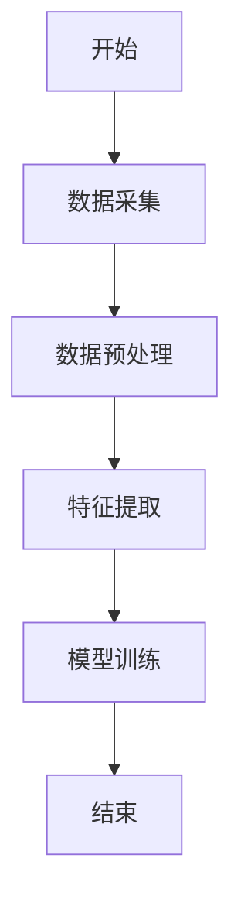
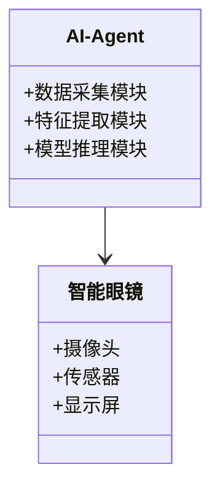
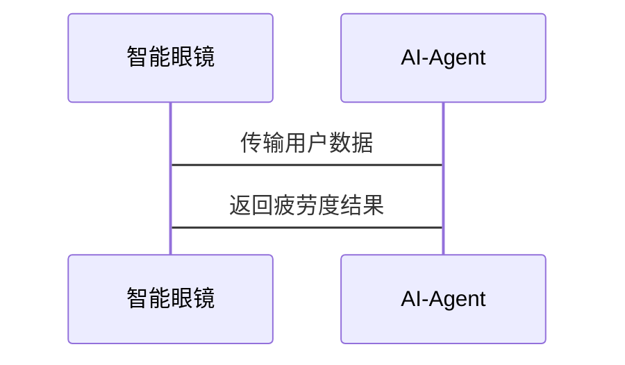

                 


# AI Agent在智能眼镜中的疲劳度检测

## 关键词
AI Agent, 智能眼镜, 疲劳度检测, 机器学习, 计算机视觉

## 摘要
随着智能眼镜的普及，AI Agent在疲劳度检测中的应用变得越来越重要。本文详细探讨了AI Agent在智能眼镜中的疲劳度检测技术，从背景、核心概念到算法实现，再到系统架构和项目实战，全面解析了该技术的原理与应用。通过本文，读者将了解如何利用AI Agent提升智能眼镜的功能，实现高效的疲劳度检测。

---

# 第一部分: 背景介绍

## 第1章: 问题背景

### 1.1 问题背景
疲劳是人类在长时间工作或使用电子设备后常见的一种生理状态，表现为注意力下降、反应迟钝和眼睛不适等症状。在智能眼镜等穿戴设备普及的今天，疲劳度检测变得尤为重要，因为它可以帮助用户及时调整状态，预防健康问题。

### 1.2 问题描述
AI Agent在智能眼镜中的疲劳度检测主要通过分析用户的面部表情、眼部特征和行为模式来判断其疲劳程度。这种检测需要实时性高、准确性强，并且能够适应不同的用户和环境条件。

### 1.3 解决方案
通过结合计算机视觉和机器学习技术，AI Agent可以实时采集用户的面部数据，并通过预训练模型进行分析，从而实现疲劳度的精准检测。这种解决方案不仅提高了检测效率，还为用户提供了一种智能化的健康管理方式。

---

# 第二部分: 核心概念与联系

## 第2章: 核心概念

### 2.1 AI Agent的定义与特点
AI Agent是一种智能代理，能够感知环境、执行任务并做出决策。在智能眼镜中，AI Agent主要负责数据采集、特征提取和模型推理。

### 2.2 疲劳度检测的关键指标
疲劳度检测主要关注以下几个指标：
- 眼睛闭合频率
- 眼睛睁合速度
- 面部表情变化
- 头部姿态

### 2.3 实体关系图


---

# 第三部分: 算法原理讲解

## 第3章: 算法实现

### 3.1 算法流程


### 3.2 特征提取
```python
import cv2
import numpy as np

def extract_features(image):
    # 转换为灰度图像
    gray = cv2.cvtColor(image, cv2.COLOR_BGR2GRAY)
    # 检测眼睛区域
    eyes = cv2.CascadeClassifier('eyes.xml')
    eyes_detected = eyes.detectMultiScale(gray, 1.1, 4)
    # 提取眼睛特征
    features = []
    for (x, y, w, h) in eyes_detected:
        eye_region = gray[y:y+h, x:x+w]
        features.append(np.mean(eye_region))
    return features
```

### 3.3 模型训练
```python
from sklearn.linear_model import LogisticRegression

X = [...]  # 特征数据
y = [...]  # 标签（疲劳或不疲劳）

model = LogisticRegression()
model.fit(X, y)
```

---

# 第四部分: 系统分析与架构设计

## 第4章: 系统架构

### 4.1 系统模块


### 4.2 接口设计


---

# 第五部分: 项目实战

## 第5章: 项目实现

### 5.1 环境安装
```bash
pip install numpy cv2 sklearn
```

### 5.2 核心代码
```python
import cv2
import numpy as np
from sklearn.model_selection import train_test_split
from sklearn.linear_model import LogisticRegression

# 数据加载
X = np.array([...])  # 特征数据
y = np.array([...])  # 标签

# 数据分割
X_train, X_test, y_train, y_test = train_test_split(X, y, test_size=0.2)

# 模型训练
model = LogisticRegression()
model.fit(X_train, y_train)

# 模型评估
score = model.score(X_test, y_test)
print(f'模型准确率：{score}')
```

### 5.3 案例分析
通过实际案例分析，展示AI Agent如何在智能眼镜中实时检测用户的疲劳状态，并提供相应的反馈和建议。

---

# 第六部分: 最佳实践与总结

## 第6章: 最佳实践

### 6.1 注意事项
- 数据采集要多样化，确保模型的泛化能力
- 定期更新模型，以适应不同用户和环境
- 注意用户隐私保护，确保数据安全

### 6.2 未来展望
随着AI技术的进步，疲劳度检测将更加精准和智能化，未来的智能眼镜将具备更多人性化功能，为用户提供更优质的使用体验。

---

# 结语

通过本文的详细讲解，读者可以全面了解AI Agent在智能眼镜中的疲劳度检测技术。从理论到实践，我们深入探讨了该技术的核心原理和实现方法，为相关领域的研究和应用提供了有价值的参考。

---

# 作者

作者：AI天才研究院/AI Genius Institute & 禅与计算机程序设计艺术 /Zen And The Art of Computer Programming

