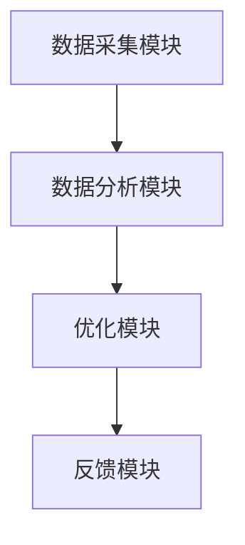

                 


# AI Agent在智能睡眠面罩中的快速入睡辅助

> 关键词：AI Agent，智能睡眠面罩，快速入睡，算法原理，系统架构，项目实战

> 摘要：本文详细探讨了AI Agent在智能睡眠面罩中的应用，从背景介绍到算法原理，从系统架构到项目实战，全面分析了如何通过AI技术帮助用户快速入睡。文章结合实际案例，深入浅出地讲解了相关技术原理和实现方法，为读者提供了一套完整的解决方案。

---

## 第一部分: AI Agent与智能睡眠面罩的背景与概念

### 第1章: AI Agent的概述

#### 1.1 AI Agent的基本概念
AI Agent（人工智能代理）是指能够感知环境并采取行动以实现目标的智能体。它通过数据采集、分析和决策，为用户提供智能化的服务。AI Agent的核心特点包括自主性、反应性、目标导向和学习能力。

#### 1.2 AI Agent的应用场景
AI Agent广泛应用于多个领域，包括智能家居、医疗健康、金融投资等。在睡眠辅助领域，AI Agent可以通过分析用户的睡眠数据，提供个性化的睡眠改善方案。

---

### 第2章: 智能睡眠面罩的概述

#### 2.1 智能睡眠面罩的基本概念
智能睡眠面罩是一种结合了传感器技术和智能算法的睡眠辅助设备。它能够实时监测用户的睡眠状态，包括心率、脑电波、眼动等数据，并通过反馈机制帮助用户改善睡眠质量。

#### 2.2 智能睡眠面罩的特点与优势
智能睡眠面罩的特点包括：
- 高精度的传感器：能够准确采集用户的生理数据。
- 智能算法：通过AI技术分析数据，提供个性化的睡眠优化建议。
- 舒适性：设计符合人体工学，佩戴舒适。

#### 2.3 智能睡眠面罩的市场现状与发展趋势
随着人们对健康睡眠的重视，智能睡眠面罩市场迅速增长。未来，随着AI技术的进步，智能睡眠面罩将更加智能化，能够实时监测并调整用户的睡眠环境。

---

### 第3章: AI Agent与智能睡眠面罩的结合

#### 3.1 AI Agent在睡眠辅助中的应用背景
现代社会中，睡眠问题日益严重，许多人存在失眠、睡眠质量差等问题。AI Agent通过分析用户的睡眠数据，提供个性化的睡眠改善方案，为解决睡眠问题提供了新的思路。

#### 3.2 AI Agent在智能睡眠面罩中的核心作用
AI Agent在智能睡眠面罩中的作用主要体现在以下几个方面：
- 数据采集与分析：通过传感器采集用户的睡眠数据，包括心率、脑电波等。
- 睡眠优化算法：基于数据，优化用户的睡眠环境，如调整光照、温度、声音等。
- 用户反馈与个性化调整：根据用户的反馈，动态调整优化方案，提供更加个性化的服务。

---

## 第二部分: AI Agent的算法原理与数学模型

### 第4章: AI Agent的算法原理

#### 4.1 AI Agent的基本算法
AI Agent的核心算法包括：
- 监督学习：通过标注数据训练模型，预测用户的睡眠状态。
- 无监督学习：通过聚类分析，发现用户的睡眠模式。
- 强化学习：通过奖励机制，优化睡眠环境的调整策略。

#### 4.2 睡眠优化算法
睡眠优化算法的核心步骤如下：
1. 数据采集：通过传感器采集用户的睡眠数据。
2. 数据分析：利用机器学习算法分析数据，识别用户的睡眠问题。
3. 优化策略：根据分析结果，调整睡眠环境的参数，如光线、温度、声音等。
4. 反馈与调整：根据用户的反馈，持续优化算法，提高睡眠改善效果。

#### 4.3 算法的数学模型
以下是睡眠优化算法的数学模型示例：

$$
y = f(x) = w_1x_1 + w_2x_2 + \dots + w_nx_n + b
$$

其中，$x_i$ 是输入特征，$w_i$ 是对应的权重，$b$ 是偏置项，$y$ 是预测的睡眠质量。

---

### 第5章: AI Agent的数学模型

#### 5.1 数据预处理
数据预处理是AI Agent工作的基础，包括数据清洗、归一化和特征提取。

#### 5.2 算法选择
根据具体需求选择合适的算法，如随机森林、支持向量机（SVM）或神经网络。

#### 5.3 模型训练与优化
通过交叉验证和超参数调优，提高模型的准确性和鲁棒性。

---

## 第三部分: 系统架构与项目实战

### 第6章: 系统架构设计

#### 6.1 项目背景
智能睡眠面罩的核心目标是通过AI技术帮助用户快速入睡，改善睡眠质量。

#### 6.2 系统功能设计
系统功能设计包括：
- 数据采集模块：采集用户的生理数据。
- 数据分析模块：分析数据，识别睡眠问题。
- 优化模块：调整睡眠环境的参数。
- 反馈模块：根据用户反馈，优化算法。

#### 6.3 系统架构图
以下是系统架构的mermaid图：



---

### 第7章: 项目实战

#### 7.1 环境安装
需要安装的环境包括：
- Python 3.8+
- TensorFlow
- Scikit-learn
- Matplotlib

#### 7.2 核心代码实现
以下是核心代码示例：

```python
import numpy as np
from sklearn import svm

# 数据预处理
X = np.array([[1, 2], [3, 4], [5, 6]])
y = np.array([0, 1, 0])

# 训练模型
model = svm.SVC()
model.fit(X, y)

# 预测
print(model.predict([[2, 3]]))
```

#### 7.3 案例分析
通过实际案例分析，展示如何利用AI Agent优化用户的睡眠质量。

---

## 第四部分: 最佳实践与总结

### 第8章: 最佳实践

#### 8.1 注意事项
- 数据隐私保护
- 算法的可解释性
- 系统的鲁棒性

#### 8.2 拓展阅读
推荐的书籍和资源，帮助读者深入学习AI Agent和智能睡眠面罩相关知识。

---

## 作者：AI天才研究院 & 禅与计算机程序设计艺术

---

这篇文章从AI Agent的基本概念到实际应用，详细探讨了其在智能睡眠面罩中的作用。通过理论分析和实际案例，为读者提供了一套完整的解决方案。希望这篇文章能为AI技术在睡眠健康领域的应用提供有价值的参考。

