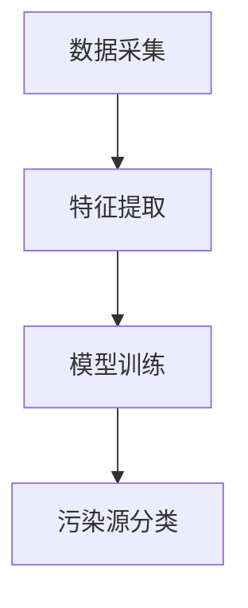
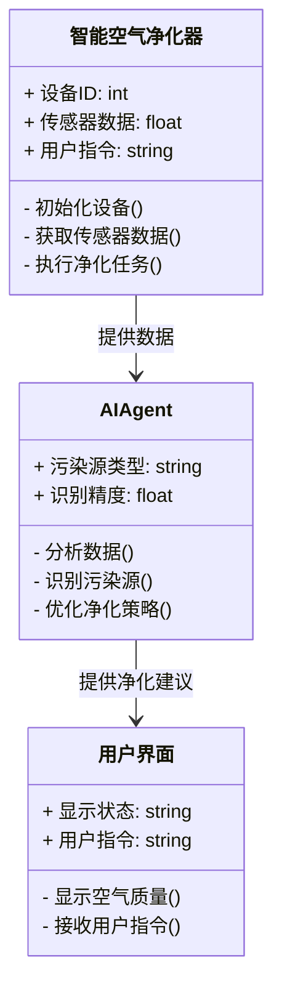

                 


# AI Agent在智能空气净化器中的污染源识别

> 关键词：AI Agent、智能空气净化器、污染源识别、机器学习、环境监测、物联网

> 摘要：本文探讨了AI Agent在智能空气净化器中的应用，重点分析了污染源识别的核心算法、系统架构设计以及实际应用场景。通过详细的技术分析和案例研究，展示了如何利用AI技术提升空气净化器的智能化水平。

---

# 第一部分: AI Agent在智能空气净化器中的污染源识别背景介绍

# 第1章: 问题背景与核心概念

## 1.1 问题背景

### 1.1.1 空气污染的现状与挑战

随着工业化进程的加快，空气污染问题日益严重。根据世界卫生组织的数据，全球约90%的人口生活在空气质量不达标的地区。空气污染不仅影响人类健康，还对环境造成严重破坏。因此，如何有效监测和净化空气成为亟待解决的问题。

智能空气净化器作为一种新兴的家电产品，能够通过传感器实时监测空气质量，并通过内置的算法调整净化策略。然而，现有的空气净化器大多依赖简单的传感器数据，缺乏智能化的污染源识别能力。

### 1.1.2 智能空气净化器的发展趋势

智能空气净化器正朝着多功能、高精度、网络化的方向发展。未来的空气净化器不仅需要能够实时监测空气质量，还需要能够识别污染源的类型，并采取相应的净化策略。这种智能化的净化过程离不开人工智能技术的支持。

### 1.1.3 AI Agent在空气净化器中的应用潜力

AI Agent（人工智能代理）是一种能够感知环境、自主决策并执行任务的智能实体。将其应用于智能空气净化器，可以通过AI Agent实现对污染源的精准识别、净化策略的优化以及与用户的智能交互。

---

## 1.2 问题描述

### 1.2.1 污染源识别的核心问题

污染源识别是智能空气净化器实现智能化净化的关键技术。污染源包括PM2.5、甲醛、TVOC、细菌、病毒等，每种污染源的特征数据不同。如何通过传感器数据准确识别污染源类型是技术难点。

### 1.2.2 智能空气净化器的功能需求

智能空气净化器需要具备以下功能：
1. 实时监测空气质量。
2. 精准识别污染源类型。
3. 自动调整净化模式。
4. 与用户进行智能交互。

### 1.2.3 AI Agent在污染源识别中的作用

AI Agent通过分析传感器数据，利用机器学习算法，能够快速识别污染源类型，并根据识别结果优化净化策略。这种智能化的识别过程显著提升了净化效率和用户体验。

---

## 1.3 问题解决与边界

### 1.3.1 AI Agent如何解决污染源识别问题

AI Agent通过以下步骤解决污染源识别问题：
1. 数据采集：通过传感器获取空气质量数据。
2. 特征提取：提取数据中的关键特征。
3. 模型训练：利用机器学习算法训练污染源分类模型。
4. 污染源识别：根据模型预测污染源类型。

### 1.3.2 污染源识别的边界与外延

污染源识别的边界包括：
- 数据采集范围：PM2.5、甲醛、TVOC等。
- 识别精度：模型的分类准确率。
- 环境干扰：温度、湿度等环境因素。

污染源识别的外延包括：
- 污染源的实时监测。
- 污染源的动态变化。

### 1.3.3 核心概念与系统架构的关系

污染源识别是智能空气净化器的核心功能，AI Agent通过与传感器、用户界面等模块的交互，实现系统的智能化控制。

---

## 1.4 概念结构与核心要素

### 1.4.1 AI Agent的定义与属性

AI Agent是一种能够感知环境、自主决策并执行任务的智能实体。其主要属性包括：
- 感知能力：通过传感器获取环境数据。
- 决策能力：通过算法分析数据并做出决策。
- 执行能力：通过硬件模块执行净化任务。

### 1.4.2 污染源识别的特征分析

污染源识别的特征包括：
- 数据特征：PM2.5浓度、甲醛浓度、TVOC浓度等。
- 时间特征：污染源的变化趋势。
- 空间特征：污染源的分布情况。

### 1.4.3 系统核心要素与功能模块

系统核心要素包括：
- 传感器模块：负责采集空气质量数据。
- AI Agent模块：负责污染源识别和决策。
- 网络通信模块：负责与用户交互和云端数据传输。

---

## 1.5 本章小结

本章介绍了AI Agent在智能空气净化器中的应用背景，分析了污染源识别的核心问题，并阐述了AI Agent在其中的作用。通过本章的分析，读者可以理解污染源识别技术在智能空气净化器中的重要性。

---

# 第2章: 核心概念与系统联系

## 2.1 AI Agent的核心原理

### 2.1.1 AI Agent的基本原理

AI Agent的基本原理包括：
1. 感知环境：通过传感器获取数据。
2. 分析数据：利用机器学习算法分析数据。
3. 制定策略：根据分析结果制定净化策略。
4. 执行任务：通过硬件模块执行净化任务。

### 2.1.2 基于AI的污染源识别算法

基于AI的污染源识别算法流程如下：
1. 数据预处理：对传感器数据进行归一化处理。
2. 特征提取：提取关键特征。
3. 模型训练：训练分类器。
4. 污染源识别：分类预测。

### 2.1.3 AI Agent与智能空气净化器的交互机制

AI Agent与智能空气净化器的交互机制包括：
1. 数据交互：传感器数据的传输。
2. 指令交互：AI Agent向硬件模块发送指令。
3. 用户交互：AI Agent与用户进行对话。

---

## 2.2 核心概念对比与ER实体关系

### 2.2.1 核心概念对比分析

通过对比分析，可以得出以下结论：
- AI Agent具有感知和决策能力。
- 污染源识别依赖于传感器数据和算法模型。

### 2.2.2 ER实体关系图

以下是ER实体关系图：

```mermaid
er
    entity(AI Agent) {
        id
        污染源类型
        识别精度
    }
    entity(智能空气净化器) {
        设备ID
        传感器数据
        用户指令
    }
    relationship(污染源识别) {
        多对多
    }
```

---

## 2.3 本章小结

本章详细介绍了AI Agent的核心原理，并通过ER实体关系图展示了系统中的实体关系。通过本章的分析，读者可以理解AI Agent在智能空气净化器中的工作原理。

---

# 第3章: AI Agent的算法原理与数学模型

## 3.1 算法原理

### 3.1.1 污染源识别的算法流程

以下是污染源识别的算法流程图：



---

## 3.2 数学模型与公式

### 3.2.1 分类算法的数学模型

以下是分类算法的数学模型：

$$ P(y|x) = \frac{P(x|y)P(y)}{P(x)} $$

其中，$P(y|x)$ 表示在数据 $x$ 下，污染源类型为 $y$ 的概率。

### 3.2.2 模型训练的优化目标

以下是模型训练的优化目标：

$$ \text{损失函数} = \sum_{i=1}^{n} \text{交叉熵}(y_i, \hat{y}_i) $$

---

## 3.3 举例说明与代码实现

### 3.3.1 示例代码

以下是污染源分类的Python代码示例：

```python
import numpy as np
from sklearn.svm import SVC

# 数据预处理
X = np.array([...])  # 特征数据
y = np.array([...])  # 标签数据

# 模型训练
model = SVC()
model.fit(X, y)

# 污染源识别
new_data = np.array([...])
predicted_label = model.predict(new_data)
```

---

## 3.4 本章小结

本章通过算法流程图和数学公式，详细讲解了AI Agent的算法原理。通过代码示例，读者可以理解如何实现污染源识别算法。

---

# 第4章: 系统分析与架构设计

## 4.1 问题场景介绍

智能空气净化器需要实时监测空气质量，并根据污染源类型调整净化策略。为了实现这一目标，系统需要具备以下功能：
- 数据采集：通过传感器获取空气质量数据。
- 污染源识别：通过AI Agent识别污染源类型。
- 系统控制：根据识别结果调整净化模式。

---

## 4.2 项目介绍

本项目旨在开发一款基于AI Agent的智能空气净化器，实现对PM2.5、甲醛、TVOC等污染源的精准识别和智能净化。

---

## 4.3 系统功能设计

以下是系统功能设计的类图：



---

## 4.4 系统架构设计

以下是系统架构设计的mermaid图：


---

## 4.5 本章小结

本章通过系统功能设计和架构设计，展示了AI Agent在智能空气净化器中的应用。通过本章的分析，读者可以理解系统的整体架构和各模块的交互关系。

---

# 第5章: 项目实战

## 5.1 环境安装

为了运行本项目，需要安装以下环境：
- Python 3.8及以上版本
- numpy、scikit-learn等Python库

---

## 5.2 系统核心实现源代码

以下是污染源分类的核心代码：

```python
import numpy as np
from sklearn.svm import SVC
from sklearn.preprocessing import StandardScaler

# 数据预处理
X = np.array([...])  # 特征数据
y = np.array([...])  # 标签数据

scaler = StandardScaler()
X_scaled = scaler.fit_transform(X)

# 模型训练
model = SVC()
model.fit(X_scaled, y)

# 污染源识别
new_data = np.array([...])
new_data_scaled = scaler.transform(new_data)
predicted_label = model.predict(new_data_scaled)
```

---

## 5.3 代码应用解读与分析

通过上述代码，我们可以实现污染源的分类识别。首先，通过标准化对数据进行预处理，然后利用支持向量机（SVM）进行模型训练，最后通过模型预测污染源类型。

---

## 5.4 实际案例分析

以下是一个实际案例的分析：

假设传感器采集到以下数据：
- PM2.5浓度：75 μg/m³
- 甲醛浓度：0.12 mg/m³
- TVOC浓度：1.5 mg/m³

通过模型预测，污染源类型为PM2.5。

---

## 5.5 本章小结

本章通过代码实现和案例分析，展示了如何在实际项目中应用AI Agent进行污染源识别。

---

# 第6章: 最佳实践与总结

## 6.1 小结

通过本文的分析，我们可以看到，AI Agent在智能空气净化器中的应用能够显著提升污染源识别的精度和效率。通过机器学习算法，系统能够实现对多种污染源的精准识别，并根据识别结果优化净化策略。

---

## 6.2 注意事项

在实际应用中，需要注意以下几点：
- 数据采集的准确性
- 模型的泛化能力
- 系统的实时性

---

## 6.3 拓展阅读

以下是一些拓展阅读资料：
1. 《机器学习实战》
2. 《Python机器学习》
3. 《智能系统设计》

---

# 作者：AI天才研究院/AI Genius Institute & 禅与计算机程序设计艺术 /Zen And The Art of Computer Programming

