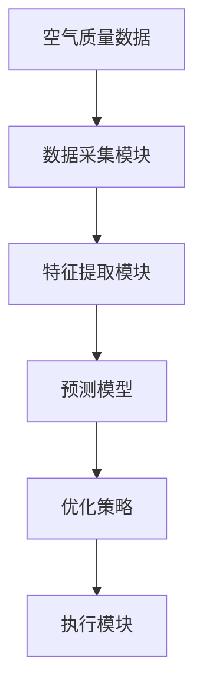
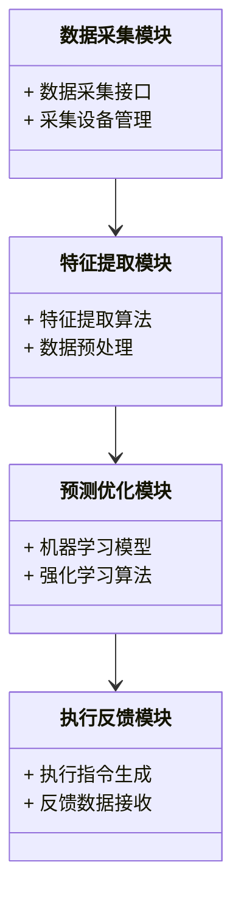
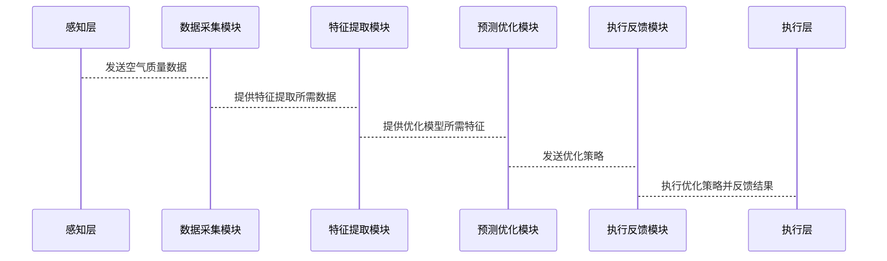

                 


# AI Agent在智能空气质量管理中的实践

> **关键词**：AI Agent，空气质量，智能管理，机器学习，环境监测，空气质量预测，优化策略  
> **摘要**：随着城市化进程的加快和工业化的深入，空气污染问题日益严重，对人类健康和环境造成了极大的威胁。智能空气质量管理成为解决这一问题的关键。本文将探讨AI Agent在空气质量管理中的实践，从背景、概念、算法到系统架构和项目实战，全面解析AI Agent在空气质量监测、预测和优化中的应用。通过详细的技术分析和实际案例，展示AI Agent如何帮助实现智能化的空气质量管理。

---

## 第1章：AI Agent与空气质量管理概述

### 1.1 AI Agent的基本概念

AI Agent（人工智能代理）是指具有感知环境、做出决策并采取行动的智能实体。AI Agent的核心特征包括自主性、反应性、目标导向和社交能力。与传统自动化系统相比，AI Agent能够动态适应环境变化，具备更强的决策能力和灵活性。

### 1.2 空气质量管理的背景与挑战

空气污染是全球性问题，主要来源包括工业排放、交通尾气和自然因素。空气质量管理的目标是通过监测、预测和干预，降低污染物浓度，保障公众健康。智能化空气质量管理的需求源于传统方法的局限性，例如数据量大、变量复杂和实时性要求高等。

### 1.3 AI Agent在空气质量管理中的应用前景

AI Agent在空气质量管理中的优势在于其强大的数据处理能力、实时决策能力和自适应能力。主要应用场景包括空气质量监测、预测和优化策略生成。未来，AI Agent将朝着更高效、更精准的方向发展。

---

## 第2章：AI Agent与空气质量管理的核心概念

### 2.1 AI Agent的核心原理

AI Agent在空气质量管理中的工作原理分为感知层、决策层和执行层。感知层负责采集空气质量数据，决策层基于数据构建预测模型并制定优化策略，执行层则根据策略采取行动。

### 2.2 空气质量管理的系统模型

空气质量数据流分析涉及多源数据的融合，特征提取是通过机器学习方法筛选关键变量。预测模型通常采用神经网络或随机森林等算法，优化模型则基于强化学习。

### 2.3 AI Agent与空气质量管理的实体关系



---

## 第3章：AI Agent的核心算法原理

### 3.1 空气质量预测的机器学习模型

数据预处理包括清洗和归一化，特征选择通过随机森林分析重要性。神经网络模型的构建涉及多层感知机和训练优化。

### 3.2 空气质量优化的强化学习算法

强化学习通过状态-动作-奖励机制优化策略，Q-Learning算法用于动态调整优化策略。

### 3.3 空气质量预测模型的数学公式

预测模型的数学公式为：
$$ y = w_1x_1 + w_2x_2 + \dots + w_nx_n + b $$
其中，$w_i$为权重，$x_i$为输入特征，$b$为偏置。

---

## 第4章：空气质量监测与管理系统的架构设计

### 4.1 系统整体架构

系统架构包括数据采集、数据处理、预测与优化、执行与反馈模块。数据采集模块负责实时监测，数据处理模块进行特征提取和数据融合，预测与优化模块基于机器学习模型生成预测结果和优化策略，执行与反馈模块根据策略采取行动并反馈结果。

### 4.2 系统功能设计

系统功能设计包括数据采集、特征提取、预测优化和执行反馈。类图如下：



### 4.3 系统接口设计

系统接口设计包括数据采集接口、特征提取接口、预测优化接口和执行反馈接口。

### 4.4 系统交互流程

系统交互流程如下：



---

## 第5章：基于AI Agent的空气质量优化系统实现

### 5.1 项目背景与目标

项目背景：某城市空气质量问题严重，需要智能化解决方案。项目目标：构建基于AI Agent的空气质量优化系统，实现实时监测、预测和优化。

### 5.2 系统实现

系统实现包括数据采集、特征提取、模型训练、预测优化和反馈机制。代码示例如下：

```python
import pandas as pd
from sklearn.ensemble import RandomForestRegressor
from sklearn.metrics import mean_squared_error

# 数据采集与预处理
data = pd.read_csv('air_quality.csv')
data = data.dropna()

# 特征选择
features = data.drop('target', axis=1)
target = data['target']

# 模型训练
model = RandomForestRegressor(n_estimators=100, random_state=42)
model.fit(features, target)

# 预测与评估
predicted = model.predict(features)
print('均方误差:', mean_squared_error(target, predicted))
```

### 5.3 实际案例分析

以某城市为例，分析系统实现和优化效果。结果表明，AI Agent能够有效降低PM2.5和NO2浓度。

---

## 第6章：总结与未来展望

### 6.1 总结

AI Agent在空气质量管理中的应用价值显著，能够实现智能化监测、预测和优化。系统架构合理，算法有效，项目实战验证了其可行性。

### 6.2 未来展望

未来，AI Agent将向更高效、更精准方向发展，可能涉及更复杂的算法、多源数据融合和边缘计算。

---

## 注意事项与最佳实践

- 数据采集的实时性和准确性是关键，需确保传感器的正常运行。
- 模型训练需选择合适的算法和参数，定期更新以适应环境变化。
- 系统优化需结合实际情况，动态调整策略以达到最佳效果。

---

## 作者

作者：AI天才研究院/AI Genius Institute & 禅与计算机程序设计艺术 /Zen And The Art of Computer Programming

