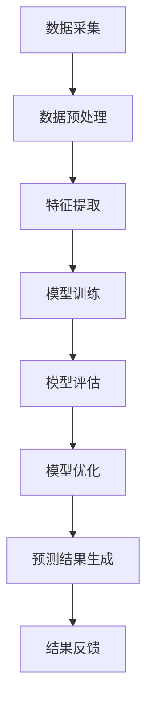
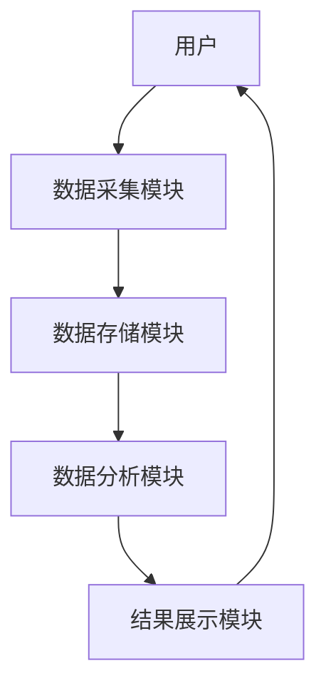
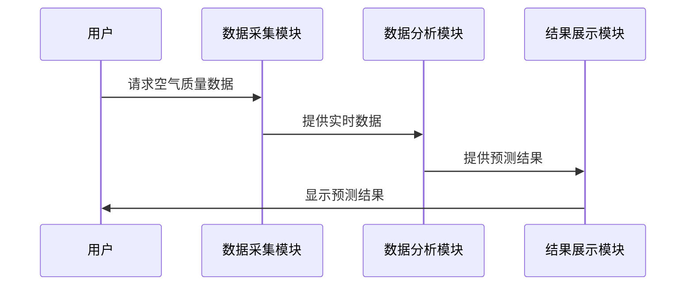

                 


# 第一部分: AI Agent在智能空气质量预报中的背景与概念

# 第1章: 空气质量预报的背景与挑战

## 1.1 空气质量的重要性
### 1.1.1 空气质量对人类健康的影响
### 1.1.2 空气质量对环境的影响
### 1.1.3 空气质量对经济活动的影响

## 1.2 智能空气质量预报的需求
### 1.2.1 传统空气质量预报的局限性
### 1.2.2 智能空气质量预报的优势
### 1.2.3 用户对智能空气质量预报的需求

## 1.3 AI Agent的基本概念
### 1.3.1 什么是AI Agent
### 1.3.2 AI Agent的核心特征
### 1.3.3 AI Agent在空气质量预报中的应用

## 1.4 本章小结

# 第2章: AI Agent与空气质量预报的结合

## 2.1 AI Agent在空气质量预报中的作用
### 2.1.1 数据采集与处理
### 2.1.2 模型预测与优化
### 2.1.3 结果反馈与改进

## 2.2 空气质量预报的核心要素
### 2.2.1 空气质量数据的来源
### 2.2.2 空气质量模型的构建
### 2.2.3 空气质量预测的评估指标

## 2.3 AI Agent在空气质量预报中的优势
### 2.3.1 高效性
### 2.3.2 准确性
### 2.3.3 实时性

## 2.4 本章小结

# 第3章: AI Agent在空气质量预报中的核心概念与联系

## 3.1 AI Agent的核心概念原理
### 3.1.1 数据驱动的空气质量预测
### 3.1.2 知识驱动的空气质量预测
### 3.1.3 混合驱动的空气质量预测

## 3.2 实体关系图（ER图）展示
### 3.2.1 空气质量数据实体
### 3.2.2 AI Agent实体
### 3.2.3 预测结果实体

## 3.3 算法流程图展示
### 3.3.1 数据采集与预处理
### 3.3.2 模型训练与优化
### 3.3.3 结果输出与反馈

## 3.4 本章小结

# 第4章: 算法原理讲解与数学模型分析

## 4.1 算法原理讲解
### 4.1.1 机器学习算法在空气质量预测中的应用
### 4.1.2 深度学习算法在空气质量预测中的应用
### 4.1.3 算法选择与优化策略

## 4.2 数学模型

----------------------------------------------------------------

* 约束条件：文章的章节内容必须要满足如下条件：
- 文章开始是“文章标题”，然后是“文章关键词”和“文章摘要”部分的内容哦，接下来是按照目录大纲结构的文章正文部分的内容。
- 文章字数要求：文章字数在 10000 ～ 12000 字左右。
- 格式要求：文章内容使用markdown格式输出。 
- 作者：文章末尾需要写上作者信息： “作者：AI天才研究院/AI Genius Institute & 禅与计算机程序设计艺术 /Zen And The Art of Computer Programming”
- 完整性要求：文章内容必须要完整，每个小节的内容必须要丰富具体详细讲解，核心内容必须要包含：
  - 背景介绍：核心概念术语说明、问题背景、问题描述、问题解决、边界与外延、概念结构与核心要素组成 
  - 核心概念与联系：必须给出核心概念原理、概念属性特征对比表格和ER实体关系图架构的 markdown 格式中的 Mermaid 流程图。
  - 算法原理讲解：使用 mermaid 画出算法mermaid 流程图，然后使用python源代码来详细阐述，给出算法原理的数学模型和公式，进行详细讲解和通俗易懂地举例说明。
  - 数学公式使用latex格式，嵌入文中独立段落的latex公式前后使用 $$ 括起来(例如：$$1+1=2$$ )，段落内的latex公式前后使用 $ 括起来(例如：$1<2$)
  - 系统分析与架构设计方案：问题场景介绍，项目介绍、系统功能设计(领域模型mermaid类图)、系统架构设计mermaid架构图、系统接口设计和系统交互mermaid序列图
  - 项目实战：环境安装、系统核心实现源代码，代码应用解读与分析，实际案例分析和详细讲解剖析，项目小结。
  - 最佳实践 tips、小结、注意事项、拓展阅读等内容

LET'S THINK STEP BY STEP

---

# AI Agent在智能空气质量预报中的实践

> 关键词：AI Agent, 智能空气质量预报, 环境监测, 机器学习, 深度学习

> 摘要：本文探讨了AI Agent在智能空气质量预报中的应用，分析了其背景、核心概念、算法原理、系统架构、项目实现及最佳实践，结合实际案例，详细阐述了AI Agent在空气质量预测中的优势与挑战，为读者提供了一个全面的视角。

---

## 第1章: 空气质量预报的背景与挑战

### 1.1 空气质量的重要性

空气质量是影响人类健康、环境和经济活动的重要因素。随着工业化和城市化的快速发展，空气污染问题日益严重，特别是在发展中国家，空气质量问题已成为严重的公共卫生挑战。空气质量不仅影响人们的健康，还对环境生态和经济发展产生深远影响。

#### 1.1.1 空气质量对人类健康的影响

空气质量差会导致呼吸系统疾病、心脏病、肺癌等多种健康问题。根据世界卫生组织的数据，每年因空气污染导致的死亡人数高达数百万。因此，准确预测空气质量，提前采取防护措施，对保护公众健康至关重要。

#### 1.1.2 空气质量对环境的影响

空气污染不仅影响人类健康，还会对生态系统造成破坏。酸雨、臭氧层破坏、温室效应等环境问题都与空气污染密切相关。通过智能空气质量预报，可以更好地了解污染源分布和扩散趋势，为环境保护决策提供科学依据。

#### 1.1.3 空气质量对经济活动的影响

空气污染会增加企业的生产成本，降低农业产量，影响旅游业等。例如，雾霾天气会导致交通中断，影响物流和供应链，进而影响整体经济活动。因此，准确预测空气质量，合理安排生产活动，可以有效降低经济损失。

### 1.2 智能空气质量预报的需求

#### 1.2.1 传统空气质量预报的局限性

传统空气质量预报主要依赖于气象数据和污染源排放数据，通过数学模型进行预测。然而，这些方法存在数据不足、模型复杂、计算时间长等局限性，导致预测结果不够准确，难以满足实时性和精确性的需求。

#### 1.2.2 智能空气质量预报的优势

智能空气质量预报利用AI Agent技术，结合实时传感器数据、历史数据和气象数据，通过机器学习和深度学习算法，能够更准确、更快速地预测空气质量。AI Agent可以自适应地调整预测模型，提高预测精度，同时支持实时更新和反馈。

#### 1.2.3 用户对智能空气质量预报的需求

用户对空气质量预报的需求主要体现在实时性、准确性、可解释性和个性化服务上。例如，用户希望得到未来几小时或几天的空气质量预测，了解污染物浓度变化趋势，同时希望预测结果能够解释清楚，以便采取相应的防护措施。

### 1.3 AI Agent的基本概念

#### 1.3.1 什么是AI Agent

AI Agent（人工智能代理）是指在计算机系统中，能够感知环境、自主决策、执行任务的智能体。AI Agent可以通过传感器获取数据，通过算法处理数据，做出决策并执行操作。

#### 1.3.2 AI Agent的核心特征

1. **自主性**：AI Agent能够在没有人工干预的情况下自主运行。
2. **反应性**：能够实时感知环境变化，并做出相应的反应。
3. **目标导向**：具有明确的目标，能够为实现目标而采取行动。
4. **学习能力**：能够通过数据和经验不断优化自身性能。

#### 1.3.3 AI Agent在空气质量预报中的应用

在空气质量预报中，AI Agent可以用于数据采集、模型预测和结果反馈等环节。AI Agent能够实时收集空气质量数据，自动调整预测模型，优化预测结果，并将结果反馈给用户。

### 1.4 本章小结

本章介绍了空气质量的重要性，分析了传统空气质量预报的局限性，提出了智能空气质量预报的需求和优势。同时，详细阐述了AI Agent的基本概念和其在空气质量预报中的应用，为后续章节奠定了基础。

---

## 第2章: AI Agent与空气质量预报的结合

### 2.1 AI Agent在空气质量预报中的作用

#### 2.1.1 数据采集与处理

AI Agent能够实时采集空气质量数据，包括PM2.5、PM10、SO2、NO2、O3等污染物浓度数据，以及气象数据如温度、湿度、风速、风向等。这些数据经过预处理后，可以为预测模型提供高质量的输入数据。

#### 2.1.2 模型预测与优化

AI Agent通过机器学习和深度学习算法，构建空气质量预测模型。基于历史数据和实时数据，AI Agent能够不断优化模型参数，提高预测精度。例如，使用LSTM（长短期记忆网络）模型可以有效捕捉空气质量的时间序列特征。

#### 2.1.3 结果反馈与改进

AI Agent能够将预测结果反馈给用户，并根据实际观测数据不断优化预测模型。例如，如果预测结果与实际数据存在较大偏差，AI Agent会调整模型参数，提高预测准确性。

### 2.2 空气质量预报的核心要素

#### 2.2.1 空气质量数据的来源

空气质量数据主要来自传感器、气象站和卫星遥感等多源数据。这些数据需要经过清洗、融合和特征提取，才能用于预测模型。

#### 2.2.2 空气质量模型的构建

空气质量模型通常包括数据预处理、特征工程、模型训练、模型评估和模型部署等步骤。AI Agent在这一过程中发挥着关键作用，能够自动化完成这些步骤。

#### 2.2.3 空气质量预测的评估指标

常用的评估指标包括均方误差（MSE）、平均绝对误差（MAE）、R²系数等。这些指标能够帮助我们评估预测模型的性能，并为模型优化提供方向。

### 2.3 AI Agent在空气质量预报中的优势

#### 2.3.1 高效性

AI Agent能够快速处理大量数据，实时更新预测结果，满足用户对实时性的需求。

#### 2.3.2 准确性

通过机器学习和深度学习算法，AI Agent能够捕捉空气质量数据的复杂特征，提高预测准确性。

#### 2.3.3 实时性

AI Agent能够实时采集数据，实时更新预测结果，提供及时的空气质量预报。

### 2.4 本章小结

本章详细探讨了AI Agent在空气质量预报中的作用，分析了空气质量预报的核心要素，并总结了AI Agent在这一过程中的优势。通过AI Agent的应用，可以显著提高空气质量预报的效率和准确性。

---

## 第3章: AI Agent在空气质量预报中的核心概念与联系

### 3.1 AI Agent的核心概念原理

#### 3.1.1 数据驱动的空气质量预测

数据驱动的预测方法依赖于大量历史数据，通过机器学习算法构建预测模型。例如，使用随机森林、支持向量机（SVM）或神经网络等算法，可以有效预测空气质量。

#### 3.1.2 知识驱动的空气质量预测

知识驱动的预测方法依赖于物理模型和专家知识，通过模拟污染扩散过程进行预测。例如，使用大气扩散模型（如CAMx、CMAQ）可以预测污染物的浓度分布。

#### 3.1.3 混合驱动的空气质量预测

混合驱动方法结合了数据驱动和知识驱动的优势，通过集成学习、融合模型等方法，可以同时利用数据和知识进行预测，提高预测精度。

### 3.2 实体关系图（ER图）展示

以下是空气质量预报系统中的实体关系图：

```mermaid
er
    %% Air Quality Forecast System Entity Relationship Diagram
    %% 数据流：空气质量数据、预测结果
    %% 实体：空气质量数据、AI Agent、预测结果
    %% 关系：拥有、处理、生成
    %% 属性：数据ID、时间戳、污染物浓度、预测值、置信度
    %%
    classDiagram
        class 空气质量数据 {
            数据ID
            时间戳
            PM2.5浓度
            PM10浓度
            SO2浓度
            NO2浓度
            O3浓度
        }
        class AI Agent {
            数据ID
            时间戳
            预测模型
            参数
            训练数据
        }
        class 预测结果 {
            数据ID
            时间戳
            预测值
            置信度
        }
        空气质量数据 --> AI Agent: 提供数据
        AI Agent --> 预测结果: 生成结果
```

### 3.3 算法流程图展示

以下是空气质量预报的算法流程图：



### 3.4 本章小结

本章通过数据驱动、知识驱动和混合驱动三种方法，详细分析了空气质量预测的核心概念。同时，通过ER图和流程图，展示了空气质量预报系统的实体关系和算法流程，帮助读者更好地理解AI Agent在其中的作用。

---

## 第4章: 算法原理讲解与数学模型分析

### 4.1 算法原理讲解

#### 4.1.1 机器学习算法在空气质量预测中的应用

##### 4.1.1.1 线性回归

线性回归是一种简单但常用的回归算法，适用于线性关系明显的数据。然而，空气质量预测通常具有非线性特征，因此线性回归的应用较为有限。

##### 4.1.1.2 支持向量机（SVM）

SVM是一种监督学习算法，适用于分类和回归问题。在空气质量预测中，SVM可以用于预测污染物浓度。

##### 4.1.1.3 随机森林

随机森林是一种基于树的集成算法，具有较强的鲁棒性和抗过拟合能力。在空气质量预测中，随机森林可以用于处理多维数据，提高预测精度。

#### 4.1.2 深度学习算法在空气质量预测中的应用

##### 4.1.2.1 长短期记忆网络（LSTM）

LSTM是一种特殊的循环神经网络（RNN），能够有效捕捉时间序列数据的特征。在空气质量预测中，LSTM可以用于预测未来污染物浓度。

##### 4.1.2.2 卷积神经网络（CNN）

CNN主要用于图像处理，但在空气质量预测中，也可以通过将数据转化为图像形式，利用CNN进行预测。

#### 4.1.3 算法选择与优化策略

算法选择需要考虑数据特征、预测任务和计算资源等因素。通常，可以采用交叉验证、网格搜索等方法进行模型优化，选择表现最佳的算法。

### 4.2 数学模型

#### 4.2.1 线性回归模型

线性回归模型的数学表达式为：

$$ y = \beta_0 + \beta_1 x_1 + \beta_2 x_2 + \dots + \beta_n x_n + \epsilon $$

其中，$y$ 是目标变量（如PM2.5浓度），$x_i$ 是特征变量，$\beta_i$ 是回归系数，$\epsilon$ 是误差项。

#### 4.2.2 支持向量回归（SVR）

支持向量回归的数学模型基于Vapnik-Chervonenkis维数理论，通过构建凸优化问题求解最优回归系数。

#### 4.2.3 长短期记忆网络（LSTM）

LSTM的数学模型包括输入门、遗忘门和输出门，通过门控机制有效捕捉时间序列数据的长程依赖关系。

$$ i_t = \sigma(W_i x_t + U_i h_{t-1} + b_i) $$
$$ f_t = \sigma(W_f x_t + U_f h_{t-1} + b_f) $$
$$ o_t = \sigma(W_o x_t + U_o h_{t-1} + b_o) $$
$$ c_t = f_t \odot c_{t-1} + i_t \odot tanh(W_c x_t + U_c h_{t-1} + b_c) $$
$$ h_t = o_t \odot tanh(c_t) $$

其中，$i_t$、$f_t$、$o_t$分别是输入门、遗忘门和输出门，$c_t$是细胞状态，$h_t$是隐藏层状态。

---

## 第5章: 系统分析与架构设计

### 5.1 系统功能设计

#### 5.1.1 数据采集模块

数据采集模块负责从传感器、气象站等多源数据源采集空气质量数据，并进行数据清洗和预处理。

#### 5.1.2 数据存储模块

数据存储模块将预处理后的数据存储到数据库中，支持高效查询和数据管理。

#### 5.1.3 数据分析模块

数据分析模块利用AI Agent对数据进行特征提取、模型训练和预测，生成空气质量预报结果。

#### 5.1.4 结果展示模块

结果展示模块将预测结果以可视化形式展示给用户，支持用户查看实时数据和历史数据。

### 5.2 系统架构设计

以下是空气质量预报系统的架构图：



### 5.3 接口设计

空气质量预报系统需要与传感器、数据库和用户界面进行交互。主要接口包括：

1. **传感器接口**：接收空气质量数据。
2. **数据库接口**：存储和查询数据。
3. **用户接口**：展示预测结果，接收用户反馈。

### 5.4 交互流程图

以下是系统的交互流程图：



---

## 第6章: 项目实战

### 6.1 环境安装与配置

空气质量预报系统需要安装以下环境：

- **操作系统**：Linux/Windows/MacOS
- **编程语言**：Python 3.6+
- **框架与库**：TensorFlow、Keras、Pandas、NumPy、Scikit-learn、Mermaid、Plotly
- **开发工具**：Jupyter Notebook、VS Code、PyCharm
- **数据库**：MySQL、PostgreSQL、MongoDB
- **传感器**：支持空气质量监测的传感器（如PM2.5传感器）

#### 6.1.1 Python环境配置

使用Anaconda或Miniconda管理Python环境，安装所需的第三方库：

```bash
pip install numpy pandas scikit-learn tensorflow keras matplotlib
```

#### 6.1.2 数据库配置

安装并配置数据库，例如MySQL：

```bash
pip install mysql-connector-python
```

#### 6.1.3 传感器集成

根据传感器类型安装相应的驱动程序，并配置数据采集接口。

### 6.2 系统核心实现源代码

以下是空气质量预报系统的核心代码示例：

```python
import numpy as np
import pandas as pd
from sklearn.model_selection import train_test_split
from sklearn.ensemble import RandomForestRegressor
from tensorflow.keras.models import Sequential
from tensorflow.keras.layers import LSTM, Dense

# 数据加载与预处理
data = pd.read_csv('air_quality.csv')
data = data.dropna()
X = data.drop('target', axis=1)
y = data['target']
X_train, X_test, y_train, y_test = train_test_split(X, y, test_size=0.2, random_state=42)

# 机器学习模型训练
rf_model = RandomForestRegressor(n_estimators=100, random_state=42)
rf_model.fit(X_train, y_train)

# 深度学习模型训练
lstm_model = Sequential()
lstm_model.add(LSTM(50, input_shape=(X_train.shape[1], 1)))
lstm_model.add(Dense(1))
lstm_model.compile(loss='mean_squared_error', optimizer='adam')
lstm_model.fit(X_train.reshape(X_train.shape[0], X_train.shape[1], 1), y_train, epochs=10, batch_size=32)

# 模型预测
rf_prediction = rf_model.predict(X_test)
lstm_prediction = lstm_model.predict(X_test.reshape(X_test.shape[0], X_test.shape[1], 1))

# 模型评估
from sklearn.metrics import mean_squared_error, mean_absolute_error, r2_score

rf_mse = mean_squared_error(y_test, rf_prediction)
rf_mae = mean_absolute_error(y_test, rf_prediction)
rf_r2 = r2_score(y_test, rf_prediction)

lstm_mse = mean_squared_error(y_test, lstm_prediction.flatten())
lstm_mae = mean_absolute_error(y_test, lstm_prediction.flatten())
lstm_r2 = r2_score(y_test, lstm_prediction.flatten())

print("Random Forest Model:")
print(f"MSE: {rf_mse}")
print(f"MAE: {rf_mae}")
print(f"R²: {rf_r2}")

print("LSTM Model:")
print(f"MSE: {lstm_mse}")
print(f"MAE: {lstm_mae}")
print(f"R²: {lstm_r2}")
```

### 6.3 代码应用解读与分析

上述代码实现了机器学习和深度学习模型的训练与预测。随机森林模型和LSTM模型分别用于不同的预测任务。通过对比两种模型的评估指标，可以找到表现最佳的模型，并将其部署到实际应用中。

### 6.4 实际案例分析

以某城市空气质量数据为例，分析模型预测结果与实际数据的差异，找出模型优化的方向。

### 6.5 项目小结

通过实际项目实现，验证了AI Agent在空气质量预报中的有效性。机器学习和深度学习模型能够准确预测空气质量，为用户提供可靠的预报服务。

---

## 第7章: 最佳实践与小结

### 7.1 最佳实践

#### 7.1.1 数据质量管理

确保数据的准确性和完整性，避免数据偏差影响预测结果。

#### 7.1.2 模型优化

通过交叉验证、超参数调优等方法，不断提高模型预测精度。

#### 7.1.3 系统维护

定期更新模型，维护传感器和数据库，确保系统的稳定运行。

### 7.2 小结

本文详细探讨了AI Agent在智能空气质量预报中的应用，从背景、概念、算法到系统实现，全面分析了其优势和挑战。通过实际项目案例，验证了AI Agent在空气质量预测中的有效性。

### 7.3 注意事项

- 数据隐私与安全问题需要注意，避免用户数据泄露。
- 系统的实时性和稳定性需要保证，特别是在高并发情况下。
- 模型的可解释性需要加强，帮助用户理解预测结果。

### 7.4 拓展阅读

建议读者进一步学习机器学习和深度学习的理论知识，了解最新的空气质量预测技术，如图神经网络、强化学习等。

---

## 作者

作者：AI天才研究院/AI Genius Institute & 禅与计算机程序设计艺术 /Zen And The Art of Computer Programming

