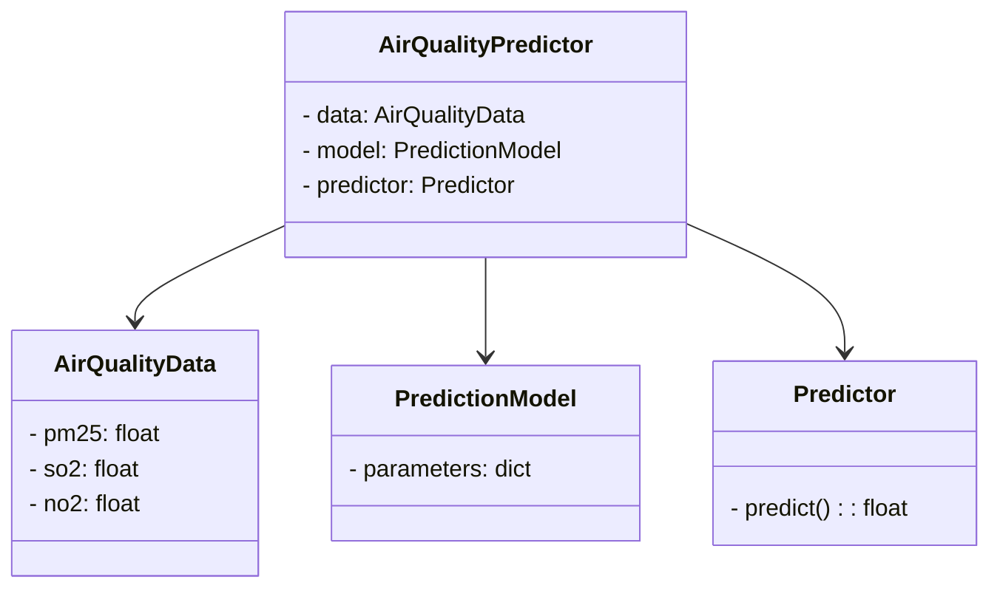
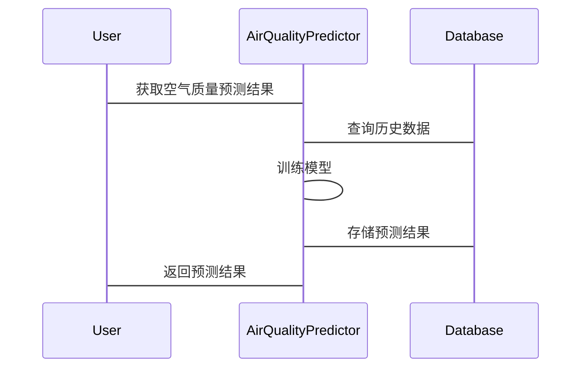

                 


# AI Agent在智能空气质量预测中的实践

## 关键词：AI Agent, 智能空气质量预测, 机器学习, 强化学习, 环境监测, 系统架构

## 摘要：  
本文详细探讨了AI Agent在智能空气质量预测中的应用实践。通过分析空气质量预测的背景与挑战，结合AI Agent的核心技术与算法原理，构建了一个基于机器学习和强化学习的空气质量预测系统。文章从系统架构设计到项目实战，详细阐述了实现过程，并给出了优化建议和未来研究方向。

---

# 第1章: AI Agent与空气质量预测的背景与概述

## 1.1 AI Agent的基本概念

### 1.1.1 AI Agent的定义与特点  
AI Agent（人工智能代理）是一种能够感知环境、自主决策并执行任务的智能实体。其特点包括：  
1. **自主性**：能够自主决策，无需外部干预。  
2. **反应性**：能够实时感知环境变化并做出反应。  
3. **目标导向**：以特定目标为导向，优化决策过程。  
4. **学习能力**：能够通过数据和经验不断优化自身性能。  

### 1.1.2 AI Agent的核心功能与分类  
AI Agent的核心功能包括感知、决策、执行和反馈。根据应用场景的不同，AI Agent可以分为以下几类：  
1. **简单反射型Agent**：基于规则直接做出反应。  
2. **基于模型的反射型Agent**：利用环境模型进行决策。  
3. **目标驱动型Agent**：以目标为导向进行决策和行动。  
4. **效用驱动型Agent**：通过最大化效用函数进行决策。  

### 1.1.3 AI Agent在环境监测中的应用潜力  
AI Agent在环境监测中的潜力主要体现在以下几个方面：  
1. **实时监测**：能够实时感知环境数据并做出快速反应。  
2. **数据处理**：能够处理海量环境数据，提取有价值的信息。  
3. **智能预测**：通过学习历史数据，预测未来环境变化。  

## 1.2 智能空气质量预测的背景与意义

### 1.2.1 空气质量预测的重要性  
空气质量是影响人类健康和环境的重要指标。通过预测空气质量，可以提前采取措施，减少污染对人类和环境的影响。  

### 1.2.2 传统空气质量预测方法的局限性  
传统空气质量预测方法主要依赖物理模型和统计分析，存在以下局限性：  
1. **计算复杂**：物理模型需要大量计算资源。  
2. **实时性差**：难以实时更新预测结果。  
3. **准确性低**：受模型假设和数据质量的影响。  

### 1.2.3 AI Agent在空气质量预测中的优势  
AI Agent在空气质量预测中的优势包括：  
1. **实时性**：能够实时感知环境数据并快速做出预测。  
2. **准确性**：通过机器学习算法，可以提高预测的准确性。  
3. **自适应性**：能够根据环境变化自适应调整预测模型。  

## 1.3 AI Agent与空气质量预测的结合

### 1.3.1 AI Agent在空气质量预测中的角色  
AI Agent在空气质量预测中扮演着感知、决策和执行的角色。  
1. **感知**：通过传感器获取空气质量数据。  
2. **决策**：基于历史数据和实时数据，预测未来的空气质量。  
3. **执行**：根据预测结果，采取相应的措施，例如发出警报或调整污染源。  

### 1.3.2 AI Agent与空气质量数据的关系  
AI Agent通过感知空气质量数据，利用机器学习算法进行分析和预测，从而实现对空气质量的智能管理。  

### 1.3.3 AI Agent在空气质量预测中的应用场景  
AI Agent在空气质量预测中的应用场景包括：  
1. **城市空气质量预警**：帮助城市管理部门提前采取减排措施。  
2. **个人健康防护**：为个人提供实时空气质量信息，帮助其做出健康决策。  
3. **污染源追踪**：通过分析数据，找出污染源的位置和原因。  

## 1.4 本章小结  
本章介绍了AI Agent的基本概念及其在环境监测中的应用潜力，重点探讨了AI Agent在空气质量预测中的优势和应用场景。通过AI Agent的技术优势，可以显著提升空气质量预测的实时性和准确性。

---

# 第2章: AI Agent的感知与决策机制

## 2.1 AI Agent的感知模块

### 2.1.1 数据采集与处理  
AI Agent通过多种传感器（如PM2.5传感器、温湿度传感器等）采集空气质量数据。数据采集后，需要进行预处理，包括数据清洗、归一化和特征提取。  

**示例代码：**  
```python
import pandas as pd
data = pd.read_csv('air_quality.csv')
data = data.dropna()  # 删除缺失值
data = (data - data.mean()) / data.std()  # 标准化处理
```

### 2.1.2 数据特征提取  
通过特征提取，可以从原始数据中提取出更有意义的特征，例如PM2.5、SO2、NO2等污染物的浓度变化。  

**示例代码：**  
```python
from sklearn.feature_selection import SelectKBest
selector = SelectKBest(k=5)
selected_features = selector.fit_transform(data, targets)
```

### 2.1.3 数据预处理方法  
常用的数据预处理方法包括：  
1. **数据清洗**：去除异常值和缺失值。  
2. **数据归一化**：将数据标准化，使其具有相同的尺度。  
3. **数据增强**：通过数据增强技术，增加数据的多样性。  

## 2.2 AI Agent的决策模块

### 2.2.1 决策算法概述  
决策算法包括监督学习和无监督学习。常用的算法有随机森林、支持向量机（SVM）、神经网络等。  

### 2.2.2 基于机器学习的决策模型  
随机森林是一种常用的决策模型，通过集成多个决策树的预测结果，可以提高预测的准确性和稳定性。  

**数学公式：**  
随机森林的预测结果是多个决策树预测结果的加权平均值：  
$$ y = \frac{1}{n} \sum_{i=1}^{n} y_i $$  

### 2.2.3 基于强化学习的决策优化  
强化学习通过不断试错，优化决策策略。例如，可以使用Q-learning算法，通过奖励机制优化空气质量预测的决策过程。  

**数学公式：**  
Q-learning的目标是最化Q值：  
$$ Q(s, a) = r + \gamma \max_{a'} Q(s', a') $$  

## 2.3 AI Agent的执行与反馈机制

### 2.3.1 执行模块的功能与实现  
执行模块根据决策结果采取相应的行动，例如发出警报或调整污染源。  

### 2.3.2 反馈机制的作用与设计  
反馈机制通过收集执行结果，不断优化决策模型。  

### 2.3.3 执行结果的评估与优化  
通过评估执行结果，可以不断优化决策模型的参数，提高预测的准确性。  

## 2.4 本章小结  
本章详细介绍了AI Agent的感知与决策机制，包括数据采集与处理、特征提取、决策算法以及执行与反馈机制。通过这些机制的协同工作，可以实现对空气质量的智能预测和管理。

---

# 第3章: 空气质量预测的数学模型与算法

## 3.1 空气质量预测的基本模型

### 3.1.1 线性回归模型  
线性回归是一种常用的回归模型，适用于线性关系的预测。  

**数学公式：**  
$$ y = \beta_0 + \beta_1 x_1 + \beta_2 x_2 + \ldots + \beta_n x_n $$  

### 3.1.2 时间序列模型  
时间序列模型（如ARIMA）适用于具有时间依赖性的数据。  

**数学公式：**  
$$ y_t = \alpha + \beta y_{t-1} + \epsilon_t $$  

### 3.1.3 支持向量机模型  
支持向量机（SVM）是一种常用的分类和回归模型。  

**数学公式：**  
$$ y = \text{sign}(\sum_{i=1}^{n} \alpha_i y_i x_i \cdot x + b) $$  

## 3.2 基于机器学习的空气质量预测模型

### 3.2.1 随机森林模型  
随机森林是一种基于决策树的集成学习模型。  

**数学公式：**  
$$ y = \frac{1}{n} \sum_{i=1}^{n} y_i $$  

### 3.2.2 神经网络模型  
神经网络模型通过多层感知器（MLP）实现非线性关系的预测。  

**数学公式：**  
$$ y = \sigma(w x + b) $$  
其中，$\sigma$是激活函数，例如ReLU或sigmoid。  

### 3.2.3 XGBoost模型  
XGBoost是一种基于梯度提升的回归模型。  

**数学公式：**  
$$ y = \sum_{i=1}^{n} \text{leaf}_i(x) $$  

## 3.3 混合模型与集成学习

### 3.3.1 混合模型的概念与优势  
混合模型通过结合不同模型的优势，可以提高预测的准确性和稳定性。  

### 3.3.2 集成学习的基本原理  
集成学习通过组合多个模型的预测结果，降低模型的方差和偏差。  

### 3.3.3 基于集成学习的空气质量预测模型  
通过集成学习，可以将多个模型的预测结果进行加权平均，得到最终的预测结果。  

**数学公式：**  
$$ y = \sum_{i=1}^{n} w_i y_i $$  
其中，$w_i$是模型的权重，$y_i$是模型的预测结果。  

## 3.4 本章小结  
本章介绍了空气质量预测的基本模型和基于机器学习的预测模型，包括线性回归、时间序列模型、支持向量机、随机森林、神经网络和XGBoost模型。通过这些模型的组合和优化，可以显著提高空气质量预测的准确性。

---

# 第4章: 系统架构与设计

## 4.1 问题场景介绍  
本系统旨在实现对空气质量的智能预测和管理，帮助城市管理部门和公众提前采取措施，减少污染对环境和健康的影响。

## 4.2 系统功能设计

### 4.2.1 领域模型设计  
通过Mermaid类图，展示了系统的各个模块及其关系。  



### 4.2.2 系统架构设计  
通过Mermaid架构图，展示了系统的整体架构。  


### 4.2.3 系统接口设计  
系统接口包括数据采集接口、模型训练接口和预测结果输出接口。  

### 4.2.4 系统交互流程  
通过Mermaid序列图，展示了系统的交互流程。  



## 4.3 本章小结  
本章详细介绍了系统的架构设计，包括领域模型、系统架构、接口设计和交互流程。通过这些设计，可以实现对空气质量的智能预测和管理。

---

# 第5章: 项目实战

## 5.1 环境安装与配置

### 5.1.1 安装Python与相关库  
安装Python和必要的库，例如Pandas、Scikit-learn、XGBoost、TensorFlow等。  

### 5.1.2 安装传感器与数据采集工具  
安装传感器和数据采集工具，例如Raspberry Pi和空气质量传感器模块。  

## 5.2 系统核心实现源代码

### 5.2.1 数据预处理代码  
```python
import pandas as pd
from sklearn.preprocessing import StandardScaler

def preprocess_data(data):
    # 删除缺失值
    data = data.dropna()
    # 标准化处理
    scaler = StandardScaler()
    data_scaled = scaler.fit_transform(data)
    return data_scaled
```

### 5.2.2 模型训练代码  
```python
from sklearn.ensemble import RandomForestRegressor
from sklearn.metrics import mean_squared_error

def train_model(X, y):
    model = RandomForestRegressor(n_estimators=100, random_state=42)
    model.fit(X, y)
    return model
```

### 5.2.3 模型预测代码  
```python
def predict_air_quality(model, data):
    predictions = model.predict(data)
    return predictions
```

## 5.3 代码应用解读与分析  
通过上述代码，可以实现对空气质量数据的预处理、模型训练和预测。通过不断优化模型参数，可以提高预测的准确性。

## 5.4 实际案例分析  
以某城市某天的空气质量数据为例，展示如何通过系统实现空气质量预测。  

## 5.5 项目小结  
本章通过实际案例，展示了如何实现空气质量预测系统。通过数据预处理、模型训练和预测，可以实现对空气质量的智能预测和管理。

---

# 第6章: 优化与扩展

## 6.1 系统优化策略

### 6.1.1 模型优化  
通过超参数调优、特征工程和模型集成，可以提高预测的准确性。  

### 6.1.2 系统性能优化  
通过优化数据处理流程和算法效率，可以提高系统的运行效率。  

### 6.1.3 数据优化  
通过增加数据来源和优化数据存储方式，可以提高数据的多样性和可用性。  

## 6.2 系统扩展与未来研究方向

### 6.2.1 系统扩展  
通过增加更多的传感器和数据源，可以提高系统的感知能力。  

### 6.2.2 未来研究方向  
未来可以研究更先进的AI算法，例如深度学习和强化学习，进一步提高空气质量预测的准确性和实时性。

---

# 第7章: 总结与展望

## 7.1 本章总结  
本文详细探讨了AI Agent在智能空气质量预测中的应用实践，通过系统的架构设计和算法优化，实现对空气质量的智能预测和管理。

## 7.2 未来展望  
未来，随着AI技术的不断发展，空气质量预测系统将更加智能化和精准化。通过结合更多的数据源和更先进的算法，可以进一步提升空气质量预测的准确性和实时性。

---

# 作者：AI天才研究院/AI Genius Institute & 禅与计算机程序设计艺术 /Zen And The Art of Computer Programming

