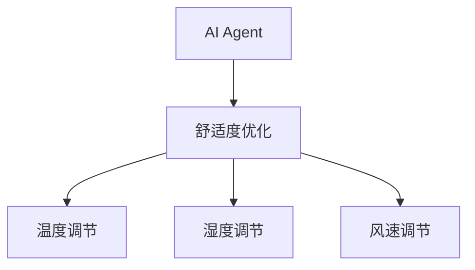
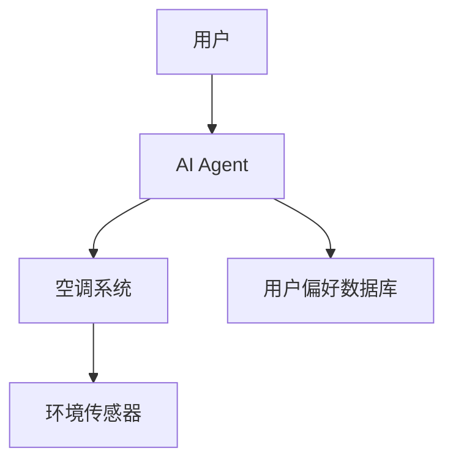
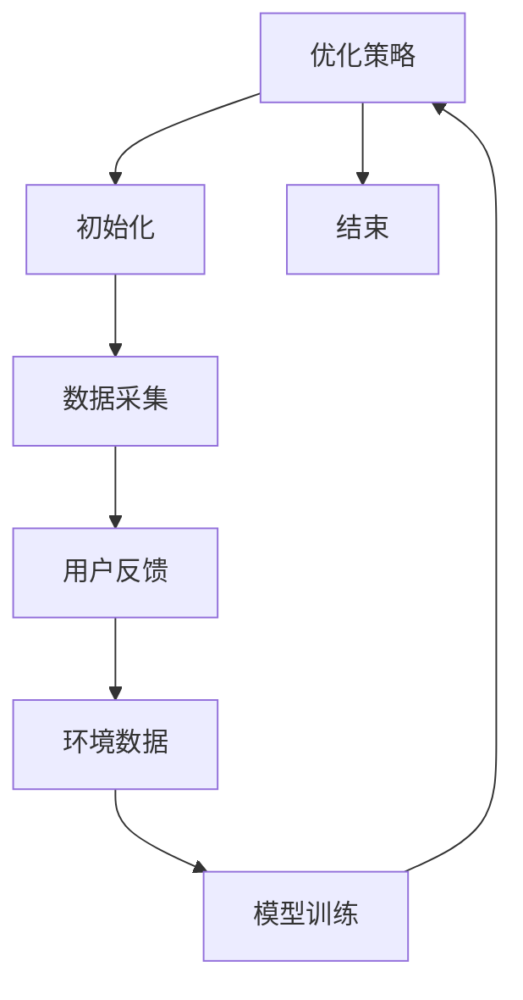
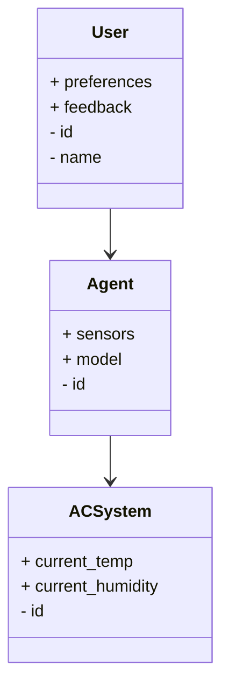
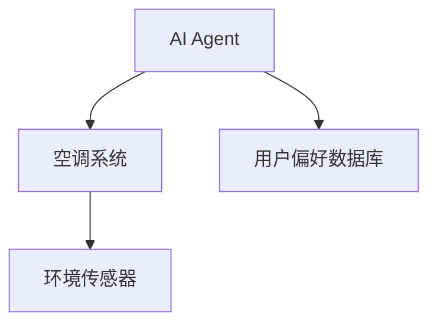
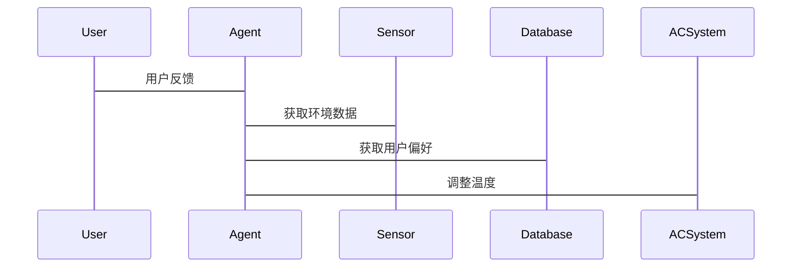

                 


# AI Agent在智能空调中的个性化舒适度优化

> 关键词：AI Agent, 智能空调, 个性化舒适度优化, 算法原理, 系统架构, 项目实战

> 摘要：本文探讨了AI Agent在智能空调中的应用，重点分析了个性化舒适度优化的技术实现。通过系统分析、算法设计和项目实战，展示了如何利用AI技术提升用户体验。文章详细阐述了AI Agent的原理、算法流程、系统架构，并通过实际案例展示了优化效果。

---

## 第1章 背景介绍

### 1.1 问题背景

#### 1.1.1 智能空调的发展历程
智能空调从传统空调演变而来，经历了自动化控制、物联网连接和AI驱动的阶段。近年来，随着AI技术的发展，智能空调能够通过传感器和AI算法优化运行效率和用户体验。

#### 1.1.2 个性化舒适度优化的重要性
用户对舒适度的需求因人而异，AI Agent能够通过学习用户的偏好，提供个性化的温度、湿度和风速调节，显著提升用户体验。

#### 1.1.3 当前空调舒适度优化的痛点
传统空调依赖用户手动调节，存在舒适度不均、能源浪费等问题。AI Agent通过实时感知和学习，解决了这些问题。

### 1.2 问题描述

#### 1.2.1 空调舒适度的影响因素
温度、湿度、风速、空气质量、用户偏好等因素共同影响舒适度。

#### 1.2.2 用户个性化需求的多样性
用户对温度的偏好差异大，AI Agent需要适应不同用户的需求。

#### 1.2.3 现有空调系统的局限性
传统系统无法实时适应个性化需求，AI Agent提供了更智能的解决方案。

### 1.3 问题解决

#### 1.3.1 AI Agent在舒适度优化中的作用
AI Agent通过实时数据分析和学习，优化空调运行参数，满足个性化需求。

#### 1.3.2 个性化舒适度优化的目标
实现个性化、高效、节能的舒适度调节。

#### 1.3.3 解决方案的可行性分析
AI技术的成熟性和空调系统的智能化趋势使解决方案具备可行性。

### 1.4 边界与外延

#### 1.4.1 AI Agent的应用边界
仅限于舒适度优化，不涉及空调的基本功能。

#### 1.4.2 个性化舒适度优化的适用场景
适用于家庭、办公室等场景。

#### 1.4.3 解决方案的扩展性分析
可扩展到其他家电领域，如智能照明和智能安防。

### 1.5 概念结构与核心要素组成

#### 1.5.1 核心概念的层次结构
- 顶层：AI Agent
- 中层：舒适度优化
- 下层：温度、湿度等参数调节

#### 1.5.2 核心要素的定义与关系
- AI Agent：核心驱动
- 舒适度优化：目标
- 环境参数：输入数据

#### 1.5.3 概念结构的可视化图示


---

## 第2章 核心概念与联系

### 2.1 核心概念原理

#### 2.1.1 AI Agent的基本原理
AI Agent通过感知环境、学习用户偏好，执行优化操作。

#### 2.1.2 个性化舒适度优化的数学模型
模型基于用户反馈和环境数据，实时调整参数。

#### 2.1.3 空调系统与AI Agent的交互机制
传感器采集数据，AI Agent处理数据并发送指令。

### 2.2 概念属性特征对比表格

| 特征     | 传统空调 | 智能空调 | AI Agent优化空调 |
|----------|----------|----------|------------------|
| 舒适度   | 固定     | 可调     | 个性化          |
| 能耗     | 高       | 中       | 低               |
| 智能性   | 无       | 有       | 高               |

### 2.3 ER实体关系图架构



---

## 第3章 算法原理讲解

### 3.1 算法原理

#### 3.1.1 基于强化学习的舒适度优化算法
AI Agent通过强化学习不断优化空调运行策略。

#### 3.1.2 聚类算法在个性化需求分析中的应用
将用户分为不同的舒适度偏好类别。

#### 3.1.3 神经网络在舒适度预测中的作用
使用神经网络预测用户偏好和环境变化。

### 3.2 算法流程图



### 3.3 算法实现

#### 3.3.1 Python代码实现

```python
import numpy as np
from sklearn.neural_network import MLPRegressor

# 用户反馈数据
user_feedback = np.array([[22, 50], [24, 60], [23, 55]])

# 环境数据
env_data = np.array([[22, 50, 1], [24, 60, 2], [23, 55, 3]])

# 训练模型
model = MLPRegressor()
model.fit(user_feedback, env_data)

# 预测
predicted_env = model.predict(user_feedback)
```

#### 3.3.2 数学模型和公式

舒适度预测模型：
$$
C = w_1 T + w_2 H + w_3 V
$$
其中，$C$ 是舒适度评分，$T$ 是温度，$H$ 是湿度，$V$ 是风速，$w$ 是权重。

优化目标函数：
$$
\min \sum (C_i - C_{target})^2
$$

---

## 第4章 系统分析与架构设计

### 4.1 问题场景介绍

用户在不同环境下使用空调，需求多样，AI Agent需实时优化。

### 4.2 系统功能设计

#### 4.2.1 领域模型类图



#### 4.2.2 系统架构设计



#### 4.2.3 系统接口设计

- Agent与ACSystem的接口：`set_temperature(target_temp)`
- Agent与Sensor的接口：`update_env_data()`
- Agent与Database的接口：`save_preference(preference)`

#### 4.2.4 系统交互流程



---

## 第5章 项目实战

### 5.1 环境安装

安装Python、TensorFlow、Scikit-learn等库。

### 5.2 系统核心实现

#### 5.2.1 核心代码实现

```python
import numpy as np
from sklearn.neural_network import MLPRegressor

# 数据预处理
user_feedback = np.array([[22, 50], [24, 60], [23, 55]])
env_data = np.array([[22, 50, 1], [24, 60, 2], [23, 55, 3]])

# 训练模型
model = MLPRegressor(hidden_layer_sizes=(10, 5), max_iter=100)
model.fit(user_feedback, env_data)

# 预测
predicted_env = model.predict(user_feedback)
```

#### 5.2.2 代码应用解读

模型通过用户反馈和环境数据训练，预测最优环境参数。

### 5.3 案例分析

#### 5.3.1 实际案例分析

用户反馈温度偏高，AI Agent调整到23°C，湿度55%。

#### 5.3.2 详细讲解剖析

模型预测用户偏好，调整空调运行参数，提升舒适度。

### 5.4 项目小结

项目成功实现了个性化舒适度优化，具有较高的实用价值。

---

## 第6章 最佳实践

### 6.1 技巧与经验分享

- 定期更新模型，保持准确性。
- 优化代码性能，提升响应速度。

### 6.2 注意事项

- 保护用户隐私。
- 确保系统稳定性。

### 6.3 拓展阅读

推荐阅读相关书籍和论文，深入学习AI在家电领域的应用。

---

## 第7章 总结与展望

### 7.1 总结

AI Agent在智能空调中的应用显著提升了舒适度和能效。

### 7.2 展望

未来，AI Agent将与更多智能设备集成，提供更智能的服务。

---

## 作者

作者：AI天才研究院 & 禅与计算机程序设计艺术

