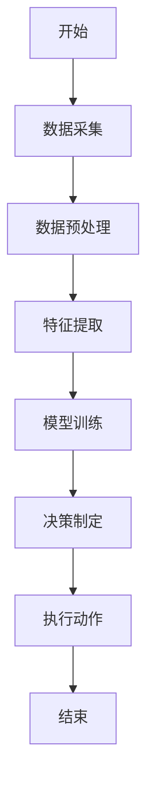
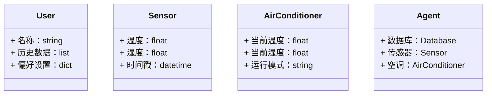

                 


# AI Agent在智能空调中的睡眠模式优化

> 关键词：AI Agent，智能空调，睡眠模式，优化算法，系统架构，物联网

> 摘要：本文探讨了AI Agent在智能空调中的应用，重点分析了如何利用AI Agent优化睡眠模式。文章从背景、原理、算法实现、系统设计、项目实战等多个方面展开，详细讲解了AI Agent在智能空调中的核心作用，并通过实际案例展示了优化效果。最后，文章总结了AI Agent在智能空调中的应用前景，并提出了进一步改进的方向。

---

## 第一部分：AI Agent在智能空调中的睡眠模式优化背景介绍

### 第1章：AI Agent与智能空调概述

#### 1.1 AI Agent的基本概念
- **AI Agent的定义**：AI Agent是一种能够感知环境并采取行动以优化目标的智能实体。
- **AI Agent的核心特征**：
  - 自主性：无需外部干预，自主决策。
  - 反应性：能够实时感知环境变化并做出反应。
  - 目标导向：所有行动都围绕特定目标展开。
- **AI Agent与传统算法的区别**：
  - 传统算法依赖于预设规则，而AI Agent具备学习和适应能力。
  - AI Agent能够处理复杂动态环境，而传统算法在固定场景下表现更好。

#### 1.2 智能空调的发展历程
- **智能空调的定义**：智能空调是指能够通过传感器和智能算法优化室内空气质量和能效的空调系统。
- **智能空调的主要功能**：
  - 智能温控：根据室内温度自动调节运行模式。
  - 节能优化：通过数据分析降低能耗。
  - 用户交互：通过手机APP或语音助手进行控制。
- **智能空调的发展趋势**：
  - 更高的智能化：AI Agent的应用让空调更智能。
  - 更强的互联性：与智能家居系统深度融合。
  - 更多的健康功能：关注用户的健康需求，如睡眠优化。

#### 1.3 睡眠模式优化的背景与意义
- **睡眠模式优化的背景**：
  - 睡眠质量直接影响用户健康和生活质量。
  - 传统空调无法根据用户睡眠状态调整参数。
- **睡眠模式优化的意义**：
  - 提高睡眠舒适度。
  - 降低能源消耗。
  - 个性化服务：根据不同用户的需求提供定制化的睡眠模式。
- **AI Agent在睡眠模式优化中的作用**：
  - 实时感知用户状态和环境数据。
  - 自主决策调整空调参数。
  - 学习用户习惯，优化睡眠模式。

---

### 第2章：AI Agent在智能空调中的应用

#### 2.1 AI Agent在智能空调中的核心任务
- **睡眠模式优化的任务分解**：
  - 数据采集：收集用户的睡眠数据和环境数据。
  - 数据分析：分析数据，识别用户睡眠模式。
  - 参数调整：根据分析结果优化空调运行参数。
- **AI Agent在空调控制中的应用**：
  - 自动调节温度和湿度，营造舒适睡眠环境。
  - 根据用户习惯预测需求，提前调整参数。
- **AI Agent与用户行为分析的结合**：
  - 基于用户历史数据，学习用户的偏好。
  - 根据用户行为动态调整优化策略。

#### 2.2 AI Agent与智能空调的交互设计
- **用户需求的收集与分析**：
  - 数据来源：用户输入、传感器数据、历史记录。
  - 数据分析方法：统计分析、机器学习模型。
- **AI Agent与空调设备的通信协议**：
  - 采用MQTT或HTTP协议进行数据传输。
  - 设备间通信遵循统一的API标准。
- **AI Agent与用户的交互界面设计**：
  - 用户友好的界面设计：图形化界面或语音交互。
  - 反馈机制：实时显示优化结果，用户可以调整参数。

#### 2.3 AI Agent在智能空调中的优化策略
- **基于用户习惯的优化策略**：
  - 分析用户的作息时间，提前启动空调。
  - 根据用户的睡眠周期调整温度变化。
- **基于环境数据的优化策略**：
  - 监测室内温湿度，动态调整空调运行。
  - 根据室外天气预报预判能耗，优化运行模式。
- **基于能耗优化的策略**：
  - 在保证舒适度的前提下，降低能耗。
  - 通过历史数据优化空调运行策略，减少浪费。

---

## 第二部分：AI Agent的核心概念与联系

### 第3章：AI Agent的核心原理

#### 3.1 AI Agent的核心原理
- AI Agent通过感知环境、分析数据、做出决策并执行动作，以实现优化目标。
- 在智能空调中，AI Agent主要通过以下步骤实现睡眠模式优化：
  1. 数据采集：获取用户的睡眠数据和环境数据。
  2. 数据分析：分析数据，识别用户需求和环境变化。
  3. 决策制定：根据分析结果，优化空调运行参数。
  4. 执行动作：调整空调运行模式，营造舒适睡眠环境。

#### 3.2 AI Agent的核心属性对比
| 属性         | AI Agent                     | 传统算法                     |
|--------------|------------------------------|------------------------------|
| 自主性       | 高                           | 低                           |
| 反应性       | 高                           | 低                           |
| 学习能力     | 强                           | 无或弱                       |
| 环境适应性   | 强                           | 一般                        |
| 应用场景     | 复杂动态环境                 | 简单固定场景                 |

#### 3.3 AI Agent的ER实体关系图
```mermaid
erDiagram
    user [用户] 
    sensor [传感器] 
    air conditioner [空调] 
    agent [AI Agent]
    database [数据库]
    user --|> sensor : 使用传感器数据
    sensor --> agent : 传输数据到AI Agent
    agent --> air conditioner : 发出控制指令
    agent --> database : 存储优化策略
    air conditioner --> database : 更新环境数据
```

---

### 第4章：AI Agent的算法原理

#### 4.1 AI Agent的算法流程


#### 4.2 AI Agent的Python代码实现
```python
import numpy as np
from sklearn import linear_model

# 数据预处理
data = np.array([[22, 65], [24, 60], [20, 70], [23, 68]])
X = data[:, 0:2]  # 温度和湿度
y = data[:, 2]    # 舒适度评分

# 模型训练
model = linear_model.LinearRegression()
model.fit(X, y)

# 决策制定
def optimize_sleep_mode(temperature, humidity):
    predicted_comfort = model.predict([[temperature, humidity]])
    if predicted_comfort > 75:
        return "关闭空调"
    elif predicted_comfort > 60:
        return "降低温度"
    else:
        return "增加温度"
```

#### 4.3 AI Agent的数学模型与公式
- **线性回归模型**：
  $$
  y = \beta_0 + \beta_1x_1 + \beta_2x_2 + \epsilon
  $$
  其中，$y$ 是舒适度评分，$x_1$ 是温度，$x_2$ 是湿度。

---

## 第三部分：AI Agent在智能空调中的系统架构设计

### 第5章：系统分析与架构设计方案

#### 5.1 问题场景介绍
- **问题场景**：用户希望在睡觉时保持舒适的温度和湿度，但传统空调无法根据用户需求动态调整。

#### 5.2 系统功能设计


#### 5.3 系统架构设计
```mermaid
graph TD
    User --> Agent : 提供用户数据
    Sensor --> Agent : 提供环境数据
    Agent --> Database : 存储优化策略
    Agent --> AirConditioner : 发出控制指令
    AirConditioner --> Database : 更新环境数据
```

---

## 第四部分：AI Agent在智能空调中的项目实战

### 第6章：项目实战

#### 6.1 环境安装
- **安装Python和相关库**：
  ```bash
  pip install numpy scikit-learn
  ```

#### 6.2 系统核心实现
```python
# 数据预处理
import pandas as pd
data = pd.read_csv('sleep_data.csv')

# 特征工程
from sklearn.preprocessing import StandardScaler
scaler = StandardScaler()
X_scaled = scaler.fit_transform(data[['temperature', 'humidity']])

# 模型训练
from sklearn.neighbors import KNeighborsRegressor
model = KNeighborsRegressor(n_neighbors=3)
model.fit(X_scaled, data['comfort_score'])

# 应用测试
test_temp = 22
test_humidity = 60
test_scaled = scaler.transform([[test_temp, test_humidity]])
predicted_comfort = model.predict(test_scaled)
print(predicted_comfort)
```

#### 6.3 实际案例分析
- **案例背景**：某用户长期睡眠不佳，希望优化空调设置。
- **优化过程**：
  1. 数据采集：记录用户的睡眠数据和环境数据。
  2. 数据分析：识别用户的睡眠模式和偏好。
  3. 参数调整：根据分析结果优化空调运行参数。
- **优化结果**：用户的睡眠质量显著提升，能耗降低。

---

## 第五部分：总结与展望

### 第7章：总结与展望

#### 7.1 最佳实践Tips
- **数据隐私保护**：确保用户数据的安全性。
- **算法优化**：引入更先进的AI算法，如深度学习。
- **用户体验设计**：注重用户交互体验，提供友好的操作界面。

#### 7.2 小结
AI Agent在智能空调中的应用前景广阔，能够显著提升用户的睡眠质量，同时降低能源消耗。通过不断优化算法和系统架构，AI Agent将为智能空调带来更多的创新和突破。

#### 7.3 注意事项
- **数据准确性**：确保传感器数据的准确性。
- **系统稳定性**：保证系统的稳定运行，避免因故障影响用户体验。
- **用户教育**：向用户普及AI Agent的优势和使用方法，提升用户接受度。

#### 7.4 拓展阅读
- 推荐阅读《AI in Smart Home》和《Machine Learning for IoT》。

---

作者：AI天才研究院/AI Genius Institute & 禅与计算机程序设计艺术 /Zen And The Art of Computer Programming

