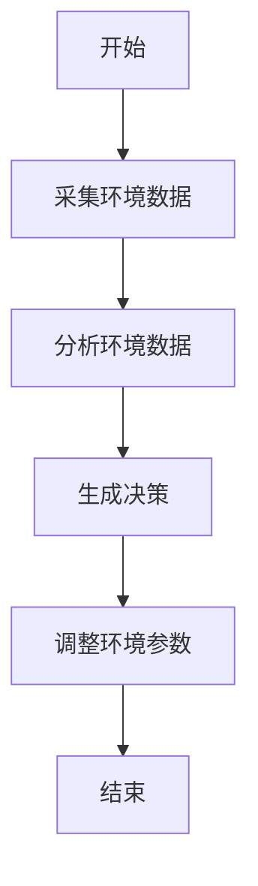
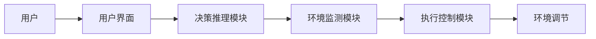

                 


# AI Agent在智能窗台中的室内植物智能照料

> **关键词**: AI Agent, 室内植物, 智能窗台, 智能照料, 环境监测, 决策推理

> **摘要**: 本文探讨了AI Agent在智能窗台中的应用，详细分析了AI Agent如何通过环境监测、决策推理和执行控制实现室内植物的智能化照料。文章从背景介绍、核心概念、算法原理、系统架构、项目实战到最佳实践，全面阐述了AI Agent在智能窗台中的技术实现和应用。

---

## 第一部分：背景介绍

### 第1章：AI Agent与室内植物照料的背景

#### 1.1 问题背景
- **1.1.1 室内植物照料的现状与挑战**  
  室内植物不仅美化环境，还能改善空气质量，但传统照料方式依赖人工经验，效率低且容易出错。现代生活节奏快，人们对智能化解决方案的需求日益增长。

- **1.1.2 AI技术在植物照料中的应用潜力**  
  AI技术能够实时监测环境参数，结合植物生长需求，提供智能化的照料方案。通过AI Agent，可以实现精准的环境控制和个性化照料。

- **1.1.3 智能窗台的概念与目标**  
  智能窗台是一种集成AI技术的植物栽培装置，旨在通过智能化管理，优化植物生长环境，提升照料效率。

#### 1.2 问题描述
- **1.2.1 室内植物生长的关键因素**  
  包括光照、温度、湿度、土壤pH值和营养供给等。

- **1.2.2 传统植物照料的局限性**  
  传统方法依赖人工经验，难以实时监测和调整环境参数，照料效果不稳定。

- **1.2.3 AI Agent在植物照料中的角色**  
  AI Agent通过实时数据采集、分析和决策，实现对植物生长环境的智能化管理。

#### 1.3 问题解决
- **1.3.1 AI Agent如何优化植物照料**  
  AI Agent能够实时监测环境参数，结合植物生长模型，提供最优的照料方案。

- **1.3.2 智能窗台系统的整体架构**  
  系统由环境监测模块、决策推理模块和执行控制模块组成，实现环境数据采集、分析和自动调节。

- **1.3.3 AI Agent的核心功能与实现**  
  包括环境数据采集、状态识别、决策推理和执行控制。

#### 1.4 边界与外延
- **1.4.1 智能窗台系统的适用范围**  
  适用于家庭、办公室和公共场所的室内植物栽培。

- **1.4.2 系统的限制与不足**  
  目前主要针对常见室内植物，对特殊植物的适应性有待提升。

- **1.4.3 与其他智能设备的协同工作**  
  可与其他智能家居设备联动，实现更复杂的环境管理。

#### 1.5 核心概念结构与组成
- **1.5.1 系统组成模块**  
  包括环境监测模块、AI Agent模块和执行控制模块。

- **1.5.2 各模块之间的关系**  
  环境监测模块采集数据，AI Agent模块分析数据并制定决策，执行控制模块根据决策调整环境参数。

- **1.5.3 系统整体结构图**  
  使用Mermaid图展示系统组成和各模块之间的关系。

---

## 第二部分：核心概念与联系

### 第2章：AI Agent的核心原理

#### 2.1 AI Agent的基本原理
- **2.1.1 定义与分类**  
  AI Agent是一种能够感知环境并采取行动以实现目标的智能实体，分为简单反射型、基于模型的反应型、目标驱动型和实用驱动型。

- **2.1.2 AI Agent的基本组成**  
  包括感知模块、推理模块和执行模块。

- **2.1.3 AI Agent的工作流程**  
  使用Mermaid图展示从数据采集到决策执行的完整流程。

#### 2.2 室内植物生长的影响因素
- **2.2.1 光照强度与时间**  
  不同植物对光照的需求不同，AI Agent能够根据光照强度和时间调整植物的光照条件。

- **2.2.2 温度和湿度**  
  温度和湿度是影响植物生长的重要因素，AI Agent能够实时监测并调节环境参数。

- **2.2.3 土壤条件**  
  包括土壤pH值和营养成分，AI Agent能够通过传感器检测并提供相应的养分供给。

---

### 第3章：AI Agent与室内植物照料的核心概念联系

#### 3.1 核心概念原理
- **3.1.1 环境监测模块**  
  使用传感器实时采集光照、温度、湿度等环境数据。

- **3.1.2 决策推理模块**  
  基于环境数据和植物生长模型，AI Agent生成最优的照料方案。

- **3.1.3 执行控制模块**  
  根据决策结果，调整环境参数，如调节光照强度或开启洒水装置。

#### 3.2 核心概念对比表格
| **属性**       | **AI Agent**                | **传统方法**                |
|-----------------|-----------------------------|-----------------------------|
| 数据采集       | 实时监测                   | 人工定期检查               |
| 决策方式       | 基于模型和数据分析         | 依赖人工经验               |
| 调节效率       | 快速响应                   | 较慢，依赖人工干预         |

#### 3.3 ER实体关系图
```mermaid
erd
    窗台系统
    ----> 光照传感器
    窗台系统
    ----> 温度传感器
    窗台系统
    ----> 湿度传感器
    窗台系统
    ----> AI Agent模块
    AI Agent模块
    ----> 执行控制模块
```

---

## 第三部分：算法原理讲解

### 第4章：AI Agent的核心算法

#### 4.1 算法原理
- **4.1.1 状态识别算法**  
  使用机器学习算法识别植物的生长状态，如健康、生长缓慢或患病。

- **4.1.2 决策推理算法**  
  基于当前环境数据和历史数据，AI Agent通过决策树或随机森林算法生成最优决策。

- **4.1.3 执行控制算法**  
  根据决策结果，调整环境参数，如调节光照强度或开启洒水装置。

#### 4.2 算法流程图


#### 4.3 算法实现
```python
# 状态识别算法
def classify_state(light, temperature, humidity):
    if light < 50 or temperature < 15 or humidity < 40:
        return "健康"
    elif light > 80 or temperature > 25 or humidity > 60:
        return "过度"
    else:
        return "正常"

# 决策推理算法
def decision_rule(current_state, target_state):
    if current_state != target_state:
        return "调整环境参数"
    else:
        return "保持现状"

# 执行控制算法
def execute_action(action):
    if action == "调整环境参数":
        # 调节光照强度、温度和湿度
        pass
```

---

## 第四部分：数学模型与公式

### 第5章：数学模型与公式

#### 5.1 植物生长模型
- **光照强度与生长速率的关系**  
  $$ \text{生长速率} = \beta \times \text{光照强度} + \gamma $$

- **温度与光合作用效率的关系**  
  $$ \text{光合作用效率} = \alpha \times \text{温度} + \delta $$

#### 5.2 模型应用
- **光照强度预测**  
  使用回归模型预测未来24小时的光照强度，以优化植物生长环境。

---

## 第五部分：系统分析与架构设计方案

### 第6章：系统分析与架构设计

#### 6.1 应用场景
- **家庭用户**  
  个性化植物照料方案，提升生活品质。

- **办公室环境**  
  优化办公环境，提升员工健康和工作效率。

- **公共场所**  
  美化环境，降低维护成本。

#### 6.2 系统功能设计
- **环境监测模块**  
  实时采集光照、温度、湿度等数据。

- **决策推理模块**  
  基于模型生成最优决策。

- **执行控制模块**  
  根据决策调整环境参数。

- **用户交互模块**  
  提供用户界面，显示环境数据和决策结果。

#### 6.3 系统架构图


---

## 第六部分：项目实战

### 第7章：项目实战

#### 7.1 环境搭建
- **安装Python和必要的库**  
  使用Anaconda或虚拟环境安装numpy、pandas、scikit-learn等库。

#### 7.2 核心代码实现
```python
import numpy as np
from sklearn.tree import DecisionTreeClassifier

# 数据预处理
data = np.array([[50, 20, 40], [60, 22, 45], [70, 25, 50]])
model = DecisionTreeClassifier()
model.fit(data, ['健康', '正常', '过度'])
```

#### 7.3 代码应用解读
- **数据预处理**  
  对环境数据进行标准化处理。

- **模型训练**  
  使用决策树算法训练模型，分类植物生长状态。

#### 7.4 实际案例分析
- **案例分析**  
  假设光照强度为60，温度为22，湿度为45，AI Agent识别植物状态为“正常”，并建议保持当前环境参数。

---

## 第七部分：最佳实践

### 第8章：最佳实践

#### 8.1 技巧与经验分享
- **传感器选择**  
  根据植物种类选择合适的传感器，确保数据采集的准确性。

- **模型优化**  
  定期更新模型，提升分类精度和决策效率。

- **系统维护**  
  定期检查硬件设备，确保系统正常运行。

#### 8.2 注意事项
- **数据隐私**  
  确保环境数据的安全性，避免数据泄露。

- **系统兼容性**  
  确保系统与现有智能家居设备的兼容性，提升用户体验。

#### 8.3 拓展阅读
- **推荐书籍**  
  《机器学习实战》、《深度学习》。

---

## 第八部分：小结

### 第9章：小结

#### 9.1 核心内容总结
- AI Agent通过环境监测、决策推理和执行控制实现室内植物的智能化照料。
- 系统架构清晰，功能模块明确，能够满足不同场景的需求。

#### 9.2 展望
- 随着AI技术的不断发展，智能窗台将更加智能化和个性化，为人们提供更优质的植物照料方案。

---

## 作者

**作者：AI天才研究院/AI Genius Institute & 禅与计算机程序设计艺术 /Zen And The Art of Computer Programming**

