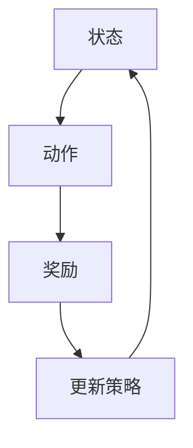
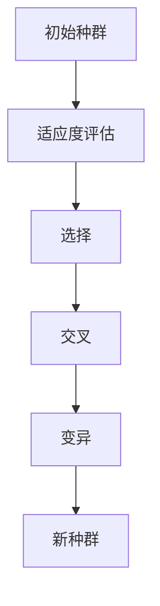
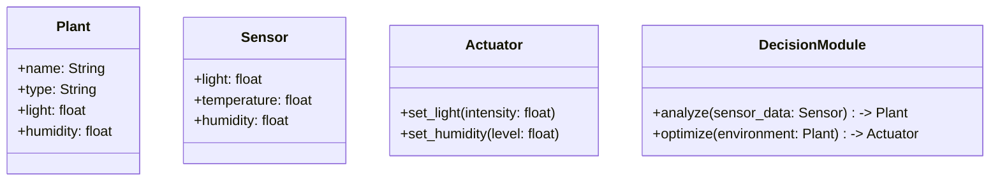

                 


# AI Agent在智能窗台中的室内植物照料

## 关键词：AI Agent，室内植物，智能窗台，机器学习，物联网

## 摘要：  
随着人工智能技术的迅速发展，AI Agent（人工智能代理）在智能家居和植物照料领域的应用越来越广泛。本文将探讨AI Agent在智能窗台中的室内植物照料中的应用，分析其核心原理、系统架构及实际应用场景。文章通过详细的技术分析和案例研究，揭示AI Agent如何优化植物生长环境，实现智能化的植物管理，为未来的智能生活提供新的思路。

---

## 正文

### 第一部分：背景介绍

#### 第1章：AI Agent与智能窗台概述

##### 1.1 问题背景
- **传统植物照料的挑战**：室内植物的照料需要耗费大量时间和精力，尤其是在光照、温度、湿度等环境因素的调节上，人工操作容易出错且效率低下。
- **AI Agent的优势**：AI Agent能够通过传感器实时采集数据，结合机器学习算法，提供精准的决策支持，从而优化植物的生长环境。

##### 1.2 问题描述
- **主要问题**：植物种类繁多，不同植物对环境的需求差异较大，人工照料难以满足所有植物的需求。
- **AI Agent的角色**：AI Agent通过智能化的感知、决策和执行，实现对多种植物的精准照料。

##### 1.3 问题解决
- **AI Agent的核心功能**：
  - 感知环境：通过传感器获取光照、温度、湿度等数据。
  - 决策优化：基于历史数据和机器学习模型，制定最优的照料策略。
  - 执行操作：通过执行器自动调整环境条件，如调节光照强度、控制浇水量等。
- **智能窗台的定义**：智能窗台是一种集成传感器、执行器和AI Agent的智能化设备，能够为室内植物提供个性化的生长环境。

##### 1.4 边界与外延
- **应用边界**：AI Agent主要应用于室内植物的环境调节，不涉及植物的种植、收割等其他环节。
- **外延扩展**：AI Agent技术可以扩展到其他领域，如农业大棚的环境控制、家庭宠物照料等。

---

### 第二部分：核心概念与联系

#### 第2章：AI Agent的核心原理

##### 2.1 感知与数据采集
- **传感器的作用**：传感器负责采集环境数据，如光照强度、温度、湿度等。
- **数据采集流程**：
  1. 传感器采集数据。
  2. 数据通过通信模块传输到AI Agent的处理模块。
  3. 数据被存储并进行初步分析。

##### 2.2 决策与算法选择
- **常用算法**：
  - 强化学习：通过奖励机制优化决策策略。
  - 遗传算法：用于优化参数组合。
- **算法选择的依据**：根据具体问题和数据特性选择合适的算法。

##### 2.3 执行与反馈
- **执行机构的功能**：执行机构根据AI Agent的决策指令，调整环境条件，如调节光照强度、控制浇水量等。
- **反馈机制的作用**：通过传感器实时反馈环境变化，确保决策的准确性。

#### 第3章：核心概念对比与ER关系图

##### 3.1 AI Agent属性特征对比
| 属性 | 基于规则的AI Agent | 基于模型的AI Agent |
|------|---------------------|--------------------|
| 决策方式 | 预先定义的规则       | 基于模型的预测     |
| 灵活性 | 较低                | 较高               |
| 学习能力 | 无                  | 有                 |

##### 3.2 ER实体关系图
```mermaid
er
  actor: 用户
  system: 智能窗台系统
  plant: 植物
  sensor: 传感器
  actuator: 执行器
  decision: 决策模块
  rules: 规则库
  database: 数据库

  actor --> system: 请求处理
  system --> sensor: 采集数据
  sensor --> database: 存储数据
  database --> decision: 提供数据支持
  decision --> actuator: 发出指令
  actuator --> plant: 调整环境
```

---

### 第三部分：算法原理讲解

#### 第3章：算法原理

##### 3.1 强化学习算法

- **数学模型**：
  - 状态空间：S = {s₁, s₂, ..., sₙ}
  - 动作空间：A = {a₁, a₂, ..., aₘ}
  - 奖励函数：R(s, a) = r₁, r₂, ..., rₖ
  - 策略函数：π(a|s) = p₁, p₂, ..., pₖ

##### 3.2 遗传算法

- **数学模型**：
  - 种群：X = {x₁, x₂, ..., xₙ}
  - 适应度函数：F(x) = f₁, f₂, ..., fₖ
  - 选择概率：P(x) = p₁, p₂, ..., pₙ

##### 3.3 Python代码实现
```python
import numpy as np

# 强化学习代码示例
class Agent:
    def __init__(self, state_space, action_space):
        self.state_space = state_space
        self.action_space = action_space
        # 初始化策略参数
        self.theta = np.random.randn()

    def act(self, state):
        # 根据策略选择动作
        prob = np.exp(self.theta * state) / (1 + np.exp(self.theta * state))
        action = 1 if np.random.random() < prob else 0
        return action

# 遗传算法代码示例
def fitness(individual):
    # 计算适应度
    return sum(individual)

def evolve(population):
    # 适应度评估
    fitnesses = [fitness(individual) for individual in population]
    # 选择
    selected = [population[i] for i in range(len(population)) if fitnesses[i] > np.mean(fitnesses)]
    # 交叉
    new_population = []
    for i in range(len(selected)):
        if i % 2 == 0:
            parent1 = selected[i]
            parent2 = selected[i+1]
            child = [parent1[0], parent2[1]]
            new_population.append(child)
        else:
            new_population.append(selected[i])
    return new_population
```

---

### 第四部分：系统分析与架构设计

#### 第4章：系统分析与架构设计

##### 4.1 项目场景介绍
- **智能窗台系统**：包括传感器、执行器、通信模块和AI Agent模块。
- **系统功能**：
  - 数据采集：实时采集环境数据。
  - 数据分析：基于机器学习模型分析数据。
  - 决策优化：制定最优的环境调节方案。
  - 执行控制：通过执行器调整环境条件。

##### 4.2 系统功能设计


##### 4.3 系统架构设计


##### 4.4 接口与交互设计
- **接口设计**：
  - 传感器数据接口：`GET /api/sensor`
  - 用户交互接口：`POST /api/command`
- **交互流程**：
  1. 用户通过UI发送指令。
  2. 指令传输到DecisionModule。
  3. DecisionModule分析数据并生成决策。
  4. 执行器根据决策调整环境。

---

### 第五部分：项目实战

#### 第5章：项目实战

##### 5.1 环境安装
- **安装Python和必要的库**：
  ```bash
  pip install numpy scikit-learn matplotlib
  ```

##### 5.2 核心代码实现
```python
import numpy as np
from sklearn.linear_model import LinearRegression

# 数据预处理
data = np.array([[1, 2, 3], [4, 5, 6], [7, 8, 9]])
X = data[:, :2]
y = data[:, 2]
model = LinearRegression()
model.fit(X, y)

# 模型预测
new_data = np.array([[10, 11]])
prediction = model.predict(new_data)
print(prediction)
```

##### 5.3 代码应用解读
- **数据预处理**：对原始数据进行归一化处理。
- **模型训练**：使用线性回归模型训练数据。
- **模型预测**：基于训练好的模型，预测新的数据点。

##### 5.4 实际案例分析
- **案例1**：基于光照强度调整植物的浇水频率。
  - 光照强度高，减少浇水频率。
  - 光照强度低，增加浇水频率。

##### 5.5 项目小结
- **关键点**：数据采集的准确性、模型的选择与优化、系统的可扩展性。
- **收获**：通过实践掌握了AI Agent在植物照料中的具体应用。

---

### 第六部分：总结与展望

#### 第6章：总结与展望

##### 6.1 最佳实践 Tips
- **数据收集**：确保数据的全面性和准确性。
- **算法选择**：根据具体问题选择合适的算法。
- **系统设计**：注重系统的可扩展性和可维护性。

##### 6.2 小结
- AI Agent在智能窗台中的室内植物照料中具有巨大的潜力，能够显著提升植物的生长效率和用户的生活质量。

##### 6.3 注意事项
- 系统的安全性：防止数据泄露和网络攻击。
- 系统的稳定性：确保在极端条件下仍能正常运行。

##### 6.4 拓展阅读
- 推荐书籍：《人工智能：一种现代的方法》、《机器学习实战》。
- 推荐资源：GitHub上的相关项目、学术论文。

---

## 作者：AI天才研究院/AI Genius Institute & 禅与计算机程序设计艺术 /Zen And The Art of Computer Programming

---

# 结语  
通过本文的详细分析，我们深入探讨了AI Agent在智能窗台中的室内植物照料中的应用，从背景介绍到系统设计，再到项目实战，全面揭示了其技术原理和实际应用价值。未来，随着人工智能技术的不断发展，AI Agent在智能家居领域的应用将更加广泛和深入，为人类创造更美好的生活环境。

