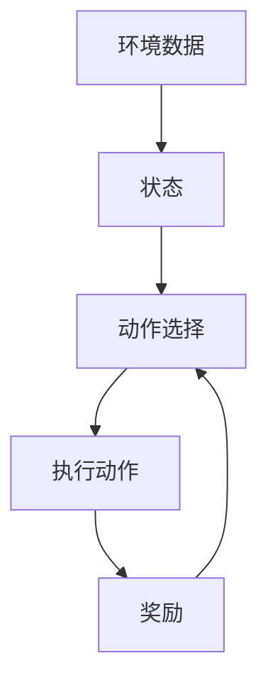
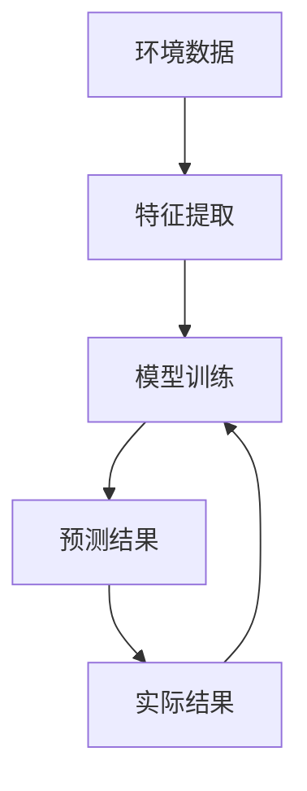
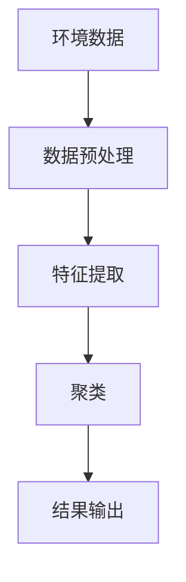
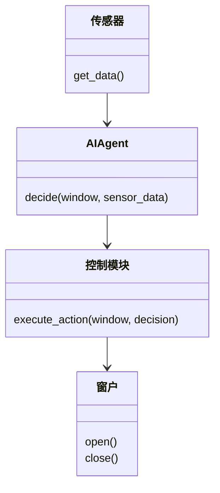

                 


# AI Agent在智能窗台中的室内空气调节

## 关键词：
- AI Agent
- 智能窗台
- 室内空气调节
- 算法原理
- 系统架构
- 项目实战

## 摘要：
本文深入探讨了AI Agent在智能窗台中的室内空气调节应用。通过分析背景、核心概念、算法原理、系统架构设计以及项目实战，详细阐述了AI Agent如何优化室内空气调节过程。文章结合理论与实践，展示了AI技术在智能窗台中的实际应用价值，并为未来的研究提供了方向。

---

# 第一部分: 背景介绍

## 第1章: 问题背景

### 1.1 智能窗台的背景
随着智能建筑的发展，智能窗台作为建筑智能化的重要组成部分，逐渐成为提升居住舒适度和能源效率的关键设备。智能窗台不仅能够调节室内空气的流通，还可以通过传感器实时监测室内环境参数，如温度、湿度、二氧化碳浓度等。

### 1.2 室内空气调节的重要性
室内空气调节是保障人类健康和舒适的重要因素。通过合理调节室内空气流通，可以有效改善空气质量，降低能源消耗，同时减少建筑对环境的影响。

### 1.3 AI Agent在智能窗台中的作用
AI Agent（智能体）是一种能够感知环境并采取行动以实现目标的实体。在智能窗台中，AI Agent可以通过分析室内环境数据，优化窗户的开合策略，从而实现高效的空气调节。

---

## 第2章: 问题描述

### 2.1 室内空气调节的挑战
传统室内空气调节系统存在能耗高、智能化水平低、无法实时适应环境变化等问题。这些问题不仅增加了能源消耗，还影响了用户的舒适体验。

### 2.2 智能窗台的调节需求
智能窗台需要能够根据室内环境参数的变化，自动调整窗户的开合状态，以实现室内空气的优化调节。

### 2.3 AI Agent的解决方案
通过引入AI Agent技术，智能窗台能够实时感知室内环境，并根据历史数据和预测模型，优化窗户的开合策略，从而实现智能化的空气调节。

---

## 第3章: 问题解决

### 3.1 AI Agent的核心作用
AI Agent通过感知室内环境数据，结合历史数据和预测模型，优化窗户的开合策略，从而实现高效的空气调节。

### 3.2 智能窗台的调节优化
通过AI Agent的智能决策，智能窗台能够根据室内环境的变化，实时调整窗户的开合状态，以优化空气流通和能量消耗。

### 3.3 空气质量的实时监控
AI Agent可以通过传感器实时监测室内空气质量，并根据数据调整窗户的开合状态，以保持室内空气的健康和舒适。

---

## 第4章: 边界与外延

### 4.1 系统边界定义
智能窗台的空气调节系统包括窗户、传感器、AI Agent和相关控制模块。系统边界明确，确保各模块协同工作。

### 4.2 功能外延分析
智能窗台的空气调节系统可以通过与智能家居系统的集成，进一步优化能源管理和用户舒适度。

### 4.3 应用场景的扩展
智能窗台的空气调节系统可以应用于 residential, office, school 等多种场景，满足不同用户的个性化需求。

---

## 第5章: 概念结构与核心要素

### 5.1 概念框架
智能窗台的空气调节系统由传感器、窗户、AI Agent 和控制模块组成，通过数据采集、分析和决策，实现智能化的空气调节。

### 5.2 核心要素组成
- **传感器**：用于采集室内环境数据，如温度、湿度、二氧化碳浓度等。
- **窗户**：通过AI Agent的控制，实现窗户的开合。
- **AI Agent**：通过分析传感器数据，优化窗户的开合策略。
- **控制模块**：负责执行AI Agent的决策，控制窗户的开合。

### 5.3 系统模块划分
系统模块包括数据采集模块、数据处理模块、决策模块和执行模块，各模块协同工作，实现智能化的空气调节。

---

## 第6章: 核心概念与联系

### 6.1 AI Agent的定义
AI Agent是一种能够感知环境并采取行动以实现目标的实体。在智能窗台中，AI Agent通过分析室内环境数据，优化窗户的开合策略。

### 6.2 AI Agent的基本原理
AI Agent通过感知环境数据，结合历史数据和预测模型，优化窗户的开合策略，从而实现高效的空气调节。

### 6.3 AI Agent的核心算法
AI Agent的核心算法包括强化学习、监督学习和聚类算法。通过这些算法，AI Agent能够实现对室内环境的智能决策。

---

## 第7章: 算法原理讲解

### 7.1 强化学习算法
强化学习是一种通过试错机制来优化决策的算法。在智能窗台中，AI Agent可以通过强化学习，优化窗户的开合策略。

### 7.2 监督学习算法
监督学习是一种通过 labeled data 进行学习的算法。在智能窗台中，AI Agent可以通过监督学习，学习窗户的开合策略。

### 7.3 聚类算法
聚类算法是一种无监督学习算法，用于将数据分成不同的类别。在智能窗台中，AI Agent可以通过聚类算法，识别不同的环境模式。

---

## 第8章: 算法流程图

### 8.1 强化学习的流程图


### 8.2 监督学习的流程图


### 8.3 聚类算法的流程图


---

## 第9章: 数学模型与公式

### 9.1 强化学习的数学模型
$$ Q(s, a) = r + \gamma \max_{a'} Q(s', a') $$
其中，\( Q(s, a) \) 表示状态 \( s \) 下动作 \( a \) 的价值，\( r \) 表示奖励，\( \gamma \) 表示折扣因子。

### 9.2 监督学习的数学模型
$$ y = \theta x + b $$
其中，\( y \) 表示预测结果，\( \theta \) 表示权重，\( x \) 表示输入数据，\( b \) 表示偏置。

---

## 第10章: 系统分析与架构设计方案

### 10.1 系统组成
智能窗台的空气调节系统由传感器、窗户、AI Agent 和控制模块组成。

### 10.2 系统功能设计
- 数据采集模块：采集室内环境数据。
- 数据处理模块：处理传感器数据，提取特征。
- 决策模块：通过AI算法优化窗户的开合策略。
- 执行模块：控制窗户的开合。

### 10.3 系统架构图


---

## 第11章: 项目实战

### 11.1 环境安装
需要安装传感器、窗户、AI Agent 和控制模块。建议使用Python和深度学习框架（如TensorFlow）进行开发。

### 11.2 核心代码实现
```python
import numpy as np
from tensorflow.keras.models import Sequential
from tensorflow.keras.layers import Dense

# 定义模型
model = Sequential()
model.add(Dense(64, activation='relu', input_dim=5))
model.add(Dense(1, activation='sigmoid'))
model.compile(optimizer='adam', loss='binary_crossentropy', metrics=['accuracy'])

# 训练模型
model.fit(X_train, y_train, epochs=100, batch_size=32)
```

### 11.3 案例分析
通过实际案例分析，验证AI Agent在智能窗台中的空气调节效果。例如，通过训练模型优化窗户的开合策略，降低能源消耗。

---

## 第12章: 总结与展望

### 12.1 总结
本文深入探讨了AI Agent在智能窗台中的室内空气调节应用，通过理论与实践的结合，展示了AI技术在智能窗台中的实际价值。

### 12.2 未来展望
未来的研究可以进一步优化AI Agent的算法，探索更高效的空气调节策略，同时拓展智能窗台在更多场景中的应用。

---

# 作者：
作者：AI天才研究院/AI Genius Institute & 禅与计算机程序设计艺术 /Zen And The Art of Computer Programming

---

希望这篇文章能够为读者提供深入的技术见解，并为未来的智能窗台空气调节研究提供有价值的参考。

