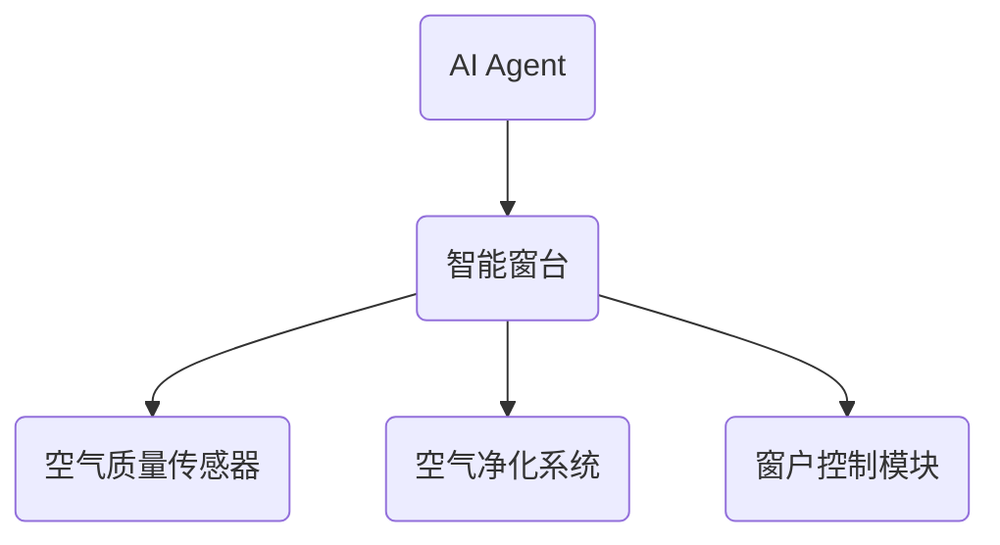
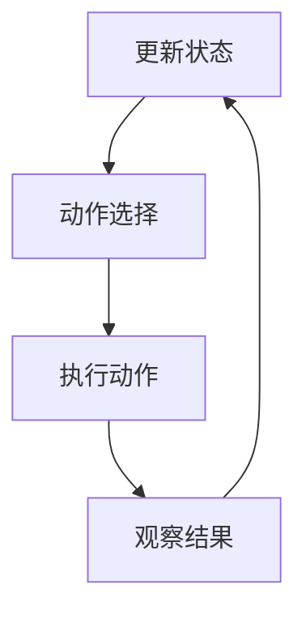
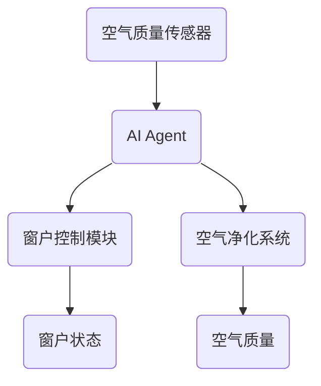

                 


# AI Agent在智能窗台中的室内空气质量优化

> 关键词：AI Agent, 智能窗台, 室内空气质量优化, 强化学习, 反馈机制, 智能系统架构

> 摘要：本文详细探讨了AI Agent在智能窗台中的应用，特别是在优化室内空气质量方面。通过分析AI Agent的核心概念、算法原理、系统架构以及实际项目案例，展示了如何利用AI技术实现智能化的空气质量优化。文章还提供了代码实现和系统设计的详细步骤，为读者提供全面的技术指导。

---

# 引言

随着人们对居住环境要求的不断提高，室内空气质量优化成为智能化建筑的重要组成部分。智能窗台作为一种创新的建筑元素，结合AI Agent技术，能够实时感知并优化室内空气质量。本文将从背景、原理到实际应用，系统地介绍AI Agent在智能窗台中的优化策略。

---

## 第一章：背景介绍

### 1.1 问题背景

室内空气质量直接影响居住者的健康和舒适度。传统方法依赖人工操作，存在效率低、实时性差的问题。AI Agent通过智能化感知和决策，能够实时优化空气质量，提升居住体验。

### 1.2 问题描述

智能窗台需解决的主要问题包括：
- 实时监测室内空气质量
- 自动调节窗户和净化系统以优化空气质量
- 处理多变的外部环境和用户需求

### 1.3 问题解决

AI Agent通过以下方式优化空气质量：
- 实时感知室内空气质量参数
- 基于数据的智能决策
- 自动控制窗户和净化设备

### 1.4 边界与外延

明确AI Agent在智能窗台中的应用边界，包括数据采集范围、决策范围等。同时，扩展讨论AI Agent在其他建筑设备中的应用潜力。

---

## 第二章：AI Agent的核心概念与原理

### 2.1 AI Agent的定义与特点

AI Agent是一种智能体，能够感知环境、做出决策并执行操作。其特点包括自主性、反应性、目标导向和学习能力。

### 2.2 室内空气质量优化的核心原理

空气质量优化基于实时监测和智能调节，结合AI算法实现最优控制。

### 2.3 AI Agent与智能窗台的实体关系图



---

## 第三章：算法原理讲解

### 3.1 强化学习算法

强化学习通过奖励机制优化决策。例如，Q-learning算法：



数学模型：
$$ Q(s, a) = Q(s, a) + \alpha [r + \max Q(s', a') - Q(s, a)] $$

### 3.2 反馈机制实现

通过空气质量传感器反馈数据，调整AI Agent的决策策略。代码示例如下：

```python
class AI_Agent:
    def __init__(self):
        self.q_table = {}  # Q值表

    def get_action(self, state):
        if state not in self.q_table:
            self.q_table[state] = 0
        max_action = max(self.q_table.items(), key=lambda x: x[1])[0]
        return max_action

    def update_q_table(self, state, action, reward, next_state):
        current_q = self.q_table.get((state, action), 0)
        next_max_q = max(self.q_table.get(next_state, 0), default=0)
        self.q_table[(state, action)] = current_q + alpha * (reward + next_max_q - current_q)
```

---

## 第四章：系统分析与架构设计

### 4.1 项目背景

智能窗台空气质量优化系统旨在提升室内空气质量，改善居住舒适度。

### 4.2 系统功能设计

功能模块包括空气质量监测、AI决策、窗户控制和空气净化系统。

### 4.3 系统架构设计



### 4.4 系统接口设计

定义API接口，实现传感器数据获取和设备控制。

---

## 第五章：项目实战

### 5.1 环境安装

安装Python和相关库，如TensorFlow和Scikit-learn。

### 5.2 核心代码实现

实现AI Agent的空气质量优化算法。

### 5.3 实际案例分析

通过实际案例展示AI Agent在优化空气质量中的应用效果。

---

## 第六章：总结与展望

### 6.1 总结

AI Agent在智能窗台中的应用显著提升了室内空气质量优化的效果和效率。

### 6.2 展望

未来，AI Agent技术将在更多建筑设备中得到应用，推动智能化建筑的发展。

---

# 结语

通过本文的详细分析，读者可以深入了解AI Agent在智能窗台中的应用，并掌握空气质量优化的核心技术和实现方法。希望本文能为相关领域的研究和实践提供有益的指导。

---

作者：AI天才研究院

