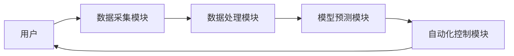
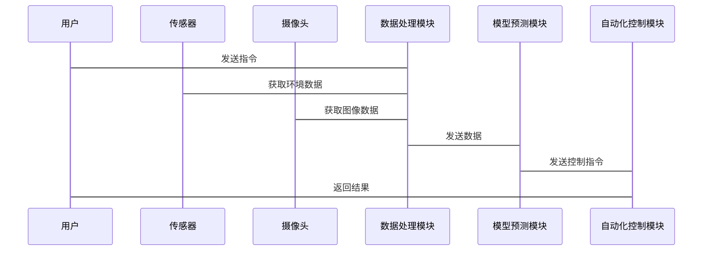

                 


# AI Agent在智能窗台中的植物生长监测

> 关键词：AI Agent，植物生长监测，智能窗台，数据采集，机器学习，物联网

> 摘要：本文探讨了AI Agent在智能窗台中的应用，重点分析了植物生长监测的核心技术与实现方法。文章从背景介绍、核心概念、算法原理、系统设计、项目实战等多个维度展开，详细阐述了AI Agent如何通过数据采集、智能分析和自动化控制来实现植物生长的实时监测与优化管理。

---

## 第一部分：AI Agent与植物生长监测的背景

### 第1章：AI Agent的基本概念与作用

#### 1.1 什么是AI Agent？
AI Agent（人工智能代理）是一种能够感知环境、做出决策并采取行动的智能实体。它通过传感器、摄像头等设备获取数据，利用机器学习算法进行分析，并根据结果执行相应的操作。AI Agent的核心目标是通过自动化手段提高系统的效率和智能化水平。

在植物生长监测中，AI Agent可以用于实时监控植物的生长状态，包括光照、温度、湿度、土壤酸碱度等环境参数，以及植物的高度、叶片数量、颜色变化等生长特征。

#### 1.2 AI Agent的核心功能
1. **数据采集**：通过传感器、摄像头等设备采集植物生长的相关数据。
2. **智能分析**：利用机器学习算法对数据进行分析，识别植物的健康状况和生长趋势。
3. **决策与控制**：根据分析结果，自动调整光照、温度、湿度等环境参数，优化植物的生长条件。

#### 1.3 AI Agent在农业中的应用
AI Agent在农业中的应用非常广泛，包括作物监测、病虫害识别、土壤检测等。在智能窗台中，AI Agent主要用于家庭用户的植物养护，帮助用户实现便捷、高效的植物管理。

---

### 第2章：植物生长监测的重要性

#### 2.1 植物生长监测的目的
植物生长监测的目的是为了确保植物在最佳的环境中生长，提高植物的生长效率和质量。通过实时监测植物的生长状态，用户可以及时发现并解决问题，避免植物因环境因素受损。

#### 2.2 植物生长监测的挑战
1. **数据多样性**：植物生长涉及的环境参数和生长特征种类繁多，数据采集和处理的难度较大。
2. **实时性要求高**：植物的生长状态可能会随时变化，要求监测系统具有较高的实时性。
3. **模型可解释性**：机器学习模型的预测结果需要具有较高的可解释性，以便用户理解和调整。

#### 2.3 智能窗台的定义与特点
智能窗台是一种集成AI技术的植物种植设备，具有以下特点：
1. **智能化**：通过AI Agent实现自动化监测和控制。
2. **便捷性**：用户可以通过手机APP或网页界面远程监控植物的生长状态。
3. **高效性**：通过实时数据分析，优化植物的生长环境，提高生长效率。

---

## 第二部分：AI Agent在智能窗台中的应用

### 第3章：AI Agent的工作原理

#### 3.1 数据采集
AI Agent通过多种传感器和设备采集植物生长的相关数据，包括：
1. **环境参数**：温度、湿度、光照强度、CO2浓度等。
2. **生长特征**：植物的高度、叶片数量、颜色变化等。

#### 3.2 数据预处理
为了提高模型的准确性和鲁棒性，需要对采集到的数据进行预处理，包括：
1. **数据清洗**：去除噪声和异常值。
2. **特征提取**：提取对植物生长影响的关键特征。

#### 3.3 模型训练与部署
通过机器学习算法对预处理后的数据进行训练，构建植物生长监测模型。常用的算法包括支持向量机（SVM）、随机森林（Random Forest）和深度学习模型（如CNN、RNN等）。训练好的模型可以部署到智能窗台中，实时监测植物的生长状态。

#### 3.4 自动化控制
AI Agent可以根据模型的预测结果，自动调整智能窗台的环境参数，例如：
1. **光照调节**：通过LED灯调节光照强度。
2. **温度控制**：通过加热或冷却设备调节温度。
3. **湿度调节**：通过喷雾或通风设备调节湿度。

---

### 第4章：AI Agent的核心算法与实现

#### 4.1 算法原理
AI Agent的核心算法是基于机器学习的模型训练。通过采集和预处理数据，利用监督学习或无监督学习算法对植物的生长状态进行分类或回归预测。

#### 4.2 数学模型
以下是机器学习模型训练的核心公式：

$$ \text{损失函数} = \frac{1}{n}\sum_{i=1}^{n}(y_i - \hat{y_i})^2 $$

其中，$y_i$ 是真实值，$\hat{y_i}$ 是预测值，$n$ 是样本数量。

模型优化过程如下：

$$ \theta = \theta - \eta \cdot \frac{\partial L}{\partial \theta} $$

其中，$\theta$ 是模型参数，$\eta$ 是学习率，$\frac{\partial L}{\partial \theta}$ 是损失函数对参数的偏导。

#### 4.3 代码实现
以下是植物生长监测模型的Python代码示例：

```python
import numpy as np
from sklearn.model_selection import train_test_split
from sklearn.svm import SVC

# 数据预处理
X = ...  # 特征数据
y = ...  # 标签数据

# 划分训练集和测试集
X_train, X_test, y_train, y_test = train_test_split(X, y, test_size=0.2)

# 模型训练
model = SVC()
model.fit(X_train, y_train)

# 模型预测
y_pred = model.predict(X_test)

# 模型评估
accuracy = np.mean(y_pred == y_test)
print(f"模型准确率：{accuracy}")
```

---

## 第三部分：智能窗台系统的架构设计

### 第5章：系统功能设计

#### 5.1 系统功能模块
智能窗台系统主要包括以下功能模块：
1. **数据采集模块**：通过传感器和摄像头采集植物生长数据。
2. **数据处理模块**：对数据进行清洗和特征提取。
3. **模型预测模块**：利用机器学习模型预测植物的生长状态。
4. **自动化控制模块**：根据预测结果调整环境参数。

#### 5.2 系统架构设计
以下是智能窗台系统的架构图：



---

### 第6章：系统接口与交互设计

#### 6.1 系统接口设计
智能窗台系统需要与传感器、摄像头、用户界面等进行交互，以下是系统接口设计：



---

## 第四部分：项目实战与总结

### 第7章：项目实战

#### 7.1 环境安装
需要安装以下工具和库：
- Python 3.8+
- TensorFlow 2.0+
- OpenCV 4.0+
- scikit-learn 0.24+

安装命令：
```bash
pip install numpy scikit-learn tensorflow open-cv-python
```

#### 7.2 核心代码实现
以下是植物生长监测的核心代码：

```python
import cv2
import numpy as np
from sklearn.ensemble import RandomForestClassifier

# 数据采集
def collect_data():
    # 通过摄像头采集图像
    cap = cv2.VideoCapture(0)
    ret, frame = cap.read()
    cap.release()
    return frame

# 数据预处理
def preprocess(image):
    # 将图像转换为灰度图
    gray = cv2.cvtColor(image, cv2.COLOR_BGR2GRAY)
    # 提取特征
    feature = np.mean(gray)
    return feature

# 模型训练
def train_model(X, y):
    model = RandomForestClassifier()
    model.fit(X, y)
    return model

# 模型预测
def predict(model, X_test):
    return model.predict(X_test)

# 实际应用
data = collect_data()
X = preprocess(data)
y = ...  # 标签数据
model = train_model(X, y)
result = predict(model, X)
print(f"预测结果：{result}")
```

---

### 第8章：项目总结与展望

#### 8.1 项目总结
本文详细介绍了AI Agent在智能窗台中的应用，从背景、核心概念、算法原理到系统设计和项目实战，全面阐述了植物生长监测的技术实现。通过AI Agent，用户可以实现植物生长的实时监测和自动化管理，显著提高植物的生长效率和质量。

#### 8.2 未来展望
未来，随着AI技术的不断发展，智能窗台的应用场景将更加广泛。可以通过引入更先进的算法（如深度学习）和更丰富的传感器数据，进一步提高监测的准确性和实时性。同时，还可以开发更多的智能设备，将AI Agent技术应用于更多的农业领域，推动农业智能化的快速发展。

---

## 作者：AI天才研究院/AI Genius Institute & 禅与计算机程序设计艺术 /Zen And The Art of Computer Programming

---

以上是《AI Agent在智能窗台中的植物生长监测》的技术博客文章的详细内容。

