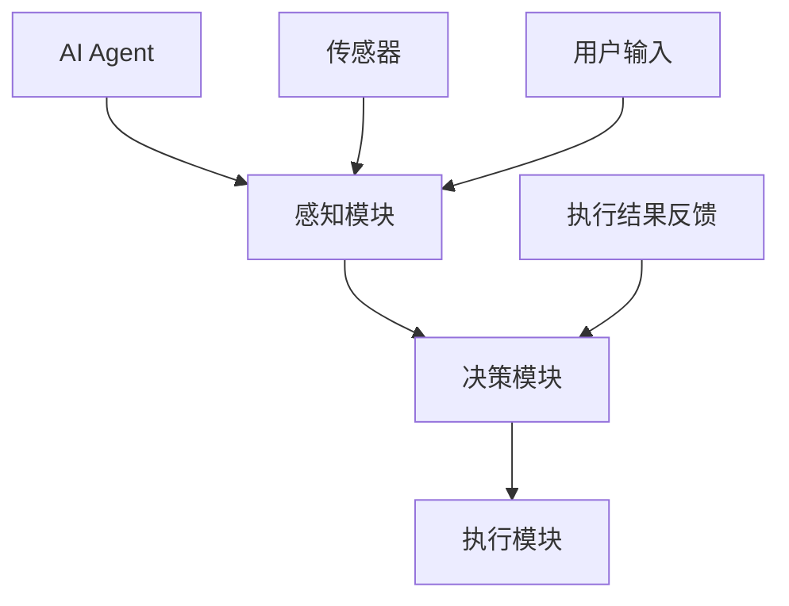
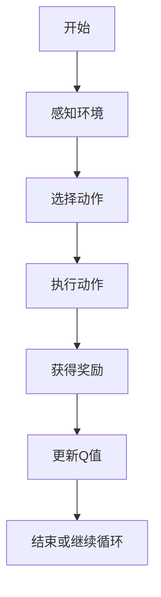
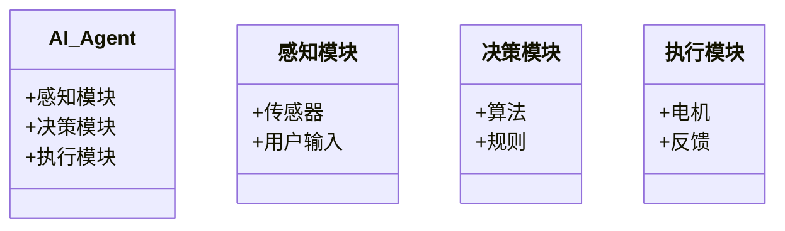
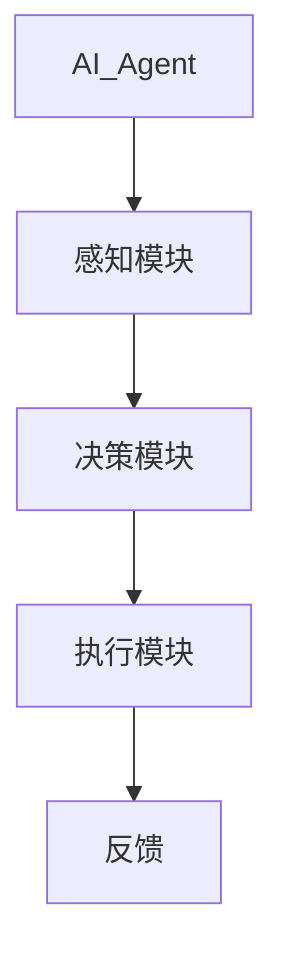
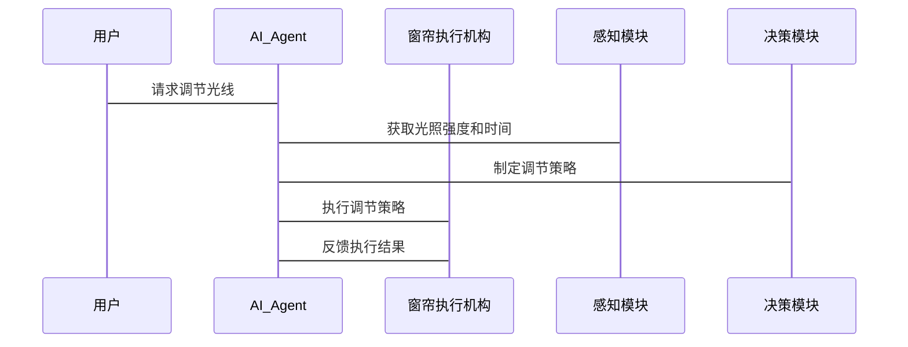

                 


```markdown
# AI Agent在智能窗帘中的光线调节

> 关键词：AI Agent，智能窗帘，光线调节，强化学习，系统架构，项目实战

> 摘要：本文详细探讨了AI Agent在智能窗帘中的光线调节应用，从核心概念到算法原理，再到系统架构和项目实战，全面解析了AI Agent在智能窗帘中的工作原理和实际应用。通过案例分析和代码实现，展示了如何利用AI技术实现智能窗帘的智能化光线调节。

---

## 第1章: 背景介绍

### 1.1 AI Agent的基本概念
#### 1.1.1 什么是AI Agent
- AI Agent的定义
- AI Agent的核心特点
- AI Agent的应用场景

#### 1.1.2 AI Agent的核心特点
- 智能性：能够感知环境并做出决策
- 自适应性：能够根据环境变化调整行为
- 学习能力：通过经验改进性能

#### 1.1.3 AI Agent的应用场景
- 智能家居
- 自动驾驶
- 机器人控制

### 1.2 智能窗帘的发展历程
#### 1.2.1 普通窗帘到智能窗帘的演变
- 从手动到电动
- 从电动到智能控制

#### 1.2.2 光线调节的基本原理
- 窗帘的开闭与光线调节的关系
- 光线强度对室内环境的影响

#### 1.2.3 智能窗帘的市场现状
- 市场需求增长
- 技术进步推动智能窗帘普及

### 1.3 AI Agent在智能窗帘中的应用场景
#### 1.3.1 光线调节的智能化需求
- 用户对光线调节的个性化需求
- 环境变化对光线调节的影响

#### 1.3.2 用户需求与光线调节的关系
- 不同场景下的光线调节需求
- 用户习惯与光线调节的关联

#### 1.3.3 AI Agent在智能窗帘中的具体应用
- 自动调节窗帘以适应光照变化
- 根据用户习惯优化光线调节策略

### 1.4 本章小结
- AI Agent的基本概念
- 智能窗帘的发展历程
- 光线调节的智能化需求

---

## 第2章: AI Agent的核心概念与联系

### 2.1 AI Agent的基本原理
#### 2.1.1 AI Agent的感知机制
- 感知环境：通过传感器获取光照强度、时间等信息
- 用户反馈：通过用户输入调整光线调节策略

#### 2.1.2 AI Agent的决策机制
- 基于感知信息做出决策
- 决策过程中的权衡与优化

#### 2.1.3 AI Agent的执行机制
- 执行决策：通过电机或其他执行机构调整窗帘状态
- 反馈机制：根据执行结果调整后续决策

### 2.2 AI Agent与智能窗帘的结合
#### 2.2.1 智能窗帘的光线调节需求
- 不同时间段的光线调节策略
- 用户偏好对光线调节的影响

#### 2.2.2 AI Agent在光线调节中的作用
- 自动调整窗帘以适应光照变化
- 根据用户习惯优化光线调节策略

#### 2.2.3 AI Agent与智能窗帘的交互方式
- 用户通过手机APP或语音助手控制
- AI Agent通过传感器和反馈机制实现自主调节

### 2.3 AI Agent的系统架构
#### 2.3.1 系统架构图


#### 2.3.2 系统各模块的功能描述
- 感知模块：负责收集环境信息（光照强度、时间）和用户输入
- 决策模块：根据感知信息和用户需求做出调节决策
- 执行模块：根据决策结果调整窗帘状态

#### 2.3.3 系统模块之间的关系
- 感知模块与决策模块的关系
- 决策模块与执行模块的关系
- 执行模块与反馈机制的关系

### 2.4 本章小结
- AI Agent的基本原理
- AI Agent在智能窗帘中的具体应用
- 系统架构与模块关系

---

## 第3章: AI Agent的算法原理

### 3.1 AI Agent的算法原理
#### 3.1.1 强化学习算法
- Q-learning算法
- 状态、动作、奖励的概念
- Q值更新公式：$Q(s, a) = Q(s, a) + \alpha (r + \gamma \max Q(s', a') - Q(s, a))$

#### 3.1.2 反馈机制
- 奖励函数的设计
- 动态调整策略
- 算法流程图


#### 3.1.3 算法实现
- 状态空间：光照强度、时间、用户偏好
- 动作空间：完全打开、部分打开、关闭
- 状态转移：根据当前状态和动作，得到新的状态
- 奖励函数：根据实际效果给予奖励或惩罚

### 3.2 算法实现
#### 3.2.1 Python代码实现
```python
import numpy as np

# 定义状态空间
states = [' bright', 'dim', 'dark']
actions = ['open', 'half_open', 'close']

# 初始化Q值表
Q = np.zeros(len(states), len(actions))

# 定义奖励函数
def reward(state, action, next_state):
    if action == 'open' and next_state == 'bright':
        return 1
    elif action == 'half_open' and next_state == 'dim':
        return 1
    elif action == 'close' and next_state == 'dark':
        return 1
    else:
        return -1

# Q-learning算法实现
alpha = 0.1
gamma = 0.9

for episode in range(1000):
    current_state = np.random.choice(states)
    for _ in range(10):
        # 选择动作
        action = np.random.choice(actions)
        # 执行动作
        next_state = np.random.choice(states)
        # 更新Q值
        Q[states.index(current_state)][actions.index(action)] += alpha * (reward(current_state, action, next_state) + gamma * max(Q[states.index(next_state)]) - Q[states.index(current_state)][actions.index(action)])
```

#### 3.2.2 算法原理的数学模型
- 状态转移概率：$P(s' | s, a)$
- 期望奖励：$E[r | s, a]$
- 策略评估：$v_\pi(s) = \sum_{a} \pi(a|s) Q_\pi(s,a)$
- 策略改进：$\pi(a|s) = \arg \max Q_\pi(s,a)$

### 3.3 本章小结
- 强化学习算法的基本原理
- 算法实现的详细步骤
- 数学模型的解释

---

## 第4章: 系统分析与架构设计

### 4.1 问题场景介绍
#### 4.1.1 问题描述
- 光线调节的需求
- 环境变化的影响
- 用户习惯的差异

#### 4.1.2 项目介绍
- 项目目标
- 项目范围
- 项目团队

### 4.2 系统功能设计
#### 4.2.1 领域模型类图


#### 4.2.2 系统架构设计


#### 4.2.3 系统接口设计
- 感知模块接口：获取光照强度、时间、用户输入
- 决策模块接口：接收感知信息，输出调节策略
- 执行模块接口：接收调节策略，调整窗帘状态

#### 4.2.4 系统交互序列图


### 4.3 本章小结
- 系统功能设计
- 系统架构设计
- 系统接口设计

---

## 第5章: 项目实战

### 5.1 环境安装
#### 5.1.1 安装Python
- 安装Python 3.8以上版本
- 安装必要的库：numpy, matplotlib

#### 5.1.2 安装AI框架
- 安装TensorFlow或PyTorch
- 安装强化学习库：rl4py

#### 5.1.3 环境配置
- 配置虚拟环境
- 配置项目路径

### 5.2 系统核心实现
#### 5.2.1 感知模块实现
```python
import numpy as np

def get_light_intensity():
    # 模拟传感器数据
    return np.random.uniform(0, 1)

def get_time():
    # 模拟时间数据
    return np.random.randint(0, 24)
```

#### 5.2.2 决策模块实现
```python
def decide_action(light_intensity, time):
    if light_intensity > 0.7 and time in [8, 9, 17, 18]:
        return 'open'
    elif light_intensity > 0.3 and time in [10, 11, 16, 17]:
        return 'half_open'
    else:
        return 'close'
```

#### 5.2.3 执行模块实现
```python
def execute_action(action):
    if action == 'open':
        return '完全打开'
    elif action == 'half_open':
        return '部分打开'
    else:
        return '关闭'
```

#### 5.2.4 反馈机制实现
```python
def feedback(current_state, action, next_state):
    if action == 'open' and next_state == 'bright':
        return 1
    elif action == 'half_open' and next_state == 'dim':
        return 1
    elif action == 'close' and next_state == 'dark':
        return 1
    else:
        return -1
```

### 5.3 功能测试
#### 5.3.1 测试用例设计
- 测试不同光照强度下的调节策略
- 测试不同时间下的调节策略
- 测试用户输入对调节策略的影响

#### 5.3.2 测试结果分析
- 调节策略的正确性
- 系统的响应速度
- 系统的稳定性

### 5.4 优化与改进
#### 5.4.1 算法优化
- 调整学习率alpha
- 调整折扣因子gamma
- 改进奖励函数

#### 5.4.2 系统优化
- 提高感知模块的准确性
- 优化决策模块的算法
- 提升执行模块的响应速度

### 5.5 本章小结
- 项目实战的详细步骤
- 系统实现的代码示例
- 测试结果与优化建议

---

## 第6章: 总结与展望

### 6.1 总结
#### 6.1.1 核心内容回顾
- AI Agent的基本概念
- 算法原理
- 系统架构设计
- 项目实战

#### 6.1.2 经验与教训
- 算法选择的重要性
- 系统设计的合理性
- 项目管理的经验

### 6.2 未来展望
#### 6.2.1 技术发展
- 更先进的强化学习算法
- 更智能的感知模块
- 更高效的执行模块

#### 6.2.2 应用场景扩展
- 更多智能家居设备的集成
- 更多用户需求的满足
- 更广泛的应用领域

### 6.3 最佳实践 tips
- 系统设计要注重模块化
- 算法选择要结合实际需求
- 项目实施要注重测试与优化

### 6.4 本章小结
- 本书的核心内容总结
- 未来的研究方向
- 实践中的注意事项

---

## 附录

### 附录A: 参考文献
- 强化学习相关文献
- 智能窗帘相关文献
- AI Agent相关文献

### 附录B: 工具与资源
- Python安装与配置
- AI框架的安装与使用
- 开源代码仓库

---

## 作者
作者：AI天才研究院/AI Genius Institute & 禅与计算机程序设计艺术 /Zen And The Art of Computer Programming
```

