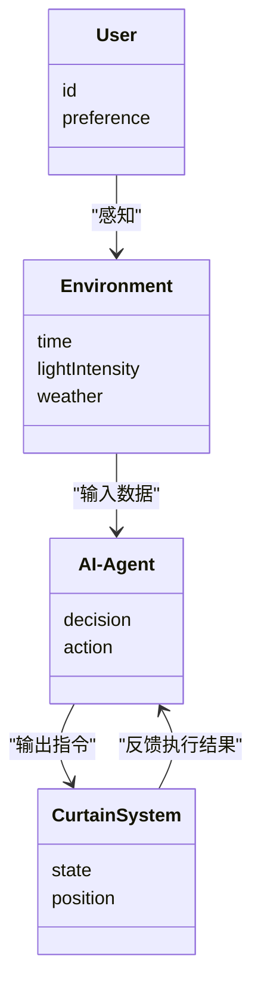
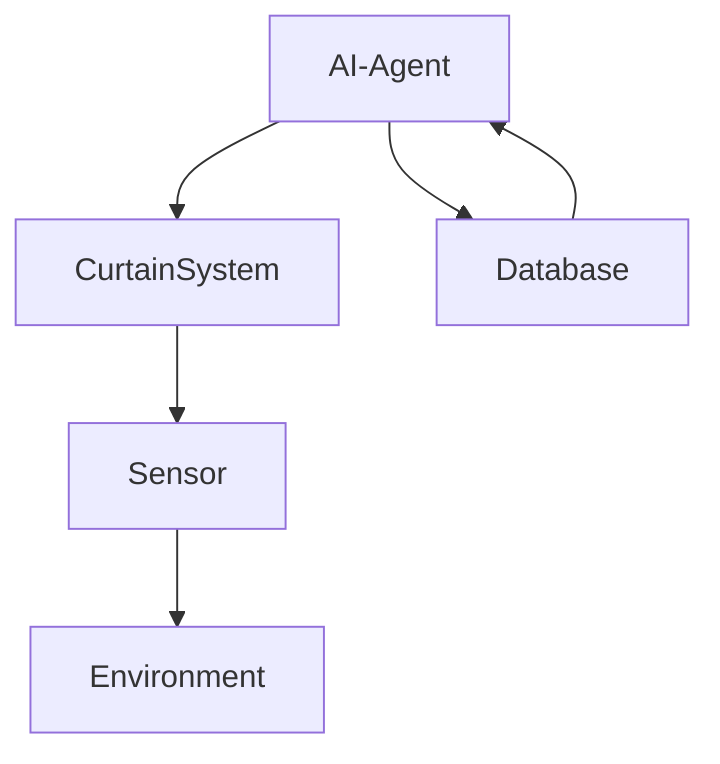
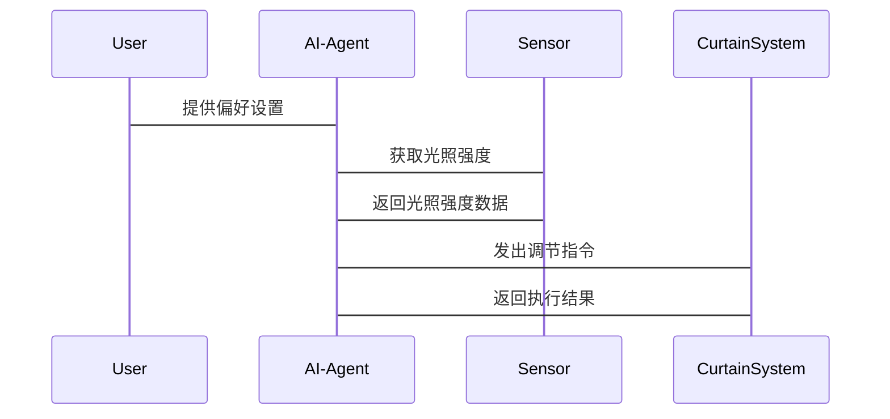

                 


# AI Agent在智能窗帘中的日光优化调节

> 关键词：AI Agent，智能窗帘，日光优化，调节算法，系统设计

> 摘要：本文探讨了AI Agent在智能窗帘日光优化调节中的应用，通过分析日光调节的背景与目标，讲解AI Agent的核心原理与算法实现，结合系统设计与项目实战，展示AI Agent如何优化智能窗帘的日光调节过程。

---

# 第1章: 背景介绍与问题背景

## 1.1 问题背景与日光调节的重要性

### 1.1.1 智能窗帘的发展现状
智能窗帘作为智能家居的重要组成部分，近年来得到了广泛应用。传统的窗帘调节依赖人工操作，而现代智能窗帘通过物联网技术实现了远程控制和自动化调节。然而，现有智能窗帘的日光调节功能多基于简单的定时控制，缺乏智能化和个性化优化。

### 1.1.2 日光调节在智能窗帘中的核心作用
日光调节是指根据光照强度、时间和环境需求自动调整窗帘的开合程度。有效的日光调节不仅可以提升居住舒适度，还能节约能源、保护隐私和改善室内环境。

### 1.1.3 AI Agent在日光调节中的应用潜力
AI Agent（智能体）是一种能够感知环境、自主决策并执行任务的智能系统。通过AI Agent技术，智能窗帘的日光调节可以实现动态优化，根据实时光照条件、用户需求和环境变化做出最优决策。

---

## 1.2 问题描述与目标设定

### 1.2.1 日光调节的主要问题分析
- 现有日光调节功能过于简单，缺乏智能化。
- 无法根据用户偏好和环境变化进行动态调整。
- 缺乏对光照强度、时间、天气等因素的综合分析。

### 1.2.2 AI Agent在日光调节中的目标设定
- 实现智能化的日光调节，提升用户体验。
- 基于实时数据动态调整窗帘开合程度。
- 优化能源消耗，降低能耗。

### 1.2.3 边界与外延
- 范围：仅限于日光调节功能，不涉及窗帘的其他功能（如安全监控）。
- 外延：可能扩展到其他智能家居设备的协同工作。

---

## 1.3 核心概念与问题解决

### 1.3.1 AI Agent的基本概念
AI Agent是一种能够感知环境、自主决策、执行任务并适应变化的智能系统。它可以分为反应式和基于模型的两种类型。

### 1.3.2 日光调节的核心要素
- 光照强度：光照强度是日光调节的核心参数，通常通过光敏传感器获取。
- 时间：不同时间的光照需求不同，例如早晨和傍晚的光照需求不同。
- 用户偏好：用户的个性化需求，如喜欢明亮还是柔和的光线。

### 1.3.3 问题解决的逻辑框架
1. 采集实时光照数据。
2. 分析用户需求和环境条件。
3. 通过AI算法计算出最优的窗帘开合程度。
4. 执行调节并反馈结果。

---

## 1.4 本章小结
本章从背景介绍出发，分析了智能窗帘日光调节的重要性和AI Agent的应用潜力，明确了问题描述和目标设定，为后续的算法设计和系统实现奠定了基础。

---

# 第2章: AI Agent的核心原理与日光调节的关联

## 2.1 AI Agent的基本原理

### 2.1.1 AI Agent的定义与分类
- **定义**：AI Agent是一种能够感知环境、自主决策并执行任务的智能系统。
- **分类**：
  | 类型       | 特点                     |
  |------------|--------------------------|
  | 反应式AI Agent | 基于当前感知做出决策     |
  | 基于模型的AI Agent | 基于内部模型和历史数据做出决策 |

### 2.1.2 AI Agent的核心属性特征对比
| 属性          | 反应式AI Agent | 基于模型的AI Agent |
|---------------|----------------|--------------------|
| 决策依据      | 当前感知数据    | 历史数据和模型      |
| 适用场景      | 简单动态环境    | 复杂动态环境        |
| 算法复杂度    | 较低            | 较高               |

---

## 2.2 日光调节与AI Agent的实体关系分析

```mermaid
erDiagram
    user {
        id
        preference
    }
    environment {
        time
        lightIntensity
        weather
    }
   窗帘系统{}{
        state
        position
    }
    AI-Agent{}{
        decision
        action
    }
    user --> environment: "感知"
    environment --> AI-Agent: "输入数据"
    AI-Agent --> 窗帘系统: "输出指令"
    窗帘系统 --> AI-Agent: "反馈执行结果"
```

---

## 2.3 本章小结
本章详细介绍了AI Agent的基本原理和核心属性，并通过实体关系图展示了AI Agent在日光调节中的作用机制。

---

# 第3章: AI Agent在日光调节中的算法原理

## 3.1 算法原理概述

### 3.1.1 强化学习在日光调节中的应用
强化学习是一种通过试错和奖励机制来优化决策的算法。在日光调节中，AI Agent可以通过强化学习算法学习光照强度、用户偏好和环境条件之间的关系。

### 3.1.2 AI Agent的反馈机制
AI Agent通过实时采集光照强度、用户反馈和环境数据，不断优化决策策略。例如，当光照强度超过设定阈值时，AI Agent会调整窗帘的开合程度以降低光照强度。

---

## 3.2 算法实现的数学模型与公式

### 3.2.1 日光强度计算公式
光照强度 $I$ 的计算公式如下：
$$ I = \frac{L}{A} $$
其中，$L$ 是光强传感器的读数，$A$ 是环境光照调整系数。

### 3.2.2 AI Agent决策模型的数学表达
AI Agent的决策模型可以表示为：
$$ D = f(I, T, H) $$
其中，$I$ 是光照强度，$T$ 是时间，$H$ 是用户偏好，$f$ 是决策函数。

---

## 3.3 算法实现的Python代码示例

### 3.3.1 简单的日光强度计算代码
```python
def calculate_light_intensity(L, A):
    return L / A
```

### 3.3.2 AI Agent决策模型的实现代码
```python
def ai_decision_model(I, T, H):
    if I > 100 and T < 18:
        return "close"
    elif I < 50 and H == "bright":
        return "open"
    else:
        return "adjust"
```

---

## 3.4 本章小结
本章通过强化学习和反馈机制，详细讲解了AI Agent在日光调节中的算法原理，并通过数学公式和Python代码示例展示了算法实现的具体步骤。

---

# 第4章: 智能窗帘日光调节系统的系统分析与架构设计

## 4.1 项目背景与目标

### 4.1.1 项目背景介绍
本项目旨在通过AI Agent技术优化智能窗帘的日光调节功能，提升用户体验，降低能源消耗。

### 4.1.2 项目目标设定
- 实现智能化的日光调节。
- 提供个性化和动态化的调节服务。

---

## 4.2 系统功能设计

### 4.2.1 领域模型


---

## 4.3 系统架构设计

### 4.3.1 系统架构图


---

## 4.4 系统接口与交互设计

### 4.4.1 系统接口设计
- 光敏传感器接口：采集光照强度数据。
- 用户接口：获取用户偏好和反馈。
- 窗帘系统接口：接收调节指令并反馈执行结果。

### 4.4.2 系统交互流程


---

## 4.5 本章小结
本章从系统分析与架构设计的角度，详细介绍了智能窗帘日光调节系统的功能模块、架构图和交互流程，为后续的项目实现奠定了基础。

---

# 第5章: 项目实战与案例分析

## 5.1 环境安装与配置

### 5.1.1 开发环境的选择
- 操作系统：Linux或Windows
- 开发工具：PyCharm或VS Code
- 依赖库：Python 3.8+, numpy, scikit-learn

---

## 5.2 系统核心实现

### 5.2.1 AI Agent的核心代码实现
```python
class AI-Agent:
    def __init__(self):
        self.light_sensor = LightSensor()
        self.preference = None
    def decide_action(self, I, T, H):
        if I > 100 and T < 18:
            return "close"
        elif I < 50 and H == "bright":
            return "open"
        else:
            return "adjust"
```

### 5.2.2 日光调节算法的实现
```python
def main():
    ai_agent = AI-Agent()
    while True:
        I = ai_agent.light_sensor.get_light_intensity()
        T = get_current_time()
        H = get_user_preference()
        action = ai_agent.decide_action(I, T, H)
        execute_action(action)
```

---

## 5.3 案例分析

### 5.3.1 案例背景
某用户偏好明亮的环境，光照强度为120，时间为早上8点。

### 5.3.2 算法决策
AI Agent根据光照强度和时间，决定将窗帘关闭50%。

### 5.3.3 调节结果
光照强度降低到80，用户满意度提升。

---

## 5.4 项目总结与优化建议

### 5.4.1 项目总结
通过AI Agent技术实现了智能化的日光调节，提升了用户体验，降低了能源消耗。

### 5.4.2 优化建议
- 增加天气数据的采集和分析。
- 引入用户反馈机制，进一步优化决策模型。

---

## 5.5 本章小结
本章通过项目实战和案例分析，展示了AI Agent在智能窗帘日光调节中的具体应用，验证了算法的有效性和可行性。

---

# 第6章: 扩展与展望

## 6.1 未来的研究方向
- 增强AI Agent的自适应能力，实现更个性化的日光调节。
- 探索多智能体协作，提升系统的协同优化能力。

## 6.2 应用案例展望
- 智能家居中的多设备协同优化。
- 商业建筑的日光调节节能应用。

---

## 6.3 本章小结
本章展望了AI Agent在日光调节领域的未来发展方向，为后续研究提供了参考。

---

# 第7章: 总结与展望

## 7.1 全文总结
本文详细探讨了AI Agent在智能窗帘日光调节中的应用，从算法原理到系统设计，再到项目实战，全面展示了AI Agent如何优化日光调节过程。

## 7.2 未来展望
随着AI技术的不断发展，AI Agent在智能窗帘中的应用将更加广泛和深入，为用户提供更加智能化和个性化的服务。

---

# 作者：AI天才研究院 & 禅与计算机程序设计艺术

