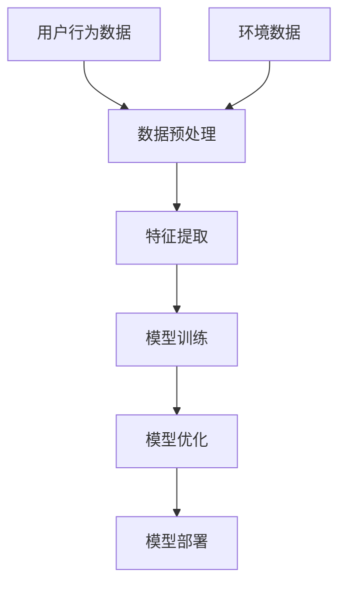
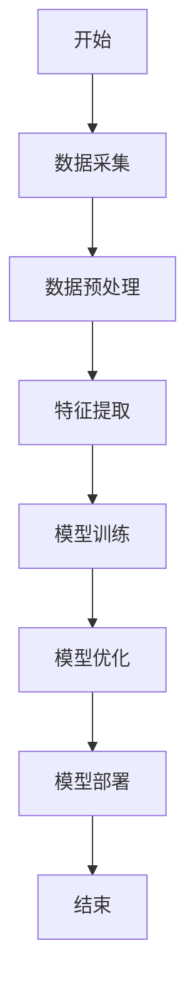
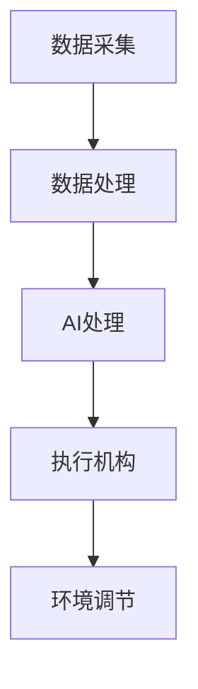

                 


# AI Agent在智能窗帘中的昼夜节律调节

> 关键词：AI Agent, 智能窗帘, 昼夜节律, 调节模型, 智能家居

> 摘要：本文探讨了AI Agent在智能窗帘中的昼夜节律调节应用，分析了其核心概念、算法原理、系统架构及实现方案，并通过实际案例展示了AI Agent在智能窗帘中的应用价值。

---

# 第一部分: 背景介绍

## 第1章: 昼夜节律与AI Agent概述

### 1.1 昼夜节律的基本概念

#### 1.1.1 昼夜节律的定义与特点
昼夜节律是指生物体内部的生理和行为周期性变化，通常以24小时为一个周期。它受到光暗周期的影响，调节着人体的生物钟，影响睡眠、觉醒、体温、激素分泌等活动。

#### 1.1.2 昼夜节律对人体的影响
良好的昼夜节律有助于提高人体健康和生活质量，而紊乱的昼夜节律可能导致失眠、疲劳、注意力不集中等问题。

#### 1.1.3 昼夜节律调节的重要性
在现代生活中，由于工作、娱乐、社交等活动的影响，许多人面临昼夜节律紊乱的问题。通过智能设备调节环境因素（如光线和温度）可以有效改善这一状况。

### 1.2 AI Agent在智能窗帘中的应用背景

#### 1.2.1 智能窗帘的发展现状
智能窗帘通过物联网技术实现远程控制和自动化调节，已成为智能家居的重要组成部分。

#### 1.2.2 昼夜节律调节的智能化需求
随着人们对健康生活的关注增加，智能窗帘需要具备调节环境以适应人体昼夜节律的功能。

#### 1.2.3 AI Agent在智能窗帘中的作用
AI Agent通过学习用户的作息习惯和环境数据，自动调节窗帘的开合和光线强度，帮助用户维持良好的昼夜节律。

### 1.3 本书的核心内容与目标

#### 1.3.1 本书的核心目标
探讨AI Agent在智能窗帘中的昼夜节律调节技术，分析其原理、实现和应用。

#### 1.3.2 本书的结构安排
从理论到实践，逐步讲解AI Agent在智能窗帘中的应用，包括算法设计、系统架构和项目实现。

#### 1.3.3 本书的适用读者
适合对智能家居、AI技术感兴趣的读者，以及从事相关领域研究和开发的工程师。

---

## 第2章: 昼夜节律调节的背景与技术现状

### 2.1 昼夜节律调节的背景

#### 2.1.1 现代生活方式对昼夜节律的影响
现代社会的快节奏和电子设备的普及导致许多人出现昼夜节律紊乱。

#### 2.1.2 光线与昼夜节律的关系
自然光和人造光的不同波长和强度对昼夜节律有显著影响，尤其是蓝光对褪黑激素分泌的抑制作用。

#### 2.1.3 温度与昼夜节律的关系
体温的变化也与昼夜节律密切相关，适宜的环境温度有助于维持良好的睡眠质量。

### 2.2 AI技术在智能家居中的应用现状

#### 2.2.1 AI在智能家居中的主要应用领域
AI技术广泛应用于智能音箱、智能灯泡、智能空调等领域，通过语音交互和自动化控制提升用户体验。

#### 2.2.2 AI Agent在智能家居中的发展趋势
AI Agent正朝着更加智能化、个性化和主动化的方向发展，能够根据用户行为和环境变化自主决策。

#### 2.2.3 智能窗帘行业的发展趋势
智能窗帘将更加注重与智能家居生态的整合，通过AI技术实现更智能的环境调节。

### 2.3 本书的研究意义与创新点

#### 2.3.1 研究的意义
通过AI Agent实现智能窗帘的昼夜节律调节，有助于改善用户的睡眠质量，提升生活品质。

#### 2.3.2 创新点
将AI Agent与智能窗帘结合，提出一种基于昼夜节律调节的环境优化方案，具有较高的创新性和实用价值。

#### 2.3.3 本书的贡献
本书为AI Agent在智能窗帘中的应用提供了理论支持和实践指导，推动了智能窗帘技术的发展。

---

# 第二部分: 核心概念与联系

## 第3章: AI Agent的核心概念与原理

### 3.1 AI Agent的基本概念

#### 3.1.1 AI Agent的定义
AI Agent是一种智能体，能够感知环境、自主决策并执行任务，以实现特定目标。

#### 3.1.2 AI Agent的核心特征
- **自主性**：能够在没有外部干预的情况下自主运行。
- **反应性**：能够实时感知环境变化并做出反应。
- **学习能力**：通过机器学习算法不断优化决策模型。

#### 3.1.3 AI Agent的分类
- **简单反射型Agent**：基于规则的简单响应。
- **基于模型的反射型Agent**：结合环境模型进行决策。
- **目标驱动型Agent**：根据目标优化行动。
- **实用驱动型Agent**：通过效用函数优化决策。

### 3.2 昼夜节律调节模型

#### 3.2.1 昼夜节律调节的基本原理
通过调节环境中的光照和温度来影响人体的生物钟，从而实现昼夜节律的调整。

#### 3.2.2 昼夜节律调节的关键因素
- 光照强度和波长
- 环境温度
- 用户的作息习惯

#### 3.2.3 昼夜节律调节的数学模型

##### 模型公式
昼夜节律调节模型可以用以下公式表示：
$$
S(t) = \alpha \cdot L(t) + \beta \cdot T(t) + \gamma \cdot H(t)
$$
其中：
- $S(t)$ 表示昼夜节律状态
- $L(t)$ 表示光照强度
- $T(t)$ 表示环境温度
- $H(t)$ 表示用户行为习惯
- $\alpha, \beta, \gamma$ 是权重系数

---

### 3.3 AI Agent与昼夜节律调节的关系

#### 3.3.1 AI Agent在昼夜节律调节中的作用
AI Agent通过感知环境数据和用户行为，优化窗帘的开合和光线调节，从而实现昼夜节律的调节。

#### 3.3.2 AI Agent与智能窗帘的协同工作
智能窗帘作为AI Agent的执行机构，通过接收AI Agent的指令调整环境参数。

#### 3.3.3 昼夜节律调节对AI Agent的要求
AI Agent需要具备实时感知、学习和自适应能力，以应对环境和用户行为的变化。

---

# 第4章: 昼夜节律调节与AI Agent的联系

### 4.1 昼夜节律调节的核心要素

#### 4.1.1 光照调节
智能窗帘通过调节透光率和开合时间影响室内光照，从而影响用户的昼夜节律。

#### 4.1.2 温度调节
通过调节窗帘的开合和隔热性能，影响室内温度，进而影响昼夜节律。

#### 4.1.3 用户行为习惯
AI Agent需要根据用户的作息习惯调整环境参数，以优化昼夜节律。

### 4.2 AI Agent在昼夜节律调节中的优势

#### 4.2.1 自动化调节
AI Agent能够根据环境数据和用户行为自动调整窗帘和光线，无需人工干预。

#### 4.2.2 个性化调节
AI Agent能够根据用户的个性化需求提供定制化的调节方案。

#### 4.2.3 实时反馈
AI Agent能够实时感知环境变化，并根据反馈优化调节策略。

---

### 4.3 昼夜节律调节与AI Agent的对比分析

| 调节方法 | 优点 | 缺点 |
|----------|------|------|
| 手动调节 | 简单、灵活 | 易遗忘、效率低 |
| 定时调节 | 方便、规律 | 无法应对突发情况 |
| AI Agent调节 | 自动化、个性化、实时反馈 | 实施成本高、技术复杂 |

---

# 第三部分: 算法原理

## 第5章: 昼夜节律调节的算法原理

### 5.1 AI Agent的算法框架

#### 5.1.1 数据采集
通过传感器采集环境数据（如光照、温度）和用户行为数据（如作息时间）。

#### 5.1.2 数据预处理
对采集的数据进行清洗、归一化处理，确保数据质量。

#### 5.1.3 模型训练
使用机器学习算法（如回归、分类、强化学习）训练昼夜节律调节模型。

#### 5.1.4 模型优化
通过交叉验证和超参数调优优化模型性能。

#### 5.1.5 模型部署
将训练好的模型部署到智能窗帘系统中，实现实时调节。

### 5.2 昼夜节律调节的数学模型

#### 5.2.1 时间序列分析
使用ARIMA模型预测用户的昼夜节律状态。

#### 5.2.2 强化学习算法
通过Q-Learning算法优化窗帘的开合策略。

#### 5.2.3 神经网络模型
构建深度神经网络模型，学习复杂的环境和用户行为关系。

---

### 5.3 AI Agent的算法实现

#### 5.3.1 数据流图



#### 5.3.2 算法流程图



---

## 第6章: 系统架构与实现

### 6.1 系统架构设计

#### 6.1.1 系统模块划分
- 数据采集模块：负责采集环境和用户数据。
- 数据处理模块：对数据进行预处理和特征提取。
- AI处理模块：运行调节模型，生成控制指令。
- 执行机构模块：根据指令调整窗帘状态。

#### 6.1.2 系统架构图



---

### 6.2 系统实现细节

#### 6.2.1 环境数据采集
使用光线传感器和温度传感器采集环境数据。

#### 6.2.2 用户行为分析
通过用户的历史作息数据，分析其昼夜节律特征。

#### 6.2.3 AI算法实现
基于机器学习算法实现昼夜节律调节模型。

#### 6.2.4 系统交互设计
设计友好的人机交互界面，让用户能够手动调整参数。

---

# 第四部分: 项目实战

## 第7章: 项目实战与分析

### 7.1 项目环境搭建

#### 7.1.1 环境安装
安装必要的开发工具和库，如Python、TensorFlow、OpenCV等。

#### 7.1.2 数据集准备
收集用户行为数据和环境数据，进行清洗和标注。

### 7.2 核心代码实现

#### 7.2.1 数据预处理代码

```python
import pandas as pd
import numpy as np

# 读取数据
data = pd.read_csv('data.csv')

# 数据清洗
data = data.dropna()
data = (data - data.mean()) / data.std()

# 特征提取
features = data[['light', 'temperature', 'user_activity']]
labels = data['circadian_rhythm']
```

#### 7.2.2 模型训练代码

```python
from sklearn.model import LinearRegression

model = LinearRegression()
model.fit(features, labels)
```

#### 7.2.3 模型预测代码

```python
# 预测昼夜节律状态
predictions = model.predict(new_features)
```

### 7.3 实际案例分析

#### 7.3.1 案例背景
某用户长期熬夜，希望通过智能窗帘调节改善睡眠质量。

#### 7.3.2 数据分析
分析用户的作息时间和环境数据，发现其睡前使用电子设备导致昼夜节律紊乱。

#### 7.3.3 调节方案
AI Agent根据模型预测，自动调节窗帘的开合时间和透光率，优化用户的睡眠环境。

### 7.4 项目总结

#### 7.4.1 项目成果
成功实现了AI Agent在智能窗帘中的昼夜节律调节功能。

#### 7.4.2 经验总结
- 数据质量对模型性能影响显著。
- 系统的实时性和稳定性需要进一步优化。

---

# 第五部分: 最佳实践

## 第8章: 最佳实践与注意事项

### 8.1 小结

#### 8.1.1 本章回顾
总结了AI Agent在智能窗帘中的昼夜节律调节技术，包括核心概念、算法原理和系统实现。

#### 8.1.2 本章总结
AI Agent能够有效提升智能窗帘的环境调节能力，改善用户的昼夜节律。

### 8.2 注意事项

#### 8.2.1 数据隐私问题
在采集和处理用户数据时，需注意隐私保护。

#### 8.2.2 系统稳定性
确保系统的实时性和稳定性，避免因技术问题影响用户体验。

#### 8.2.3 用户教育
向用户普及昼夜节律调节的知识，帮助其更好地使用智能窗帘功能。

### 8.3 拓展阅读

#### 8.3.1 推荐书籍
- 《智能系统与人工智能》
- 《生物节律与健康》

#### 8.3.2 推荐文章
- AI在智能家居中的应用
- 昼夜节律调节的技术进展

---

# 作者

作者：AI天才研究院/AI Genius Institute & 禅与计算机程序设计艺术 /Zen And The Art of Computer Programming

