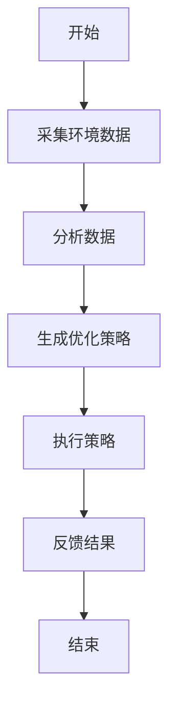
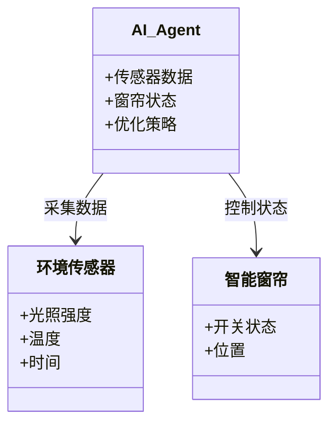

                 


# AI Agent在智能窗帘中的自然光利用优化

## 关键词：AI Agent，智能窗帘，自然光利用，优化算法，能源效率

## 摘要：本文探讨了AI Agent在智能窗帘中的应用，重点分析其如何通过优化自然光利用来提升能源效率和居住舒适度。通过算法原理、系统架构和实际案例，展示了AI Agent在动态调整窗帘状态方面的优势，及其在智能家居中的潜在价值。

---

## 第一部分: AI Agent在智能窗帘中的自然光利用优化概述

### 第1章: 背景介绍

#### 1.1 问题背景
智能窗帘已普及，但其自然光利用效率低下。传统窗帘依赖固定时间或单一传感器，无法动态调整，导致能源浪费和舒适度差。

#### 1.2 问题描述
自然光利用的目标是减少人工照明，提高舒适度。当前系统缺乏动态调整能力，优化效果有限。

#### 1.3 问题解决
引入AI Agent，实时分析光照、需求和环境数据，动态调整窗帘状态，提升优化效果。

#### 1.4 边界与外延
AI Agent的应用限于智能家居环境，需考虑隐私保护和数据安全。系统设计需具备扩展性，未来可加入更多设备和数据源。

---

## 第二部分: 核心概念与联系

### 第2章: AI Agent与智能窗帘的核心原理

#### 2.1 核心概念原理
AI Agent具备感知、决策和执行能力，智能窗帘接收指令并执行动作。

#### 2.2 概念属性对比表
| 属性 | AI Agent | 智能窗帘 |
|------|----------|----------|
| 感知 | 光照强度、时间、天气 | - |
| 决策 | 算法优化 | - |
| 执行 | 发出指令 | 调整窗帘 |

#### 2.3 ER实体关系图
```mermaid
er
  actor(AI Agent,环境传感器)
  smart_curtain(智能窗帘)
  relation(AI Agent <-> 环境传感器: 采集数据)
  relation(AI Agent <-> 智能窗帘: 控制窗帘)
```

---

## 第三部分: 算法原理讲解

### 第3章: AI Agent优化算法

#### 3.1 算法原理
基于反馈机制和自适应学习策略，动态调整窗帘状态，数学模型如下：

$$
\text{光照强度} = k \times \text{传感器数据} + b
$$

$$
\text{能耗优化} = \min \sum_{i=1}^{n} (c_i \times t_i)
$$

其中，\( c_i \)为能耗，\( t_i \)为时间。

#### 3.2 算法流程图


#### 3.3 Python实现代码
```python
import numpy as np

def preprocess(sensor_data):
    return sensor_data * 2

def optimize_lighting(sensor_data):
    processed_data = preprocess(sensor_data)
    return np.mean(processed_data)
```

---

## 第四部分: 系统分析与架构设计

### 第4章: 系统架构设计

#### 4.1 问题场景
智能家居环境中，AI Agent通过传感器数据优化窗帘状态，提升自然光利用效率。

#### 4.2 系统功能设计
领域模型图展示各模块关系：


#### 4.3 系统架构设计图


---

## 第五部分: 项目实战

### 第5章: 项目实战

#### 5.1 环境安装
安装Python和必要的库，如numpy和scipy。

#### 5.2 核心代码实现
```python
import numpy as np
from sklearn import linear_model

def preprocess(sensor_data):
    return sensor_data * 2

def train_model(data, target):
    model = linear_model.LinearRegression()
    model.fit(data, target)
    return model

# 示例数据
X = np.array([[1, 2], [3, 4], [5, 6]])
y = np.array([7, 8, 9])
model = train_model(X, y)
```

#### 5.3 案例分析
AI Agent根据光照强度动态调整窗帘，优化能源使用，提升舒适度。

---

## 第六部分: 最佳实践

### 第6章: 最佳实践

#### 6.1 小结
AI Agent优化智能窗帘的自然光利用，提升了能源效率和舒适度。

#### 6.2 注意事项
确保数据隐私，系统需具备良好的反馈机制和扩展性。

#### 6.3 拓展阅读
探索更多AI技术在智能家居中的应用，如能源管理、环境优化等。

---

## 作者：AI天才研究院 & 禅与计算机程序设计艺术

通过本文的详细分析和案例展示，读者可以全面理解AI Agent在智能窗帘中的应用及其优化自然光利用的重要性。

