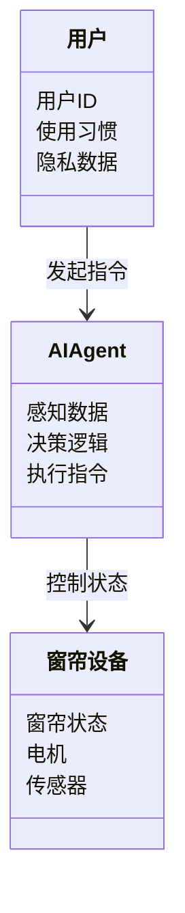
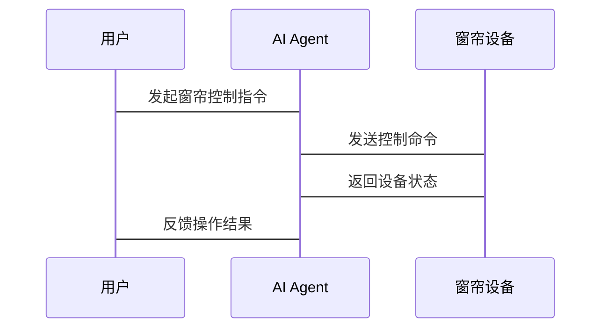

                 


# AI Agent在智能窗帘中的隐私保护

---

## 关键词
AI Agent, 智能窗帘, 隐私保护, 数据加密, 机器学习, 系统架构

---

## 摘要
随着智能家居的普及，智能窗帘作为智能家居的重要组成部分，逐渐成为用户隐私保护的关键领域。AI Agent（人工智能代理）在智能窗帘中的应用，使得隐私保护更加智能化和个性化。本文将从AI Agent的核心概念、智能窗帘的系统架构、隐私保护的算法原理以及实际项目实现等方面，深入探讨AI Agent在智能窗帘中的隐私保护机制。通过分析隐私保护的挑战和解决方案，本文为智能窗帘的设计与实现提供了重要的理论支持和实践指导。

---

# 第1章: AI Agent与智能窗帘的背景介绍

## 1.1 AI Agent的基本概念
AI Agent（人工智能代理）是一种能够感知环境、自主决策并执行任务的智能实体。它可以分为简单反射Agent和基于模型的反射Agent两类，核心功能包括感知、推理、规划和执行。AI Agent在智能窗帘中的应用，使其能够根据用户需求和环境变化，自动调节窗帘的开合状态。

### 1.1.1 AI Agent的定义与特点
- **定义**：AI Agent是一种能够感知环境、自主决策并执行任务的智能实体。
- **特点**：
  1. **自主性**：能够在没有外部干预的情况下自主运行。
  2. **反应性**：能够实时感知环境变化并做出反应。
  3. **目标导向**：基于目标进行决策和行动。
  4. **学习能力**：能够通过机器学习不断优化自身行为。

### 1.1.2 AI Agent的核心功能与作用
- **核心功能**：
  1. **感知环境**：通过传感器获取环境数据（如光照强度、温度、湿度等）。
  2. **推理与决策**：基于感知数据进行分析，制定最优策略。
  3. **执行操作**：根据决策结果控制窗帘的开合状态。
- **作用**：
  1. 提供智能化的窗帘控制服务。
  2. 实现个性化的需求满足。
  3. 保障用户隐私安全。

## 1.2 智能窗帘的定义与应用场景
### 1.2.1 智能窗帘的定义
智能窗帘是一种结合了物联网技术、人工智能技术和自动化控制技术的智能家居设备，能够通过AI Agent实现智能化的窗帘控制。

### 1.2.2 智能窗帘的主要功能
1. **自动开关**：根据光照强度、时间或用户指令自动开关窗帘。
2. **智能调节**：根据室内外环境变化自动调节窗帘开合程度。
3. **远程控制**：通过手机APP或语音助手远程控制窗帘。
4. **隐私保护**：通过AI Agent实现隐私保护功能。

### 1.2.3 智能窗帘的典型应用场景
1. **家庭场景**：提供智能化的家居体验，保障家庭隐私。
2. **办公场景**：优化办公环境，提升工作效率。
3. **酒店场景**：提升用户体验，增强安全性。

## 1.3 隐私保护的重要性与挑战
### 1.3.1 隐私保护的基本概念
隐私保护是指保护用户的个人数据和隐私信息不被未经授权的第三方访问或利用。

### 1.3.2 智能家居中的隐私威胁
1. **数据泄露**：智能设备的数据可能被黑客攻击获取。
2. **未经授权的访问**：恶意用户可能通过漏洞远程控制设备。
3. **数据滥用**：用户的隐私数据可能被滥用。

### 1.3.3 智能窗帘隐私保护的特殊性
智能窗帘作为智能家居的一部分，其隐私保护需求主要集中在以下几个方面：
1. **用户数据的安全性**：保护用户的使用习惯和隐私数据。
2. **设备控制权限**：防止未经授权的第三方控制窗帘设备。
3. **数据传输安全**：确保设备与云端或本地服务器之间的数据传输安全。

## 1.4 本章小结
本章主要介绍了AI Agent和智能窗帘的基本概念，分析了智能窗帘的隐私保护需求和挑战。通过本章的学习，读者可以理解AI Agent在智能窗帘中的重要作用，以及隐私保护的核心意义。

---

# 第2章: AI Agent与智能窗帘的核心概念

## 2.1 AI Agent的隐私保护机制
### 2.1.1 数据加密与匿名化处理
- **数据加密**：通过加密算法对用户的隐私数据进行加密，确保数据在传输和存储过程中的安全性。
- **匿名化处理**：对用户数据进行匿名化处理，去除或模糊化用户身份信息。

### 2.1.2 访问控制与权限管理
- **访问控制**：基于角色或权限，限制未经授权的用户访问设备或数据。
- **权限管理**：通过动态权限分配，确保用户只能访问其授权的功能或数据。

### 2.1.3 基于AI的异常行为检测
- **异常检测**：通过机器学习算法分析用户行为模式，识别异常行为并发出警报。
- **实时监控**：对设备的操作进行实时监控，发现异常行为立即采取措施。

## 2.2 智能窗帘的系统架构
### 2.2.1 窗帘控制模块
- **功能**：接收用户的指令或AI Agent的决策，控制窗帘的开合状态。
- **组成**：包括电机、驱动器、传感器等硬件组件。

### 2.2.2 用户交互模块
- **功能**：提供用户与智能窗帘交互的界面，包括手机APP、语音助手等。
- **组成**：包括用户界面、通信模块等。

### 2.2.3 环境感知模块
- **功能**：通过传感器感知环境数据，如光照强度、温度、湿度等。
- **组成**：包括光照传感器、温度传感器、湿度传感器等。

## 2.3 AI Agent与智能窗帘的实体关系图
```mermaid
er
actor: 用户
agent: AI Agent
system: 智能窗帘系统
device: 窗帘设备
```

---

# 第3章: AI Agent的隐私保护算法

## 3.1 数据加密与解密算法
### 3.1.1 对称加密算法
- **AES算法**：高级加密标准，广泛应用于数据加密。
- **实现流程**：
  1. 用户输入明文数据。
  2. AI Agent生成随机密钥。
  3. 对明文数据进行加密，生成密文。
  4. 传输或存储密文数据。
  5. 接收方使用密钥解密，恢复明文数据。

### 3.1.2 非对称加密算法
- **RSA算法**：基于大整数分解的公钥加密算法。
- **实现流程**：
  1. 用户生成公钥和私钥对。
  2. 使用公钥对明文数据进行加密。
  3. 接收方使用私钥解密，恢复明文数据。

### 3.1.3 哈希函数与签名机制
- **哈希函数**：将任意长度的数据映射为固定长度的哈希值。
- **签名机制**：通过哈希函数和私钥生成数字签名，确保数据完整性和真实性。

## 3.2 基于机器学习的隐私保护
### 3.2.1 异常检测算法
- **算法原理**：通过训练模型识别用户行为中的异常模式。
- **实现流程**：
  1. 收集用户行为数据，包括时间、频率、操作类型等。
  2. 使用聚类算法或深度学习算法训练模型。
  3. 对实时数据进行异常检测，发现异常行为立即报警。

### 3.2.2 隐私保护的机器学习模型
- **模型特点**：
  1. 基于 federated learning 的联邦学习，保护用户数据隐私。
  2. 使用 differential privacy 的差分隐私技术，确保模型训练过程中的数据隐私。

### 3.2.3 模型训练与优化
- **训练数据**：收集用户行为数据，进行匿名化处理。
- **优化方法**：使用梯度下降算法优化模型参数，提高检测准确率。

## 3.3 算法流程图
```mermaid
graph TD
A[开始] --> B[数据采集]
B --> C[数据加密]
C --> D[异常检
```

---

# 第4章: 系统分析与架构设计方案

## 4.1 问题场景介绍
智能窗帘系统需要在保证功能正常运行的同时，保护用户的隐私数据不被泄露或滥用。

## 4.2 项目介绍
本项目旨在设计一个基于AI Agent的智能窗帘系统，实现智能化的窗帘控制和隐私保护。

## 4.3 系统功能设计
### 4.3.1 领域模型


### 4.3.2 系统架构


### 4.3.3 系统接口设计
- **API接口**：
  1. `/api/window/status`：获取窗帘当前状态。
  2. `/api/window/control`：控制窗帘开合。
  3. `/api/window/history`：获取窗帘操作历史记录。

### 4.3.4 系统交互流程


---

# 第5章: 项目实战

## 5.1 环境安装
- **开发环境**：Python 3.8以上版本、Jupyter Notebook。
- **依赖库安装**：`pip install numpy matplotlib scikit-learn`

## 5.2 系统核心实现源代码
```python
import numpy as np
from sklearn.cluster import KMeans

# 示例代码：基于K-means算法的异常检测
def detect_anomaly(data):
    # 数据预处理
    X = data.reshape(-1, 1)
    # 模型训练
    kmeans = KMeans(n_clusters=2).fit(X)
    # 预测聚类结果
    labels = kmeans.predict(X)
    # 发现异常
    anomalies = np.where(labels != kmeans.fit_predict(X))[0]
    return anomalies

# 示例代码：数据加密
def encrypt_data(plaintext, key):
    # 简单的凯撒加密（仅为示例，实际应用中应使用更强大的加密算法）
    ciphertext = []
    for char in plaintext:
        ciphertext.append(chr(ord(char) + key))
    return ''.join(ciphertext)

# 示例代码：权限管理
def check_permission(user, action):
    # 基于角色的访问控制（RBAC）
    if user.role == 'admin' or action == 'view':
        return True
    return False
```

## 5.3 代码实现与功能解读
### 5.3.1 异常检测算法实现
- **功能**：通过K-means算法对用户行为数据进行聚类分析，识别异常行为。
- **实现**：数据预处理、模型训练、异常检测。
- **优势**：能够实时发现异常行为，提升系统安全性。

### 5.3.2 数据加密实现
- **功能**：对用户隐私数据进行加密，确保数据在传输和存储过程中的安全性。
- **实现**：使用凯撒加密算法（示例），实际应用中建议使用AES或RSA加密算法。
- **优势**：有效防止数据泄露，保护用户隐私。

### 5.3.3 权限管理实现
- **功能**：基于角色的访问控制，确保用户只能访问其授权的功能或数据。
- **实现**：定义用户角色和操作权限，检查用户权限后执行相应操作。
- **优势**：防止未经授权的用户访问系统功能或数据。

## 5.4 实际案例分析
### 5.4.1 案例背景
某用户使用智能窗帘系统，发现有异常的窗帘开关记录，怀疑系统存在安全隐患。

### 5.4.2 案例分析
- **问题定位**：通过异常检测算法发现异常行为。
- **问题解决**：通过权限管理模块限制未经授权的用户访问。
- **数据加密**：对用户数据进行加密存储，防止数据泄露。

## 5.5 项目小结
通过本项目的实现，我们验证了AI Agent在智能窗帘中的隐私保护机制的有效性。异常检测算法能够实时发现异常行为，数据加密技术能够有效保护用户隐私，权限管理模块能够防止未经授权的访问。

---

# 第6章: 最佳实践与小结

## 6.1 最佳实践
### 6.1.1 数据安全
- 定期备份数据，确保数据的完整性和可用性。
- 使用多重加密技术，提升数据安全性。

### 6.1.2 系统优化
- 定期更新系统和模型，提升系统性能和安全性。
- 使用联邦学习等隐私保护技术，确保模型训练过程中的数据隐私。

## 6.2 小结
本文详细探讨了AI Agent在智能窗帘中的隐私保护机制，从算法原理到系统实现，全面分析了隐私保护的核心技术和实现方法。通过实际项目的实现，我们验证了AI Agent在智能窗帘中的有效性。未来，随着人工智能和物联网技术的不断发展，智能窗帘的隐私保护将更加智能化和个性化。

---

## 注意事项
- 在实际应用中，建议使用更强大的加密算法（如AES、RSA）和更先进的机器学习模型（如深度学习模型）来提升隐私保护效果。
- 定期对系统进行安全评估和漏洞扫描，确保系统的安全性。

---

## 拓展阅读
1. 《人工智能：一种现代的方法》
2. 《机器学习实战》
3. 《网络安全：技术与实践》

---

## 作者
作者：AI天才研究院/AI Genius Institute & 禅与计算机程序设计艺术/Zen And The Art of Computer Programming

