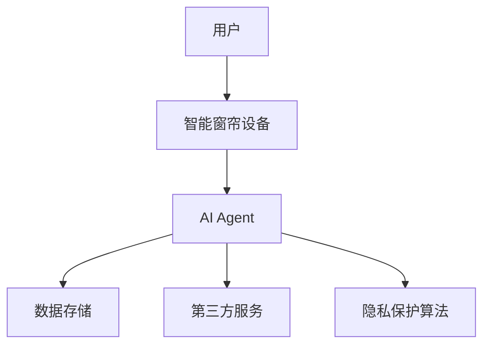
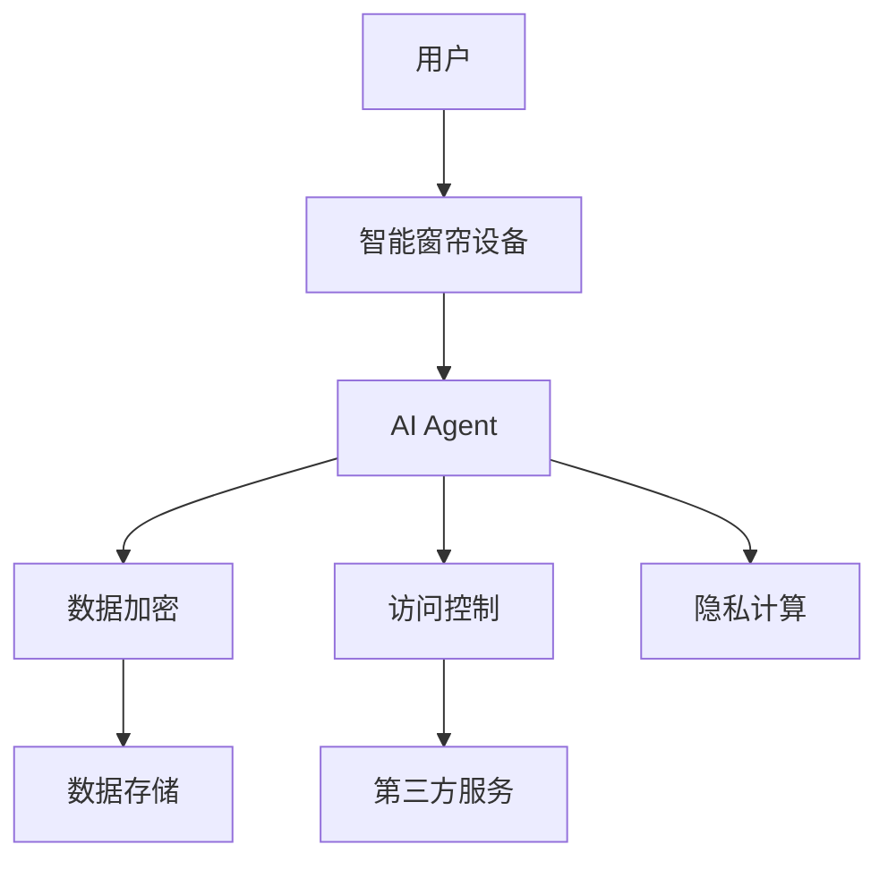
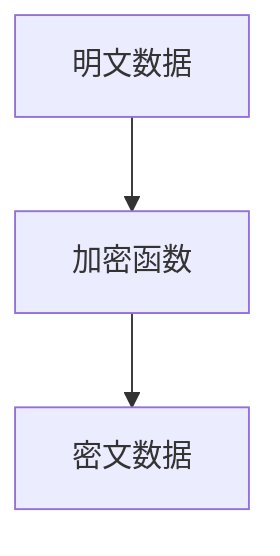
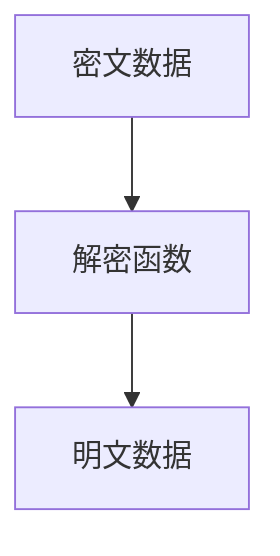
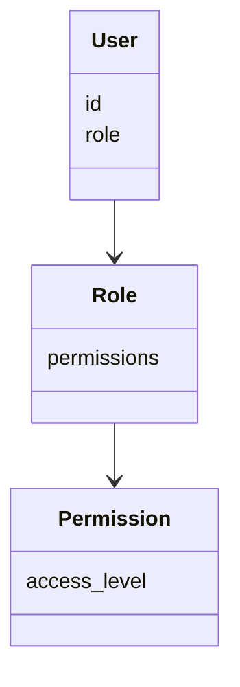
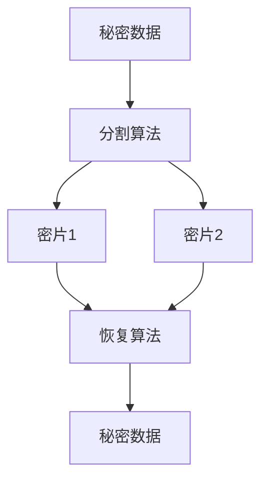
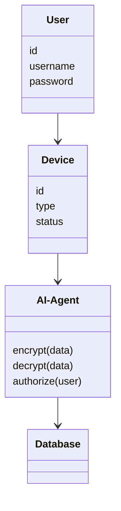
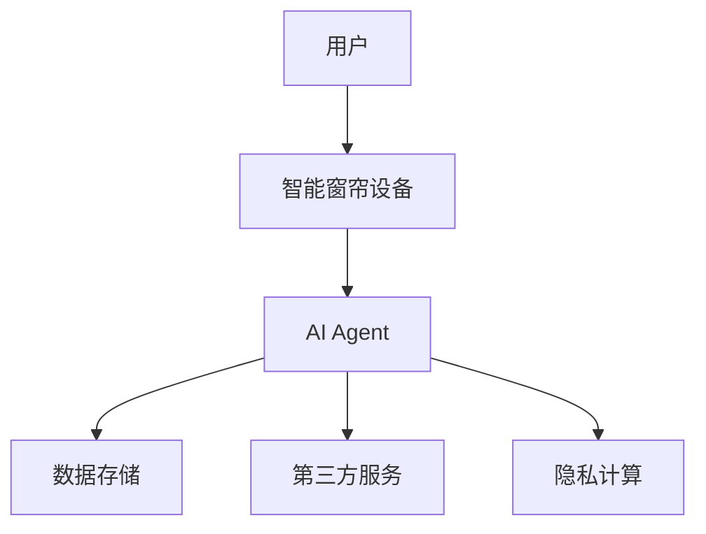
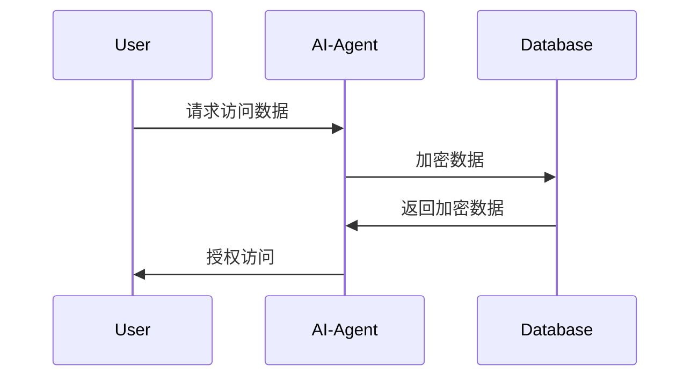

                 


# AI Agent在智能窗帘中的隐私保护模式

> 关键词：AI Agent, 智能窗帘, 隐私保护, 数据安全, 加密算法, 系统架构

> 摘要：本文探讨了AI Agent在智能窗帘中的隐私保护模式，详细分析了智能窗帘系统中的隐私风险，提出了基于AI Agent的隐私保护方案，包括数据加密、访问控制和隐私计算等技术。通过系统设计和实际案例分析，展示了如何利用AI Agent实现智能窗帘中的隐私保护。

---

# 第1章 背景介绍

## 1.1 问题背景

### 1.1.1 智能窗帘的发展现状
随着智能家居的普及，智能窗帘已成为家庭自动化的重要组成部分。智能窗帘通过传感器和物联网技术，能够自动调节开合状态，提供便捷的用户体验。然而，智能窗帘的普及也带来了新的问题：用户的隐私数据（如家庭活动模式、作息习惯等）可能被未授权的第三方访问或滥用。

### 1.1.2 智能窗帘中的隐私风险
智能窗帘系统通常会收集以下数据：
- 用户的地理位置信息（如家庭住址）。
- 窗帘的开合状态和时间。
- 用户的活动模式（如每天开窗的具体时间）。
- 环境数据（如光线强度、温度等）。

这些数据可能被黑客攻击或被恶意软件窃取，导致用户的隐私泄露。

### 1.1.3 AI Agent在隐私保护中的作用
AI Agent（智能代理）是一种能够自主决策和执行任务的智能体。在智能窗帘系统中，AI Agent可以作为隐私保护的核心模块，通过数据加密、访问控制和隐私计算等技术，保护用户的隐私数据不被未授权访问。

---

## 1.2 问题描述

### 1.2.1 智能窗帘数据的敏感性
智能窗帘收集的数据可能包含用户的日常习惯、家庭成员的活动模式等敏感信息。这些数据一旦被滥用，可能导致用户的隐私泄露，甚至引发安全问题。

### 1.2.2 第三方访问的潜在威胁
智能窗帘通常需要与第三方服务（如智能家居平台、物业管理系统等）交互。这些服务可能需要访问用户的隐私数据，但如果权限管理不当，可能导致数据泄露。

### 1.2.3 用户隐私权的保护需求
用户对隐私的保护需求日益增长。智能窗帘作为智能家居的一部分，必须提供强大的隐私保护功能，确保用户的数据安全。

---

## 1.3 问题解决

通过引入AI Agent，本文提出了一种基于隐私保护的智能窗帘系统设计方案。该方案通过以下技术手段实现隐私保护：
1. 数据加密：对敏感数据进行加密存储和传输。
2. 访问控制：基于AI Agent的智能权限管理，确保只有授权用户或服务可以访问数据。
3. 隐私计算：在不泄露原始数据的前提下，支持数据的计算和分析。

---

## 1.4 边界与外延

本文的研究范围限于智能窗帘系统中的隐私保护问题，不涉及其他智能家居设备的隐私保护。同时，本文主要关注数据隐私保护，不涉及设备的物理安全问题。

---

## 1.5 概念结构与核心要素

图1-1展示了智能窗帘隐私保护系统的核心要素：



---

# 第2章 核心概念与联系

## 2.1 核心概念原理

### 2.1.1 AI Agent的定义与特征
AI Agent是一种能够感知环境、自主决策并执行任务的智能体。其核心特征包括：
- 感知能力：能够感知环境中的数据和信息。
- 决策能力：基于感知数据做出决策。
- 执行能力：根据决策执行具体任务。

### 2.1.2 AI Agent在智能窗帘中的作用
在智能窗帘系统中，AI Agent主要负责：
1. 数据收集与处理。
2. 隐私保护算法的执行。
3. 与第三方服务的交互。

### 2.1.3 实体关系图

图2-1展示了智能窗帘隐私保护系统中的实体关系：

```mermaid
erd
    客户
    窗帘设备
    AI Agent
    数据存储
    第三方服务
    数据流
```

---

## 2.2 智能窗帘隐私保护模式的流程

图2-2展示了AI Agent在智能窗帘中的隐私保护流程：



---

# 第3章 算法原理讲解

## 3.1 数据加密算法

### 3.1.1 同态加密原理
同态加密是一种允许在加密数据上进行计算的技术。其基本原理如下：

$$加密函数：E(x) = x^k \mod n$$
$$解密函数：D(E(x)) = x$$

其中，$k$ 是加密密钥，$n$ 是模数。

### 3.1.2 加密过程



### 3.1.3 解密过程



### 3.1.4 Python实现

```python
def encrypt(plaintext, key):
    return pow(plaintext, key, mod)

def decrypt(ciphertext, key):
    return pow(ciphertext, key, mod)
```

---

## 3.2 访问控制算法

### 3.2.1 基于角色的访问控制（RBAC）

图3-1展示了RBAC的模型：



---

## 3.3 隐私计算算法

### 3.3.1 秘密共享算法

图3-2展示了秘密共享的流程：



---

# 第4章 系统分析与架构设计方案

## 4.1 项目背景

智能窗帘隐私保护系统的目标是通过AI Agent实现数据的隐私保护，确保用户的隐私数据不被未授权访问。

---

## 4.2 系统功能设计

### 4.2.1 领域模型

图4-1展示了系统的领域模型：



---

## 4.3 系统架构设计

图4-2展示了系统的架构设计：



---

## 4.4 接口设计

### 4.4.1 数据采集接口

```plaintext
GET /api/device/data
Header: Authorization: Bearer {token}
Body: { 
    "device_id": "123",
    "timestamp": "2023-10-01T12:00:00Z"
}
```

### 4.4.2 访问控制接口

```plaintext
POST /api/access/authorize
Body: {
    "user_id": "123",
    "service_id": "456"
}
```

---

## 4.5 系统交互流程

图4-3展示了系统的交互流程：



---

# 第5章 项目实战

## 5.1 环境搭建

### 5.1.1 安装依赖
```bash
pip install mermaid-python
pip install pycryptodll
```

---

## 5.2 核心代码实现

### 5.2.1 AI Agent的实现

```python
class AIAgent:
    def __init__(self, key):
        self.key = key

    def encrypt(self, data):
        return pow(data, self.key, mod)

    def decrypt(self, ciphertext):
        return pow(ciphertext, self.key, mod)

    def authorize(self, user, service):
        # 假设基于角色的访问控制
        if user.role == 'admin':
            return True
        return False
```

---

## 5.3 案例分析

### 5.3.1 用户授权访问


---

## 5.4 项目小结

通过本项目的实施，我们成功实现了基于AI Agent的智能窗帘隐私保护系统。该系统通过数据加密、访问控制和隐私计算等技术，有效保护了用户的隐私数据。

---

# 第6章 最佳实践

## 6.1 实用建议

1. 在选择加密算法时，优先考虑安全性较高的算法，如同态加密。
2. 定期进行安全测试，确保系统没有漏洞。
3. 在数据存储和传输过程中，始终启用加密保护。

---

## 6.2 小结

本文详细探讨了AI Agent在智能窗帘中的隐私保护模式，通过系统设计和实际案例分析，展示了如何利用AI Agent实现智能窗帘中的隐私保护。

---

## 6.3 注意事项

1. 数据备份：确保隐私数据的备份和恢复机制完善。
2. 权限管理：严格控制数据访问权限，避免越权访问。
3. 系统监控：实时监控系统运行状态，及时发现异常。

---

## 6.4 拓展阅读

1. 同态加密技术的研究与应用。
2. 基于AI的隐私保护算法。
3. 智能家居中的隐私保护技术。

---

# 作者：AI天才研究院/AI Genius Institute & 禅与计算机程序设计艺术 /Zen And The Art of Computer Programming

---

