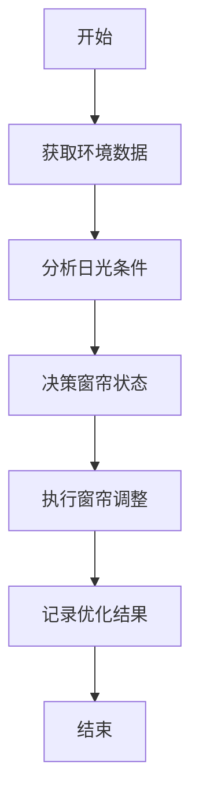
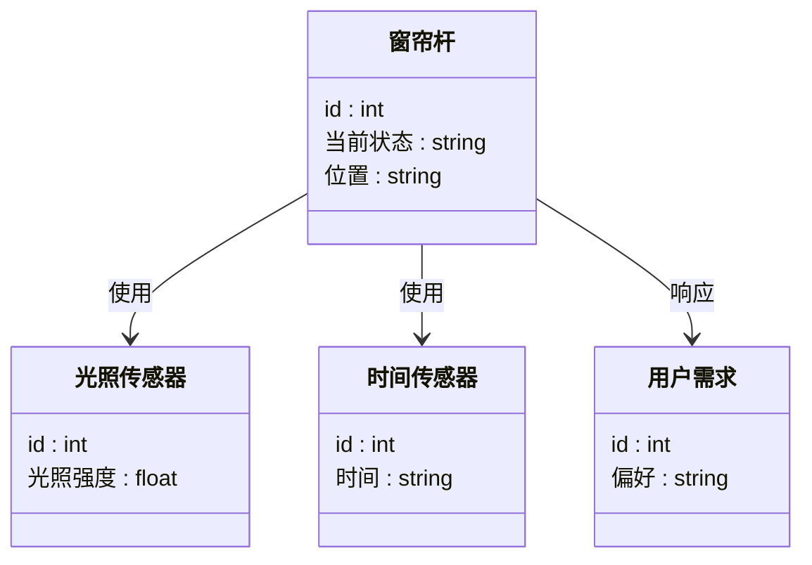
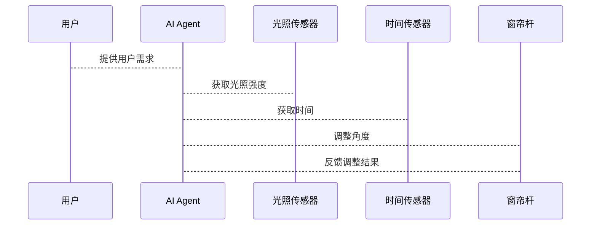

                 


# AI Agent在智能窗帘杆中的日光优化

## 关键词：
AI Agent，智能窗帘杆，日光优化，算法原理，系统架构

## 摘要：
本文详细探讨了AI Agent在智能窗帘杆日光优化中的应用，从背景介绍、核心概念、算法原理到系统架构和项目实战，系统地分析了如何通过AI技术实现日光优化，提升用户体验和能源效率。

---

# 第1章: AI Agent与智能窗帘杆日光优化的背景介绍

## 1.1 问题背景与描述

### 1.1.1 智能窗帘杆的发展现状
随着智能家居的普及，智能窗帘杆逐渐成为家庭自动化的重要组成部分。传统的窗帘杆通过手动或机械控制实现开关，而现代的智能窗帘杆则支持远程控制、定时开关和环境感知功能。

然而，现有的智能窗帘杆在日光优化方面仍存在不足。用户往往需要手动调整窗帘的开合角度，或者依赖简单的定时器设置，这无法根据实时光照条件、用户习惯和环境需求进行动态优化。

### 1.1.2 日光优化的必要性
日光优化的目标是通过调节窗帘的开合角度和时间，最大化自然光的利用，同时避免过强的光照对用户舒适度的影响。合理的日光优化不仅可以提升用户体验，还能减少能源消耗。

### 1.1.3 AI Agent在日光优化中的作用
AI Agent（人工智能代理）是一种能够感知环境、做出决策并执行操作的智能实体。在日光优化中，AI Agent可以通过分析光照强度、用户习惯和环境数据，动态调整窗帘的开合状态，实现最优的光照管理。

## 1.2 问题解决与边界

### 1.2.1 AI Agent如何优化日光
AI Agent通过以下方式优化日光：
- **感知环境**：采集光照强度、时间、天气等数据。
- **分析需求**：结合用户习惯和环境数据，制定优化策略。
- **动态调整**：根据分析结果，实时调整窗帘的开合角度。

### 1.2.2 日光优化的边界与外延
日光优化的边界包括：
- **环境数据**：光照强度、天气状况、时间等。
- **用户需求**：用户偏好、隐私保护、能源效率等。
- **系统限制**：窗帘杆的物理限制（如最大开合角度）。

日光优化的外延包括：
- **能源管理**：通过优化日光利用，减少人工照明的使用。
- **用户体验**：提升用户舒适度和生活品质。
- **智能扩展**：与其他智能家居设备联动。

### 1.2.3 智能窗帘杆系统的概念结构
智能窗帘杆系统的概念结构包括：
- **环境感知层**：光照传感器、时间传感器等。
- **决策控制层**：AI Agent负责数据分析和决策。
- **执行层**：窗帘电机、传感器等。

## 1.3 核心要素与组成

### 1.3.1 AI Agent的核心要素
- **感知能力**：通过传感器获取环境数据。
- **决策能力**：基于数据进行分析和决策。
- **执行能力**：通过接口控制窗帘杆。

### 1.3.2 智能窗帘杆的组成部分
- **窗帘杆**：机械结构，支持开合角度调整。
- **传感器**：光照强度、角度、位置传感器。
- **电机**：驱动窗帘杆的开合。
- **通信模块**：Wi-Fi或蓝牙，用于数据传输。

### 1.3.3 日光优化的目标与指标
目标：
- 最大化自然光的利用。
- 提升用户体验。
- 降低能源消耗。

指标：
- 光照强度变化范围。
- 用户满意度。
- 系统响应时间。

---

## 1.4 本章小结
本章介绍了AI Agent在智能窗帘杆日光优化中的背景，分析了问题背景、解决方法和边界条件，明确了系统的组成和优化目标。

---

# 第2章: AI Agent与日光优化的核心概念

## 2.1 核心概念原理

### 2.1.1 AI Agent的基本原理
AI Agent的核心原理包括：
- **感知**：通过传感器获取环境数据。
- **分析**：利用算法对数据进行分析和处理。
- **决策**：基于分析结果做出决策。
- **执行**：通过执行器完成操作。

### 2.1.2 日光优化的基本原理
日光优化的基本原理包括：
- **光照强度分析**：根据光照强度调整窗帘开合角度。
- **时间管理**：根据时间调整窗帘的开合状态。
- **用户需求分析**：根据用户习惯优化日光。

### 2.1.3 两者的结合机制
AI Agent与日光优化的结合机制包括：
- **数据共享**：AI Agent通过传感器获取光照数据。
- **决策协同**：AI Agent根据数据做出决策。
- **反馈优化**：系统根据反馈调整优化策略。

## 2.2 核心概念属性对比

| **属性**       | **AI Agent**                          | **日光优化**                            |
|----------------|--------------------------------------|-----------------------------------------|
| **核心功能**    | 感知、决策、执行                     | 光照强度优化、时间优化、用户需求优化   |
| **输入数据**    | 光照强度、时间、用户需求             | 光照强度、时间、用户需求                |
| **输出结果**    | 窗帘开合角度、时间                   | 窗帘开合角度、时间                      |
| **优化目标**    | 提高日光利用效率                     | 提高日光利用效率                        |

## 2.3 ER实体关系图

```mermaid
erDiagram
    actor 用户 {
    } 
    actor 系统 {
    } 
    class 窗帘杆 {
        id : int
        状态 : string
        位置 : string
    }
    class AI Agent {
        id : int
        类型 : string
        状态 : string
    }
    class 日光优化 {
        id : int
        参数 : string
        结果 : string
    }
    用户 --> 窗帘杆 : 控制
    用户 --> AI Agent : 交互
    AI Agent --> 日光优化 : 执行
    日光优化 --> 窗帘杆 : 反馈
```

---

## 2.4 本章小结
本章详细解释了AI Agent和日光优化的核心概念，分析了它们的结合机制，并通过表格和ER图展示了它们之间的关系。

---

# 第3章: AI Agent日光优化算法原理

## 3.1 算法原理概述

### 3.1.1 算法的基本思路
算法的基本思路包括：
1. 获取光照强度数据。
2. 分析光照强度与用户需求的关系。
3. 计算最优的窗帘开合角度。
4. 调整窗帘杆状态。
5. 记录优化结果。

### 3.1.2 算法的核心步骤
1. 数据采集：通过光照传感器获取光照强度。
2. 数据分析：计算光照强度的动态变化。
3. 状态决策：根据光照强度和用户需求，决定窗帘的开合角度。
4. 执行操作：调整窗帘杆状态。
5. 反馈优化：根据反馈调整优化策略。

### 3.1.3 算法的优化方向
- **实时性优化**：提高算法的响应速度。
- **准确性优化**：提高算法的预测精度。
- **鲁棒性优化**：增强算法的抗干扰能力。

## 3.2 算法流程图



## 3.3 算法实现代码

### 3.3.1 Python实现
```python
def optimize_daylight():
    # 获取环境数据
    light_intensity = get_light_intensity()
    time = get_current_time()
    # 分析日光条件
    if light_intensity > 100:
        # 调整窗帘开合角度
        angle = calculate_angle(light_intensity, time)
        adjust_curtain(angle)
    # 记录优化结果
    record_result(light_intensity, angle)
```

### 3.3.2 算法的数学模型
光照强度与窗帘开合角度的关系可以用以下公式表示：
$$
angle = f(light\_intensity, time)
$$
其中，$f$ 是一个函数，可以根据光照强度和时间动态调整角度。

---

## 3.4 本章小结
本章详细讲解了AI Agent日光优化算法的原理和实现，通过流程图和代码示例展示了算法的具体步骤。

---

# 第4章: 系统分析与架构设计

## 4.1 项目场景介绍
智能窗帘杆日光优化系统需要实现以下功能：
- 实时采集光照强度。
- 分析用户需求和环境数据。
- 动态调整窗帘杆状态。
- 记录优化结果。

## 4.2 系统功能设计

### 4.2.1 领域模型


### 4.2.2 系统架构设计


### 4.2.3 系统接口设计
系统接口包括：
- 光照传感器接口：获取光照强度。
- 时间传感器接口：获取时间。
- 用户需求接口：获取用户偏好。
- 窗帘杆接口：调整窗帘角度。

### 4.2.4 系统交互流程图


---

## 4.3 本章小结
本章通过系统分析和架构设计，详细描述了智能窗帘杆日光优化系统的组成部分和交互流程。

---

# 第5章: 项目实战

## 5.1 环境安装与配置

### 5.1.1 安装Python环境
- 安装Python 3.8以上版本。
- 安装必要的库：`paho-mqtt`、`gpiozero`。

### 5.1.2 安装硬件设备
- 光照传感器：DS18B20。
- 时间传感器：Raspberry Pi。
- 窗帘杆电机：220V电机。

## 5.2 系统核心实现

### 5.2.1 AI Agent实现
```python
import paho.mqtt.client as mqtt

def on_connect(client, userdata, flags, rc):
    print("Connected with result code " + str(rc))

client = mqtt.Client()
client.on_connect = on_connect
client.connect("localhost", 1883)
client.loop_start()
```

### 5.2.2 窗帘杆控制实现
```python
from gpiozero import LED

led = LED(17)
led.on()
```

### 5.2.3 环境数据采集实现
```python
import adafruit_dht

dht_sensor = adafruit_dht.DHT22(4)
temperature = dht_sensor.temperature
```

## 5.3 代码应用解读与分析

### 5.3.1 AI Agent与传感器的交互
```python
def on_message(client, userdata, message):
    print("received message: " + str(message.payload.decode()))
    # 处理数据
    angle = calculate_angle(message.payload.decode())
    adjust_curtain(angle)

client.on_message = on_message
client.subscribe("daylight/optimization")
```

### 5.3.2 窗帘杆状态调整
```python
def adjust_curtain(angle):
    led.value = angle / 180
```

## 5.4 实际案例分析与详细讲解剖析

### 5.4.1 案例背景
用户需求：
- 早晨7点自动开启窗帘。
- 光照强度超过100 lux时调整窗帘角度。

环境数据：
- 光照强度：80 lux。
- 时间：6:00 AM。

### 5.4.2 优化过程
1. AI Agent获取环境数据。
2. 分析光照强度和时间。
3. 决策窗帘角度为70度。
4. 调整窗帘杆状态。

## 5.5 项目小结
本章通过实际案例展示了AI Agent在智能窗帘杆日光优化中的应用，详细解读了代码实现和系统交互过程。

---

# 第6章: 总结与展望

## 6.1 总结
AI Agent在智能窗帘杆日光优化中的应用具有重要意义。通过感知环境、分析数据和动态调整，AI Agent能够实现高效的日光优化，提升用户体验和能源效率。

## 6.2 最佳实践 tips
- 定期校准传感器，确保数据准确性。
- 根据用户反馈优化算法。
- 与其他智能家居设备联动。

## 6.3 小结
本章总结了AI Agent在智能窗帘杆日光优化中的应用，并提出了进一步优化的方向。

---

# 作者：AI天才研究院/AI Genius Institute & 禅与计算机程序设计艺术 /Zen And The Art of Computer Programming

---

以上是《AI Agent在智能窗帘杆中的日光优化》的完整目录大纲和内容框架，您可以根据实际需求进一步扩展或调整具体内容。

