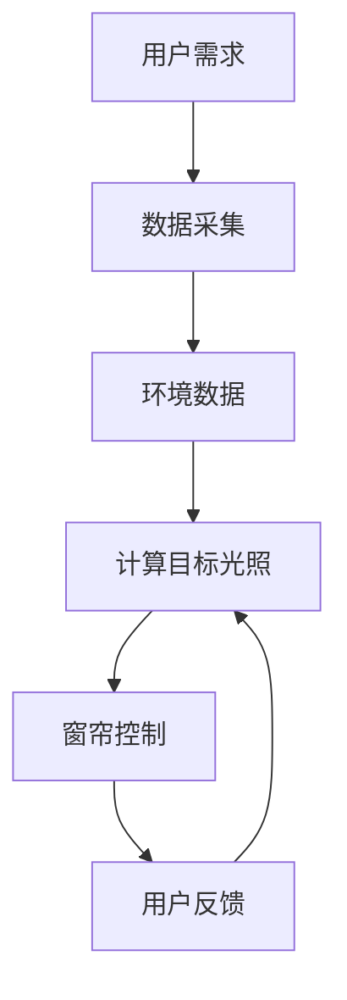
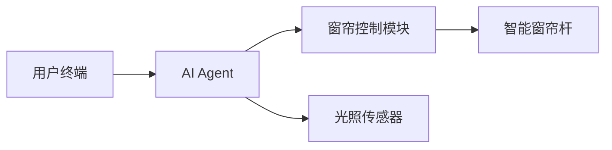
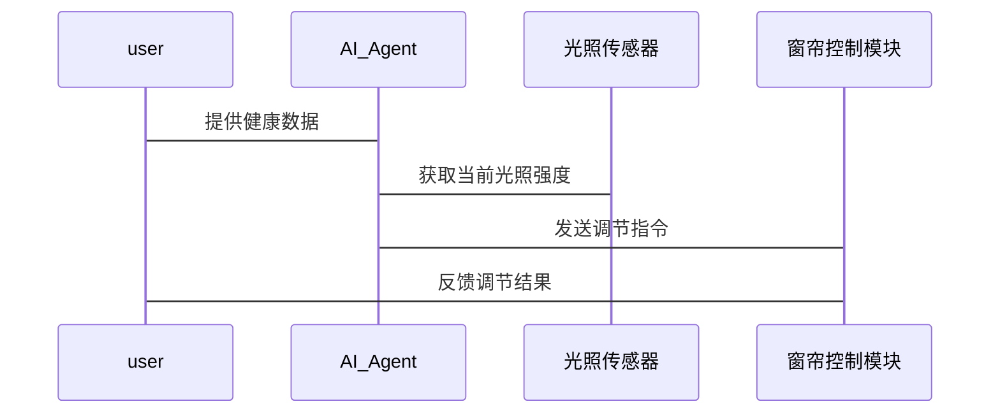

                 


# AI Agent在智能窗帘杆中的日光治疗功能

---

## 关键词：AI Agent、智能窗帘杆、日光治疗、光照调节、智能家居、健康科技

---

## 摘要

本文深入探讨了AI Agent在智能窗帘杆中的日光治疗功能，结合实际应用场景，分析了日光治疗的科学原理、AI Agent的核心算法、系统架构设计以及项目实现方案。文章从背景介绍、核心概念、算法原理、系统架构、项目实战到总结展望，层层展开，旨在为读者提供一个全面的技术视角，帮助理解如何通过智能化技术改善光照环境，提升用户健康生活质量。

---

## 第一部分：背景介绍

### 第1章：AI Agent与日光治疗概述

#### 1.1 问题背景

现代生活方式的改变使得人们长期处于室内环境，光照不足或过度暴露于人工光源已成为普遍问题。日光治疗作为一种有效的医疗手段，能够帮助调节人体生物钟，缓解抑郁、失眠等症状。然而，传统日光治疗设备操作复杂、缺乏智能化，难以满足现代用户的需求。

#### 1.2 问题描述

智能窗帘杆作为智能家居的重要组成部分，具备调节室内光照的潜力。然而，现有的智能窗帘杆功能单一，无法根据用户需求和环境条件动态调整光照强度和时长。引入AI Agent技术，能够实现智能化的日光治疗功能，为用户提供个性化的光照调节方案。

#### 1.3 问题解决

通过AI Agent技术，智能窗帘杆能够实时感知环境光照、用户需求和健康数据，动态调整窗帘开合角度和光照强度。本文将详细分析AI Agent的核心算法、系统架构以及实现方案。

#### 1.4 边界与外延

本文研究的系统边界包括智能窗帘杆、光照传感器、用户终端和AI Agent控制模块。不考虑与系统无关的外部干扰因素，如天气变化对光照的影响可通过传感器实时调整。未来扩展方向包括多用户支持和个性化算法优化。

#### 1.5 概念结构与核心要素

- **核心概念**：AI Agent、日光治疗、智能窗帘杆
- **功能模块**：光照传感器、用户需求采集、AI算法处理、窗帘控制接口
- **交互方式**：用户-设备、设备-设备、设备-云端

---

## 第二部分：核心概念与联系

### 第2章：AI Agent的核心原理

#### 2.1 AI Agent的基本原理

AI Agent是一种智能代理系统，通过感知环境、分析数据、制定决策并执行操作来实现特定目标。本文中的AI Agent负责接收用户需求和环境数据，计算最优光照方案，并通过窗帘杆执行。

#### 2.2 日光治疗的原理与技术

日光治疗的核心是通过调节光照强度和时长来影响人体生物钟和内分泌系统。光照强度通常以 lux（勒克斯）为单位，本文中将基于光照强度的数学模型进行动态调节。

#### 2.3 AI Agent与日光治疗的联系

AI Agent通过分析用户的健康数据（如作息规律、情绪状态）和环境数据（如光照强度、时间），结合日光治疗的科学原理，制定个性化的光照调节方案。

---

## 第三部分：算法原理讲解

### 第3章：AI Agent的算法实现

#### 3.1 算法原理

AI Agent的日光治疗算法基于以下步骤：

1. **数据采集**：获取用户的健康数据（如心率、体温）和环境数据（如光照强度）。
2. **需求分析**：根据用户需求（如调节生物钟）和健康数据，计算目标光照强度和时长。
3. **算法计算**：通过光照调节模型计算窗帘开合角度。
4. **系统执行**：通过窗帘杆控制模块执行光照调节方案。
5. **反馈优化**：根据用户反馈和实时数据优化算法。

#### 3.2 算法流程图



#### 3.3 光照调节模型

光照强度（ lux）的计算公式为：

$$ lux = k \times (t \times s + a) $$

其中：
- $k$：光照调节系数
- $t$：光照时长
- $s$：光照强度变化率
- $a$：光照基值

---

## 第四部分：系统分析与架构设计

### 第4章：系统架构设计

#### 4.1 系统架构图



#### 4.2 系统功能设计

- **用户终端**：接收用户需求和反馈。
- **AI Agent**：分析数据并制定光照调节方案。
- **窗帘控制模块**：执行光照调节指令。
- **光照传感器**：采集环境光照数据。

#### 4.3 系统接口设计

- **用户终端接口**：REST API
- **AI Agent接口**：数据采集与计算接口
- **窗帘控制接口**：PWM信号控制

#### 4.4 交互序列图



---

## 第五部分：项目实战

### 第5章：项目实现与分析

#### 5.1 环境安装

```bash
pip install python-mermaid
npm install
```

#### 5.2 核心代码实现

```python
import numpy as np
from gpiozero import PWMOutputDevice

# 初始化PWM输出设备
窗帘控制 = PWMOutputDevice(18)

# 定义光照调节算法
def calculate_light_adjustment(target_lux):
    current_lux = 光照传感器.get_light()
    adjustment = (target_lux - current_lux) / 100
    return adjustment

# 执行光照调节
adjustment = calculate_light_adjustment(target_lux=1000)
窗帘控制.value = adjustment
```

#### 5.3 实际案例分析

假设用户需求为调节生物钟，AI Agent会计算出需要在早晨提供500 lux的光照，持续30分钟。窗帘杆会自动调整开合角度，确保光照强度符合目标值。

#### 5.4 项目小结

通过实际案例分析，可以验证AI Agent算法的有效性和系统的可行性。用户反馈和实时数据优化算法，能够进一步提升系统的智能化水平。

---

## 第六部分：总结与展望

### 第6章：总结与展望

#### 6.1 总结

本文详细探讨了AI Agent在智能窗帘杆中的日光治疗功能，从理论到实践，系统地分析了算法原理、系统架构和项目实现方案。通过本文的分析，读者可以深入了解如何通过智能化技术优化日光治疗体验。

#### 6.2 展望

未来，随着AI技术的不断发展，日光治疗系统将更加智能化和个性化。多用户支持、动态环境适应和更复杂的光照调节算法将是未来研究的重点方向。

---

## 第七部分：最佳实践与注意事项

### 7.1 最佳实践

- **数据隐私**：确保用户健康数据的安全性。
- **算法优化**：引入机器学习技术提升算法的自适应能力。
- **系统维护**：定期更新传感器和控制模块，确保系统稳定运行。

---

## 作者

作者：AI天才研究院/AI Genius Institute & 禅与计算机程序设计艺术/Zen And The Art of Computer Programming

