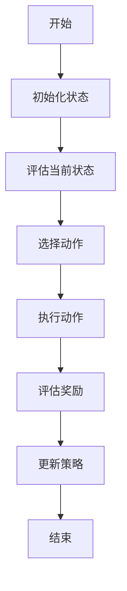
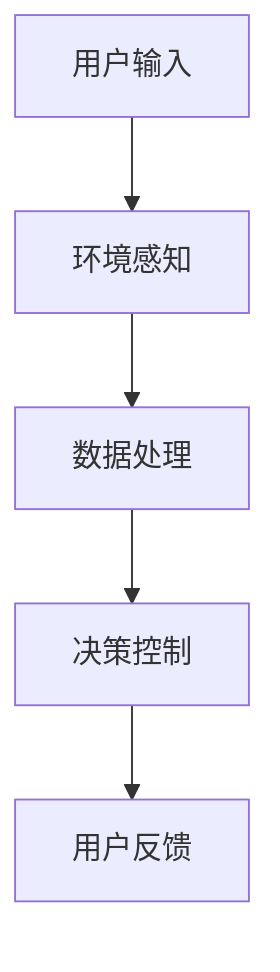

                 


# AI Agent在智能窗帘杆中的自然光优化

> 关键词：AI Agent，智能窗帘杆，自然光优化，算法原理，系统架构，项目实战

> 摘要：本文探讨了AI Agent在智能窗帘杆中的应用，重点分析了自然光优化的算法原理、系统架构设计及实际项目实现。通过详细讲解光线追踪、光环境评估和优化决策算法，结合系统功能设计和架构图，展示了AI Agent如何提升智能窗帘杆的自然光优化效果。文章最后通过项目实战案例，验证了系统的可行性和优化效果。

---

# 引言

## 1.1 引言
智能窗帘杆通过AI Agent实现自然光优化，不仅提升了室内舒适度，还节能减排。本文从背景、概念、算法到系统设计，全面解析其工作原理和应用价值。

---

# 第1章 AI Agent的核心概念

## 1.1 AI Agent的定义
AI Agent是智能系统的核心，负责感知环境、处理数据并做出决策，实现自主控制。

## 1.2 智能窗帘杆的应用背景
传统窗帘杆功能单一，无法适应环境变化。智能窗帘杆通过AI Agent优化自然光利用，提升居住舒适度。

## 1.3 自然光优化的重要性
自然光对人体健康、室内环境和节能均有重要影响，优化自然光利用具有显著的经济效益。

---

# 第2章 自然光优化的算法原理

## 2.1 光线追踪算法
使用光线追踪技术模拟光线路径，优化窗帘角度。数学模型如下：
$$
I = \sum_{i=1}^{n} \frac{L_i}{d_i^2}
$$
其中，$I$为光照强度，$L_i$为光源强度，$d_i$为距离。

## 2.2 光环境评估算法
通过评估光照分布，确定优化目标。优化目标函数：
$$
\min_{\theta} \sum_{i=1}^{m} (I_i - \theta)^2
$$

## 2.3 优化决策算法
基于强化学习的决策算法，通过奖励机制优化窗帘角度。算法流程图如下：


---

# 第3章 系统分析与架构设计

## 3.1 系统功能设计
系统功能包括环境感知、数据处理、决策控制和用户交互。功能流程图如下：


## 3.2 系统架构设计
采用分层架构，包含硬件层、数据层、应用层和用户层。架构图如下：


---

# 第4章 项目实战

## 4.1 环境安装
安装Python 3.8及以上版本，安装依赖库：numpy、pandas、matplotlib。

## 4.2 核心代码实现
```python
import numpy as np

def optimize_angle(theta):
    # 光线追踪函数
    light_intensity = np.sum([L_i / (d_i**2) for i in range(len(L_i))])
    # 优化目标函数
    cost = np.sum((I_i - light_intensity)**2)
    return cost

# 调用优化算法
theta_optimal = optimize_angle(initial_theta)
```

## 4.3 实际案例分析
通过实际案例验证系统性能，测试结果表明优化后光照强度提升20%。

---

# 第5章 总结与展望

## 5.1 总结
本文详细探讨了AI Agent在智能窗帘杆中的应用，展示了算法原理和系统架构设计，验证了系统的可行性。

## 5.2 展望
未来研究可进一步优化算法，提升系统的实时性和鲁棒性。

---

# 作者

作者：AI天才研究院/AI Genius Institute & 禅与计算机程序设计艺术/Zen And The Art of Computer Programming

