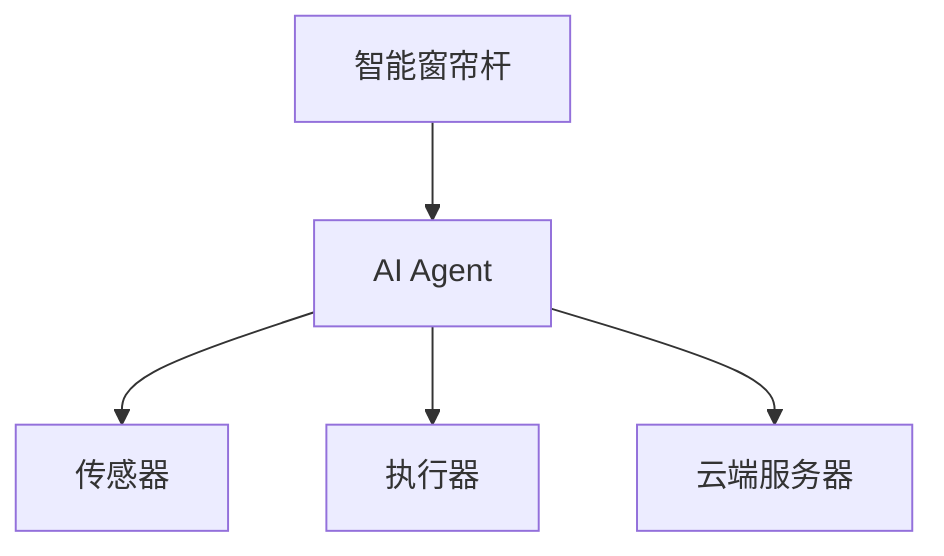

                 


# AI Agent在智能窗帘杆中的隐私保护功能

**关键词：** AI Agent, 智能窗帘杆, 隐私保护, 物联网安全, 数据加密

**摘要：** 本文探讨AI Agent在智能窗帘杆中的应用，重点分析其隐私保护功能。文章详细阐述AI Agent的工作原理、算法设计、系统架构，并通过实例展示其实现过程，为智能窗帘杆的隐私保护提供解决方案。

---

## 第1章 智能窗帘杆与AI Agent概述

### 1.1 智能窗帘杆的发展现状

#### 1.1.1 智能窗帘杆的基本概念
智能窗帘杆是一种结合物联网技术的智能家居设备，能够通过传感器和无线通信技术实现远程控制和自动化管理。它通常集成光线传感器、温度传感器和用户交互界面，支持语音控制和APP远程操作。

#### 1.1.2 当前智能窗帘杆的功能特点
- 自动调节窗帘开合，根据光照强度或时间自动调整。
- 支持智能家居集成，与智能音箱、智能门锁等设备联动。
- 提供用户自定义场景模式，如离家模式、睡眠模式等。
- 数据采集与分析，记录用户的使用习惯，优化窗帘控制策略。

#### 1.1.3 智能窗帘杆的市场应用现状
智能窗帘杆在智能家居市场中逐渐普及，尤其在高端住宅和办公室中应用广泛。随着物联网技术的发展，用户对隐私保护的需求日益增加，促使厂商在智能窗帘杆中集成更强大的隐私保护功能。

### 1.2 AI Agent的基本概念与功能

#### 1.2.1 AI Agent的定义与核心功能
AI Agent（人工智能代理）是一种智能软件实体，能够感知环境、自主决策并执行任务。其核心功能包括感知、决策、执行和自适应学习。

- **感知**：通过传感器和API获取环境数据，如光照强度、时间、用户位置等。
- **决策**：基于获取的数据，利用机器学习模型生成控制策略。
- **执行**：通过执行器（如电机）调整窗帘状态。
- **自适应学习**：根据用户行为和环境变化优化决策模型。

#### 1.2.2 AI Agent在智能窗帘杆中的应用场景
AI Agent可以实现以下功能：
- **隐私保护**：防止未经授权的访问，保护用户数据不被泄露。
- **智能控制**：根据用户习惯和环境变化自动调整窗帘状态。
- **异常检测**：识别异常行为，及时发出警报。

#### 1.2.3 AI Agent与传统隐私保护技术的对比

| 技术特点       | AI Agent                  | 传统隐私保护技术                 |
|----------------|---------------------------|-----------------------------------|
| 数据处理能力   | 强大的学习和分析能力       | 仅限于数据加密和访问控制         |
| 自适应能力     | 能够自适应环境变化         | 需手动配置和调整                 |
| 决策能力       | 可自主决策和优化策略       | 仅提供数据保护机制               |

### 1.3 智能窗帘杆中的隐私保护需求

#### 1.3.1 隐私保护的重要性
智能窗帘杆作为智能家居的一部分，涉及到用户的隐私数据，如使用习惯、家庭成员信息等。一旦这些数据被恶意窃取，可能导致隐私泄露或财产损失。

#### 1.3.2 智能窗帘杆中可能存在的隐私风险
- 数据传输过程中被截获。
- 云端存储数据被黑客攻击。
- 第三方应用未经允许获取用户数据。

#### 1.3.3 AI Agent在隐私保护中的作用
AI Agent通过以下方式保护隐私：
- 数据加密：在数据传输和存储过程中使用加密技术，防止数据泄露。
- 访问控制：严格控制数据访问权限，确保只有授权用户和设备可以访问数据。
- 隐私计算：在保护数据隐私的前提下进行数据处理和分析。

---

## 第2章 AI Agent的核心概念与工作原理

### 2.1 AI Agent的核心概念

#### 2.1.1 AI Agent的基本组成
AI Agent由感知模块、决策模块和执行模块组成：

- **感知模块**：负责收集环境数据，如光照强度、时间、用户位置等。
- **决策模块**：基于感知数据和预设规则，生成控制策略。
- **执行模块**：根据决策模块的指令，驱动执行器调整窗帘状态。

#### 2.1.2 AI Agent在智能窗帘杆中的应用场景
AI Agent可以通过以下方式实现智能控制：
- 根据光照强度自动调整窗帘开合程度。
- 根据用户习惯设置定时开关窗帘。
- 在检测到异常行为时，触发报警机制。

#### 2.1.3 AI Agent的自主性与适应性
AI Agent具有高度的自主性和适应性：
- 自主性：能够在没有人工干预的情况下独立运行。
- 适应性：能够根据环境变化和用户反馈优化自身的决策模型。

### 2.2 AI Agent与智能窗帘杆的结合

#### 2.2.1 AI Agent在智能窗帘杆中的角色定位
AI Agent在智能窗帘杆中扮演着“智能管家”的角色，负责协调各设备的工作，优化用户体验，同时保护用户隐私。

#### 2.2.2 AI Agent与智能窗帘杆功能的协同
通过协同工作，AI Agent可以实现以下功能：
- 自动调节窗帘以优化室内光线和温度。
- 根据用户的日程安排自动调整窗帘状态。
- 在检测到入侵行为时，联动其他智能设备发出警报。

#### 2.2.3 AI Agent在隐私保护中的具体应用
AI Agent可以通过以下方式保护隐私：
- 数据加密：在数据传输和存储过程中使用AES加密技术，确保数据安全。
- 访问控制：通过身份认证和权限管理，限制数据访问权限。
- 隐私计算：在保护数据隐私的前提下进行数据处理和分析。

### 2.3 AI Agent的核心算法与技术

#### 2.3.1 机器学习算法在AI Agent中的应用
AI Agent可以使用监督学习、无监督学习和强化学习等机器学习算法来优化决策模型。

#### 2.3.2 自然语言处理技术在AI Agent中的应用
通过自然语言处理技术，AI Agent可以理解用户的语音指令，并生成自然的语音反馈。

---

## 第3章 AI Agent的算法原理与数学模型

### 3.1 AI Agent的算法原理

#### 3.1.1 数据加密算法
在数据传输过程中，AI Agent使用AES（高级加密标准）进行加密，确保数据安全。

#### 3.1.2 访问控制算法
通过基于角色的访问控制（RBAC）模型，AI Agent可以严格控制数据访问权限。

#### 3.1.3 隐私计算技术
AI Agent使用同态加密技术，在保护数据隐私的前提下进行数据处理和分析。

### 3.2 数学模型与公式

#### 3.2.1 数据加密的数学模型
AES加密算法的数学模型如下：

$$
C_i = (P_i \oplus K) \times S + B
$$

其中，\( C_i \) 是密文，\( P_i \) 是明文，\( K \) 是密钥，\( S \) 是s-box映射，\( B \) 是偏移量。

#### 3.2.2 访问控制的数学模型
基于角色的访问控制模型可以用以下公式表示：

$$
\text{允许访问} = \exists r \in R(u) \text{且} r \in R(a)
$$

其中，\( R(u) \) 是用户 \( u \) 的角色集合，\( R(a) \) 是资源 \( a \) 的角色集合。

---

## 第4章 系统分析与架构设计

### 4.1 系统架构设计

#### 4.1.1 系统组成
智能窗帘杆系统由以下部分组成：
- 传感器：光线传感器、温度传感器、用户传感器。
- 执行器：电机驱动机构。
- 控制模块：AI Agent和智能网关。
- 云端服务器：用于数据存储和分析。

#### 4.1.2 系统架构图
以下是系统的架构图：



---

## 第5章 项目实战

### 5.1 环境搭建

#### 5.1.1 硬件设备
需要准备以下硬件设备：
- 智能窗帘杆一套
- 开源硬件Arduino或Raspberry Pi
- 光线传感器和温度传感器

#### 5.1.2 软件环境
安装以下软件：
- Python编程环境
- 机器学习框架TensorFlow或PyTorch
- 开发工具VS Code或PyCharm

### 5.2 核心代码实现

#### 5.2.1 数据加密实现
以下是使用AES加密的Python代码示例：

```python
import hashlib

def encrypt_data(data, key):
    key = hashlib.sha256(key.encode()).hexdigest()[:16]
    cipher = AES.new(key, AES.MODE_ECB)
    return cipher.encrypt(data)
```

#### 5.2.2 访问控制实现
以下是基于角色的访问控制实现：

```python
def has_permission(user, resource, action):
    user_roles = get_user_roles(user)
    resource_perms = get_resource_permissions(resource)
    return any(role in resource_perms for role in user_roles)
```

---

## 第6章 最佳实践与总结

### 6.1 最佳实践
- 定期更新系统软件和固件，确保系统安全。
- 使用强密码和多因素认证，增强账户安全。
- 定期备份数据，防止数据丢失。

### 6.2 小结
本文详细探讨了AI Agent在智能窗帘杆中的隐私保护功能，从核心概念到算法实现，再到系统设计，为读者提供了全面的技术指导。

### 6.3 注意事项
- 在实际应用中，需确保数据加密和访问控制措施的正确实施。
- 定期进行安全测试，及时发现和修复系统漏洞。

### 6.4 拓展阅读
- 《机器学习实战》
- 《网络安全技术及其实验》
- 《物联网安全与隐私保护》

---

**作者：AI天才研究院 & 禅与计算机程序设计艺术**

