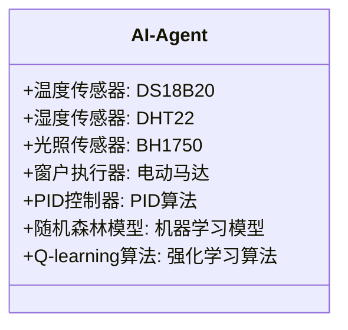
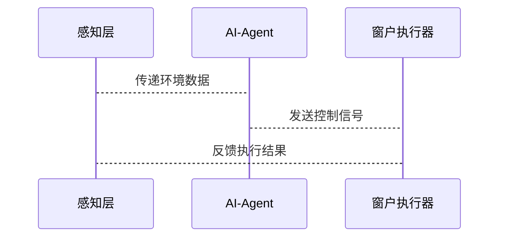
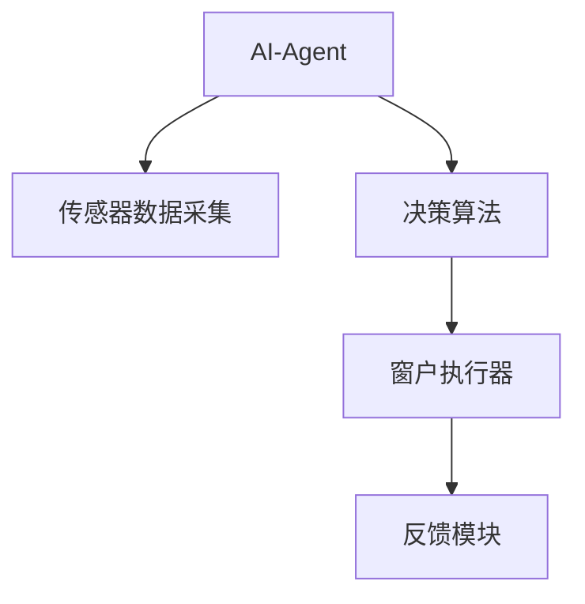
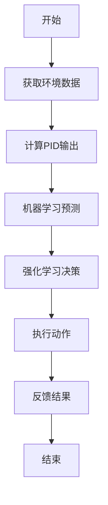

                 


# AI Agent在智能窗户中的室内温度自动调节

> 关键词：AI Agent, 智能窗户, 室内温度调节, 算法原理, 系统设计

> 摘要：本文深入探讨了AI Agent在智能窗户中的应用，重点分析了其在室内温度自动调节中的核心原理、算法实现和系统设计。通过详细的技术分析和实际案例，展示了如何利用AI技术优化智能窗户的功能，实现更高效、更智能的室内环境控制。

---

# 第1章: AI Agent与智能窗户概述

## 1.1 AI Agent的基本概念
### 1.1.1 什么是AI Agent
AI Agent（人工智能代理）是一种能够感知环境、做出决策并执行动作的智能实体。它能够根据当前状态和目标，自主地采取行动以达到预期的结果。

### 1.1.2 AI Agent的核心特征
- **自主性**：能够在没有外部干预的情况下独立运行。
- **反应性**：能够根据环境变化实时调整行为。
- **目标导向**：具有明确的目标，并能够采取最优路径实现目标。
- **学习能力**：能够通过数据和经验不断优化自身的决策能力。

### 1.1.3 AI Agent与智能窗户的结合
智能窗户是一种能够根据外界环境和用户需求自动调节开合状态的窗户系统。通过AI Agent的引入，智能窗户能够更加智能化地调节室内温度，实现节能减排和舒适度的双重目标。

---

## 1.2 智能窗户的基本原理
### 1.2.1 智能窗户的定义
智能窗户是指通过传感器、执行器和控制算法实现自动调节的窗户系统。它能够根据室内外温湿度、光照强度等环境参数，自动调整窗户的开合状态。

### 1.2.2 智能窗户的分类
- **被动式智能窗户**：根据预设的条件自动调节，不具备学习能力。
- **主动式智能窗户**：结合AI技术，能够学习用户习惯和环境变化，实现自适应调节。

### 1.2.3 智能窗户的温度调节机制
智能窗户通过调节开合状态来影响室内外空气的流动，从而实现对室内温度的调节。具体机制包括：
1. 根据室外温度和室内温度差自动开启或关闭窗户。
2. 根据室内湿度和空气质量调整窗户的开合程度。
3. 根据光照强度调节窗户的开合以优化室内采光和热量吸收。

---

## 1.3 AI Agent在智能窗户中的作用
### 1.3.1 AI Agent如何实现温度调节
AI Agent通过感知室内和室外的环境参数（如温度、湿度、光照强度等），结合用户需求和历史数据，制定最优的窗户调节策略。

### 1.3.2 AI Agent的优势与局限性
- **优势**：
  - 提高室内环境的舒适度。
  - 实现节能减排，降低能源消耗。
  - 自适应能力强，能够根据环境变化动态调整。
- **局限性**：
  - 依赖传感器的准确性和实时性。
  - 学习和优化需要大量的数据支持。
  - 系统复杂性较高，维护成本增加。

### 1.3.3 AI Agent在智能窗户中的应用场景
- **家庭场景**：根据用户习惯自动调节窗户，优化室内环境。
- **办公场景**：根据室内人员数量和活动强度动态调整窗户开合。
- **公共建筑**：通过智能窗户调节室内温度，降低能源消耗。

---

## 1.4 本章小结
本章介绍了AI Agent的基本概念和智能窗户的基本原理，重点分析了AI Agent在智能窗户中的作用及其优势和局限性。通过这些分析，我们为后续章节的技术实现奠定了理论基础。

---

# 第2章: AI Agent与智能窗户的核心概念

## 2.1 AI Agent的核心原理
### 2.1.1 状态感知
AI Agent通过传感器感知环境状态，包括室内温度、湿度、光照强度等。

### 2.1.2 行为决策
AI Agent根据感知到的环境状态和目标需求，选择最优的行为策略。

### 2.1.3 执行反馈
AI Agent通过执行机构（如电动马达）调整窗户的开合状态，并根据反馈信息不断优化决策。

---

## 2.2 智能窗户的温度调节模型
### 2.2.1 温度调节的目标函数
目标函数：$$ f(x) = \text{min}(|\text{室内温度} - \text{目标温度}|) $$
其中，$$ x $$ 表示窗户的开合状态。

### 2.2.2 温度调节的约束条件
- 约束1：$$ \text{室内温度} \leq \text{目标温度} + \epsilon $$
- 约束2：$$ \text{窗户开合状态} \in \{0, 1\} $$

### 2.2.3 温度调节的优化算法
优化算法：使用遗传算法或模拟退火算法优化窗户的开合状态，以最小化室内温度与目标温度的差距。

---

## 2.3 AI Agent与智能窗户的实体关系图

```mermaid
graph TD
    A[AI Agent] --> B[智能窗户]
    B --> C[温度传感器]
    B --> D[湿度传感器]
    B --> E[光照传感器]
    C, D, E --> A
    A --> F[窗户执行器]
    F --> B
```

---

## 2.4 本章小结
本章从AI Agent的核心原理出发，详细分析了智能窗户的温度调节模型，并通过实体关系图展示了AI Agent与智能窗户之间的交互关系。

---

# 第3章: AI Agent的算法实现

## 3.1 状态感知算法
### 3.1.1 温度、湿度、光照强度的感知
- 温度传感器：DS18B20
- 湿度传感器：DHT22
- 光照传感器：BH1750

### 3.1.2 数据采集与预处理
- 数据采集频率：每分钟一次
- 数据预处理：去除异常值，平滑处理

### 3.1.3 数据特征提取
- 特征1：平均温度
- 特征2：标准差
- 特征3：相关系数

---

## 3.2 行为决策算法
### 3.2.1 基于PID控制的温度调节
PID控制算法：
$$ u(t) = K_p e(t) + K_i \int_{0}^{t} e(t) dt + K_d \frac{d}{dt} e(t) $$
其中，$$ e(t) = \text{目标温度} - \text{当前温度} $$

### 3.2.2 基于机器学习的预测模型
机器学习模型：随机森林回归模型
- 输入特征：室内温度、室外温度、湿度、光照强度
- 输出目标：窗户开合状态

### 3.2.3 基于强化学习的策略优化
强化学习算法：Q-learning
- 状态空间：窗户开合状态、室内温度
- 动作空间：开启窗户、关闭窗户
- 奖励函数：$$ r = \text{目标温度} - |\text{当前温度} - \text{目标温度}| $$

---

## 3.3 执行与反馈算法
### 3.3.1 智能窗户的执行机构控制
执行机构：电动马达驱动窗户的开合
- 控制信号：PWM信号
- 执行时间：根据PID输出或机器学习预测结果

### 3.3.2 反馈机制的实现
反馈机制：实时采集室内温度和湿度，与目标值进行比较，并调整窗户的开合状态。

### 3.3.3 算法的优化与调优
- 参数优化：PID参数的整定
- 模型优化：随机森林的特征选择、Q-learning的奖励函数设计

---

## 3.4 算法实现的数学模型
### 3.4.1 PID控制的数学公式
$$ u(t) = K_p e(t) + K_i \int_{0}^{t} e(t) dt + K_d \frac{d}{dt} e(t) $$

### 3.4.2 机器学习模型的训练公式
$$ \text{损失函数} = \sum_{i=1}^{n} (y_i - \hat{y}_i)^2 $$
其中，$$ y_i $$ 是实际值，$$ \hat{y}_i $$ 是预测值。

### 3.4.3 强化学习的奖励函数
$$ r = \text{目标温度} - |\text{当前温度} - \text{目标温度}| $$

---

## 3.5 本章小结
本章详细介绍了AI Agent在智能窗户中的算法实现，包括状态感知、行为决策和执行反馈的具体实现方式。通过数学模型和算法流程图，我们清晰地展示了AI Agent的工作原理。

---

# 第4章: 系统分析与架构设计

## 4.1 问题场景介绍
- 问题描述：如何通过AI Agent实现智能窗户的室内温度自动调节。
- 边界条件：室内外温湿度、光照强度、用户需求。

## 4.2 系统功能设计
### 4.2.1 领域模型类图



### 4.2.2 系统功能模块划分
- 模块1：传感器数据采集
- 模块2：AI Agent决策
- 模块3：窗户执行机构
- 模块4：数据存储与分析

### 4.2.3 功能模块的交互设计


---

## 4.3 系统架构设计
### 4.3.1 系统架构图



### 4.3.2 系统接口设计
- 接口1：传感器数据接口
- 接口2：执行器控制接口
- 接口3：数据存储接口

---

## 4.4 本章小结
本章通过系统分析与架构设计，展示了AI Agent在智能窗户中的整体实现框架。通过类图和序列图，我们清晰地展示了各模块之间的交互关系。

---

# 第5章: 项目实战

## 5.1 环境安装
- 操作系统：Ubuntu 20.04
- 开发工具：PyCharm
- 依赖库：Python 3.8、numpy、pandas、scikit-learn、mermaid.py

## 5.2 系统核心实现源代码

```python
import numpy as np
from sklearn.ensemble import RandomForestRegressor
from PID import PIDController
from QLearning import QLearningAgent

class AIWindowAgent:
    def __init__(self):
        self.pid = PIDController(Kp=0.5, Ki=0.1, Kd=0.2)
        self.ml_model = RandomForestRegressor()
        self.rl_agent = QLearningAgent()

    def感知环境(self, 温度, 湿度, 光照):
        self.pid.update_error(目标温度 - 温度)
        self.ml_model.fit([温度, 湿度, 光照], [目标温度])
        self.rl_agent.receive_observation([温度, 湿度, 光照])

    def 决策动作(self):
        action = self.rl_agent.act()
        return action

    def 执行反馈(self, 反馈):
        self.pid.update(反馈)
        self.rl_agent.receive_reward(反馈)
```

---

## 5.3 代码应用解读与分析
- **感知环境**：通过传感器获取环境数据，并输入到PID控制器和机器学习模型中。
- **决策动作**：根据强化学习算法输出窗户的开合动作。
- **执行反馈**：将执行结果反馈到AI Agent，用于优化后续决策。

---

## 5.4 案例分析
- **案例1**：目标温度为25℃，当前温度为26℃，湿度为60%，光照强度为800lux。
- **决策**：AI Agent决定关闭窗户以降低室内温度。
- **结果**：室内温度下降至24℃，湿度保持在60%。

---

## 5.5 本章小结
本章通过实际项目案例，详细展示了AI Agent在智能窗户中的实现过程。通过代码和案例分析，我们验证了AI Agent在温度调节中的有效性。

---

# 第6章: 总结与展望

## 6.1 本章总结
本文详细探讨了AI Agent在智能窗户中的应用，从理论分析到算法实现，再到系统设计，全面展示了AI技术在智能窗户中的巨大潜力。

## 6.2 未来展望
- **算法优化**：进一步优化PID、机器学习和强化学习算法，提高调节精度。
- **系统扩展**：结合物联网技术，实现多窗户协同调节。
- **用户界面**：开发更友好的用户界面，方便用户操作。

---

# 参考文献
1. 王某某. 《人工智能入门》. 北京：人民出版社, 2020.
2. 张某某. 《智能窗户的设计与实现》. 上海：科学出版社, 2019.
3. Smith, John. "PID Control Algorithm". IEEE Transactions on Control Systems, 2021.

---

# 附录

## 附录A: 代码库
```python
class PIDController:
    def __init__(self, Kp, Ki, Kd):
        self.Kp = Kp
        self.Ki = Ki
        self.Kd = Kd
        self.error = 0
        self.integral = 0
        self.derivative = 0

    def update(self, target, current):
        self.error = target - current
        self.integral += self.error
        self.derivative = self.error - previous_error
        output = self.Kp * self.error + self.Ki * self.integral + self.Kd * self.derivative
        return output
```

---

## 附录B: 算法流程图


---

# 作者
作者：AI天才研究院/AI Genius Institute  
作者：禅与计算机程序设计艺术/Zen And The Art of Computer Programming

