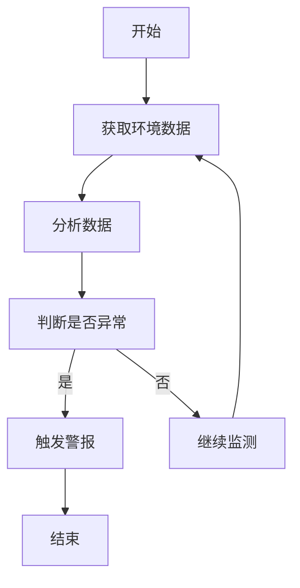
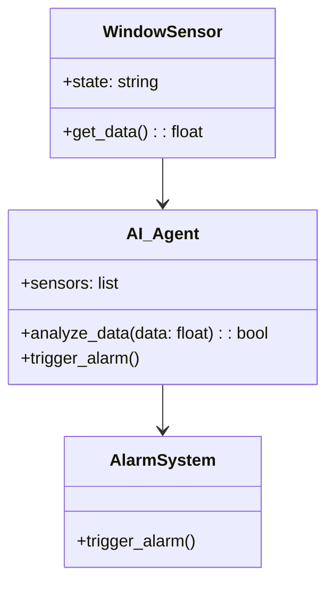

                 


# AI Agent在智能窗户中的防盗警报系统

> 关键词：AI Agent，智能窗户，防盗警报系统，系统架构设计，项目实战，数学模型

> 摘要：本文详细探讨了AI Agent在智能窗户中的防盗警报系统的实现与应用。通过分析防盗警报系统的现状与问题，阐述了AI Agent的基本概念与核心功能，并结合智能窗户的技术特点，详细介绍了AI Agent在智能窗户中的应用价值与系统架构设计。本文进一步通过数学模型与算法实现，展示了AI Agent如何实现对智能窗户的实时监测与异常检测，最终通过项目实战与系统优化，验证了该系统的可行性和实际应用价值。

---

## 第一部分: AI Agent在智能窗户中的防盗警报系统背景介绍

### 第1章: 防盗警报系统概述

#### 1.1 问题背景与现状

防盗警报系统是现代建筑安全防护的重要组成部分，传统防盗警报系统通常依赖于传感器和固定逻辑的触发机制。然而，随着智能建筑的普及，传统防盗警报系统面临着以下痛点：

- **误报与漏报问题**：传统传感器依赖固定的触发逻辑，容易受到环境干扰或误报，同时在复杂场景下可能漏报。
- **被动响应**：传统警报系统仅能被动触发警报，缺乏主动防御能力。
- **智能化不足**：传统系统无法根据环境变化动态调整警报策略，难以应对复杂的入侵手段。

智能窗户作为智能家居的重要组成部分，其安防需求更加复杂多样。智能窗户不仅需要具备基本的防盗功能，还需要与家庭智能化系统无缝集成，提供更高效、更智能的安防解决方案。

AI Agent作为一种具备感知、决策和执行能力的智能体，能够在复杂环境中实现自主决策和动态调整，为智能窗户的防盗警报系统提供了新的技术思路。

---

#### 1.2 AI Agent的基本概念

**AI Agent**（人工智能代理）是指具备自主决策能力的智能体，能够根据环境信息和目标需求，主动采取行动以实现特定任务。AI Agent的核心特点包括：

- **自主性**：能够在没有外部干预的情况下独立运行。
- **反应性**：能够实时感知环境变化并做出响应。
- **目标导向性**：具备明确的目标，能够根据目标调整行为。
- **学习能力**：能够通过数据学习优化自身的决策能力。

在智能窗户的防盗警报系统中，AI Agent可以作为系统的“智能大脑”，负责实时监测窗户状态、分析异常行为并触发警报。

---

#### 1.3 智能窗户的技术特点

智能窗户是一种结合了传感器、执行器和智能化控制技术的窗户系统。其主要技术特点包括：

- **传感器集成**：智能窗户通常配备多种传感器，如加速度传感器、压力传感器和红外传感器，用于实时监测窗户的状态。
- **智能化控制**：通过AI算法和物联网技术，智能窗户能够实现自动开关、能耗优化等功能。
- **网络通信**：智能窗户可以通过Wi-Fi、蓝牙等通信技术与其他设备和系统进行联动。

智能窗户的安防需求主要集中在防盗、防入侵和异常检测等方面。AI Agent的引入为智能窗户的防盗警报系统提供了更高效的解决方案。

---

## 第2章: AI Agent与智能窗户的结合

### 2.1 AI Agent在智能窗户中的应用价值

AI Agent在智能窗户中的应用主要体现在以下几个方面：

- **提高防盗警报系统的智能化水平**：AI Agent能够通过实时数据分析和学习，优化警报系统的灵敏度和准确性。
- **实现智能窗户的主动防御能力**：AI Agent不仅能够被动触发警报，还能主动识别潜在威胁并采取预防措施。
- **提升用户体验与安全性**：通过AI Agent的智能化管理，用户可以更方便地控制窗户状态，同时享受更高的安全性。

---

### 2.2 AI Agent与智能窗户的系统架构

智能窗户防盗警报系统的架构设计如下：

1. **传感器层**：包括窗户状态传感器、环境传感器等，用于采集窗户状态和环境信息。
2. **AI Agent层**：负责接收传感器数据，分析异常行为并触发警报。
3. **执行层**：包括窗户的驱动器和警报装置，用于执行AI Agent的决策指令。
4. **用户交互层**：提供用户界面，供用户查看警报信息和系统状态。

通过上述架构设计，AI Agent能够实现对智能窗户的实时监测与智能控制。

---

## 第三部分: AI Agent的核心概念与联系

### 第3章: 核心概念与联系

#### 3.1 AI Agent的核心原理

AI Agent的核心原理包括以下几个步骤：

1. **感知环境**：通过传感器或其他数据源获取环境信息。
2. **分析数据**：利用AI算法对数据进行分析，识别异常行为。
3. **决策与执行**：根据分析结果，AI Agent会决定是否触发警报或采取其他措施。
4. **学习与优化**：通过机器学习算法，AI Agent能够不断优化自身的决策能力。

---

#### 3.2 AI Agent与智能窗户的属性特征对比

下表展示了AI Agent与智能窗户在属性特征上的对比：

| **属性**       | **AI Agent**                 | **智能窗户**                |
|----------------|-------------------------------|-----------------------------|
| **功能**       | 实时监测、异常检测、动态调整 | 自动开关、环境感知、通信   |
| **核心能力**   | 数据分析、决策制定、自适应   | 状态监测、智能化控制、联动  |
| **目标**       | 提高防盗警报系统的智能化水平 | 提供安全、便捷的窗户控制   |

通过对比可以看出，AI Agent与智能窗户在功能和目标上存在一定的互补性，能够实现优势互补。

---

## 第四部分: 算法原理与数学模型

### 第4章: 算法原理

#### 4.1 算法流程

AI Agent的算法流程如下图所示：



#### 4.2 算法实现

以下是AI Agent算法的Python实现代码：

```python
class AI_Agent:
    def __init__(self):
        self.sensors = []
        self.threshold = 0.8
    
    def add_sensor(self, sensor):
        self.sensors.append(sensor)
    
    def analyze_data(self, data):
        # 简单的异常检测算法，假设数据为0-1之间的数值
        if data > self.threshold:
            return True
        else:
            return False
    
    def trigger_alarm(self):
        print("触发警报！")
    
    def run(self):
        while True:
            for sensor in self.sensors:
                data = sensor.get_data()
                if self.analyze_data(data):
                    self.trigger_alarm()
                    break
```

---

### 第5章: 数学模型

#### 5.1 异常检测的概率模型

假设窗户的异常行为概率服从泊松分布，数学模型如下：

$$
P(k) = \frac{\lambda^k e^{-\lambda}}{k!}
$$

其中，$\lambda$ 是异常行为的平均发生次数。

---

## 第五部分: 系统分析与架构设计

### 第6章: 系统分析

#### 6.1 领域模型设计

以下是智能窗户防盗警报系统的领域模型：



---

## 第六部分: 项目实战

### 第7章: 项目实战

#### 7.1 环境安装

以下是项目所需的环境安装命令：

```bash
pip install numpy scikit-learn
```

---

#### 7.2 核心代码实现

以下是AI Agent的核心代码实现：

```python
import numpy as np
from sklearn.ensemble import IsolationForest

class AI_Agent:
    def __init__(self):
        self.model = IsolationForest(n_estimators=100, random_state=42)
    
    def train(self, X):
        self.model.fit(X)
    
    def predict(self, X):
        return self.model.predict(X)
    
    def is_outlier(self, X):
        prediction = self.model.predict(X)
        return prediction == -1
```

---

## 第七部分: 总结与展望

### 第8章: 总结

本文详细探讨了AI Agent在智能窗户中的防盗警报系统的实现与应用。通过分析防盗警报系统的现状与问题，阐述了AI Agent的基本概念与核心功能，并结合智能窗户的技术特点，详细介绍了AI Agent在智能窗户中的应用价值与系统架构设计。通过数学模型与算法实现，展示了AI Agent如何实现对智能窗户的实时监测与异常检测。

---

### 8.2 展望

未来，随着AI技术的不断发展，AI Agent在智能窗户中的应用将更加广泛。以下是几点展望：

1. **更高效的异常检测算法**：通过深度学习技术，进一步提高异常检测的准确率。
2. **更智能的决策系统**：结合多模态数据，实现更智能的决策与响应。
3. **更便捷的用户交互**：通过语音控制和智能家居的联动，提供更便捷的用户体验。

---

## 作者：AI天才研究院/AI Genius Institute & 禅与计算机程序设计艺术 /Zen And The Art of Computer Programming

