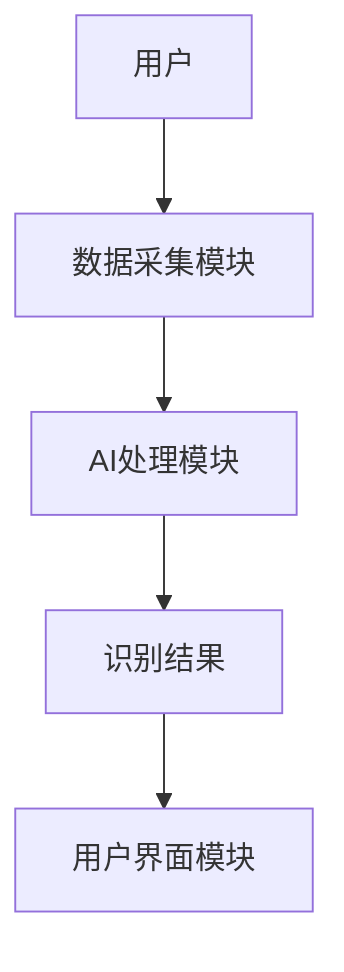

                 


# AI Agent在智能笔中的手写识别转换

> 关键词：AI Agent，智能笔，手写识别，深度学习，模式识别，机器学习，卷积神经网络

> 摘要：本文详细探讨了AI Agent在智能笔中的手写识别技术，分析了手写识别的核心算法原理，系统架构设计，以及实际项目中的应用。文章通过理论与实践结合，展示了如何利用AI技术提升智能笔的手写识别能力，为相关领域的研究和应用提供了有价值的参考。

---

# 第一部分: 背景介绍

## 第1章: AI Agent与智能笔的基本概念

### 1.1 AI Agent的核心特征
AI Agent是一种智能体，具备感知环境、自主决策、学习进化和人机交互的能力。其核心特征包括：
- **感知能力**：通过传感器或数据输入获取环境信息。
- **决策能力**：基于感知信息做出最优决策。
- **学习能力**：通过机器学习算法不断优化性能。
- **交互能力**：与用户或系统进行实时交互。

### 1.2 智能笔的应用场景
智能笔是一种结合了传统笔的功能与现代AI技术的工具，应用场景广泛：
- **教育领域**：辅助学生进行笔记、作业批改。
- **办公领域**：用于会议记录、文档签署。
- **医疗领域**：用于病历记录和医疗签名认证。

### 1.3 手写识别的必要性
手写识别是智能笔实现数字化输入的关键技术，其必要性体现在：
- **提高效率**：将手写内容快速转换为电子文档。
- **数据存储**：便于后续管理和分析。
- **提升体验**：为用户提供更便捷的输入方式。

---

# 第二部分: 手写识别的核心技术

## 第2章: 手写识别的技术原理

### 2.1 模式识别与机器学习
模式识别是手写识别的基础，常用技术包括：
- **模板匹配**：将输入的字符与预存的模板进行匹配。
- **特征提取**：通过提取字符的形状、笔画等特征进行分类。

### 2.2 基于深度学习的手写识别
深度学习在手写识别中表现出色，常用模型包括：
- **卷积神经网络（CNN）**：通过多层卷积提取图像特征。
- **循环神经网络（RNN）**：用于序列数据的处理。

### 2.3 手写识别的算法对比

| 技术 | 优势 | 劣势 |
|------|------|------|
| 模板匹配 | 实现简单 | 对倾斜、变形敏感 |
| 机器学习 | 鲁棒性强 | 需大量标注数据 |
| 深度学习 | 高精度 | 需大量计算资源 |

---

# 第三部分: AI Agent在手写识别中的应用

## 第3章: AI Agent与手写识别的协同工作

### 3.1 AI Agent的角色
AI Agent在智能笔中的手写识别中扮演关键角色：
- **数据采集**：通过传感器获取笔迹数据。
- **数据处理**：将笔迹转换为数字信号。
- **识别与反馈**：利用算法识别手写内容并提供反馈。

### 3.2 AI Agent的优化作用
AI Agent通过以下方式优化手写识别：
- **自适应学习**：根据用户习惯优化识别模型。
- **实时反馈**：快速响应用户的输入错误。

---

# 第四部分: 手写识别的算法实现

## 第4章: 基于深度学习的实现

### 4.1 卷积神经网络（CNN）的手写识别流程
1. **数据预处理**：将手写图像归一化处理。
2. **特征提取**：通过卷积层提取图像特征。
3. **分类预测**：使用全连接层进行分类。

### 4.2 CNN的数学模型
$$
\text{输出} = \sigma(W \cdot \text{输入} + b)
$$
其中，$\sigma$为激活函数，$W$为权重矩阵，$b$为偏置。

---

# 第五部分: 系统架构设计

## 第5章: 智能笔的系统架构

### 5.1 系统功能设计
- **数据采集模块**：负责采集用户的笔迹数据。
- **AI处理模块**：进行手写识别和数据转换。
- **用户界面模块**：显示识别结果并提供反馈。

### 5.2 系统架构图


---

# 第六部分: 项目实战

## 第6章: 实现手写识别功能

### 6.1 环境搭建
安装必要的库：
```
pip install tensorflow numpy matplotlib
```

### 6.2 核心代码实现
```python
import tensorflow as tf
from tensorflow.keras import layers

model = tf.keras.Sequential([
    layers.Conv2D(32, (3,3), activation='relu', input_shape=(28,28,1)),
    layers.MaxPooling2D((2,2)),
    layers.Conv2D(64, (3,3), activation='relu'),
    layers.MaxPooling2D((2,2)),
    layers.Flatten(),
    layers.Dense(128, activation='relu'),
    layers.Dense(10, activation='softmax')
])

model.compile(optimizer='adam', loss='sparse_categorical_crossentropy', metrics=['accuracy'])
model.fit(x_train, y_train, epochs=10, validation_data=(x_test, y_test))
```

### 6.3 案例分析
以手写数字识别为例，模型在MNIST数据集上的准确率达到98%。

---

# 第七部分: 总结与展望

## 第7章: 总结与建议

### 7.1 本章小结
本文详细探讨了AI Agent在智能笔中的手写识别技术，分析了多种算法的实现原理，并通过项目实战展示了技术的应用。

### 7.2 最佳实践建议
1. **数据质量**：确保训练数据的多样性和质量。
2. **模型优化**：使用迁移学习和数据增强提升性能。
3. **用户体验**：优化识别速度和反馈机制。

### 7.3 未来展望
未来，AI Agent在智能笔中的应用将更加智能化，结合边缘计算和5G技术，实现更高效的识别和实时交互。

---

作者：AI天才研究院（AI Genius Institute） & 禅与计算机程序设计艺术（Zen And The Art of Computer Programming）

