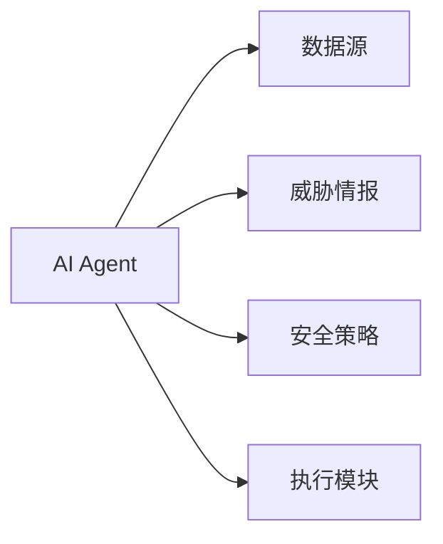
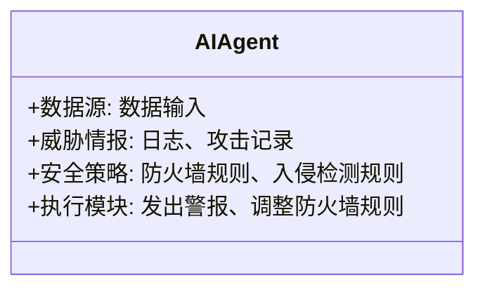
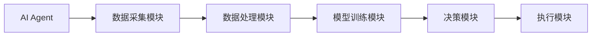

                 


# AI Agent在智能网络安全中的应用

> 关键词：AI Agent，智能网络安全，入侵检测，威胁分析，漏洞挖掘，系统架构，项目实战

> 摘要：本文深入探讨了AI Agent在智能网络安全中的应用，从基本概念到核心原理，再到实际应用和系统架构设计，最后通过项目实战和最佳实践，全面剖析了AI Agent在提升网络安全能力中的关键作用。

---

## 第一部分: AI Agent与智能网络安全概述

### 第1章: AI Agent的基本概念与背景

#### 1.1 AI Agent的定义与特点
##### 1.1.1 什么是AI Agent
AI Agent（人工智能代理）是指能够感知环境、自主决策并执行任务的智能实体。它通过传感器获取信息，利用算法进行分析和推理，并通过执行器与环境交互。

##### 1.1.2 AI Agent的核心特点
- **自主性**：AI Agent能够自主决策，无需外部干预。
- **反应性**：能够实时感知环境变化并做出响应。
- **目标导向**：基于目标和优先级进行决策。
- **学习能力**：通过机器学习不断优化自身能力。

##### 1.1.3 AI Agent与传统程序的区别
AI Agent具有自主性和学习能力，能够处理复杂和动态的环境，而传统程序通常遵循固定的规则，缺乏灵活性和适应性。

#### 1.2 智能网络安全的背景与挑战
##### 1.2.1 网络安全的重要性
随着数字化转型的推进，网络安全成为保障企业和个人数据安全的关键。

##### 1.2.2 智能化网络安全的需求
传统网络安全技术依赖规则匹配，难以应对复杂的新兴威胁，智能化需求日益迫切。

##### 1.2.3 当前网络安全的主要挑战
- **复杂性**：网络环境日益复杂，威胁手段不断进化。
- **速度**：攻击者速度远快于防御者响应。
- **资源有限**：安全专业人才短缺，资源有限。

#### 1.3 AI Agent在智能网络安全中的作用
##### 1.3.1 AI Agent如何提升网络安全能力
通过实时感知、智能决策和自主行动，AI Agent能够快速识别和应对威胁。

##### 1.3.2 AI Agent在智能安全中的应用场景
- **入侵检测**：实时监测网络流量，识别异常行为。
- **威胁分析**：分析攻击模式，预测潜在威胁。
- **漏洞挖掘**：主动发现系统漏洞，降低风险。

##### 1.3.3 AI Agent与传统安全技术的结合
AI Agent可以与防火墙、入侵检测系统等传统技术结合，形成多层次防御体系。

---

## 第二部分: AI Agent的核心原理与技术

### 第2章: AI Agent的核心原理与技术

#### 2.1 AI Agent的核心原理
##### 2.1.1 感知层: 数据采集与分析
AI Agent通过传感器或API接口采集网络数据，包括流量、日志和系统状态。

##### 2.1.2 决策层: 智能决策与策略制定
基于机器学习模型，分析数据，识别威胁，并制定应对策略。

##### 2.1.3 执行层: 行动与反馈
根据决策结果，执行防御或修复操作，并通过反馈机制优化自身行为。

#### 2.2 AI Agent的关键技术
##### 2.2.1 机器学习算法
- **监督学习**：用于分类任务，如入侵检测。
- **无监督学习**：用于异常检测。
- **强化学习**：用于动态威胁应对。

##### 2.2.2 自然语言处理
用于分析日志和威胁情报，提取关键信息。

##### 2.2.3 计算机视觉
用于分析网络拓扑结构和攻击路径。

#### 2.3 AI Agent的实体关系模型


#### 2.4 AI Agent的算法流程


---

## 第三部分: AI Agent在智能网络安全中的应用

### 第3章: AI Agent在智能网络安全中的应用

#### 3.1 入侵检测与防御
##### 3.1.1 基于AI Agent的入侵检测系统
通过实时分析网络流量，识别异常行为，及时发出警报。

##### 3.1.2 AI Agent在防火墙中的应用
动态调整防火墙规则，阻断潜在攻击。

##### 3.1.3 实时威胁检测与响应
AI Agent能够快速识别威胁并采取行动，如断开受感染设备的网络连接。

#### 3.2 威胁分析与溯源
##### 3.2.1 基于AI Agent的威胁情报分析
通过分析日志和威胁情报，识别攻击模式，预测潜在威胁。

##### 3.2.2 威胁行为模式识别
利用机器学习模型，识别攻击行为的特征，帮助进行威胁分类。

##### 3.2.3 攻击链路追踪
通过分析攻击路径，确定攻击来源，协助进行溯源分析。

#### 3.3 漏洞挖掘与修复
##### 3.3.1 基于AI Agent的漏洞扫描
AI Agent可以主动扫描网络中的设备，识别潜在漏洞。

##### 3.3.2 自动化漏洞修复
在发现漏洞后，AI Agent可以触发修复流程，如安装补丁或隔离受感染设备。

##### 3.3.3 漏洞情报分析
通过分析历史漏洞数据，预测未来可能的攻击向量，提前做好防御准备。

---

## 第四部分: 系统分析与架构设计

### 第4章: 系统分析与架构设计

#### 4.1 问题场景介绍
AI Agent需要在复杂的网络环境中运行，面临数据量大、实时性强、资源有限等挑战。

#### 4.2 项目介绍
构建一个基于AI Agent的智能网络安全系统，实现入侵检测、威胁分析和漏洞修复等功能。

#### 4.3 系统功能设计
##### 4.3.1 领域模型


#### 4.4 系统架构设计
##### 4.4.1 系统架构图


#### 4.5 系统接口设计
##### 4.5.1 接口定义
- 数据采集模块：接收网络流量数据。
- 执行模块：发送警报或调整安全设置。

##### 4.5.2 交互流程


---

## 第五部分: 项目实战

### 第5章: 项目实战

#### 5.1 环境安装
- **操作系统**：Linux Ubuntu 20.04
- **工具**：Python 3.8，TensorFlow 2.4，Scikit-learn 0.24
- **依赖库**：Pandas、NumPy、Matplotlib

#### 5.2 系统核心实现
##### 5.2.1 数据采集模块
```python
import requests

def collect_data():
    url = "http://localhost:8080/api/flow"
    response = requests.get(url)
    return response.json()
```

##### 5.2.2 模型训练模块
```python
from sklearn import svm

def train_model(data):
    X = data['features']
    y = data['labels']
    clf = svm.SVC()
    clf.fit(X, y)
    return clf
```

##### 5.2.3 决策模块
```python
def make_decision(model, new_data):
    prediction = model.predict(new_data['features'])
    return prediction[0]
```

#### 5.3 案例分析
##### 5.3.1 案例介绍
某企业网络遭受DDoS攻击，AI Agent通过实时分析流量数据，快速识别异常行为并发出警报。

##### 5.3.2 实际案例分析
分析攻击流量特征，训练模型，识别攻击模式，并制定应对策略。

#### 5.4 项目小结
通过项目实战，验证了AI Agent在智能网络安全中的有效性，但仍需进一步优化模型和算法。

---

## 第六部分: 最佳实践

### 第6章: 最佳实践

#### 6.1 小结
AI Agent在智能网络安全中具有广阔的应用前景，能够显著提升安全防护能力。

#### 6.2 注意事项
- 数据隐私保护
- 模型的可解释性
- 系统的实时性与稳定性

#### 6.3 拓展阅读
- 《机器学习实战》
- 《网络安全技术及应用》
- 《AI Agent原理与应用》

---

## 作者：AI天才研究院 & 禅与计算机程序设计艺术

---

以上是《AI Agent在智能网络安全中的应用》的完整目录大纲和内容概述。通过系统化的分析和实战案例，全面展现了AI Agent在智能网络安全中的重要作用和具体应用。

