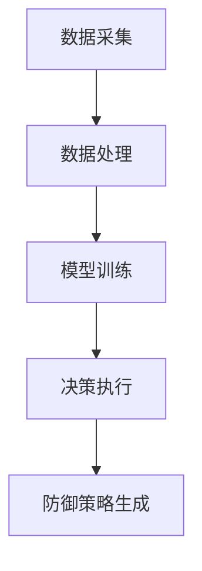
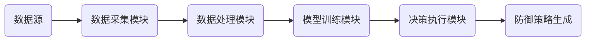
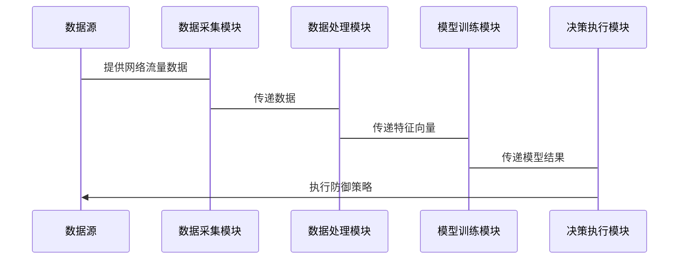

                 


# AI Agent在智能网络安全防御系统中的角色

> **关键词**：AI Agent, 智能网络安全, 网络防御系统, 人工智能, 威胁检测, 自适应防御, 安全策略优化

> **摘要**：  
本文探讨了AI Agent在智能网络安全防御系统中的核心角色，分析了其在网络安全中的应用价值和实现机制。通过详细介绍AI Agent的基本概念、算法原理、系统架构以及实际项目案例，本文揭示了如何利用AI Agent技术提升网络安全防御能力。文章还讨论了当前技术面临的挑战与未来发展方向，为读者提供了全面的理论与实践指导。

---

# 第一章: 引言

## 1.1 背景介绍

### 1.1.1 人工智能与网络安全的结合  
随着互联网的飞速发展，网络安全威胁日益复杂化和智能化。传统的基于规则的网络安全防御系统已经难以应对日益 sophisticated 的攻击手段。人工智能（AI）技术的引入，为网络安全防御带来了新的可能性。

### 1.1.2 AI Agent在网络安全中的重要性  
AI Agent（人工智能代理）是一种能够感知环境、自主决策并执行任务的智能体。在网络安全领域，AI Agent可以实时分析网络流量、识别异常行为、预测潜在威胁，并动态调整防御策略，从而显著提升网络安全防御的效率和效果。

### 1.1.3 问题背景与目标  
当前网络安全威胁呈现出智能化、隐蔽化的特点，传统的被动防御模式已无法满足需求。本文旨在探讨如何利用AI Agent技术构建智能、主动的网络安全防御系统，并实现对网络威胁的实时监测、精准识别和快速响应。

### 1.1.4 研究意义与应用前景  
通过研究AI Agent在网络安全中的应用，可以实现更高效的威胁检测、更智能的防御策略优化，以及更快速的应急响应。这不仅能够提升企业网络的安全性，还能为个人用户提供更加 robust 的安全防护。

---

## 1.2 核心概念与联系

### 1.2.1 AI Agent的定义与特点  
AI Agent是一种能够感知环境、理解需求、自主决策并执行任务的智能体。其核心特点包括：  
1. **自主性**：无需人工干预，能够独立完成任务。  
2. **反应性**：能够实时感知环境变化并做出响应。  
3. **学习能力**：通过机器学习算法不断提升自身的识别和决策能力。  

### 1.2.2 智能网络安全防御系统的概念结构  
智能网络安全防御系统由多个组件构成，包括：  
1. **数据采集层**：负责收集网络流量、日志等数据。  
2. **数据处理层**：对数据进行清洗、转换和特征提取。  
3. **模型训练层**：利用机器学习算法训练威胁检测模型。  
4. **决策执行层**：基于模型结果生成防御策略并执行。  

### 1.2.3 AI Agent与网络安全防御的实体关系图  
```mermaid
er
actor(AI Agent)
actor(网络安全系统)
actor(威胁)
actor(防御策略)
```

---

# 第二章: AI Agent的基本概念与技术基础

## 2.1 AI Agent的定义与分类

### 2.1.1 AI Agent的定义  
AI Agent是一种能够感知环境、理解需求、自主决策并执行任务的智能体。在网络安全领域，AI Agent通常用于威胁检测、入侵防御和安全策略优化。

### 2.1.2 基于AI的网络安全防御系统  
基于AI的网络安全防御系统通过AI Agent实时监控网络流量，识别异常行为，并根据威胁情报动态调整防御策略。

### 2.1.3 AI Agent的分类与特点  
AI Agent可以分为以下几类：  
1. **基于规则的AI Agent**：根据预定义的规则进行威胁检测。  
2. **基于学习的AI Agent**：利用机器学习算法进行自主学习和优化。  
3. **基于推理的AI Agent**：通过逻辑推理进行威胁分析和防御决策。  

---

## 2.2 AI Agent的核心技术基础

### 2.2.1 机器学习与深度学习  
机器学习和深度学习是AI Agent的核心技术，广泛应用于威胁检测、异常行为分析等领域。常用的算法包括：  
1. **监督学习**：用于分类任务，如恶意流量识别。  
2. **无监督学习**：用于异常检测，如未知威胁识别。  
3. **深度学习**：用于复杂模式识别，如基于神经网络的流量分析。  

### 2.2.2 自然语言处理  
自然语言处理（NLP）技术用于分析威胁情报、漏洞报告等非结构化数据，帮助AI Agent更好地理解威胁背景和攻击手段。

### 2.2.3 强化学习与决策树  
强化学习用于动态调整防御策略，决策树用于结构化数据的分类和决策。

---

# 第三章: AI Agent在网络安全中的应用

## 3.1 网络安全中的威胁检测

### 3.1.1 基于AI的入侵检测系统  
基于AI的入侵检测系统（IDS）能够实时分析网络流量，识别潜在的入侵行为。例如，利用深度学习算法检测异常流量模式。

### 3.1.2 基于AI Agent的异常行为分析  
AI Agent通过分析用户行为模式，识别异常登录行为、数据泄露等潜在威胁。

### 3.1.3 基于AI的流量分析与威胁识别  
基于AI的流量分析系统能够实时监控网络流量，识别DDoS攻击、数据窃取等威胁。

## 3.2 威胁分析与防御策略

### 3.2.1 基于AI Agent的威胁建模  
通过威胁建模，AI Agent可以预测潜在威胁的类型、来源和影响范围。

### 3.2.2 基于AI的威胁情报分析  
AI Agent能够分析全球威胁情报数据，动态调整防御策略，增强网络安全防护能力。

### 3.2.3 基于AI的自适应防御策略  
AI Agent可以根据实时威胁情况动态调整防火墙规则、入侵检测阈值等防御参数。

---

## 3.3 AI Agent在网络安全中的优势

### 3.3.1 实时性与高效性  
AI Agent能够实时监控网络流量，快速识别和响应威胁。

### 3.3.2 智能性与自适应性  
AI Agent能够通过自主学习不断优化威胁检测和防御策略。

### 3.3.3 精准性与准确性  
基于机器学习的AI Agent能够精准识别异常行为，降低误报率和漏报率。

---

# 第四章: AI Agent的算法原理与数学模型

## 4.1 基于AI Agent的入侵检测系统

### 4.1.1 算法原理  
入侵检测系统（IDS）基于机器学习算法分析网络流量，识别异常行为。常用算法包括：  
1. **K-近邻算法（KNN）**：用于分类任务。  
2. **支持向量机（SVM）**：用于分类和异常检测。  
3. **长短期记忆网络（LSTM）**：用于时间序列分析。  

### 4.1.2 数学模型  
入侵检测的数学模型如下：  
$$ y = f(x) $$  
其中，$x$ 是输入特征向量，$y$ 是输出类别（正常/异常）。

### 4.1.3 代码示例  
以下是一个基于KNN算法的入侵检测系统实现：  
```python
from sklearn.neighbors import KNeighborsClassifier
from sklearn.model_selection import train_test_split
import numpy as np

# 数据预处理
X = np.array(features)
y = np.array(labels)

# 划分训练集和测试集
X_train, X_test, y_train, y_test = train_test_split(X, y, test_size=0.2)

# 训练模型
knn = KNeighborsClassifier(n_neighbors=3)
knn.fit(X_train, y_train)

# 预测
y_pred = knn.predict(X_test)

# 评估准确率
accuracy = knn.score(X_test, y_test)
print("Accuracy:", accuracy)
```

---

## 4.2 基于AI Agent的威胁分析模型

### 4.2.1 算法原理  
威胁分析模型通过分析网络流量、日志数据等信息，识别潜在威胁。常用算法包括：  
1. **聚类分析**：用于异常行为检测。  
2. **回归分析**：用于威胁严重性评估。  

### 4.2.2 数学模型  
威胁严重性评估模型如下：  
$$ S = \sum_{i=1}^{n} w_i \cdot f_i(x) $$  
其中，$w_i$ 是特征权重，$f_i(x)$ 是特征函数。

### 4.2.3 代码示例  
以下是一个基于聚类分析的威胁分析模型实现：  
```python
from sklearn.cluster import KMeans
import numpy as np

# 数据预处理
X = np.array(features)

# 聚类分析
kmeans = KMeans(n_clusters=2, random_state=0)
kmeans.fit(X)

# 预测
y_pred = kmeans.predict(X)

# 评估
print("聚类中心:", kmeans.cluster_centers_)
print("聚类标签:", y_pred)
```

---

# 第五章: 系统架构与设计

## 5.1 系统功能设计

### 5.1.1 系统功能模块  
智能网络安全防御系统主要包括以下功能模块：  
1. **数据采集模块**：负责收集网络流量、日志等数据。  
2. **数据处理模块**：对数据进行清洗、转换和特征提取。  
3. **模型训练模块**：利用机器学习算法训练威胁检测模型。  
4. **决策执行模块**：根据模型结果生成防御策略并执行。  

### 5.1.2 系统功能流程图  


## 5.2 系统架构设计

### 5.2.1 系统架构图  


### 5.2.2 系统接口设计  
1. **数据采集接口**：负责接收网络流量数据。  
2. **模型训练接口**：负责训练威胁检测模型。  
3. **决策执行接口**：负责生成和执行防御策略。  

### 5.2.3 系统交互序列图  


---

# 第六章: 项目实战与代码实现

## 6.1 项目背景与目标

### 6.1.1 项目背景  
本项目旨在开发一个基于AI Agent的智能网络安全防御系统，实现对网络流量的实时监控和异常行为检测。

### 6.1.2 项目目标  
1. 实现基于机器学习的威胁检测功能。  
2. 开发动态调整的防御策略生成模块。  
3. 提供友好的用户界面和实时监控功能。  

## 6.2 系统实现

### 6.2.1 环境配置  
1. **操作系统**：Linux Ubuntu 20.04  
2. **编程语言**：Python 3.8  
3. **机器学习库**：scikit-learn, TensorFlow  
4. **可视化工具**：Matplotlib  

### 6.2.2 核心代码实现  
以下是威胁检测模块的实现代码：  
```python
from sklearn.svm import OneClassSVM
from sklearn.metrics import classification_report
import numpy as np

# 数据预处理
X = np.array(features)

# 训练模型
model = OneClassSVM(nu=0.05)
model.fit(X)

# 预测
y_pred = model.predict(X)

# 评估
print(classification_report(y_true, y_pred))
```

### 6.2.3 案例分析与代码解读  
通过实际案例分析，验证系统的威胁检测能力和防御策略生成效果。以下是代码解读：  
```python
# 数据处理模块
def preprocess_data(data):
    # 数据清洗
    data = data.dropna()
    # 特征提取
    features = data[['flow_duration', 'packet_count', 'byte_count']]
    return features

# 模型训练模块
def train_model(features, labels):
    model = KNeighborsClassifier(n_neighbors=3)
    model.fit(features, labels)
    return model

# 决策执行模块
def execute_decision(model, new_data):
    prediction = model.predict(new_data)
    return prediction
```

---

## 6.3 项目小结

### 6.3.1 实践总结  
通过项目实战，验证了基于AI Agent的智能网络安全防御系统的可行性和有效性。

### 6.3.2 经验与教训  
在项目实施过程中，需要注意数据质量和模型调优问题。

### 6.3.3 未来改进方向  
未来可以进一步优化算法、完善系统功能，提升系统的智能化和自适应能力。

---

# 第七章: 挑战与未来发展方向

## 7.1 当前技术的挑战

### 7.1.1 数据质量问题  
数据的质量直接影响模型的性能，如何获取高质量的数据是当前面临的主要挑战。

### 7.1.2 模型的可解释性  
基于深度学习的模型通常缺乏可解释性，这在实际应用中是一个较大的障碍。

### 7.1.3 算法的实时性  
如何在实时场景下高效运行算法，是当前技术的另一个挑战。

## 7.2 未来发展方向

### 7.2.1 深度学习与强化学习的结合  
未来可以通过结合深度学习和强化学习，进一步提升模型的性能和自适应能力。

### 7.2.2 自适应防御策略  
基于动态环境的自适应防御策略是未来的重要发展方向。

### 7.2.3 多模态数据融合  
通过多模态数据的融合，可以进一步提升系统的威胁检测和防御能力。

---

## 7.3 最佳实践 Tips

### 7.3.1 数据预处理的重要性  
数据预处理是影响模型性能的关键因素，必须重视数据清洗和特征提取。

### 7.3.2 算法选择与调优  
选择合适的算法并进行参数调优，可以显著提升模型的性能。

### 7.3.3 系统架构设计  
合理的系统架构设计可以提高系统的可扩展性和可维护性。

### 7.3.4 持续学习与优化  
网络安全威胁不断变化，必须持续优化模型和系统。

---

# 第八章: 总结

## 8.1 本文的核心内容

### 8.1.1 AI Agent在网络安全中的角色  
AI Agent在智能网络安全防御系统中扮演着核心角色，能够显著提升威胁检测和防御能力。

### 8.1.2 本文的主要贡献  
本文系统地探讨了AI Agent在网络安全中的应用价值和实现机制，为读者提供了全面的理论与实践指导。

## 8.2 未来展望

### 8.2.1 技术发展趋势  
随着人工智能技术的不断发展，AI Agent在网络安全中的应用将更加广泛和深入。

### 8.2.2 作者的愿景  
希望通过本文的研究和实践，能够推动智能网络安全防御技术的发展，为网络安全领域贡献一份力量。

---

# 作者：AI天才研究院 & 禅与计算机程序设计艺术

---

以上是关于《AI Agent在智能网络安全防御系统中的角色》的完整目录和内容框架。希望本文能够为读者提供有价值的参考和启发，帮助大家更好地理解和应用AI Agent技术在网络安全领域中的重要作用。

