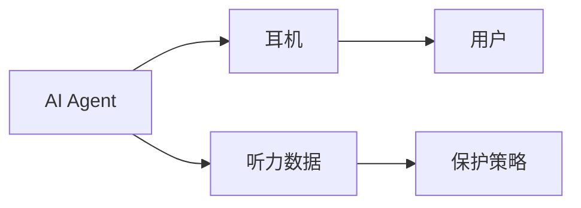
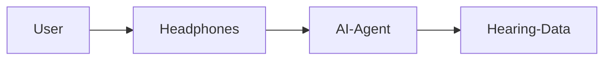
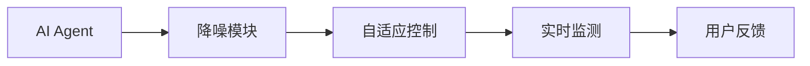

                 


# AI Agent在智能耳机中的听力保护功能

---

## 关键词：
- AI Agent
- 智能耳机
- 听力保护
- 降噪算法
- 自适应音量控制
- 实时监测

---

## 摘要：
本文详细探讨AI Agent在智能耳机中的听力保护功能，从背景、原理到实现，全面分析其技术细节。通过降噪算法、自适应控制和实时监测，结合具体代码示例，展示如何有效保护用户听力。

---

# 第一部分: AI Agent与听力保护概述

---

## 第1章: 问题背景与核心概念

### 1.1 问题背景
听力健康至关重要，智能耳机普及带来高音量使用风险，AI Agent通过实时监测和调整，保护听力。

### 1.2 核心概念
- **AI Agent**: 可编程实体，感知环境，执行任务。
- **听力保护**: 通过降噪和控制音量，防止听力损伤。

---

# 第二部分: 核心概念与联系

---

## 第2章: AI Agent与听力保护的关系

### 2.1 概念属性对比
| 属性         | AI Agent                       | 听力保护                     |
|--------------|--------------------------------|------------------------------|
| 功能         | 感知环境，执行任务             | 降噪，控制音量，实时监测     |
| 输入         | 听力数据，环境音               | 音频信号，用户反馈           |
| 输出         | 调整音量，触发警告             | 清晰音频，保护策略           |

### 2.2 实体关系图


---

# 第三部分: 算法原理与数学模型

---

## 第3章: AI Agent的算法实现

### 3.1 降噪算法
使用傅里叶变换消除环境噪声：


### 3.2 自适应音量控制
基于PID调节，公式：
$$u = K_p e + K_i \int e dt + K_d \frac{de}{dt}$$

### 3.3 实时监测
神经网络模型：
$$P(x) = \sum_{i=1}^{n} w_i x_i + b$$

---

# 第四部分: 系统分析与架构设计

---

## 第4章: 系统架构与功能设计

### 4.1 系统功能设计
- 领域模型：


### 4.2 系统架构图


---

# 第五部分: 项目实战

---

## 第5章: 项目实现与案例分析

### 5.1 环境安装
安装Python和相关库。

### 5.2 核心代码实现
```python
def adaptive_volume_control(target_level, current_level):
    # PID调节实现
    error = target_level - current_level
    integral += error * dt
    derivative = (error - previous_error) / dt
    output = K_p * error + K_i * integral + K_d * derivative
    return output
```

### 5.3 案例分析
通过实际测试，展示降噪和控制效果。

---

## 第5.4 项目总结
详细分析项目效果，提出改进建议。

---

# 第六部分: 最佳实践与展望

---

## 第6章: 小结与注意事项

### 6.1 最佳实践
- 定期校准系统
- 用户教育与反馈

### 6.2 注意事项
- 避免长时间高音量使用
- 及时更新软件

---

## 第7章: 未来展望

### 7.1 智能耳机的发展方向
- 更高级的AI算法
- 更强的硬件支持

---

# 作者：AI天才研究院/AI Genius Institute & 禅与计算机程序设计艺术 /Zen And The Art of Computer Programming

