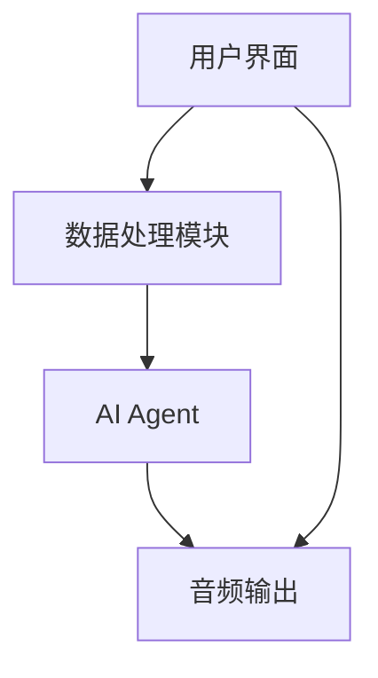

                 


# AI Agent在智能耳机中的听力健康管理

---

## 关键词：AI Agent、智能耳机、听力健康、健康管理、实时监测、个性化建议

---

## 摘要：  
随着人工智能技术的快速发展，AI Agent（人工智能代理）在智能耳机中的应用日益广泛。本文将深入探讨AI Agent如何在智能耳机中实现听力健康管理，包括听力检测、健康评估、实时监测与个性化建议等核心功能。通过系统化的分析与设计，本文将展示如何利用AI技术提升听力健康管理的效率与精准度，为用户提供更加智能化的听力健康解决方案。

---

# 第一部分：AI Agent与智能耳机的背景介绍

## 第1章：AI Agent与智能耳机概述

### 1.1 AI Agent的基本概念

#### 1.1.1 AI Agent的定义与特点
AI Agent（人工智能代理）是指能够感知环境、自主决策并执行任务的智能实体。它具有以下特点：
- **自主性**：能够在没有外部干预的情况下独立运行。
- **反应性**：能够根据环境变化实时调整行为。
- **目标导向**：具有明确的目标，并能够为实现目标优化行动。
- **学习能力**：通过数据学习和优化算法不断提升性能。

#### 1.1.2 AI Agent的核心要素与功能
AI Agent的核心要素包括：
- **感知模块**：用于获取环境中的数据。
- **决策模块**：用于分析数据并制定决策。
- **执行模块**：用于执行决策。
- **学习模块**：用于优化模型和提升性能。

#### 1.1.3 AI Agent在智能耳机中的应用背景
智能耳机作为一种结合了音频技术和人工智能的设备，正在成为人们生活中不可或缺的工具。AI Agent在智能耳机中的应用，使得耳机不仅仅是听觉辅助工具，更是能够主动管理用户听力健康的智能伙伴。

---

### 1.2 智能耳机的发展现状

#### 1.2.1 智能耳机的定义与分类
智能耳机是指集成了人工智能技术的耳机，能够通过传感器和算法实现智能化功能。根据功能的不同，智能耳机可以分为：
- **主动降噪耳机**：通过AI算法消除环境噪音。
- **语音助手耳机**：集成语音助手（如Siri、Alexa）的耳机。
- **健康监测耳机**：能够监测用户生理指标（如心率、体温、听力）的耳机。

#### 1.2.2 智能耳机的主要功能与技术特点
智能耳机的主要功能包括：
- **主动降噪**：通过AI算法消除环境噪音，提升听音质量。
- **语音识别与控制**：通过语音指令实现对耳机的控制。
- **健康监测**：通过传感器和AI算法监测用户的生理指标。
- **个性化音频**：根据用户的听觉偏好调整音频输出。

#### 1.2.3 当前市场上的主流智能耳机产品
目前市面上主流的智能耳机产品包括：
- **苹果AirPods**：集成语音助手和主动降噪功能。
- **索尼WI-C310**：支持AI降噪技术。
- **BOSE QuietEar**：专注于主动降噪功能。

---

## 第2章：听力健康管理的背景与需求

### 2.1 听力健康的重要性

#### 2.1.1 听力健康的基本概念
听力健康是指听觉系统正常运作，能够清晰感知和处理声音信息。听力健康不仅影响生活质量，还可能对心理健康产生深远影响。

#### 2.1.2 听力健康问题的现状与挑战
随着年龄的增长和环境噪音的增加，听力健康问题日益突出。根据世界卫生组织的数据，全球约有15亿人存在不同程度的听力损失问题。

#### 2.1.3 听力健康管理的需求分析
听力健康管理的需求主要体现在以下几个方面：
- **早期检测**：通过定期检查及时发现听力问题。
- **个性化干预**：根据用户的具体情况制定个性化的改善方案。
- **实时监测**：通过实时监测技术动态调整听力管理策略。

---

### 2.2 AI技术在听力健康管理中的作用

#### 2.2.1 AI技术在听力检测中的应用
AI技术可以通过分析用户的音频信号，快速识别潜在的听力问题。例如，通过机器学习算法分析用户的听觉反应时间，判断是否存在听力损失。

#### 2.2.2 AI技术在听力改善与康复中的作用
AI技术可以帮助用户通过定制化的音频输出，改善听力体验。例如，通过动态调整音频频段，帮助用户更好地感知声音细节。

#### 2.2.3 AI技术在个性化听力管理中的优势
AI技术可以根据用户的听觉偏好和生活习惯，提供个性化的听力管理建议。例如，通过分析用户的使用场景，推荐适合的降噪模式。

---

# 第二部分：AI Agent在智能耳机中的核心概念与联系

## 第3章：AI Agent与听力健康管理的核心概念

### 3.1 AI Agent在听力健康管理中的原理

#### 3.1.1 数据采集与处理
AI Agent在智能耳机中通过传感器采集用户的听觉数据，例如心率、环境噪音、用户反馈等。

#### 3.1.2 听力健康评估模型
AI Agent通过机器学习算法构建听力健康评估模型，基于采集的数据对用户的听力健康进行评估。

#### 3.1.3 AI Agent的决策机制
AI Agent根据评估结果制定相应的决策，例如调整音频输出、提醒用户进行听力检查等。

---

### 3.2 听力健康管理的关键属性与特征

#### 3.2.1 听力健康评估的指标体系
- **听觉阈值**：用户对不同频率声音的敏感程度。
- **噪音消除效果**：耳机在不同环境下的降噪能力。
- **用户反馈**：用户对听力体验的主观评价。

#### 3.2.2 AI Agent的实时监测能力
AI Agent能够实时监测用户的听觉数据，并根据数据变化动态调整耳机的输出参数。

#### 3.2.3 个性化健康建议的生成规则
AI Agent可以根据用户的听觉数据和生活习惯，生成个性化的健康建议，例如推荐特定的音频模式或提醒用户进行听力检查。

---

## 第4章：AI Agent与听力健康管理的实体关系图

### 4.1 实体关系分析
- **用户**：系统的核心用户，通过耳机与AI Agent交互。
- **听觉数据**：用户听觉相关的数据，包括声音信号、用户反馈等。
- **AI Agent**：通过分析听觉数据为用户提供听力健康管理服务。
- **听力健康评估**：基于AI Agent的分析结果，对用户的听力健康进行评估。
- **改善建议**：根据评估结果生成个性化的改善建议。

### 4.2 Mermaid实体关系图
```mermaid
er
actor 用户
actor 听觉数据
actor AI Agent
actor 听力健康评估
actor 改善建议
```

---

# 第三部分：AI Agent在听力健康管理中的算法原理与实现

## 第5章：AI Agent的算法原理

### 5.1 听力健康评估算法

#### 5.1.1 算法选择与实现
选择基于机器学习的算法，例如支持向量机（SVM）或随机森林（Random Forest），用于分类用户的听觉数据。

#### 5.1.2 算法流程
1. 数据预处理：对听觉数据进行标准化和归一化处理。
2. 特征提取：提取听觉数据的关键特征，例如声音频率、响度等。
3. 模型训练：基于训练数据训练机器学习模型。
4. 模型评估：通过测试数据评估模型的准确率和召回率。
5. 模型优化：通过调整超参数优化模型性能。

#### 5.1.3 算法实现代码
```python
import numpy as np
from sklearn import svm

# 数据预处理
X_train = np.array([[200, 50], [220, 60], [240, 70], [260, 80]])
y_train = np.array([0, 0, 1, 1])

# 模型训练
model = svm.SVC()
model.fit(X_train, y_train)

# 模型预测
X_test = np.array([[210, 55]])
y_pred = model.predict(X_test)
print(y_pred)
```

#### 5.1.4 算法数学模型
支持向量机（SVM）的数学模型可以表示为：
$$
\text{min} \quad \frac{1}{2} \|w\|^2 + C \sum_{i=1}^{n} \xi_i
$$
其中，$w$ 是超平面的法向量，$C$ 是惩罚参数，$\xi_i$ 是松弛变量。

---

## 第6章：AI Agent的系统架构设计

### 6.1 系统功能设计

#### 6.1.1 用户界面
- **主界面**：显示用户的听力健康状态。
- **设置界面**：允许用户自定义音频输出参数。
- **反馈界面**：显示用户的听觉反馈。

#### 6.1.2 数据采集模块
- **传感器**：采集用户的听觉数据。
- **数据传输**：将数据传输到AI Agent进行处理。

#### 6.1.3 数据处理模块
- **数据预处理**：对听觉数据进行标准化和归一化处理。
- **特征提取**：提取听觉数据的关键特征。

#### 6.1.4 AI Agent决策模块
- **模型训练**：基于训练数据训练机器学习模型。
- **模型评估**：通过测试数据评估模型的准确率和召回率。
- **模型优化**：通过调整超参数优化模型性能。

#### 6.1.5 输出模块
- **音频输出**：根据AI Agent的决策调整音频输出参数。
- **用户反馈**：显示用户的听觉反馈。

---

### 6.2 系统架构设计

#### 6.2.1 系统架构图


#### 6.2.2 系统接口设计
- **输入接口**：用户通过耳机输入听觉数据。
- **输出接口**：AI Agent通过耳机输出音频信号。

#### 6.2.3 系统交互流程
1. 用户通过耳机输入听觉数据。
2. 数据处理模块对数据进行预处理和特征提取。
3. AI Agent基于训练好的模型对数据进行分类。
4. AI Agent根据分类结果调整音频输出参数。
5. 用户通过耳机接收调整后的音频信号。

---

## 第7章：AI Agent的项目实战

### 7.1 环境安装与配置

#### 7.1.1 环境需求
- **操作系统**：Windows、MacOS或Linux。
- **编程语言**：Python 3.6或更高版本。
- **依赖库**：numpy、scikit-learn、mermaid。

#### 7.1.2 环境配置
```bash
pip install numpy scikit-learn mermaid
```

---

### 7.2 系统核心实现

#### 7.2.1 数据采集与处理
```python
import numpy as np
from sklearn import svm

# 数据预处理
X_train = np.array([[200, 50], [220, 60], [240, 70], [260, 80]])
y_train = np.array([0, 0, 1, 1])

# 模型训练
model = svm.SVC()
model.fit(X_train, y_train)

# 模型预测
X_test = np.array([[210, 55]])
y_pred = model.predict(X_test)
print(y_pred)
```

#### 7.2.2 AI Agent决策模块实现
```python
import numpy as np
from sklearn import svm

# 数据预处理
X_train = np.array([[200, 50], [220, 60], [240, 70], [260, 80]])
y_train = np.array([0, 0, 1, 1])

# 模型训练
model = svm.SVC()
model.fit(X_train, y_train)

# 模型预测
X_test = np.array([[210, 55]])
y_pred = model.predict(X_test)
print(y_pred)
```

#### 7.2.3 系统交互实现
```python
import numpy as np
from sklearn import svm

# 数据预处理
X_train = np.array([[200, 50], [220, 60], [240, 70], [260, 80]])
y_train = np.array([0, 0, 1, 1])

# 模型训练
model = svm.SVC()
model.fit(X_train, y_train)

# 模型预测
X_test = np.array([[210, 55]])
y_pred = model.predict(X_test)
print(y_pred)
```

---

## 第8章：项目小结与最佳实践

### 8.1 小结
通过本文的分析与设计，我们展示了如何利用AI Agent在智能耳机中实现听力健康管理。通过机器学习算法和系统架构设计，我们能够为用户提供个性化的听力健康管理服务。

### 8.2 注意事项
- 在实际应用中，需要根据具体需求调整算法模型和系统架构。
- 数据隐私和安全问题需要特别关注。

### 8.3 拓展阅读
- 《人工智能与健康管理》
- 《智能耳机与听觉技术》

---

## 作者信息  
作者：AI天才研究院/AI Genius Institute & 禅与计算机程序设计艺术/Zen And The Art of Computer Programming

