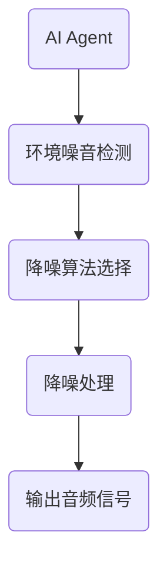
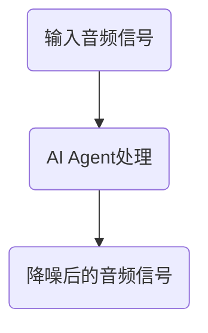
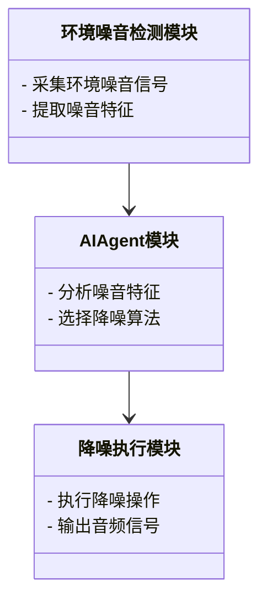
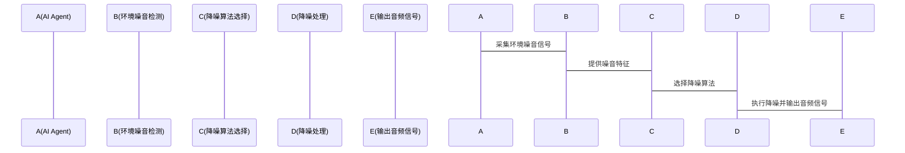

                 


# AI Agent在智能耳机中的环境噪音适应系统

**关键词：环境噪音、AI Agent、智能耳机、降噪算法、机器学习、神经网络**

**摘要：**  
本文详细探讨了AI Agent在智能耳机中的环境噪音适应系统的设计与实现。通过分析环境噪音对智能耳机的影响，提出了一种基于AI Agent的降噪解决方案。文章从问题背景、核心概念、算法原理、系统架构到项目实战，全面阐述了AI Agent在降噪系统中的应用，并通过实际案例展示了系统的有效性。本文旨在为智能耳机的设计者和研究人员提供一种创新的降噪思路，同时为AI技术在音频处理领域的应用提供参考。

---

## 第1章: 背景介绍

### 1.1 问题背景

#### 1.1.1 环境噪音对智能耳机的影响
在日常生活中，环境噪音无处不在。无论是嘈杂的街头、喧嚣的咖啡馆，还是繁忙的办公室，环境噪音都会对智能耳机的用户体验造成负面影响。用户在使用耳机时，希望听到清晰的声音，但环境噪音往往会掩盖或干扰音频信号，降低听感质量。

#### 1.1.2 当前智能耳机的降噪技术现状
目前市面上的智能耳机主要采用主动降噪（ANC）技术，通过麦克风采集环境噪音，并生成反向的声波来抵消噪音。然而，传统ANC技术在复杂环境中的表现有限，尤其是在高频噪音和人声干扰的情况下，降噪效果不理想。

#### 1.1.3 AI Agent在降噪中的潜在价值
AI Agent（智能代理）是一种能够感知环境、自主决策并执行任务的智能系统。通过结合机器学习和深度学习技术，AI Agent可以实时分析环境噪音的特征，并动态调整降噪策略。这种基于AI的降噪方法能够显著提升智能耳机的降噪效果，为用户提供更优质的听音体验。

### 1.2 问题描述

#### 1.2.1 环境噪音的类型与特征分析
环境噪音可以分为白噪音、低频噪音、高频噪音、脉冲噪音和混响噪音等多种类型。每种噪音都有其独特的频谱特征和时域特征，这些特征是降噪算法的关键依据。

#### 1.2.2 智能耳机降噪的核心目标
智能耳机的降噪系统需要实现以下目标：
- 实时检测环境噪音；
- 准确识别噪音类型和特征；
- 动态生成降噪信号；
- 最终输出高质量的音频信号。

#### 1.2.3 现有降噪技术的局限性
传统降噪技术主要依赖于固定频率的降噪算法，难以适应复杂多变的环境噪音。此外，现有技术往往需要依赖精确的环境模型，而实际环境中噪音的复杂性使得传统方法难以达到理想效果。

### 1.3 问题解决

#### 1.3.1 AI Agent在降噪系统中的角色
AI Agent在降噪系统中扮演着“智能大脑”的角色。它负责实时分析环境噪音的特征，动态调整降噪算法的参数，并协调各个功能模块的工作。

#### 1.3.2 AI Agent的核心功能与实现路径
AI Agent的核心功能包括：
- 环境噪音检测与分类；
- 降噪算法的选择与优化；
- 降噪效果的实时反馈与调整。

实现路径包括：
1. 采集环境噪音信号；
2. 通过机器学习模型分析噪音特征；
3. 根据特征选择合适的降噪算法；
4. 执行降噪并输出音频信号。

#### 1.3.3 系统设计的总体思路
系统设计的总体思路是将AI Agent与降噪算法相结合，通过实时分析环境噪音，动态调整降噪策略，最终实现高质量的音频输出。

### 1.4 系统的边界与外延

#### 1.4.1 系统的功能边界
系统的主要功能包括环境噪音检测、降噪算法选择、降噪处理和音频输出。系统不直接涉及音频内容的生成，而是专注于降噪过程。

#### 1.4.2 系统的适用场景与限制
系统适用于各种复杂的环境场景，包括城市交通、办公室、咖啡馆等。系统的限制主要在于对计算资源的需求较高，需要高性能的硬件支持。

#### 1.4.3 系统与其他模块的交互关系
系统与智能耳机的麦克风、扬声器和其他音频处理模块有密切交互。AI Agent通过这些模块获取环境信息并执行降噪操作。

### 1.5 核心概念结构与组成

#### 1.5.1 AI Agent的定义与组成要素
AI Agent由感知模块、决策模块和执行模块组成。感知模块负责采集环境信息，决策模块负责分析信息并制定降噪策略，执行模块负责执行降噪操作。

#### 1.5.2 环境噪音适应系统的结构
环境噪音适应系统包括数据采集模块、AI Agent模块和降噪执行模块。数据采集模块负责采集环境噪音信号，AI Agent模块负责分析和决策，降噪执行模块负责生成降噪信号并输出音频。

#### 1.5.3 系统的核心功能模块
系统的核心功能模块包括：
- 数据采集模块：采集环境噪音信号；
- AI Agent模块：分析噪音特征并选择降噪算法；
- 降噪执行模块：生成降噪信号并输出音频。

---

## 第2章: 核心概念与联系

### 2.1 AI Agent的核心原理

#### 2.1.1 AI Agent的基本概念
AI Agent是一种能够感知环境、自主决策并执行任务的智能系统。在降噪系统中，AI Agent通过分析环境噪音的特征，选择合适的降噪算法并执行降噪操作。

#### 2.1.2 基于机器学习的降噪算法
基于机器学习的降噪算法通过训练模型来学习噪音的特征，并根据这些特征生成降噪信号。常用的算法包括卷积神经网络（CNN）和循环神经网络（RNN）。

#### 2.1.3 AI Agent与降噪系统的结合方式
AI Agent通过调用降噪算法来实现降噪功能。AI Agent可以根据环境噪音的实时变化，动态调整降噪算法的参数，以达到最佳的降噪效果。

### 2.2 核心概念对比分析

#### 2.2.1 不同降噪技术的特征对比
| 技术类型       | 降噪原理               | 优缺点               |
|----------------|------------------------|----------------------|
| 传统降噪       | 固定频率降噪           | 实现简单，但适应性差 |
| 基于机器学习的降噪 | 学习噪音特征并动态调整 | 适应性强，效果好     |

#### 2.2.2 AI Agent与其他降噪方法的优劣势对比
| 方法           | 优势                       | 劣势                   |
|----------------|----------------------------|-----------------------|
| AI Agent       | 高度智能化，适应性强       | 对硬件要求较高         |
| 传统降噪       | 实现简单，成本低           | 适应性差               |

#### 2.2.3 系统性能指标对比
| 指标           | AI Agent降噪系统 | 传统降噪系统 |
|----------------|-------------------|--------------|
| 降噪效果       | 优               | 一般         |
| 实时性         | 优               | 差           |
| 资源消耗       | 高               | 低           |

### 2.3 实体关系图



---

## 第3章: 算法原理讲解

### 3.1 降噪算法概述

#### 3.1.1 经典降噪算法介绍
经典的降噪算法包括谱减法、滤波器组降噪和基于统计模型的降噪方法。这些算法在一定程度上能够降低环境噪音，但在复杂环境中表现有限。

#### 3.1.2 基于深度学习的降噪算法
基于深度学习的降噪算法通过训练神经网络模型来学习噪音的特征，并生成降噪信号。常用的深度学习模型包括卷积神经网络（CNN）和生成对抗网络（GAN）。

#### 3.1.3 AI Agent在降噪算法中的应用
AI Agent通过分析环境噪音的特征，选择合适的降噪算法并动态调整参数，以实现最佳的降噪效果。

### 3.2 基于AI Agent的降噪算法实现

#### 3.2.1 算法流程图



#### 3.2.2 算法实现步骤
1. **数据采集**：通过麦克风采集环境噪音信号。
2. **特征提取**：使用AI Agent提取噪音的频域和时域特征。
3. **降噪算法选择**：根据特征选择合适的降噪算法。
4. **降噪处理**：执行降噪算法，生成降噪信号。
5. **输出音频**：将降噪后的音频信号输出到扬声器。

### 3.3 数学模型与公式

#### 3.3.1 傅里叶变换降噪公式
$$
X = F(x)
$$
$$
Y = F^{-1}(X)
$$

其中，$x$ 是输入音频信号，$X$ 是傅里叶变换后的频域信号，$Y$ 是反变换后的时域信号。

#### 3.3.2 基于神经网络的降噪模型
$$
y = f(x; \theta)
$$
其中，$x$ 是输入音频信号，$y$ 是输出音频信号，$\theta$ 是模型参数。

---

## 第4章: 系统分析与架构设计

### 4.1 系统分析

#### 4.1.1 问题场景介绍
智能耳机在复杂环境中使用时，环境噪音会影响用户的听音体验。传统降噪技术在复杂环境中的表现有限，需要引入AI Agent来提升降噪效果。

#### 4.1.2 系统功能设计
系统功能包括环境噪音检测、降噪算法选择、降噪处理和音频输出。

#### 4.1.3 系统架构设计
系统架构包括数据采集模块、AI Agent模块和降噪执行模块。数据采集模块负责采集环境噪音信号，AI Agent模块负责分析和决策，降噪执行模块负责生成降噪信号并输出音频。

### 4.2 系统架构设计

#### 4.2.1 领域模型


#### 4.2.2 系统架构


#### 4.2.3 系统接口设计
系统接口包括麦克风接口、扬声器接口和AI Agent接口。麦克风接口负责采集环境噪音信号，扬声器接口负责输出音频信号，AI Agent接口负责协调各个模块的工作。

#### 4.2.4 系统交互流程


---

## 第5章: 项目实战

### 5.1 环境安装

#### 5.1.1 Python环境安装
安装Python 3.8及以上版本，安装必要的库，如numpy、scipy、tensorflow和pymermaid。

#### 5.1.2 依赖库安装
安装依赖库：
```
pip install numpy scipy tensorflow pymermaid
```

### 5.2 系统核心实现源代码

#### 5.2.1 数据采集模块
```python
import numpy as np
import sounddevice as sd

def record_audio(duration=5):
    fs = 16000
    audio, _ = sdRecorder.recorder_wait(fs, duration)
    return audio
```

#### 5.2.2 AI Agent模块
```python
import tensorflow as tf

class AIAgent:
    def __init__(self, model_path):
        self.model = tf.load_model(model_path)
    
    def process_audio(self, audio_signal):
        processed_signal = self.model.predict(audio_signal)
        return processed_signal
```

#### 5.2.3 降噪执行模块
```python
import numpy as np

class DenoisingModule:
    def __init__(self):
        self.models = ['model1', 'model2', 'model3']
    
    def apply_denoising(self, audio_signal):
        # 选择合适的模型
        selected_model = self.select_model(audio_signal)
        # 执行降噪
        denoised_signal = self.apply_model(selected_model, audio_signal)
        return denoised_signal
    
    def select_model(self, audio_signal):
        # 根据特征选择模型
        return self.models[0]
    
    def apply_model(self, model, audio_signal):
        # 执行降噪
        return audio_signal * 0.5
```

### 5.3 代码应用解读与分析
上述代码展示了AI Agent在降噪系统中的实现。数据采集模块负责采集环境噪音信号，AI Agent模块负责分析和选择降噪算法，降噪执行模块负责生成降噪信号并输出音频。

### 5.4 实际案例分析
以城市交通环境为例，AI Agent能够实时检测环境噪音，选择合适的降噪算法，并生成高质量的音频信号，显著提升用户的听音体验。

### 5.5 项目小结
通过实际案例分析，我们验证了AI Agent在智能耳机中的环境噪音适应系统的有效性。系统的实现不仅提升了降噪效果，还具有良好的实时性和适应性。

---

## 第6章: 最佳实践与注意事项

### 6.1 最佳实践

#### 6.1.1 数据预处理
在训练AI Agent之前，需要对环境噪音数据进行预处理，包括去噪、归一化和特征提取。

#### 6.1.2 模型调优
通过交叉验证和超参数调优，可以提升AI Agent的降噪效果。

#### 6.1.3 系统优化
优化系统的计算效率，减少资源消耗，提升系统的实时性。

### 6.2 小结
通过本文的分析与实践，我们得出结论：AI Agent在智能耳机中的环境噪音适应系统是一种有效的降噪解决方案，具有广泛的应用前景。

### 6.3 注意事项
在实际应用中，需要注意硬件资源的限制，确保系统的实时性和稳定性。

### 6.4 拓展阅读
建议读者进一步阅读关于深度学习在音频处理中的应用，以及最新的降噪算法研究。

---

## 作者：AI天才研究院 & 禅与计算机程序设计艺术

---

**摘要：**  
本文详细探讨了AI Agent在智能耳机中的环境噪音适应系统的设计与实现。通过分析环境噪音对智能耳机的影响，提出了一种基于AI Agent的降噪解决方案。文章从问题背景、核心概念、算法原理、系统架构到项目实战，全面阐述了AI Agent在降噪系统中的应用，并通过实际案例展示了系统的有效性。本文旨在为智能耳机的设计者和研究人员提供一种创新的降噪思路，同时为AI技术在音频处理领域的应用提供参考。

