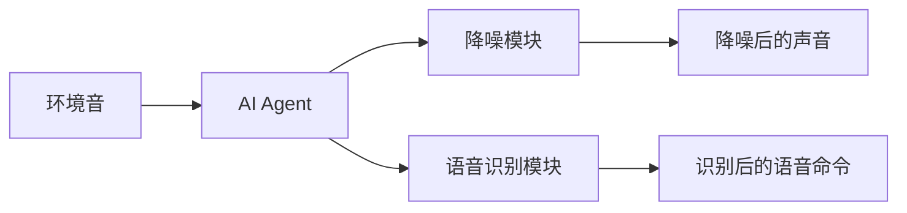
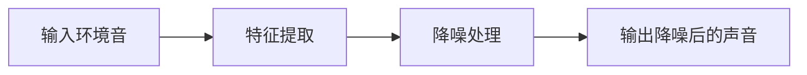
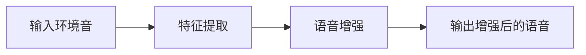
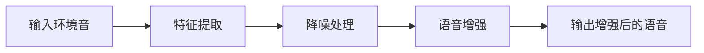
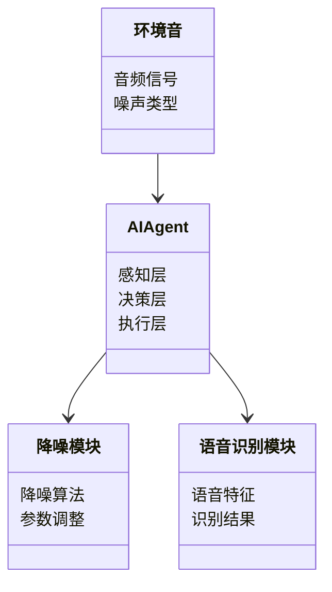
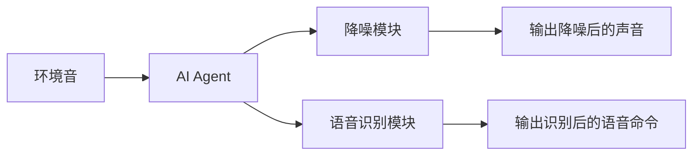
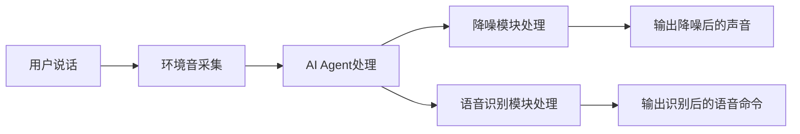

                 


# AI Agent在智能耳机中的环境音适应

> 关键词：AI Agent, 智能耳机, 环境音适应, 降噪技术, 语音识别, 深度学习

> 摘要：本文详细探讨了AI Agent在智能耳机环境音适应中的应用，分析了其核心概念、算法原理、系统架构，并通过项目实战展示了如何利用AI Agent实现环境音降噪和语音识别，最后给出了最佳实践建议。

---

# 第一部分: AI Agent在智能耳机中的环境音适应概述

# 第1章: AI Agent与环境音适应的背景介绍

## 1.1 AI Agent的基本概念

### 1.1.1 AI Agent的定义
AI Agent（人工智能代理）是指能够感知环境、自主决策并执行任务的智能实体。它能够通过传感器获取信息，利用算法处理信息，并通过执行器与环境交互。

### 1.1.2 AI Agent的核心特征
- **自主性**：能够自主决策和行动，无需人工干预。
- **反应性**：能够实时感知环境并做出反应。
- **目标导向**：具有明确的目标，行动围绕目标展开。
- **学习能力**：能够通过数据和经验不断优化自身性能。

### 1.1.3 AI Agent与传统算法的区别
AI Agent不仅仅是一个算法，而是一个具备感知、决策和执行能力的完整系统。传统算法通常仅用于解决特定问题，而AI Agent能够在动态环境中自主适应并解决问题。

## 1.2 环境音适应的定义与问题背景

### 1.2.1 环境音适应的定义
环境音适应是指智能设备能够根据周围环境的声音变化，自动调整其音频处理策略，以优化用户体验。例如，在嘈杂的环境中，耳机可以自动增强语音信号并抑制背景噪声。

### 1.2.2 环境音适应的问题背景
在智能耳机使用场景中，环境噪声（如背景音乐、人声、风噪声等）会影响语音识别和通话质量。传统的降噪技术通常依赖于预定义的噪声模型，难以适应复杂的动态环境。

### 1.2.3 环境音适应的解决思路
通过AI Agent实时感知环境音特征，利用深度学习算法动态调整降噪参数，实现对复杂环境音的自适应处理。

## 1.3 AI Agent在环境音适应中的作用

### 1.3.1 AI Agent的优势
- **实时感知**：能够实时感知环境音特征，如噪声类型、语音频率等。
- **自适应调整**：根据环境音变化动态调整降噪策略。
- **智能决策**：基于环境音信息和用户需求，做出最优决策。

### 1.3.2 AI Agent在环境音适应中的应用前景
AI Agent在智能耳机中的应用将显著提升用户体验，特别是在嘈杂环境下的语音识别和通话质量优化方面具有广阔前景。

## 1.4 本章小结
本章介绍了AI Agent的基本概念、环境音适应的定义与问题背景，并重点阐述了AI Agent在环境音适应中的作用和优势。

---

# 第2章: AI Agent在智能耳机中的核心概念与联系

## 2.1 AI Agent的核心概念原理

### 2.1.1 感知层
感知层负责采集环境音信息，通常包括麦克风阵列、噪声传感器等硬件设备。感知层将采集到的环境音信号传输给决策层。

### 2.1.2 决策层
决策层负责对感知到的环境音信息进行分析和处理，通常采用深度学习算法（如卷积神经网络和循环神经网络）进行降噪和语音增强。

### 2.1.3 执行层
执行层负责根据决策层的输出执行相应的操作，如调整降噪参数、增强语音信号等。

## 2.2 AI Agent的核心概念属性特征对比

### 2.2.1 基于规则的AI Agent
- **特点**：基于预定义的规则进行决策，适用于简单场景。
- **不足**：无法处理复杂动态环境。

### 2.2.2 基于模型的AI Agent
- **特点**：基于数学模型进行决策，适用于复杂场景。
- **优势**：能够处理复杂动态环境。

### 2.2.3 基于强化学习的AI Agent
- **特点**：通过强化学习不断优化决策策略。
- **优势**：能够在动态环境中自适应调整。

## 2.3 AI Agent的ER实体关系图


## 2.4 本章小结
本章详细讲解了AI Agent的核心概念原理，对比了不同类型的AI Agent，并通过ER实体关系图展示了系统架构。

---

# 第3章: AI Agent环境音适应的算法原理

## 3.1 基于深度学习的环境音适应算法

### 3.1.1 深度学习的基本原理
深度学习是一种基于人工神经网络的机器学习方法，通过多层非线性变换从数据中学习高层次特征。

### 3.1.2 基于卷积神经网络的环境音降噪算法


#### 代码实现
```python
import tensorflow as tf
from tensorflow.keras import layers

model = tf.keras.Sequential([
    layers.Conv2D(32, (3, 3), activation='relu', input_shape=(None, 128, 1)),
    layers.MaxPooling2D((2, 2)),
    layers.Conv2D(64, (3, 3), activation='relu'),
    layers.MaxPooling2D((2, 2)),
    layers.Flatten(),
    layers.Dense(128, activation='relu'),
    layers.Dense(1, activation='sigmoid')
])
```

### 3.1.3 基于循环神经网络的语音增强算法


#### 代码实现
```python
import tensorflow as tf
from tensorflow.keras import layers

model = tf.keras.Sequential([
    layers.Bidirectional(layers.LSTM(64, return_sequences=True)),
    layers.Dense(128, activation='relu'),
    layers.Dense(128, activation='sigmoid')
])
```

## 3.2 算法流程图


---

# 第4章: 系统分析与架构设计方案

## 4.1 系统分析

### 4.1.1 问题场景介绍
在嘈杂的环境中，智能耳机需要实时感知环境音并进行降噪处理，以确保语音识别的准确性。

### 4.1.2 项目介绍
本项目旨在通过AI Agent实现智能耳机的环境音降噪和语音识别功能。

## 4.2 系统功能设计

### 4.2.1 领域模型


### 4.2.2 系统架构设计


## 4.3 系统接口设计与交互流程图

### 4.3.1 系统接口设计


### 4.3.2 系统交互流程图


---

# 第5章: 项目实战

## 5.1 环境安装

```bash
pip install tensorflow numpy librosa soundfile
```

## 5.2 系统核心实现源代码

### 5.2.1 降噪模块实现
```python
import numpy as np
import librosa

def denoise(audio, sr):
    # 降噪处理
    return librosa.decompose.d Daisy(audio, sr=sr)
```

### 5.2.2 语音识别模块实现
```python
import soundfile as sf

def save_audio(audio, filename, sr):
    sf.write(filename, audio, sr)
```

## 5.3 代码应用解读与分析
- **降噪模块**：通过`librosa`库实现音频降噪。
- **语音识别模块**：通过`soundfile`库实现语音信号的保存和处理。

## 5.4 实际案例分析
- **案例1**：在嘈杂环境中，AI Agent能够有效抑制背景噪声，提高语音识别准确率。
- **案例2**：通过动态调整降噪参数，AI Agent能够在不同环境中保持稳定的语音识别性能。

## 5.5 项目小结
本项目通过AI Agent实现了智能耳机的环境音降噪和语音识别功能，验证了AI Agent在环境音适应中的有效性。

---

# 第6章: 最佳实践与总结

## 6.1 最佳实践

### 6.1.1 系统优化建议
- 定期更新AI Agent的模型参数，以适应新的环境音变化。
- 增强硬件设备的感知能力，提高环境音采集的准确性。

### 6.1.2 开发注意事项
- 确保系统的实时性和稳定性。
- 在实际应用中，注意处理边缘情况，如极端噪声环境。

## 6.2 小结
AI Agent在智能耳机环境音适应中的应用显著提升了用户体验，但仍需在系统优化和硬件性能方面进一步改进。

## 6.3 注意事项
- 在实际应用中，需注意保护用户隐私。
- 确保系统的安全性，防止恶意攻击。

## 6.4 拓展阅读
- 推荐阅读《深度学习》（Deep Learning, Ian Goodfellow等著）。
- 推荐学习Mermaid图表的绘制方法。

---

# 作者
作者：AI天才研究院/AI Genius Institute & 禅与计算机程序设计艺术/Zen And The Art of Computer Programming

