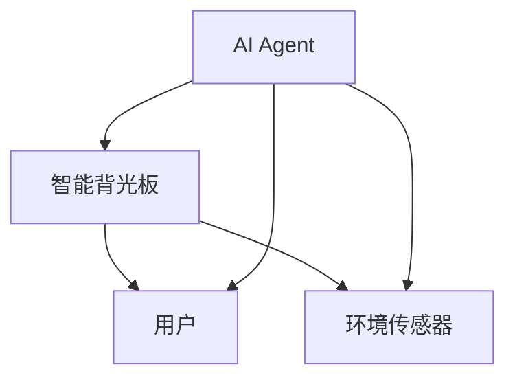
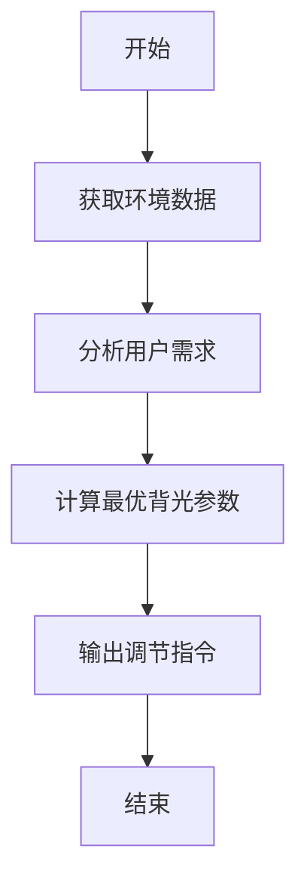
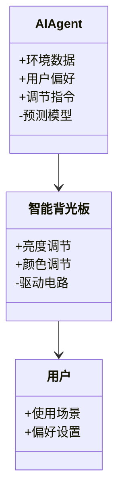

                 


# AI Agent在智能背光板中的护眼模式调节

> 关键词：AI Agent, 智能背光板, 护眼模式, 光照调节, 计算机视觉, 机器学习

> 摘要：本文详细探讨了AI Agent在智能背光板护眼模式调节中的应用，从技术原理到系统设计，再到实际案例，全面解析如何通过AI技术优化用户视觉体验，降低眼睛疲劳，提升产品智能化水平。

---

## 第一章：背景介绍

### 1.1 AI Agent与智能背光板的基本概念

#### 1.1.1 AI Agent的定义与特点

AI Agent（人工智能代理）是一种能够感知环境、自主决策并执行任务的智能实体。其特点包括：

- **自主性**：能够在没有外部干预的情况下运行。
- **反应性**：能够实时感知环境变化并做出反应。
- **学习性**：通过数据和经验不断优化行为。
- **协作性**：能够与其他系统或用户进行交互和协作。

#### 1.1.2 智能背光板的定义与功能

智能背光板是一种结合了LED背光技术和智能控制的显示设备。其主要功能包括：

- **调节亮度**：根据环境光线自动调整屏幕亮度。
- **颜色调节**：通过改变屏幕颜色温度来减少眼睛疲劳。
- **模式切换**：提供多种预设模式，如护眼模式、阅读模式等。

#### 1.1.3 护眼模式调节的必要性

长时间使用电子设备会导致眼睛疲劳，甚至引发视力问题。护眼模式通过调节屏幕亮度和颜色温度，减少蓝光输出，从而减轻眼睛负担。AI Agent的应用使得护眼模式更加智能化和个性化。

---

### 1.2 问题背景与描述

#### 1.2.1 光线对眼睛的影响

光线中的蓝光波长较短，容易导致眼睛疲劳和视网膜损伤。特别是在夜间使用电子设备时，蓝光的干扰更为明显。

#### 1.2.2 现有护眼技术的局限性

传统护眼模式通常基于固定的预设值，无法根据用户的实时需求和环境变化进行动态调整。此外，不同用户对光线的敏感度不同，传统模式难以提供个性化的解决方案。

#### 1.2.3 AI Agent在护眼模式调节中的优势

AI Agent能够实时感知环境光线变化和用户行为，结合用户的历史数据和偏好，动态调整背光参数，提供更精准和个性化的护眼体验。

---

## 第二章：核心概念与联系

### 2.1 AI Agent的核心原理

#### 2.1.1 AI Agent的组成部分

- **感知层**：通过传感器获取环境数据（如光照强度、色温和用户行为）。
- **决策层**：基于感知数据和用户需求，生成调节指令。
- **执行层**：通过背光板硬件调整亮度和颜色。

#### 2.1.2 AI Agent的学习机制

AI Agent通过监督学习或强化学习算法，不断优化背光调节策略。例如，使用回归模型预测最佳亮度值，或通过反馈机制调整颜色温度。

#### 2.1.3 AI Agent的决策过程

AI Agent根据当前环境和用户需求，综合考虑多个因素（如时间、位置、用户偏好）来决定背光参数。

---

### 2.2 智能背光板的硬件结构

#### 2.2.1 背光板的组成与功能

- **LED灯珠**：提供背光。
- **驱动电路**：控制LED的亮度和颜色。
- **传感器模块**：感知环境光线和用户输入。

#### 2.2.2 背光板的控制方式

- **PWM（脉宽调制）**：通过调整脉冲宽度来改变亮度。
- **颜色调节**：通过改变RGB值实现颜色变化。

#### 2.2.3 背光板的调节参数

- **亮度值**：0-100%。
- **颜色温度**：3000K-6500K。
- **对比度**：根据亮度动态调整。

---

### 2.3 AI Agent与智能背光板的实体关系

#### 2.3.1 实体关系图



---

## 第三章：算法原理

### 3.1 AI Agent的算法选择

#### 3.1.1 算法选择的依据

- **实时性**：需要快速响应用户需求。
- **准确性**：确保调节参数的准确性。
- **可扩展性**：支持不同用户和环境的动态变化。

#### 3.1.2 算法的优缺点分析

- **优点**：能够实时感知和调整，提供个性化体验。
- **缺点**：需要大量数据和计算资源支持。

#### 3.1.3 算法的实现步骤

1. **数据采集**：获取环境光线和用户行为数据。
2. **特征提取**：提取关键特征（如光照强度、用户偏好）。
3. **模型训练**：基于历史数据训练回归模型。
4. **预测与调整**：根据当前数据预测最优参数并执行调整。

---

### 3.2 算法流程图



---

### 3.3 算法实现的数学模型

#### 3.3.1 回归模型

$$ y = \beta_0 + \beta_1 x_1 + \beta_2 x_2 + \cdots + \beta_n x_n $$

其中：
- $y$ 是目标变量（亮度值）。
- $x_i$ 是自变量（环境光线、用户偏好）。
- $\beta_i$ 是回归系数。

#### 3.3.2 优化算法

$$ \text{损失函数} = \sum_{i=1}^{n} (y_i - \hat{y}_i)^2 $$

通过最小化损失函数，优化模型参数。

---

## 第四章：系统分析与架构设计

### 4.1 问题场景介绍

用户在不同环境下使用智能背光板，需要动态调整背光参数以减少眼睛疲劳。

### 4.2 项目介绍

开发一个基于AI Agent的智能背光板系统，实现动态护眼模式调节。

### 4.3 系统功能设计

#### 4.3.1 领域模型



### 4.4 系统架构设计


---

## 第五章：项目实战

### 5.1 环境安装

- **工具安装**：安装Python、TensorFlow、OpenCV等开发工具。
- **硬件配置**：配置环境传感器和背光板硬件。

### 5.2 核心实现

#### 5.2.1 数据采集

```python
import numpy as np
import pandas as pd

# 获取环境数据
def get_light_data():
    # 示例：从传感器获取光照强度
    light = np.random.uniform(0, 100)
    return light

# 获取用户数据
def get_user_data():
    # 示例：获取用户偏好
    user偏好 = np.random.choice(['白天', '晚上'])
    return user偏好
```

#### 5.2.2 模型训练

```python
import tensorflow as tf
from tensorflow.keras import layers

# 定义回归模型
model = tf.keras.Sequential([
    layers.Dense(64, activation='relu'),
    layers.Dense(1)
])

# 编译模型
model.compile(optimizer='adam', loss='mean_squared_error')
```

#### 5.2.3 参数调节

```python
# 调节亮度和颜色
def调节亮度(亮度值):
    return 亮度值 * 0.8  # 示例：降低亮度

def调节颜色(颜色温度):
    return max(3000, min(6500, 颜色温度 + 100))  # 示例：调整颜色温度
```

---

### 5.3 代码实现与分析

```python
# 完整实现
import numpy as np
import pandas as pd
import tensorflow as tf
from tensorflow.keras import layers

# 数据采集函数
def采集数据():
    光线强度 = np.random.uniform(0, 100)
    用户偏好 = np.random.choice(['白天', '晚上'])
    return 光线强度, 用户偏好

# 模型训练
def训练模型():
    model = tf.keras.Sequential([
        layers.Dense(64, activation='relu'),
        layers.Dense(1)
    ])
    model.compile(optimizer='adam', loss='mean_squared_error')
    return model

# 参数调节
def调节背光(预测亮度, 预测颜色温度):
    调节后的亮度 = 预测亮度 * 0.8
    调节后的颜色温度 = max(3000, min(6500, 颜色温度 + 100))
    return 调节后的亮度, 调节后的颜色温度

# 主函数
def主函数():
    光线强度, 用户偏好 = 采集数据()
    model = 训练模型()
    预测亮度 = model.predict(np.array([光线强度]))
    预测颜色温度 = model.predict(np.array([用户偏好]))
    调节后的亮度, 调节后的颜色温度 = 调节背光(预测亮度, 预测颜色温度)
    print(f"调节后的亮度：{调节后的亮度}")
    print(f"调节后的颜色温度：{调节后的颜色温度}")

主函数()
```

---

## 第六章：总结与展望

### 6.1 项目总结

通过AI Agent实现智能背光板的护眼模式调节，能够根据环境和用户需求动态调整背光参数，显著提升用户体验。

### 6.2 未来展望

未来可以进一步优化算法，引入更复杂的学习模型，如深度强化学习，以实现更加智能化的调节策略。

---

## 附录

### 附录A：API文档

提供AI Agent和背光板交互的API接口文档。

### 附录B：工具安装指南

详细说明开发环境的搭建步骤。

---

## 作者

作者：AI天才研究院/AI Genius Institute  
& 禅与计算机程序设计艺术 /Zen And The Art of Computer Programming

