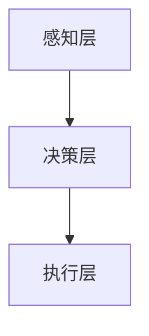
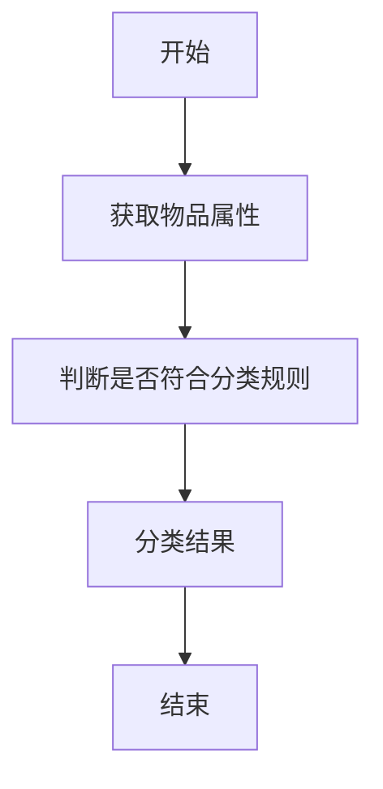
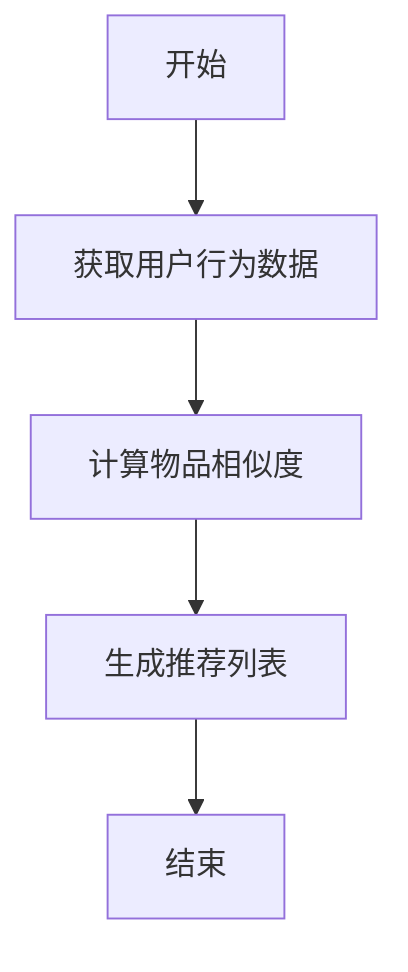
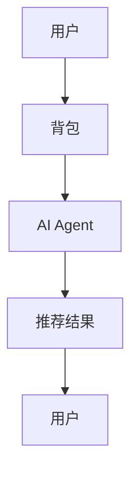

                 


# AI Agent在智能背包中的物品清单管理

> 关键词：AI Agent, 物品清单管理, 智能背包, 算法原理, 系统架构, 项目实战

> 摘要：本文探讨了AI Agent在智能背包中的物品清单管理应用，从问题背景、核心概念、算法原理到系统架构、项目实战，详细阐述了AI Agent在智能背包中的实现与应用。通过实际案例分析和代码实现，展示了AI Agent如何优化背包物品管理流程。

---

## 第一部分: AI Agent与智能背包的背景介绍

### 第1章: 问题背景与描述

#### 1.1 传统背包物品管理的痛点
在日常生活中，背包是我们常用的物品之一，但传统的背包物品管理方式存在诸多痛点：
- **物品查找困难**：背包内物品杂乱无章，查找效率低下。
- **管理效率低**：手动记录或分类效率低下，容易遗漏或重复。
- **缺乏智能推荐**：无法根据使用场景智能推荐所需物品。

#### 1.2 AI Agent的引入与问题解决
AI Agent（人工智能代理）是一种能够感知环境、自主决策并执行任务的智能实体。引入AI Agent到背包物品管理中，可以实现：
- **智能分类**：根据物品属性自动分类。
- **自动推荐**：基于使用场景智能推荐所需物品。
- **高效管理**：通过自动化流程提升管理效率。

#### 1.3 问题的边界与外延
AI Agent在背包物品管理中的应用范围包括：
- **物品识别与分类**：基于图像识别或传感器数据自动识别物品。
- **清单管理**：实时更新物品清单，支持增删改查操作。
- **智能推荐**：根据使用场景推荐相关物品。

边界与限制：
- **数据隐私**：背包中物品数据的隐私保护。
- **硬件限制**：背包中传感器和计算资源的限制。

#### 1.4 核心概念与组成要素
AI Agent在背包物品管理中的核心组成要素包括：
- **感知层**：通过传感器或摄像头采集背包内物品数据。
- **决策层**：基于感知数据进行分类和推荐。
- **执行层**：通过背包上的显示设备或提醒装置向用户反馈结果。

---

## 第二部分: AI Agent的核心概念与原理

### 第2章: AI Agent的核心概念与原理

#### 2.1 AI Agent的基本原理
AI Agent通过感知、决策和执行三个阶段实现物品管理：
1. **感知阶段**：AI Agent通过摄像头或传感器采集背包内物品数据。
2. **决策阶段**：基于感知数据进行分类和推荐。
3. **执行阶段**：通过背包上的显示设备或提醒装置向用户反馈结果。

#### 2.2 AI Agent的感知与决策机制
AI Agent的感知和决策机制可以用以下流程图表示：



#### 2.3 AI Agent与背包物品管理的结合
AI Agent在背包物品管理中的具体应用包括：
- **物品分类**：基于图像识别或传感器数据自动分类物品。
- **智能推荐**：根据使用场景推荐相关物品。
- **实时更新**：实时更新物品清单，支持增删改查操作。

---

## 第三部分: AI Agent的算法原理与实现

### 第3章: AI Agent的算法原理与实现

#### 3.1 基于规则的物品分类算法
基于规则的分类算法是一种简单的分类方法，适用于物品属性明确的场景。算法流程如下：



代码实现：

```python
def classify_item(item_attributes, rules):
    for rule in rules:
        if rule.check(item_attributes):
            return rule.classification
    return "未分类"
```

#### 3.2 协同过滤推荐算法
协同过滤推荐算法是一种基于用户行为的推荐算法。流程如下：



代码实现：

```python
def collaborative_filtering(user_id, items_matrix, users_similarity):
    recommendations = []
    for user in users_similarity[user_id]:
        for item in items_matrix[user]:
            recommendations.append(item)
    return recommendations
```

#### 3.3 算法的数学模型
协同过滤推荐算法的数学模型如下：

$$
\text{相似度}(u_i, u_j) = \frac{\sum_{k=1}^n (r_{ik} - \bar{r_i})(r_{jk} - \bar{r_j})}{\sqrt{\sum_{k=1}^n (r_{ik} - \bar{r_i})^2} \sqrt{\sum_{k=1}^n (r_{jk} - \bar{r_j})^2}}
$$

其中：
- $u_i$ 和 $u_j$ 分别是用户 $i$ 和用户 $j$
- $r_{ik}$ 是用户 $i$ 对物品 $k$ 的评分
- $\bar{r_i}$ 是用户 $i$ 的平均评分

---

## 第四部分: 系统分析与架构设计

### 第4章: 系统分析与架构设计

#### 4.1 项目背景与目标
本项目旨在通过AI Agent实现智能背包中的物品清单管理，目标包括：
- 实现物品的智能分类与推荐
- 提供高效的物品清单管理功能
- 提供友好的用户交互界面

#### 4.2 系统功能设计
系统功能包括：
- **物品识别与分类**：基于图像识别或传感器数据自动分类物品。
- **物品清单管理**：实时更新物品清单，支持增删改查操作。
- **智能推荐**：根据使用场景推荐相关物品。

#### 4.3 系统架构设计
系统架构包括：
- **数据采集层**：通过摄像头或传感器采集背包内物品数据。
- **数据处理层**：对采集到的数据进行分类和推荐。
- **用户交互层**：通过背包上的显示设备或提醒装置向用户反馈结果。

#### 4.4 接口设计与交互流程
系统交互流程如下：



---

## 第五部分: 项目实战

### 第5章: 项目实战

#### 5.1 环境安装
需要安装以下环境和工具：
- Python 3.8+
- OpenCV库
- NumPy库
- Scikit-learn库

#### 5.2 系统核心实现
核心代码实现：

```python
import cv2
import numpy as np
from sklearn.metrics.pairwise import cosine_similarity

def classify_item(item_attributes, rules):
    for rule in rules:
        if rule.check(item_attributes):
            return rule.classification
    return "未分类"

class CollaborativeFiltering:
    def __init__(self, items_matrix):
        self.items_matrix = items_matrix

    def compute_similarity(self, user_id):
        # 计算用户相似度
        pass

    def get_recommendations(self, user_id):
        # 生成推荐列表
        pass
```

#### 5.3 代码应用解读与分析
代码解读：
- `classify_item` 函数：基于规则的物品分类算法，根据给定的规则对物品进行分类。
- `CollaborativeFiltering` 类：协同过滤推荐算法，用于根据用户行为数据生成推荐列表。

#### 5.4 实际案例分析
通过一个实际案例分析，展示AI Agent在智能背包中的应用效果：

**案例场景**：用户需要去健身房，AI Agent会根据用户的历史行为推荐运动装备。

---

## 第六部分: 最佳实践

### 第6章: 最佳实践

#### 6.1 小结
本文详细介绍了AI Agent在智能背包中的物品清单管理应用，从问题背景、核心概念、算法原理到系统架构、项目实战，全面阐述了AI Agent的实现与应用。

#### 6.2 注意事项
在实际应用中，需要注意以下问题：
- **数据隐私**：背包中物品数据的隐私保护。
- **硬件限制**：背包中传感器和计算资源的限制。

#### 6.3 拓展阅读
推荐以下资源，供进一步学习：
- 《机器学习实战》
- 《人工智能：一种现代的方法》
- 《Python机器学习》

---

作者：AI天才研究院/AI Genius Institute & 禅与计算机程序设计艺术 /Zen And The Art of Computer Programming

