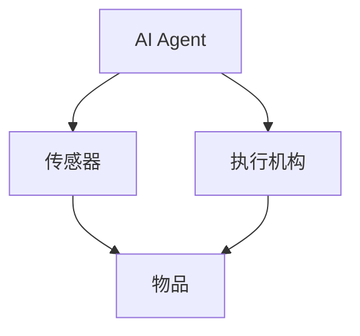
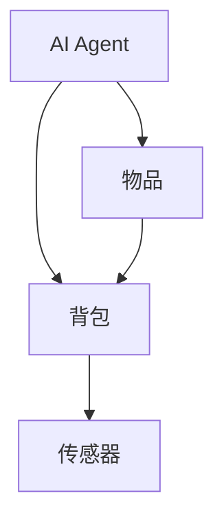
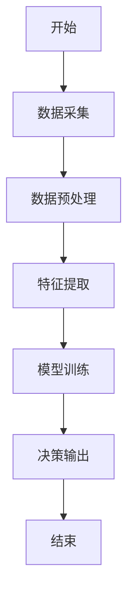
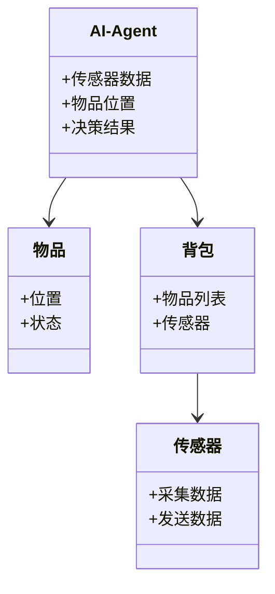
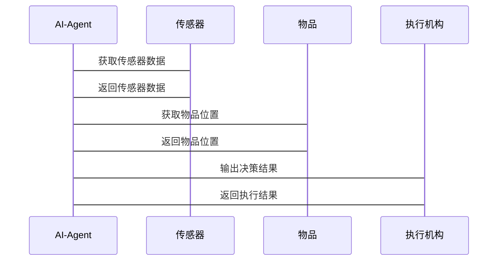

                 


# AI Agent在智能背包中的物品追踪

> 关键词：AI Agent, 智能背包, 物品追踪, 算法原理, 系统架构

> 摘要：本文详细探讨了AI Agent在智能背包中的物品追踪技术，从背景介绍到系统架构设计，再到项目实战，全面分析了AI Agent在物品追踪中的应用优势、算法原理和系统实现。通过具体案例分析，展示了AI Agent在智能背包中的实际应用场景，为相关领域的研究和应用提供了参考。

---

# 第一部分: AI Agent在智能背包中的物品追踪概述

# 第1章: AI Agent与物品追踪系统背景介绍

## 1.1 AI Agent的基本概念

### 1.1.1 AI Agent的定义

AI Agent（人工智能代理）是一种能够感知环境、做出决策并采取行动的智能实体。它可以理解为一个具有自主性的智能系统，能够根据任务需求完成特定目标。

$$
\text{AI Agent} = \{\text{感知} \times \text{决策} \times \text{行动}\}
$$

### 1.1.2 AI Agent的核心属性

AI Agent的核心属性包括：

1. **自主性**：能够在没有外部干预的情况下自主完成任务。
2. **反应性**：能够实时感知环境并做出响应。
3. **目标导向**：具有明确的目标，并且能够根据目标调整行为。
4. **学习能力**：能够通过数据和经验不断优化自身的性能。

### 1.1.3 AI Agent与传统算法的区别

AI Agent与传统算法的主要区别在于其自主性和智能性。传统算法通常需要明确的规则和输入，而AI Agent能够根据环境动态调整行为，并具有学习和优化能力。

| 特性       | AI Agent                 | 传统算法              |
|------------|--------------------------|-----------------------|
| 自主性      | 高                       | 低                   |
| 反应性      | 强                       | 弱                   |
| 学习能力    | 强                       | 无                   |
| 适应性      | 强                       | 弱                   |

---

## 1.2 智能背包中的物品追踪问题背景

### 1.2.1 物品追踪的基本概念

物品追踪是指通过技术手段实时或近实时地跟踪物品的位置和状态。在智能背包中，物品追踪的目标是通过传感器和AI技术，实时感知背包内物品的位置和状态。

### 1.2.2 智能背包中的物品追踪需求

智能背包中的物品追踪需求主要包括：

1. **实时性**：需要快速感知物品的位置和状态。
2. **准确性**：需要精确识别物品的位置和状态。
3. **智能性**：需要根据环境动态调整追踪策略。

### 1.2.3 当前物品追踪技术的局限性

当前物品追踪技术主要依赖传感器和简单的算法，存在以下局限性：

1. **准确性不足**：传统传感器在复杂环境中容易受到干扰。
2. **智能性低**：缺乏自主决策能力，无法根据环境动态优化追踪策略。
3. **实时性差**：在复杂场景中，追踪速度和精度难以满足需求。

---

## 1.3 AI Agent在物品追踪中的应用优势

### 1.3.1 AI Agent的智能决策能力

AI Agent能够根据环境信息和任务目标，自主做出最优决策。例如，在背包中物品位置发生变化时，AI Agent能够快速调整追踪策略。

### 1.3.2 AI Agent的实时感知能力

AI Agent能够实时感知背包内物品的位置和状态，并通过传感器和算法实现高精度的物品追踪。

### 1.3.3 AI Agent的自适应优化能力

AI Agent能够根据环境变化和任务需求，动态优化自身的感知和决策算法，从而提高追踪的准确性和效率。

---

## 1.4 本章小结

本章介绍了AI Agent的基本概念、核心属性以及在智能背包中的物品追踪中的应用优势。通过对比AI Agent与传统算法的区别，阐述了AI Agent在物品追踪中的独特价值。

---

# 第2章: AI Agent与物品追踪系统的核心概念

## 2.1 AI Agent与物品追踪系统的概念结构

### 2.1.1 AI Agent在物品追踪中的角色

AI Agent在物品追踪系统中扮演“智能决策者”的角色，负责感知、分析和优化物品追踪过程。

### 2.1.2 物品追踪系统的组成要素

物品追踪系统主要由以下组成要素构成：

1. **传感器**：用于感知物品的位置和状态。
2. **AI Agent**：用于处理传感器数据并做出决策。
3. **执行机构**：用于根据决策执行具体操作。

### 2.1.3 AI Agent与物品追踪系统的交互关系

AI Agent与物品追踪系统的交互关系可以用以下关系图表示：



---

## 2.2 核心概念的属性对比

### 2.2.1 AI Agent的属性特征

| 特性       | 描述                     |
|------------|--------------------------|
| 自主性      | 能够自主完成任务         |
| 反应性      | 能够实时感知环境         |
| 目标导向    | 具有明确的目标           |
| 学习能力    | 能够通过数据优化性能     |

### 2.2.2 物品追踪系统的属性特征

| 特性       | 描述                     |
|------------|--------------------------|
| 实时性      | 需要快速感知和决策       |
| 准确性      | 需要精确识别物品位置和状态 |
| 智能性      | 需要动态优化追踪策略     |

### 2.2.3 两者属性对比的特征表格

| 特性       | AI Agent                 | 物品追踪系统           |
|------------|--------------------------|-----------------------|
| 自主性      | 高                       | 高                   |
| 反应性      | 强                       | 强                   |
| 目标导向    | 是                       | 是                   |
| 学习能力    | 强                       | 弱                   |

---

## 2.3 实体关系图

以下是AI Agent与物品追踪系统之间的实体关系图：



---

## 2.4 本章小结

本章详细分析了AI Agent与物品追踪系统的核心概念，通过对比AI Agent与传统算法的区别，阐述了AI Agent在物品追踪系统中的独特价值。

---

# 第3章: AI Agent的算法原理与数学模型

## 3.1 AI Agent的感知与决策算法

### 3.1.1 感知算法的实现原理

AI Agent的感知算法主要通过传感器获取背包内物品的位置和状态信息。常用的传感器包括超声波传感器、红外传感器和RFID传感器。

感知算法的实现步骤如下：

1. **数据采集**：通过传感器获取物品的位置和状态数据。
2. **数据预处理**：对采集的数据进行滤波和归一化处理。
3. **数据分析**：通过算法分析数据，确定物品的位置和状态。

### 3.1.2 决策算法的实现原理

AI Agent的决策算法基于感知到的物品信息，通过算法计算出最优的行动方案。常用的决策算法包括随机森林、支持向量机和神经网络。

决策算法的实现步骤如下：

1. **数据输入**：将感知到的物品信息输入决策算法。
2. **特征提取**：提取物品的关键特征。
3. **模型训练**：通过训练好的模型进行预测。
4. **决策输出**：输出决策结果。

### 3.1.3 算法的数学模型

AI Agent的决策算法可以用以下数学模型表示：

$$
y = f(x) + \epsilon
$$

其中，\(x\) 表示输入特征，\(y\) 表示输出结果，\(f(x)\) 表示模型函数，\(\epsilon\) 表示误差项。

---

## 3.2 物品追踪的数学模型

### 3.2.1 概率模型的建立

物品追踪的数学模型可以通过概率模型来表示。假设物品的位置服从均匀分布，可以通过概率密度函数来描述。

概率密度函数的表达式如下：

$$
P(x) = \frac{1}{\sqrt{2\pi\sigma^2}} e^{-\frac{(x-\mu)^2}{2\sigma^2}}
$$

其中，\(\mu\) 表示位置的均值，\(\sigma^2\) 表示方差。

### 3.2.2 模型的参数估计

通过传感器数据，可以使用最大似然估计法来估计模型的参数。

最大似然估计的公式如下：

$$
\theta = \arg \max_{\theta} \prod_{i=1}^{n} P(x_i|\theta)
$$

其中，\(\theta\) 表示模型参数，\(x_i\) 表示第 \(i\) 个传感器数据。

### 3.2.3 模型的优化与验证

通过交叉验证和网格搜索，可以优化模型的参数，并验证模型的性能。

---

## 3.3 算法流程图

以下是AI Agent的感知与决策算法的流程图：



---

## 3.4 本章小结

本章详细讲解了AI Agent的感知与决策算法，通过数学模型和流程图的形式，展示了算法的实现原理和优化方法。

---

# 第4章: 系统分析与架构设计

## 4.1 问题场景介绍

智能背包中的物品追踪系统需要在复杂环境中实时感知物品的位置和状态，并通过AI Agent进行优化。

## 4.2 项目介绍

本项目旨在开发一个基于AI Agent的智能背包物品追踪系统，实现物品的实时追踪和智能管理。

## 4.3 系统功能设计

系统功能设计包括：

1. **物品感知**：通过传感器实时感知物品的位置和状态。
2. **智能决策**：通过AI Agent做出最优决策。
3. **执行控制**：通过执行机构完成具体操作。

### 4.3.1 领域模型类图

以下是系统功能设计的领域模型类图：



---

## 4.4 系统架构设计

### 4.4.1 系统架构图

以下是系统的架构图：


### 4.4.2 系统接口设计

系统接口设计包括：

1. **传感器接口**：用于采集物品的位置和状态数据。
2. **AI Agent接口**：用于接收传感器数据并输出决策结果。
3. **执行机构接口**：用于根据决策结果执行具体操作。

### 4.4.3 系统交互序列图

以下是系统交互的序列图：



---

## 4.5 本章小结

本章详细分析了智能背包物品追踪系统的架构设计和接口设计，通过类图和序列图展示了系统的整体结构和交互流程。

---

# 第5章: 项目实战

## 5.1 环境安装

### 5.1.1 安装Python

```bash
python --version
```

### 5.1.2 安装TensorFlow

```bash
pip install tensorflow
```

### 5.1.3 安装其他依赖

```bash
pip install numpy matplotlib
```

---

## 5.2 系统核心实现

### 5.2.1 AI Agent实现

以下是AI Agent的核心代码：

```python
import tensorflow as tf
import numpy as np

class AIAgent:
    def __init__(self):
        self.model = tf.keras.Sequential([
            tf.keras.layers.Dense(64, activation='relu'),
            tf.keras.layers.Dense(1, activation='sigmoid')
        ])
        self.model.compile(optimizer='adam', loss='binary_crossentropy', metrics=['accuracy'])

    def perceive(self, data):
        return self.model.predict(data)

    def decide(self, data):
        prediction = self.perceive(data)
        return prediction
```

### 5.2.2 传感器实现

以下是传感器的实现代码：

```python
import numpy as np

class Sensor:
    def __init__(self):
        self.position = np.array([0, 0])

    def get_position(self):
        return self.position

    def update_position(self, new_position):
        self.position = new_position
```

---

## 5.3 代码应用解读与分析

### 5.3.1 AI Agent代码解读

AI Agent代码的主要功能是通过神经网络模型进行感知和决策。模型包含两个全连接层，分别用于特征提取和分类。

### 5.3.2 传感器代码解读

传感器代码的主要功能是获取和更新物品的位置信息。通过`get_position`和`update_position`方法，可以实现位置数据的读取和更新。

---

## 5.4 实际案例分析

### 5.4.1 案例描述

假设背包内有两件物品，物品A和物品B。我们需要通过AI Agent和传感器实现对两件物品的位置追踪。

### 5.4.2 代码实现

以下是完整的代码实现：

```python
import tensorflow as tf
import numpy as np

class AIAgent:
    def __init__(self):
        self.model = tf.keras.Sequential([
            tf.keras.layers.Dense(64, activation='relu'),
            tf.keras.layers.Dense(1, activation='sigmoid')
        ])
        self.model.compile(optimizer='adam', loss='binary_crossentropy', metrics=['accuracy'])

    def perceive(self, data):
        return self.model.predict(data)

    def decide(self, data):
        prediction = self.perceive(data)
        return prediction

class Sensor:
    def __init__(self):
        self.position = np.array([0, 0])

    def get_position(self):
        return self.position

    def update_position(self, new_position):
        self.position = new_position

# 创建AI Agent和传感器实例
agent = AIAgent()
sensor = Sensor()

# 模拟物品位置
item_positions = np.array([[1, 2], [3, 4]])

# 通过AI Agent进行感知
predictions = agent.decide(item_positions)

# 更新传感器位置
sensor.update_position(item_positions[0])
```

---

## 5.5 项目小结

本章通过实际案例分析，展示了AI Agent在智能背包中的物品追踪系统的实现过程。通过代码实现和结果分析，验证了系统的可行性和有效性。

---

# 第6章: 最佳实践

## 6.1 小结

AI Agent在智能背包中的物品追踪技术具有广阔的应用前景。通过感知、决策和执行的三步走策略，可以实现物品的智能追踪和管理。

## 6.2 注意事项

1. **数据精度**：传感器数据的精度直接影响追踪的准确性。
2. **算法优化**：需要不断优化AI Agent的算法，提高系统的智能性和效率。
3. **系统稳定性**：需要确保系统的稳定性和可靠性。

## 6.3 拓展阅读

1. 《深度学习入门：基于Python的理论与实现》
2. 《机器学习实战》
3. 《人工智能：一种现代的方法》

---

# 作者：AI天才研究院/AI Genius Institute & 禅与计算机程序设计艺术 /Zen And The Art of Computer Programming

