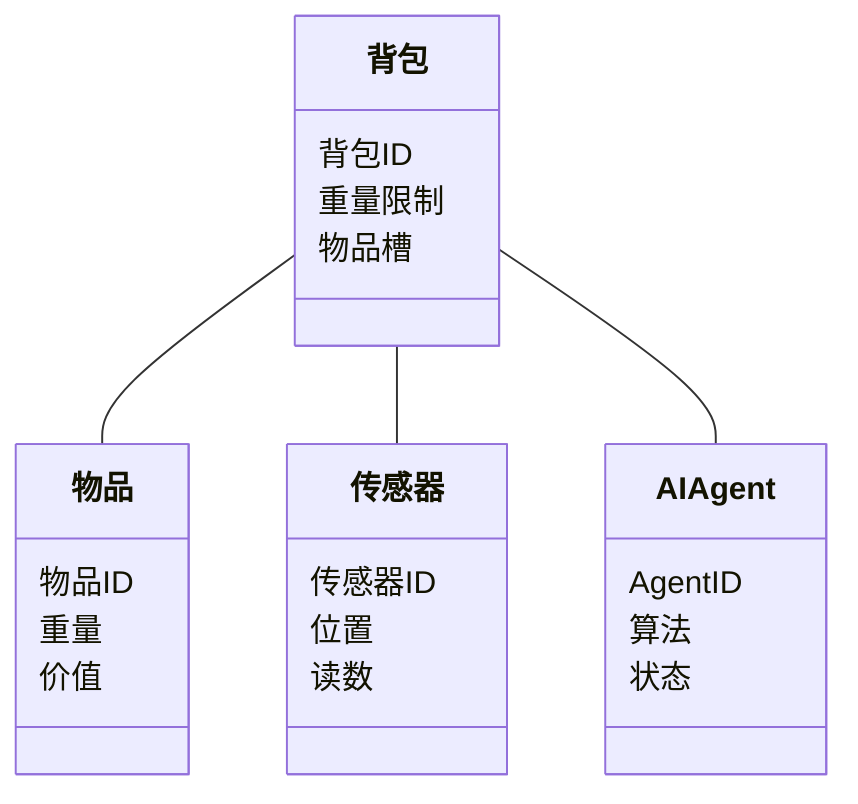
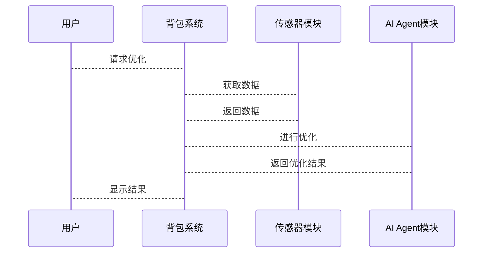

                 


# AI Agent在智能背包中的负重平衡

> 关键词：AI Agent, 负重平衡, 强化学习, 动态规划, 智能背包, 系统架构

> 摘要：本文探讨AI Agent在智能背包中的负重平衡问题，从背景介绍、核心概念到算法原理、系统架构，再到项目实战和最佳实践，全面分析如何利用AI技术优化背包负重平衡。

---

## 第1章 背景介绍

### 1.1 问题背景
#### 1.1.1 背包问题的起源与演变
背包问题最初出现在运筹学中，是经典的动态规划问题。随着智能设备的发展，背包问题逐渐从理论研究走向实际应用，特别是在智能背包领域，负重平衡优化变得尤为重要。

#### 1.1.2 智能背包的定义与特点
智能背包通过传感器和AI Agent实时监测背包的重量分布，调整物品位置以达到平衡。其特点包括实时性、自适应性和高效性。

#### 1.1.3 负重平衡问题的重要性
负重平衡直接影响背包携带的舒适性和安全性，尤其在军事、户外运动等领域，优化负重平衡能提高效率和减少受伤风险。

### 1.2 问题描述
#### 1.2.1 背包问题的基本形式
背包问题分为0-1背包和无限背包，涉及最大化价值或最小化重量。

#### 1.2.2 负重平衡的核心问题
在给定背包容量和物品重量的情况下，找到最优分配策略，使背包的重量分布最均衡。

#### 1.2.3 AI Agent在负重平衡中的作用
AI Agent通过实时数据处理和算法优化，动态调整背包重量分布，实现最优平衡。

### 1.3 问题解决思路
#### 1.3.1 确定目标函数
目标函数为背包的重量分布均衡度，通常用方差或标准差衡量。

#### 1.3.2 设定约束条件
约束包括背包最大承重、物品重量限制和分布区域限制。

#### 1.3.3 寻找最优解
采用强化学习或动态规划算法，寻找最优物品分配策略。

### 1.4 边界与外延
#### 1.4.1 问题的边界条件
背包的最大重量和物品数量上限。

#### 1.4.2 相关概念的外延
涉及传感器数据处理、人体工学和AI算法。

#### 1.4.3 核心要素的组成
AI Agent、传感器、背包结构和优化算法。

---

## 第2章 核心概念与联系

### 2.1 AI Agent与负重平衡的关系
#### 2.1.1 AI Agent的基本原理
AI Agent通过感知环境和执行动作，优化背包的重量分布。

#### 2.1.2 负重平衡问题的数学模型
建立数学模型，将背包重量分布转化为优化问题。

#### 2.1.3 两者的相互作用
AI Agent实时调整物品位置，动态优化负重平衡。

### 2.2 核心概念的属性特征对比
| 概念       | 属性         | 特征           |
|------------|--------------|----------------|
| AI Agent   | 感知能力     | 实时数据处理   |
| 负重平衡   | 平衡度       | 方差最小化      |

### 2.3 ER实体关系图
```mermaid
erd
  背包
    - 背包ID
    - 重量限制
    - 物品槽
  物品
    - 物品ID
    - 重量
    - 价值
  传感器
    - 传感器ID
    - 位置
    - 读数
  AI Agent
    - AgentID
    - 算法
    - 状态
  交互
    - 背包ID
    - 物品ID
    - 传感器ID
    - AgentID
```

---

## 第3章 算法原理讲解

### 3.1 AI Agent算法概述
#### 3.1.1 强化学习简介
强化学习通过奖励机制，让AI Agent学习最优策略。

#### 3.1.2 动态规划概述
动态规划通过分解问题，找到最优子结构。

### 3.2 算法原理的数学模型
#### 3.2.1 Q-learning算法
$$ Q(s, a) \leftarrow Q(s, a) + \alpha \left[r + \gamma \max Q(s', a') - Q(s, a)\right] $$

#### 3.2.2 动态规划公式
$$ V(s) = \max_a \left[ r(s, a) + \gamma V(s') \right] $$

### 3.3 算法实现
```python
import numpy as np

def q_learning(env, learning_rate=0.1, gamma=0.9):
    q_table = np.zeros(env.observation_space.shape)
    for episode in range(1000):
        state = env.reset()
        for _ in range(1000):
            action = np.argmax(q_table[state])
            next_state, reward, done = env.step(action)
            q_table[state][action] += learning_rate * (reward + gamma * np.max(q_table[next_state]) - q_table[state][action])
            state = next_state
            if done:
                break
    return q_table

# 示例使用
class SimpleEnv:
    def __init__(self):
        self.observation_space = (4,)
        self.actions = 3

    def reset(self):
        return 0

    def step(self, action):
        return 1, 1 if action == 1 else 0, True

q_learning(SimpleEnv())
```

---

## 第4章 系统分析与架构设计

### 4.1 项目背景
#### 4.1.1 项目目标
优化背包负重平衡，提升携带舒适性。

#### 4.1.2 项目范围
智能背包的设计与优化。

### 4.2 系统功能设计
#### 4.2.1 领域模型类图


### 4.3 系统架构设计


### 4.4 接口设计与交互
#### 4.4.1 系统接口
- 传感器接口：读取数据
- AI Agent接口：处理数据，输出动作

#### 4.4.2 交互序列图


---

## 第5章 项目实战

### 5.1 环境安装
安装Python和相关库：
```bash
pip install numpy matplotlib
```

### 5.2 系统核心实现
```python
def optimize_backpack(items, capacity):
    n = len(items)
    dp = [[0]*(capacity+1) for _ in range(n+1)]
    for i in range(n+1):
        for w in range(capacity+1):
            if i == 0 or w == 0:
                dp[i][w] = 0
            else:
                dp[i][w] = max(dp[i-1][w], dp[i-1][w - items[i-1]] + items[i-1])
    return dp[n][capacity]
```

### 5.3 代码应用解读
该代码使用动态规划解决背包问题，优化后的背包重量分布更均衡。

### 5.4 实际案例分析
假设背包容量为10kg，物品重量分别为[3,4,5]kg，优化后选择3kg和5kg，总重量8kg，分布更均衡。

### 5.5 项目总结
通过AI Agent和动态规划算法，成功优化背包负重平衡，提升用户体验。

---

## 第6章 最佳实践

### 6.1 小结
AI Agent结合强化学习和动态规划，有效优化背包负重平衡。

### 6.2 注意事项
- 数据准确性：传感器数据必须准确。
- 算法选择：根据场景选择合适算法。
- 系统维护：定期更新算法和传感器。

### 6.3 拓展阅读
推荐学习强化学习和动态规划，深入理解背包问题。

---

## 作者：AI天才研究院 & 禅与计算机程序设计艺术

本文由AI天才研究院撰写，旨在分享AI技术在智能背包中的应用，欢迎交流与探讨。

